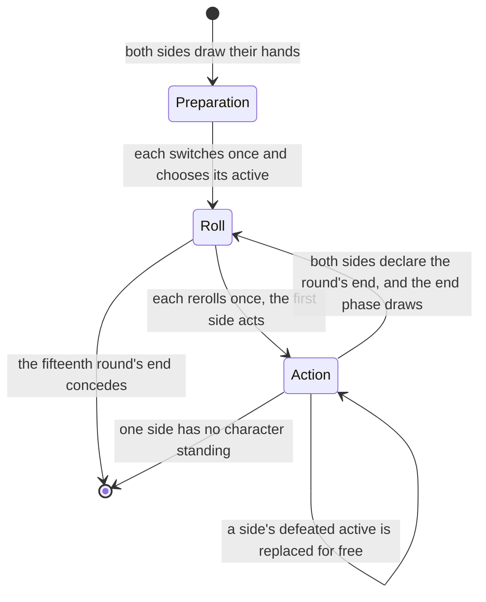
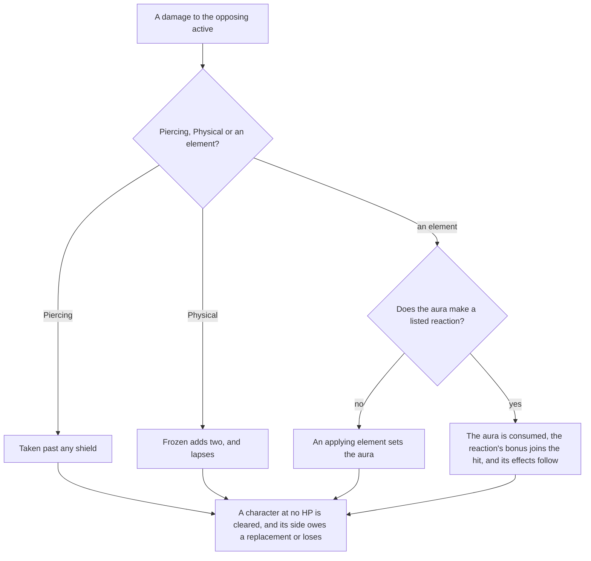

# Genius Invokation TCG

The card game is a rules engine of its own in `genshin-world`: a duel is a plain state over two sides, advanced by the actions a duel answers, and it shares only the elements with the world. This page is what is built of [Genius Invokation TCG](/docs/proposals/genshin/genius-invokation). Nothing plays a card yet: no card has its module and no screen opens a duel, so the engine is driven by its tests and by whatever a later module or screen calls.

## Decisions

- **Duels against residents run the untimed standard rule.** The rule table's second rule is the one with no clocks, since a duel against a resident has no round to run out. Its reactions and hand limit are the matchmaking rule's, which it is listed beside. `genshin:assets gcg` writes its draw, hand limit and reactions as one slice the world imports on demand.
- **The reactions are the table's element pairs, and their effects are the wiki's.** The rule lists its reactions by pair, and the table gives each pair's id. The bonuses, the shields, the spread, the piercing and the forced switch come from the wiki's rules page, since the skill rows that name them carry their values in declared-value sets this build does not read.
- **Elements apply, and Anemo and Geo do not.** Cryo, Hydro, Pyro, Electro and Dendro damage sets its aura. Anemo and Geo damage reacts with an aura and sets none, and Physical and Piercing damage reacts with nothing. A reaction consumes the aura it reacts with, and its element does not apply.
- **A reaction's bonus joins its instance.** Melt, Vaporize and Overloaded add two. Superconduct, Electro-Charged, Frozen, Crystallize, Burning, Bloom and Quicken add one. Swirl adds none.
- **Frozen and shields.** A Frozen target takes two more from a Pyro or Physical hit, and that hit removes the status, which otherwise lasts to the round's end. A shield takes damage before HP, and piercing skips it. Crystallize grants the attacker's active character one point, at most two.
- **Piercing and spread.** Superconduct and Electro-Charged pierce the other opposing characters for one. A Swirl spreads one of its aura's elements to each of them as damage only: it sets no aura and reacts with none. The wiki does not say whether a spread applies or reacts, so this is a settled call, and a recording of a duel can overturn it ([Recordings owed](/docs/genshin/roadmap)).
- **Overloaded forces the switch.** An Overloaded active character is switched to the next standing character in order, with no choice given.
- **A defeated active is replaced by a free action.** A side owes a replacement while one of its characters stands, and may take it at any point in the action phase. Only that side's turn actions wait on it, and the turn does not.
- **Preparation switches once, then chooses.** A side's switched cards go back into its draw pile, which is shuffled and drawn from to refill its hand. Then it chooses its active character, and the first round's roll starts once both sides have.
- **Rolls and rerolls.** Each side rolls eight dice a round, each face one of the seven elements or Omni, equally likely, from the seeded source. Each side then has one reroll of any dice it names, and naming none passes.
- **Combat actions pass the turn.** Using a skill, switching for one die of any face and declaring the round's end are combat actions, and each passes the turn unless the other side has already declared its end. Tuning is a fast action: it discards a card to set one die to the active character's element, and the turn stays.
- **The round's end.** The side that declares first goes first next round, and the first round goes to the first side. Frozen lapses at the end phase, each side draws the rule's two cards, from the first side on, and a draw past the hand's limit is discarded.
- **Energy.** A normal attack and an elemental skill gain the skill row's energy, one, and a burst pays the energy its cost names. A skill that a character cannot pay for is refused, and the dice it would have paid stay in the dice.
- **A duel concedes after its fifteenth round.** Once that round's end phase closes, both sides concede with no winner, as the wiki gives the limit.

Not built, and why: Burning, Bloom and Quicken apply their bonuses but not the statuses they create, since those statuses are read by the cards that carry them. Charged and plunging attacks are markers that cards read, so the engine deals them no damage yet. The dice cap and the summons and support zones wait on the card modules that fill them. Playing an action card is a card's module, not the engine's.

## How it works

The end phase is not a phase of its own: it runs as the round closes, and the next round's roll follows it. Each action is a function of its own, and a refused one leaves the duel as it was and says why.

A hit on the opposing active character is settled in one order:

## Key files

| File                                                             | Role                                                                          |
| :--------------------------------------------------------------- | :---------------------------------------------------------------------------- |
| `scripts/src/services/genshinAssets/gcg/writeGcgStandardRule.ts` | Writes the standard rule's slice from the dump's rule and reaction tables     |
| `scripts/src/services/genshinAssets/gcg/toGcgStandardRule.ts`    | The rule row, with each listed reaction joined to its element pair            |
| `packages/genshin-world/src/generated/gcg/standardRule.json`     | The written slice, imported on demand                                         |
| `packages/genshin-world/src/services/gcg/readGcgStandardRule.ts` | Imports the slice and checks it against its schema                            |
| `packages/genshin-world/src/services/gcg/createGcgDuel.ts`       | Opens a duel between two decks                                                |
| `packages/genshin-world/src/services/gcg/prepareGcgSide.ts`      | A side's preparation, and the first roll once both have prepared              |
| `packages/genshin-world/src/services/gcg/rerollGcgDice.ts`       | A side's one reroll, and the action phase once both have rolled               |
| `packages/genshin-world/src/services/gcg/useGcgSkill.ts`         | A skill paid in dice and energy, then the turn passes                         |
| `packages/genshin-world/src/services/gcg/applyGcgDamage.ts`      | A hit's Frozen, reaction, shield and piercing, and its defeats                |
| `packages/genshin-world/src/services/gcg/declareGcgRoundEnd.ts`  | The round's end, and the end phase once both sides declare                    |
| `packages/genshin-world/src/services/gcg/endGcgRound.ts`         | The end phase: Frozen lapses, the draws, and the next round or the concession |
| `packages/genshin-world/src/services/gcg/switchGcgCharacter.ts`  | A switch for one die of any face, as a combat action                          |
| `packages/genshin-world/src/services/gcg/tuneGcgDie.ts`          | Tuning a die by a discarded card, as a fast action                            |
| `packages/genshin-world/src/services/gcg/replaceGcgCharacter.ts` | The free replacement a defeated active owes                                   |
| `packages/genshin-world/src/services/gcg/payGcgCost.ts`          | The dice a cost takes from the dice chosen, Omni standing in                  |
| `packages/genshin-world/src/services/gcg/getGcgReactionKind.ts`  | The reaction an element pair makes under a rule                               |

## Sources

- [Genius Invokation TCG: Rules](https://genshin-impact.fandom.com/wiki/Genius_Invokation_TCG/Rules), Genshin Impact Wiki: the preparation, the round's phases, the zones, the elemental reactions and their bonuses, the piercing and the spread, and the fifteen-round limit.
- [AnimeGameData](https://gitlab.com/Dimbreath/AnimeGameData), the community's per-patch dump: the rule and element reaction tables the standard rule is written from.
