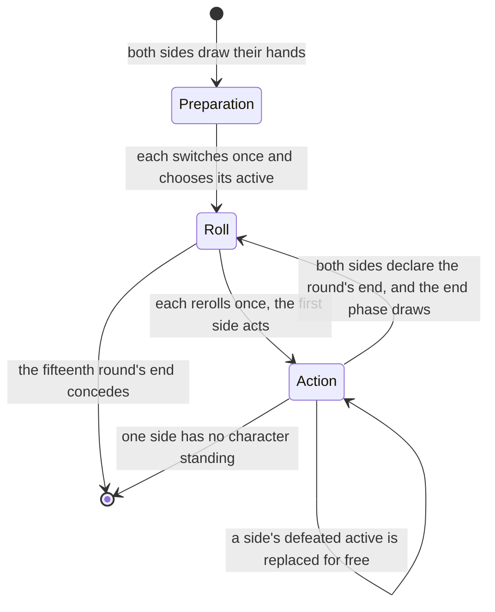
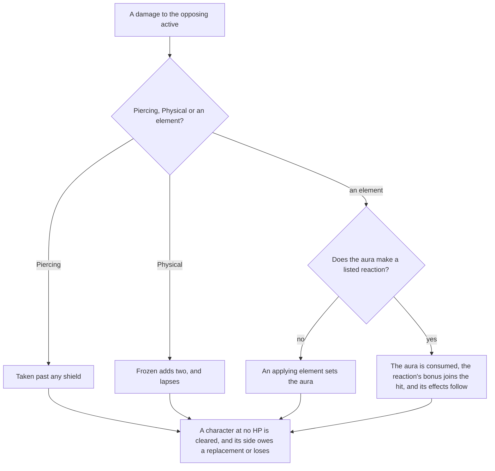
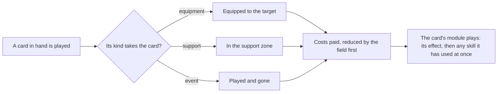

# Genius Invokation TCG

The card game is a rules engine of its own in `genshin-world`: a duel is a plain state over two sides, advanced by the actions a duel answers, and it shares only the elements with the world. This page is what is built of [Genius Invokation TCG](/docs/proposals/genshin/genius-invokation). Each of the three decks' characters, their skills and their action cards has a module, and a duel plays them through the engine's public functions. No screen opens a duel yet, so the engine is driven by its tests and by whatever a later screen calls.

## Decisions

- **Duels against residents run the untimed standard rule.** The rule table's second rule is the one with no clocks, since a duel against a resident has no round to run out. Its reactions and hand limit are the matchmaking rule's, which it is listed beside. `genshin:assets gcg` writes its draw, hand limit and reactions as one slice the world imports on demand.
- **The reactions are the table's element pairs, and their effects are the wiki's.** The rule lists its reactions by pair, and the table gives each pair's id. The bonuses, the shields, the spread, the piercing and the forced switch come from the wiki's rules page, since the skill rows that name them carry their values in declared-value sets this build does not read.
- **Elements apply, and Anemo and Geo do not.** Cryo, Hydro, Pyro, Electro and Dendro damage sets its aura. Anemo and Geo damage reacts with an aura and sets none, and Physical and Piercing damage reacts with nothing. A reaction consumes the aura it reacts with, and its element does not apply.
- **The reactions leave their cards on the attacker's side.** Burning summons Burning Flame, which deals one Pyro at each end phase, spends a usage, and stacks to two usages. Bloom leaves Dendro Core onstage, which adds two to the next Pyro or Electro damage its side's skills deal, for one usage. Quicken leaves Catalyzing Field onstage, which adds one to the next Dendro or Electro damage, for two usages. The numbers are the game's own card descriptions, read through the text map, so Dendro Core's bonus is two, where the brief that asked for it said one. A second reaction of the same kind joins the card already there, up to the card's most usages, rather than a second copy.
- **A reaction's bonus joins its instance.** Melt, Vaporize and Overloaded add two. Superconduct, Electro-Charged, Frozen, Crystallize, Burning, Bloom and Quicken add one. Swirl adds none.
- **Frozen and shields.** A Frozen target takes two more from a Pyro or Physical hit, and that hit removes the status, which otherwise lasts to the round's end. A shield takes damage before HP, and piercing skips it. Crystallize grants the attacker's active character one point, at most two.
- **Piercing and spread.** Superconduct and Electro-Charged pierce the other opposing characters for one. A Swirl spreads one of its aura's elements to each of them as damage only: it sets no aura and reacts with none. The wiki does not say whether a spread applies or reacts, so this is a settled call, and a recording of a duel can overturn it ([Recordings owed](/docs/genshin/roadmap)).
- **Overloaded forces the switch.** An Overloaded active character is switched to the next standing character in order, with no choice given.
- **A defeated active is replaced by a free action.** A side owes a replacement while one of its characters stands, and may take it at any point in the action phase. Only that side's turn actions wait on it, and the turn does not.
- **Preparation switches once, then chooses.** A side's switched cards go back into its draw pile, which is shuffled and drawn from to refill its hand. Then it chooses its active character, and the first round's roll starts once both sides have.
- **Rolls and rerolls.** Each side rolls eight dice a round, each face one of the seven elements or Omni, equally likely, from the seeded source. Each side then has one reroll of any dice it names, and naming none passes.
- **Combat actions pass the turn.** Using a skill, switching for one die of any face and declaring the round's end are combat actions, and each passes the turn unless the other side has already declared its end. Tuning is a fast action: it discards a card to set one die to the active character's element, and the turn stays.
- **The round's end.** The side that declares first goes first next round, and the first round goes to the first side. Frozen lapses at the end phase, each side draws the rule's two cards, from the first side on, and a draw past the hand's limit is discarded.
- **Energy.** A normal attack and an elemental skill gain the skill row's energy, one, and a burst pays the energy its cost names. A skill that a character cannot pay for is refused, and the dice it would have paid stay in the dice.
- **A duel concedes after its fifteenth round.** Once that round's end phase closes, both sides concede with no winner, as the wiki gives the limit.
- **The data is the dump's, read by its plain fields.** `genshin:assets gcg` writes the standard rule and one slice per opponent deck (`generated/gcg/deck<id>.json`) from the dump's `GCGDeckExcelConfigData`, `GCGCharExcelConfigData`, `GCGSkillExcelConfigData`, `GCGCardExcelConfigData` and `GCGCostExcelConfigData`. Each row's obfuscated keys are unread; the plain fields carry everything a duel reads, and each cost type must be named by the cost table or the write refuses.
- **The tutorial deck is deck 1.** Its characters are 1301, 1303 and 1203, and its thirty card copies are fifteen distinct action cards. The slice also holds the four cards those characters' skills create, which a duel needs as cards of their own: Pyro Infusion, Inspiration Field, Reflection and Illusory Bubble.
- **Decks 3 and 4 are the smallest legal opponent decks the build chose.** Deck 3 is `GCGDeckExcelConfigData` id 3, with Chongyun (1104), Yoimiya (1305) and Razor (1402) and fifteen distinct cards. Deck 4 is id 4, with Rhodeia of Loch (2201), Maguu Kenki (2501) and Yoimiya, and sixteen distinct cards, two of them talents of Rhodeia and Maguu. Deck 10 is not legal, since its Crossfire needs Xiangling in the deck, and deck 2 needs far more scripts than the two chosen. Yoimiya's cards and skills are shared, and each deck's slice holds its own created cards: deck 3's Chonghua Frost Field (111041), Niwabi Enshou (113051), Aurous Blaze (113052) and The Wolf Within (114021), and deck 4's Shadowsword: Lone Gale (125011), Shadowsword: Galloping Frost (125012) and the Oceanic Mimics Squirrel (122011), Raptor (122012) and Frog (122013).
- **Niwabi Enshou's +1 is taken on the conversion.** Its card reads that its character's Normal Attacks deal one DMG more and convert their Physical DMG to Pyro. The engine's damage carries no skill to test for a Normal Attack, so the card adds one to each Physical damage it converts, which the decks' Normal Attacks are, and spends a usage on each.
- **A skill's damage carries the skill.** A duel's context names the skill whose damage it is, when a skill deals it, so a card can tell a Normal Attack from the rest: Jueyun Guoba's one DMG more is the next Normal Attack only.
- **A card's skill damage is returned, not dealt.** A card's `onSkillUsed` returns the damage it deals, and the skill run deals it. A card that deals damage itself would import the damage pipeline it is part of.
- **A talent card is equipped and its skill used at once.** Naganohara Meteor Swarm, Streaming Surge and Transcendent Automaton each equip to their character while she is active, and the skill the card names is used at once, through one shared helper. Streaming Surge gives each summon of her side a usage when Tide and Torrent is used. Transcendent Automaton switches to the next standing character after Blustering Blade and to the previous one after Frosty Assault, the previous being the standing character before her in order.
- **Katheryne's fast switch is a card's hook.** The switch takes the fast action of a passive or of a support, so a switch consults the field's cards for `isSwitchFast`, and Katheryne takes it once a round.
- **Oceanic Mimics are summoned by the kind fewest on the field.** The game chooses the kind at random, prioritising a kind the side does not hold. A duel's skill has no random source to draw on, so the summon takes the kind with the fewest copies, earliest kind first on a tie. Rhodeia's Myriad Wilds summons two this way.
- **The Frog's one usage is kept until it is spent.** The Frog takes one DMG off each active-character hit, once, and its usage is kept while untouched, so it stays on the field until the end phase deals its two Hydro DMG and takes it off. Its spent state is its counter.
- **Food is one a character a round.** Jueyun Guoba and Northern Smoked Chicken hold a food status for the round, and a character holding one takes no second food. Mondstadt Hash Brown keeps its own once-a-round gate, which is not a status.
- **Two of the supports' values are the dump's descriptions.** Wangshu Inn heals the most injured standby character for two, and Iron Tongue Tian gives one Energy to a standing character without its maximum, active first, both from the card descriptions, at two usages each.
- **A skill is its effect's name.** `Effect_Damage_<Name>_<n>` deals `n` damage of the element the name spells, `Physic` is Physical and `Fire`, `Water`, `Ice`, `Electric`, `Wind`, `Rock` and `Grass` are the seven elements. A character's own script is `Char_Skill_<id>`, and each one is a module under `services/gcg/cards`. A card's own script is named by the card, and its module is keyed by the card's id.
- **The damage numbers of a character's script come from its wiki skill page.** The description's damage is a placeholder the game fills from the skill's configuration, which the dump's tables do not hold. Each module cites the wiki's value for its skill, and no test checks a damage against a description, since the description carries no number to check.
- **A card module's hooks are the card's behaviour, each optional.** Equipment is equipped to a character, a support takes a support zone's place, and an event is gone once played. A zone card's usages and rounds are the module's own, and a card with a limit is taken off the field once it runs out. A skill's damage passes every field card's additive bonus first, then every doubling, so Illusory Bubble doubles after Inspiration Field's bonus.
- **Phases run hooks.** The roll-phase hooks run once a side's dice are rolled, the action-phase hooks when the action phase opens, and the end-phase hooks in the end phase before the draws. An end-phase hook may return damage, which the phase deals, so a summon's end-phase damage is dealt by the phase rather than by the summon.
- **Guaranteed dice are set at the roll.** Crimson Witch of Flames and Jade Chamber set their two starting dice when the dice are rolled, and a reroll may still throw them.
- **Playing a card is a fast action.** A card passes no turn. Flowing Flame's Searing Onslaught is used at once when it is equipped, without its cost.
- **The field holds what the cards say, up to their limits.** A dice cap of sixteen, four supports, and one equipment of each kind a character holds, as the game gives them. Timmie's Pigeon is gained at each end phase, the one round trigger the card's text does not name.
- **Mona's Illusory Torrent is recorded when it applies.** The passive makes the first switch away from Mona in a round a fast action, and the switch records the passive as used for the round.
- **The slice carries no text.** The duel screen reads each card's name and description by its text id through the game-text package, which this unit leaves to the screen.

Charged and plunging attacks are markers no tutorial skill uses, so the engine deals them no damage. The decks beyond the three this page names are the proposal's, not this page's.

## How it works

The end phase is not a phase of its own: it runs as the round closes, and the next round's roll follows it. Each action is a function of its own, and a refused one leaves the duel as it was and says why.

A hit on the opposing active character is settled in one order:

## The decks

A skill follows the same path with its own costs, then its effect: a shared damage, dealt with the field's bonuses, then the character's script's own after-effects, such as Dawn's Pyro Infusion or Fantastic Voyage's Inspiration Field.

## Key files

| File                                                                           | Role                                                                                     |
| :----------------------------------------------------------------------------- | :--------------------------------------------------------------------------------------- |
| `scripts/src/services/genshinAssets/gcg/writeGcgStandardRule.ts`               | Writes the standard rule's slice from the dump's rule and reaction tables                |
| `scripts/src/services/genshinAssets/gcg/toGcgStandardRule.ts`                  | The rule row, with each listed reaction joined to its element pair                       |
| `packages/genshin-world/src/generated/gcg/standardRule.json`                   | The written slice, imported on demand                                                    |
| `packages/genshin-world/src/services/gcg/readGcgStandardRule.ts`               | Imports the slice and checks it against its schema                                       |
| `packages/genshin-world/src/services/gcg/createGcgDuel.ts`                     | Opens a duel between two decks                                                           |
| `packages/genshin-world/src/services/gcg/prepareGcgSide.ts`                    | A side's preparation, and the first roll once both have prepared                         |
| `packages/genshin-world/src/services/gcg/rerollGcgDice.ts`                     | A side's one reroll, and the action phase once both have rolled                          |
| `packages/genshin-world/src/services/gcg/useGcgSkill.ts`                       | A skill paid in dice and energy, then the turn passes                                    |
| `scripts/src/services/genshinAssets/gcg/writeGcgDeck.ts`                       | Writes one deck's slice from the dump's deck, character, skill, card and cost tables     |
| `scripts/src/services/genshinAssets/gcg/toGcgDeck.ts`                          | The slice's rows, each cost and each card's kind from the dump's plain fields            |
| `packages/genshin-world/src/generated/gcg/deck<id>.json`                       | The written slice of each opponent deck, imported on demand                              |
| `packages/genshin-world/src/services/gcg/GcgDeckLoaderMap.ts`                  | Each opponent deck's slice by its deck id, imported on demand                            |
| `packages/genshin-world/src/services/gcg/readGcgDeck.ts`                       | Reads a deck's slice by its id and checks it against its schema                          |
| `packages/genshin-world/src/services/gcg/effects/createGcgTalentCard.ts`       | A talent card equipped to its character while she is active, with its skill used at once |
| `packages/genshin-world/src/services/gcg/effects/createGcgWeaponCard.ts`       | A weapon card that only its kind of character may equip, and that adds one DMG           |
| `packages/genshin-world/src/services/gcg/effects/summonGcgOceanicMimics.ts`    | The Oceanic Mimics summoned by the kind fewest on the field                              |
| `packages/genshin-world/src/services/gcg/effects/canEatGcgFood.ts`             | Whether a character may eat a food, one a round                                          |
| `packages/genshin-world/src/services/gcg/findGcgAdjacentCharacterIndex.ts`     | The standing character one step away, forward or back, round the side                    |
| `packages/genshin-world/src/services/gcg/playGcgCard.ts`                       | A card played from a hand: placed by its kind, paid, then its module plays               |
| `packages/genshin-world/src/services/gcg/runGcgSkillUse.ts`                    | A skill's effect run for its active character, then its field's on-use hooks             |
| `packages/genshin-world/src/services/gcg/dealGcgSkillDamage.ts`                | A skill's damage with the field's bonuses and doublings, then dealt                      |
| `packages/genshin-world/src/services/gcg/payGcgSubjectCost.ts`                 | A skill's or card's costs, reduced by the field, paid from the dice chosen               |
| `packages/genshin-world/src/services/gcg/runGcgRollPhase.ts`                   | The roll-phase hooks of each side's field                                                |
| `packages/genshin-world/src/services/gcg/runGcgActionPhase.ts`                 | The action-phase hooks, then the spent cards taken off                                   |
| `packages/genshin-world/src/services/gcg/runGcgEndPhase.ts`                    | The end-phase hooks, the rounds aged, then the spent cards taken off                     |
| `packages/genshin-world/src/services/gcg/cards/gcgCardIdModuleMap.ts`          | Every card's module by its id                                                            |
| `packages/genshin-world/src/services/gcg/cards/gcgEffectNameSkillModuleMap.ts` | Every character's script by its effect name                                              |
| `packages/genshin-world/src/services/gcg/cards/`                               | One module per card and per character script, each from its text and its wiki page       |
| `packages/genshin-world/src/services/gcg/applyGcgDamage.ts`                    | A hit's Frozen, reaction, shield and piercing, and its defeats                           |
| `packages/genshin-world/src/services/gcg/declareGcgRoundEnd.ts`                | The round's end, and the end phase once both sides declare                               |
| `packages/genshin-world/src/services/gcg/endGcgRound.ts`                       | The end phase: Frozen lapses, the draws, and the next round or the concession            |
| `packages/genshin-world/src/services/gcg/switchGcgCharacter.ts`                | A switch for one die of any face, as a combat action                                     |
| `packages/genshin-world/src/services/gcg/tuneGcgDie.ts`                        | Tuning a die by a discarded card, as a fast action                                       |
| `packages/genshin-world/src/services/gcg/replaceGcgCharacter.ts`               | The free replacement a defeated active owes                                              |
| `packages/genshin-world/src/services/gcg/payGcgCost.ts`                        | The dice a cost takes from the dice chosen, Omni standing in                             |
| `packages/genshin-world/src/services/gcg/getGcgReactionKind.ts`                | The reaction an element pair makes under a rule                                          |

## Sources

- [Genius Invokation TCG: Rules](https://genshin-impact.fandom.com/wiki/Genius_Invokation_TCG/Rules), Genshin Impact Wiki: the preparation, the round's phases, the zones, the elemental reactions and their bonuses, the piercing and the spread, and the fifteen-round limit.
- The Genshin Impact Wiki's character card skill, card and summon pages for decks 3 and 4, such as [Oceanid Mimic Summoning (Character Card Skill)](<https://genshin-impact.fandom.com/wiki/Oceanid_Mimic_Summoning_(Character_Card_Skill)>), [Tide and Torrent (Character Card Skill)](<https://genshin-impact.fandom.com/wiki/Tide_and_Torrent_(Character_Card_Skill)>) and [Lightning Fang (Character Card Skill)](<https://genshin-impact.fandom.com/wiki/Lightning_Fang_(Character_Card_Skill)>), for each script's damage and summons, and each card's text.
- [AnimeGameData](https://gitlab.com/Dimbreath/AnimeGameData), the community's per-patch dump: the rule and element reaction tables the standard rule is written from, and the deck, character, skill, card and cost tables the tutorial deck is written from.
- The Genshin Impact Wiki's character card skill pages, such as [Dawn (Character Card Skill)](<https://genshin-impact.fandom.com/wiki/Dawn_(Character_Card_Skill)>), for each character script's damage and its after-effect.
