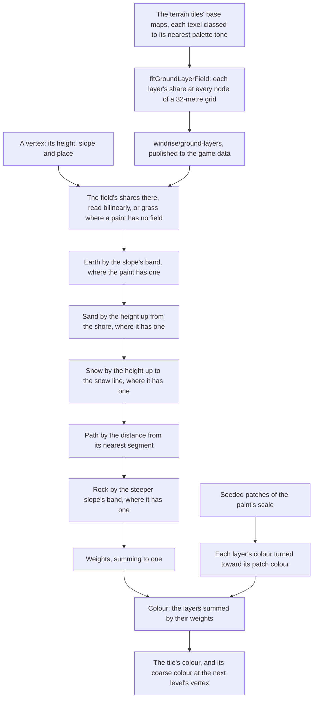

# Ground paint

Genshin's terrain is painted in layers: its tiles hold a weight per layer at every texel, and its shader blends each layer's texture by them, so a meadow turns to bare earth on its banks and to rock on its cliffs. The ground here is painted the same way, by layers and their weights. Where the layers lie is a field of their shares fitted from the terrain's base maps, and each layer is a pair of colours rather than a texture.

## How it works

- **A biome's paint is data.** `GroundPaint` holds each layer's two colours, how wide the patches they turn between are, the field that places its layers (`layerField`), and the rules a biome lays over them: the slopes bare earth and rock come in across, the heights sand and snow reach where a biome has a shore or a snow line, and its paths as segments with a width. Windrise's (`createWindriseGroundPaint`, over the field and the surfaces each terrain worker is loaded with) is its field and no rule: no slope band, no shore and no snow line, and no path until the game's own are read.
- **The layers lie where the game's terrain places them.** The game places its layers by texel, never by slope: each tile names the layer of every four-metre cell ([game data formats](/docs/genshin/game-data-formats)), and its base map shows the same. So a ground's layers are a field of their shares, fitted from its base maps (`fitGroundLayerField`): every texel within the terrain radius is classed to its nearest palette tone in Lab, and each node of a grid over the radius holds the shares of the texels round it, splatted by how near each stands as a bilinear read gives them back, a node no texel reaches taking its nearest reached node's (`computeGroundLayerField`). A vertex reads the field bilinearly (`sampleGroundLayerField`). The field is our own parameters at the grid's resolution, never the game's texture, and every region's tiles hold the same base maps, so any region's ground is fitted the same way once its base maps are exported.
- **Each layer paints its class's colour.** A layer's colour is the mean of the base-map texels classed into it (`computeGroundLayerColours`, `Ground.layers` in the `windrise/surfaces` record), so the field and the colours are fitted from one classing.
- **Rules are laid in order, each over what is under it.** Each rule a paint gives comes in by its own amount, a smoothstep across its band, and every layer already laid keeps only the rest, so the weights always sum to one and the last layer wins where two overlap: rock over everything on a cliff, path over sand on a beach road (`createGroundLayerWeights`). A path's amount is how near the point stands to its nearest segment, all of it within half the path's width and none past its falloff; segments are filed by the cells they reach, as the terrain's features are, so a point reads only the paths near it. A paint with no field lays its rules over grass.
- **The weights are solved per vertex, in the worker.** The game's weights are data per texel, not something its shader works out, so ours take the same place: the terrain's worker reads them at each vertex off the main thread rather than per pixel every frame. With each layer a flat colour pair, blending the weights per pixel would draw the same colours the vertices interpolate, so the vertex colour is the paint (`createGroundPaintColor`).
- **The morph keeps working.** A vertex's coarse colour is painted the same way at the even vertex it collapses onto, with that level's slope, so a tile morphing to the next level paints the ground that level paints, and the material morphs the colour as it morphs the normal ([terrain](/docs/genshin/terrain)).
- **Grass grows only on the grass layer.** The grass reads the ground's colour from above and grows only where it is green ([vegetation](/docs/genshin/vegetation)), so the earth, the rock, the sand and the path stay bare of blades, and the flowers grow only where the weights are nearly all grass ([scatter](/docs/genshin/scatter)).

## What it costs to run

- **A bilinear read, a few rules and a noise per vertex, in the worker.** The field is four nodes' shares a layer, a band one smoothstep, a path one segment measure per path in the vertex's cell, and the patches one simplex sample, so painting costs a fraction of a tile's heights.
- **A field of tens of kilobytes.** Windrise's is a grid of 64 nodes a side over its two-kilometre square, three layers' shares to the hundredth.
- **Nothing on the GPU.** The paint is the vertex colour the terrain already carried, so the ground's material and its draw are unchanged.

## Key files

| File                                                                        | Role                                                                                |
| :-------------------------------------------------------------------------- | :---------------------------------------------------------------------------------- |
| `packages/genshin-engine/src/terrain/createGroundLayerWeights.ts`           | The layers' weights at a point: the field's shares, then each rule over them        |
| `packages/genshin-engine/src/terrain/sampleGroundLayerField.ts`             | A field's shares at a point, read bilinearly                                        |
| `packages/genshin-engine/src/terrain/createGroundPaintColor.ts`             | A vertex's colour from its weights and each layer's patched colour                  |
| `packages/genshin-engine/src/models/terrain/GroundPaint.ts`                 | A biome's paint: its layers' colours, their patches, its field, the rules and paths |
| `packages/genshin-engine/src/models/terrain/GroundLayerField.ts`            | A grid of each layer's shares                                                       |
| `packages/genshin-engine/src/models/terrain/GroundLayer.ts`                 | The layers a ground is painted in                                                   |
| `packages/genshin-world/src/services/windrise/createWindriseGroundPaint.ts` | Windrise's paint: its field and its layers' colours                                 |
| `packages/genshin-world/src/workers/terrainTile.worker.ts`                  | Windrise's ground painted by its paint, on its own seed, once the worker is loaded  |
| `scripts/src/services/genshinAssets/fit/fitGroundLayerField.ts`             | A ground's field fitted from its terrain's base maps                                |
| `scripts/src/services/genshinAssets/fit/computeGroundLayerField.ts`         | Classed points splatted onto a grid's nodes as each layer's shares                  |
| `scripts/src/services/genshinAssets/fit/createGroundToneClassifier.ts`      | A colour's nearest palette tone in Lab, which the field and the colours both class  |

## Notes

- **The cell is the surface pass's call.** Windrise's field is fitted at 32 metres, where the surface pass reads the Ground's colour at 1.55 ΔE against its gate of 2.30, down from 9.10 under the slope bands; the cell sizes it was chosen against are [scene derivation](/docs/genshin/scene-derivation)'s.
- **No rule is laid over Windrise's field.** Inside a cell the slope sorts none of the classes, and the shore band's texels are three quarters earth and a quarter grass, which the field already paints; laid back over the field, the shore band reads the Ground's colour at 6.41 ΔE.
- **A layer has no texture.** Its detail is a pair of colours across patches tens of metres wide. The game's layer textures carry detail under a metre, which a per-pixel layer node would add; it is built only if the surface pass's structure, not its mean colour, says the ground needs it.
