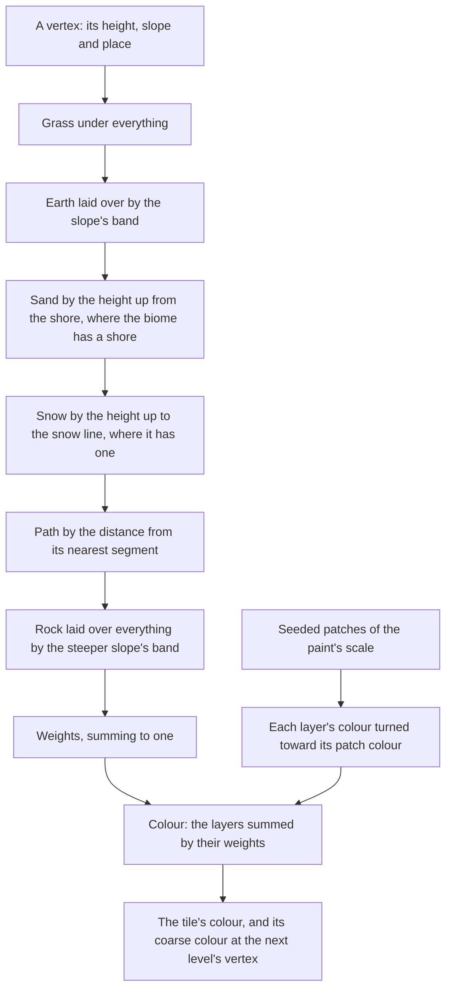

# Ground paint

Genshin's terrain is painted in layers: its tiles hold a weight per layer at every texel, and its shader blends each layer's texture by them, so a meadow turns to bare earth on its banks, to rock on its cliffs and to sand at its shore. The ground here is painted the same way, by layers and their weights, but the weights are solved by rules from the ground's own shape until the game's are read, and each layer is a pair of colours rather than a texture.

## How it works

- **A biome's paint is data.** `GroundPaint` holds each layer's two colours, how wide the patches they turn between are, and the rules: the slopes bare earth and rock come in across, the heights sand and snow reach where a biome has a shore or a snow line, and its paths as segments with a width. Windrise's is a temperate meadow's (`WINDRISE_GROUND_PAINT`): earth on the steeper banks, rock on what is steeper still, sand at the lake's shore, no snow line, and no path until the game's own are read. Each layer paints the mean of the terrain's base maps over the faces its own rule paints (`fitSurfaceColours` with `createGroundLayerClassifier`, into `surfaces.json` as `Ground.layers`), since the export holds only each tile's base map and no close-range albedo to fit the layers against. A slope split alone does not isolate the meadow: the gentle faces' base maps still hold earth-coloured texels, so the grass layer reads `#6d7b57` against the palette's green `#53733e`.
- **Layers are laid in order, each over what is under it.** Grass is the ground's base. Each later layer comes in by its own amount, a smoothstep across its band, and every layer already laid keeps only the rest, so the weights always sum to one and the last layer wins where two overlap: rock over everything on a cliff, path over sand on a beach road (`createGroundLayerWeights`). A path's amount is how near the point stands to its nearest segment, all of it within half the path's width and none past its falloff; segments are filed by the cells they reach, as the terrain's features are, so a point reads only the paths near it.
- **The weights are solved per vertex, in the worker.** The game's weights are data per texel, not something its shader works out, so ours take the same place: the terrain's worker solves them at each vertex with the tile's heights and slopes, where a fit to the game's own weights will one day write them instead, and the rules run once per vertex off the main thread rather than per pixel every frame. With each layer a flat colour pair, blending the weights per pixel would draw the same colours the vertices interpolate, so the vertex colour is the paint (`createGroundPaintColor`).
- **The morph keeps working.** A vertex's coarse colour is painted by the same rules at the even vertex it collapses onto, with that level's slope, so a tile morphing to the next level paints the ground that level paints, and the material morphs the colour as it morphs the normal ([terrain](/docs/genshin/terrain)).
- **Grass grows only on the grass layer.** The grass reads the ground's colour from above and grows only where it is green ([vegetation](/docs/genshin/vegetation)), so the earth, the rock, the sand and the path stay bare of blades.

## What it costs to run

- **A few rules and a noise per vertex, in the worker.** A layer's band is one smoothstep, a path one segment measure per path in the vertex's cell, and the patches one simplex sample, so painting costs a fraction of a tile's heights.
- **Nothing on the GPU.** The paint is the vertex colour the terrain already carried, so the ground's material and its draw are unchanged.

## Key files

| File                                                                 | Role                                                                         |
| :------------------------------------------------------------------- | :--------------------------------------------------------------------------- |
| `packages/genshin-engine/src/terrain/createGroundLayerWeights.ts`    | The layers' weights at a point, each laid over the ones before it            |
| `packages/genshin-engine/src/terrain/createGroundPaintColor.ts`      | A vertex's colour from its weights and each layer's patched colour           |
| `packages/genshin-engine/src/models/terrain/GroundPaint.ts`          | A biome's paint: its layers' colours, their patches, the rules and the paths |
| `packages/genshin-engine/src/models/terrain/GroundLayer.ts`          | The layers a ground is painted in                                            |
| `packages/genshin-world/src/services/windrise/constants.ts`          | Windrise's paint, a temperate meadow's, provisional                          |
| `packages/genshin-world/src/services/windrise/writeWindriseColor.ts` | Windrise's ground painted by its paint, on its own seed                      |

## Notes

- **Every band and colour is provisional.** Windrise's are set by eye; they are fitted to the game's own terrain layers once the inventory reads the weights its tiles hold, and judged in the surface pass ([terrain shapes](/docs/proposals/genshin/terrain-shapes)).
- **A layer has no texture.** Its detail is a pair of colours across patches tens of metres wide. The game's layer textures carry detail under a metre, which a per-pixel layer node would add; it is built only if the surface pass's structure, not its mean colour, says the ground needs it.
