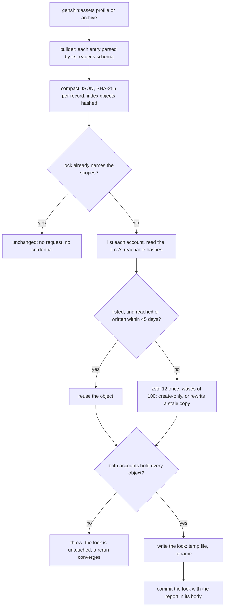
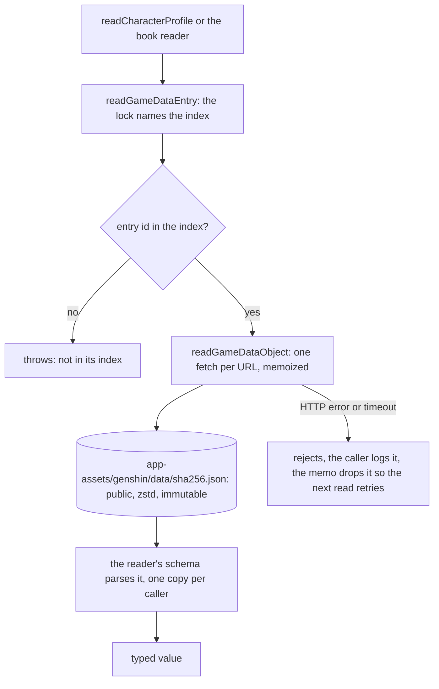
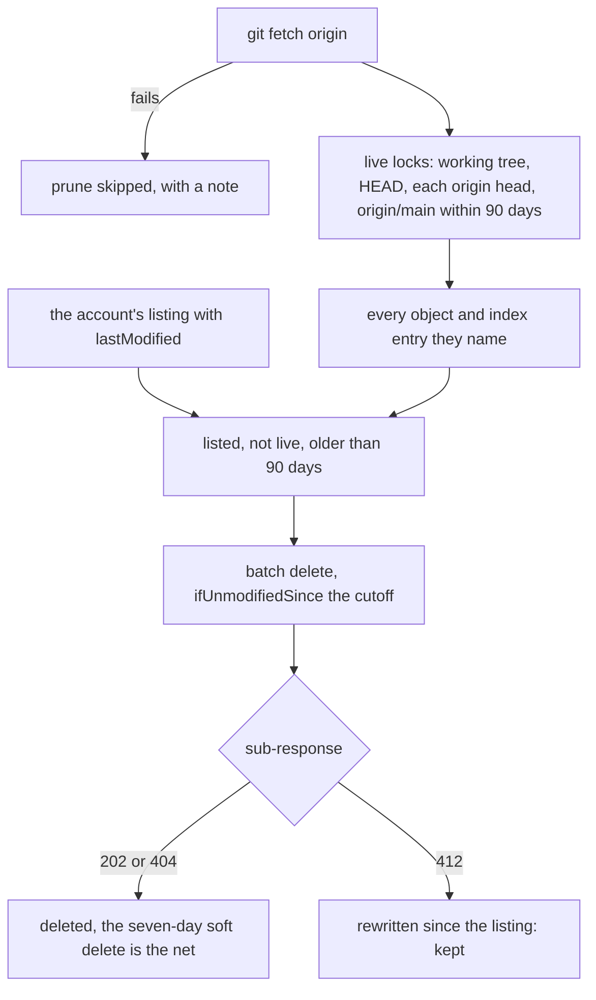

# Hosted game data

The character profiles and the book bodies that genshin-world reads are published to Azure Blob Storage. A browser fetches one record when the screen that shows it opens, and no build reads or bundles them. The one file committed for them is `packages/genshin-world/src/generated/gameDataLock.json`, a map from each published key to the hash of its object. The other generated datasets are still bundled, and [their move is proposed](/docs/proposals/genshin/hosted-game-data).

## How it works

Each record is one object named by the SHA-256 of its compact JSON, under `genshin/data/` in the AppAssets container of each account: `devstesposter001` for development and `prodstesposter001` for production. Identical bytes are stored once, a change of compression level never renames an object, and each object is stored as a zstd frame that the browser decodes, with `Cache-Control: public, max-age=31536000, immutable`.

An entity collection has one index object per language. `profile/<Language>` and `bookBody/<Language>` each map a body or character id to the hash of its record, so opening one entity costs two small fetches: the index, then the record. The lock names every index, and no other key is needed for these two datasets.

The container is AppAssets rather than GenshinAssets, because AppAssets is already public and serves the character packs, while GenshinAssets holds each player's save and must stay private.

## Publishing

- `pnpm -C scripts genshin:assets profile` and `pnpm -C scripts genshin:assets archive` build their records from the dump and publish them. Each takes `--dry-run`, which builds and reports what would publish without a credential or a request.
- A real publish stores each missing object in both accounts, with `DefaultAzureCredential`, which resolves to the owner's `az login`. No account key is written to disk.
- A rerun on the same dump reports `unchanged` and makes no request.
- The lock is written only after both accounts hold every object, so a failed account leaves the committed lock naming nothing new, and a rerun converges.
- `pnpm -C scripts genshin:data verify` fetches every object the lock reaches from each account, anonymously, and checks that each hashes to its name.

The first publish stored 5,765 objects in each account: the 5,735 distinct records behind the 5,880 committed files, and 30 index objects. Together they take 31.3 MB in each account, and the publish took 84 s.

## Reading

`readGameDataEntry` reads the lock, then the index object, then the one record, with each fetch memoized by URL for the page's life. A failed fetch is dropped from the memo, so the next read retries it, and a fetch is abandoned after `DATA_FETCH_TIMEOUT_MS`, ten seconds. A reader parses the value with its own schema each time, so each caller holds a value of its own.

The base URL is the AppAssets path of the account the page reads. `World.vue` passes it to `WorldScreen` as a prop, the Session hands it to the character screen's Profile tab and to its archive, and the Profile tab reads its record from it. Dev reads the dev account and production reads the production account.

## Deleting

`pnpm -C scripts genshin:data prune [--dry-run]` deletes what no live lock reaches and what is older than 90 days, one account at a time, after fetching origin. The live set is the working tree's lock, HEAD's, each remote branch's, and every version of origin/main within the window, plus the one in force when the window opened. A batch delete carries the cutoff as `ifUnmodifiedSince`, so an object rewritten after the listing is kept. The account's seven-day soft delete is the last net.

A publish does not prune. A revert resolves within the 90-day window, since its objects are still stored.

## Integrity

- **Schema on write.** A profile record is parsed by `profileTextSchema` before it is published, and a book body must be a string. Index entries are sorted by id, so an index hashes the same whatever order its records were built in.
- **Create-only uploads.** Each new object is written with `ifNoneMatch: "*"`. An object that already exists with the same name is the state asked for, so it is not an error.
- **Schema on read.** A reader rejects a record its schema does not parse.
- **Verified against the accounts.** `genshin:data verify` checks every object the lock reaches, in both accounts.

There is no client-side hash check: TLS, the immutable keys and the schema parse already cover what one would catch, and nothing would act on a mismatch.

## Measurements

Measured at HEAD `38b9ece57a` before the change and on this tree after it, with the same commands, each build run through the machine's run slots.

| Measure                                          | Before                  | After                         |
| :----------------------------------------------- | :---------------------- | :---------------------------- |
| `genshin-world` dist, files                      | 6,539                   | 268                           |
| `genshin-world` dist, bytes                      | 114,016,946 (108.7 MiB) | 19,283,033 (18.4 MiB)         |
| `index.js`                                       | 3,918,672 bytes         | 3,899,950 bytes               |
| `index.d.ts`                                     | 96,709 bytes            | 97,653 bytes                  |
| Clean build, wall time                           | 64.03 s                 | 13.97 s                       |
| Clean build, peak memory                         | 4,320,608,256 bytes     | 2,973,122,560 bytes           |
| No-clean build, median of three, wall time       | 63.74 s                 | 14.36 s (14.14, 14.61, 14.36) |
| No-clean build, median of three, peak memory     | 4,514,201,600 bytes     | 2,969,731,072 bytes           |
| Declaration program, `tsc --listFilesOnly` files | 3,100 (394 generated)   | 2,726 (3 generated)           |
| Tracked generated files, count                   | 6,698                   | 427 after the removal commit  |
| Tracked generated files, bytes                   | 108,387,082             | 17,539,228                    |
| Published objects per account                    | 0                       | 5,765                         |
| Published bytes per account, compressed          | 0                       | 31,348,117                    |

Wall times move with the machine's load, so the median of three is the steadier figure. The `genshin-world` row of `scripts/src/workspace/buildPackages.bench.md` and the CI package-builds artifact size were not measured in this phase.

## Decisions

- **Azure serves the objects directly, with no CDN.** Immutable caching already answers a repeat visit without a request, and [a CDN in front of Blob storage](/docs/infra/rejected/cdn-in-front-of-blob-storage) would change only the base URL.
- **Nothing is served through the app.** No Nitro route carries the data, so no build compresses it, and [static data in public assets](/docs/genshin/rejected/static-data-in-public-assets) stays rejected.
- **Each language is one index,** not one object per entity. The largest index is about 20 KB raw, so a 2 KB book never pulls a 300 KB index.
- **The keys are `profile/<Language>` and `bookBody/<Language>`,** with the entity id as the entry key, in decimal.
- **The lock imports statically,** and `tsconfig.build.json` maps its exact path ahead of the generated wildcard, so the declaration program types it rather than the stand-in.
- **The base is a required prop, passed down from the world.** `WorldScreen` takes `gameDataBaseUrl`, the Session hands it to the character screen, and the Profile tab takes it as a prop. The lint rule bans `provide` and `inject` because they hide an input from a component's signature, so a tab mounted without the prop is a type error rather than a silent fetch from a guessed address.
- **Prune runs on demand, not at the end of each publish.** The rest of the mechanism is as proposed; the automatic run is not built.
- **The Amber profile test fetches through a stub.** The stub answers the index from the lock's real hash and a stub record, because the test asserts the namecard rule, and a test that copies game data is what the rules forbid.
- **`CHUNK_SUFFIX` is removed.** Its 392 `.chunk.ts` files were all `genshin-world`'s generated chunks, and with the two datasets' loader maps gone no module carries the suffix.
- **Publishing goes to both accounts in one call.** A dry run stores nothing, so there is no per-account dry run.

## Notes

- **Rejected here:** per-version folders, which re-upload every unchanged file under each version; per-dataset manifests, which add a round trip to each read; git-style trees, which take two or three sequential round trips per read; a mutable pointer blob, which lets data run ahead of the parsers deployed with it; a Nitro mirror in development, which would hide the real host from dev; connection strings, replaced by a keyless credential.
- **Clone size does not shrink.** Git keeps the old blobs, and no history is rewritten.
- **External npm consumers need a host from the first phase.** `gameDataBaseUrl` is a required `WorldScreen` prop, and the Profile tab and the book reader fetch from it. Esposter's accounts admit only https://esposter.com and http://localhost:3000, so any other consumer must serve every object the lock names from its own base, as the package README says.

## Key files

| File                                                                     | Role                                                                                            |
| :----------------------------------------------------------------------- | :---------------------------------------------------------------------------------------------- |
| `scripts/src/services/gameData/publishGameData.ts`                       | Plans a publication, stores it in both accounts and returns the entries it planned for the lock |
| `scripts/src/services/gameData/publishGameDataStep.ts`                   | One generator's publish: publishes, then commits its entries onto the lock as it stands then    |
| `scripts/src/services/gameData/commitGameDataLock.ts`                    | Merges a publication's entries onto the lock at commit, so a concurrent scope's entries survive |
| `scripts/src/services/gameData/publishGameDataToTarget.ts`               | Stores what one account lacks, reusing young and reachable objects                              |
| `scripts/src/services/gameData/planGameDataPublication.ts`               | Hashes every record and index, with each index's entries sorted by id                           |
| `scripts/src/services/gameData/verifyGameData.ts`                        | Fetches every object the lock reaches, anonymously, and checks each hash                        |
| `scripts/src/services/gameData/pruneGameData.ts`                         | Deletes the objects no live lock reaches and that are past retention                            |
| `scripts/src/services/gameData/readLiveGameDataLocks.ts`                 | The locks a stored object may still be reached by                                               |
| `scripts/src/services/gameData/storeGameDataRecord.ts`                   | Writes one object create-only, or rewrites a stale copy with the same bytes                     |
| `scripts/src/services/gameData/createGameDataContainerClient.ts`         | The keyless container client each account is published through                                  |
| `scripts/src/services/gameData/commands/verifyCommand.ts`                | `genshin:data verify`                                                                           |
| `scripts/src/services/gameData/commands/pruneCommand.ts`                 | `genshin:data prune`                                                                            |
| `scripts/src/services/genshinAssets/profile/buildProfilePublication.ts`  | Builds each character's profile in every language, one index a language                         |
| `scripts/src/services/genshinAssets/archive/buildBookBodyPublication.ts` | Builds each volume's body in every language, one index a language                               |
| `scripts/src/services/genshinAssets/commands/profileCommand.ts`          | `genshin:assets profile`, which publishes the profiles                                          |
| `scripts/src/services/genshinAssets/commands/archiveCommand.ts`          | `genshin:assets archive`, which publishes the book bodies after the slices                      |
| `packages/genshin-world/src/generated/gameDataLock.json`                 | The lock: each index key and each object key to its hash                                        |
| `packages/genshin-world/src/services/data/readGameDataEntry.ts`          | Reads one record by id, through its index                                                       |
| `packages/genshin-world/src/services/data/readGameDataObject.ts`         | Fetches one object by its hash, memoized by URL                                                 |
| `packages/genshin-world/src/services/shared/fetchJson.ts`                | The fetch itself: the timeout, the HTTP error and the JSON                                      |
| `packages/genshin-world/src/services/data/constants.ts`                  | `GAME_DATA_BLOB_PATH`, the path under the container                                             |
| `packages/genshin-world/src/services/profile/readCharacterProfile.ts`    | Reads a character's profile record, its Friendship Level and its namecard                       |
| `packages/genshin-world/src/composables/useWorldArchive.ts`              | Reads a volume's body in the game language when the reader opens it                             |
| `packages/genshin-world/src/components/Character/Profile/Index.vue`      | The Profile tab, which reads its character's record                                             |
| `packages/genshin-world/src/components/World/Screen/Index.vue`           | Opens the world once its names and stat tables arrive, with the base URL among its props        |
| `packages/genshin-world/src/components/Character/Screen/Index.vue`       | Hands the base URL to the Profile tab                                                           |
| `packages/genshin-world/tsconfig.build.json`                             | Maps the lock's exact path ahead of the generated stand-in                                      |
| `apps/web/app/components/Genshin/World.vue`                              | Passes the AppAssets game data path to the world                                                |
| `packages/db/src/services/azure/container/uploadCompressedJson.ts`       | Uploads a compressed JSON object with its headers and conditions                                |
| `packages/db/src/services/azure/container/deleteBlobs.ts`                | Deletes a set of blobs, treating a missing one as deleted and a refused one as kept             |

## Sources

- [Put Blob, with its conditional headers](https://learn.microsoft.com/en-us/rest/api/storageservices/put-blob), for `If-None-Match` on create-only uploads.
- [Blob Batch](https://learn.microsoft.com/en-us/rest/api/storageservices/blob-batch), for the batch delete and its per-request conditions.
- [Blob soft delete](https://learn.microsoft.com/en-us/azure/storage/blobs/soft-delete-blob-overview), for the seven-day recovery window.
- [Azure Blob Storage pricing](https://azure.microsoft.com/en-us/pricing/details/storage/blobs/), for Hot LRS in Australia East.
