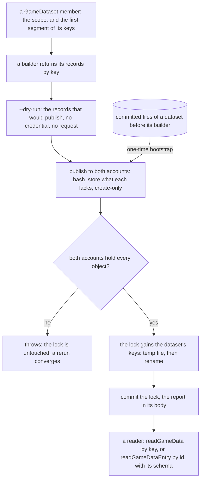
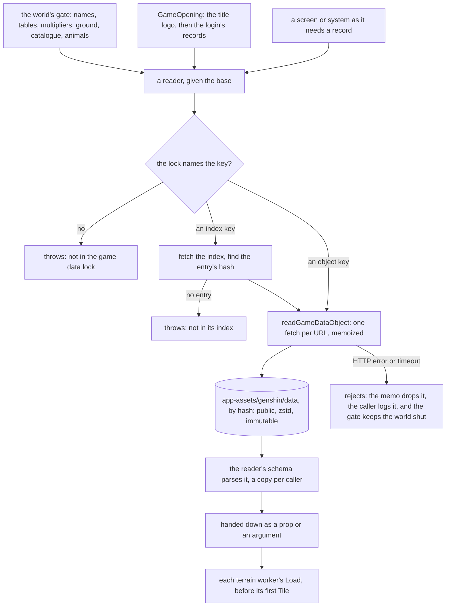
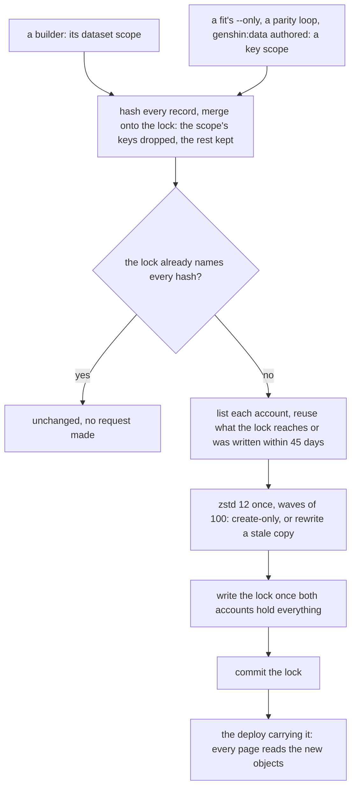
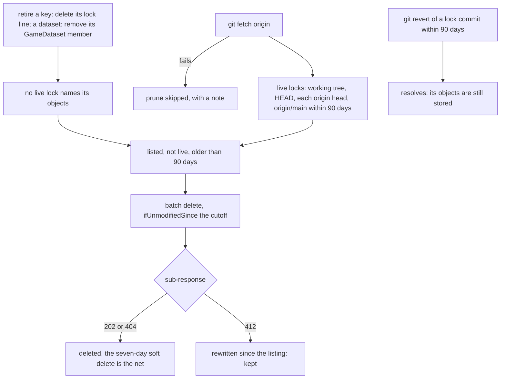
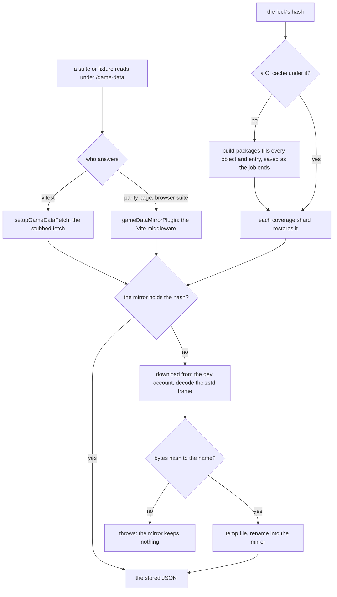

# Hosted game data

Every static dataset genshin-world reads is published to Azure Blob Storage, and `packages/genshin-world/src/generated/gameDataLock.json` maps each published key to the hash of its object. That covers the game's tables and words (the stats, enemies, materials, names, quests, archive, card game and the rest), the scenes the fits draw from the game's exports (the login, the HUD and Windrise), and the world files people author (the catalogue, the regions' grounds and the age rating). A browser fetches a record when the world's gate, the opening or a screen asks for it, and no build reads or bundles one: the package carries the lock, the one save bound the app server needs at import, and code.

## How it works

Each record is one object named by the SHA-256 of its compact JSON, under `genshin/data/` in the AppAssets container of each account: `devstesposter001` for development and `prodstesposter001` for production. Identical bytes are stored once, a change of compression level never renames an object, and each object is stored as a zstd frame that the browser decodes, with `Cache-Control: public, max-age=31536000, immutable`.

The container is AppAssets rather than GenshinAssets, because AppAssets is already public, while GenshinAssets holds each player's save and must stay private.

### Keys and scopes

A record read whole is an object key, `<dataset>/<name>`: `stats/weapons`, `login/door`, `windrise/plants`, `ground/<region>` for each region's plateaus and `catalogue/catalogue`. The title logos are one key a logo, `splash/titleLogo/<logo>`, so the opening fetches only its reader's. Each key's first segment is a `GameDataset` member, and the lock's keys type a reader's key (`GameDataKey`, `GameDataIndexKey`), so a reader naming a key no publish wrote fails typecheck.

An entity collection a screen opens one entity of is an index object instead. `profile/<Language>` and `bookBody/<Language>` each map a character or body id to the hash of its record, one index a language, and `talentMultipliers` and `talentLabels` each map an avatar id to its record. Opening one entity costs two small fetches: the index, then the record.

A publish names the scopes it replaces. A **dataset scope** (`stats`) replaces every key under its dataset, which is what a builder that rebuilds the whole dataset from the dump publishes. A **key scope** (`login/music`) replaces that one key and keeps its dataset's other keys as the lock holds them, so a fit that refits one part, a parity loop that refines one record or an authored file publishes one key. A key scope is checked to sit under a dataset before anything is published (`toGameDataKeyScopes`), and a key whose dataset has left `GameDataset` leaves the lock on its next write.

## Datasets

Every builder is a `pnpm -C scripts` command, and every one takes `--dry-run`. A reader is a function of `genshin-world` that takes the base URL and parses its record with its own schema.

| Dataset                      | Keys                                                                  | Published by                                                                  | Read by                                                                                        | Read when                                                 |
| :--------------------------- | :-------------------------------------------------------------------- | :---------------------------------------------------------------------------- | :--------------------------------------------------------------------------------------------- | :-------------------------------------------------------- |
| `stats`                      | one key a table: `stats/characters`, `stats/weapons` and the curves   | `genshin:assets stats`                                                        | `readStatTables`; `readTalentTables`, `readConstellationTables`, `readWeaponLevelRequiredExps` | the world's gate; the other three have no caller yet      |
| `talentMultipliers`          | one index, by avatar id                                               | `genshin:assets stats`                                                        | `readTalentMultipliers` through `TalentMultiplierLoaderMap`                                    | the gate for the starting team, then as a member joins    |
| `talentLabels`               | one index, by avatar id                                               | `genshin:assets stats`                                                        | none yet                                                                                       | no caller yet                                             |
| `enemies`                    | `enemies/kinds`, `enemies/levelCurves`                                | `genshin:assets enemies`                                                      | `readEnemyTables`                                                                              | the world's gate                                          |
| `adventureRank`              | `adventureRank/levels`, `locks`, `worldLevels`                        | `genshin:assets rank`                                                         | `readAdventureRankTables`                                                                      | the world's gate                                          |
| `items`                      | `items/materials`, `items/reliquarySets`                              | `genshin:assets items`                                                        | `readMaterialDataMap`; `readReliquarySets`                                                     | the world's gate; the sets have no caller yet             |
| `nameText`                   | one key a language                                                    | `genshin:text names`                                                          | `NameTextLoaderMap`                                                                            | the world's gate, and the pack loader's names             |
| `hud`                        | `hud/interfaceRects`                                                  | `genshin:assets fit hud`                                                      | `readHudInterfaceRects`                                                                        | the world's gate                                          |
| `windrise`                   | `windrise/base-ground`, `surfaces`, `plants`, `oak` and the rest      | `genshin:assets fit windrise`                                                 | `readWindriseData`                                                                             | the world's gate, and each terrain worker's `Load`        |
| `ground`                     | one key a region                                                      | `genshin:data authored`, and `fit windrise` when a capital's plateau moves    | `readWindriseData`                                                                             | the world's gate, and each terrain worker's `Load`        |
| `catalogue`                  | `catalogue/catalogue`                                                 | `genshin:data authored`                                                       | `readCatalogue`                                                                                | the world's gate                                          |
| `wildlife`                   | one key a region                                                      | `genshin:assets wildlife`                                                     | `readMondstadtWildlifePlaces`                                                                  | the world's gate                                          |
| `splash`                     | `splash/titleLogo/<logo>`                                             | `genshin:assets fit login`                                                    | `readTitleLogoPath`                                                                            | the opening, before its first splash                      |
| `login`                      | one key a part: `login/door`, `login/music`, `login/sky` and the rest | `fit login`, the parity loops, and `genshin:data authored` for its age rating | `readLoginData`                                                                                | the opening, while its splashes play                      |
| `profile`                    | one index a language                                                  | `genshin:assets profile`                                                      | `readCharacterProfile`                                                                         | the Profile tab opens                                     |
| `friendship`                 | `friendship/friendship`                                               | `genshin:assets friendship`                                                   | `readFriendshipLevels`, `readFriendshipNamecards`                                              | the Profile tab opens                                     |
| `archive`                    | one key a section                                                     | `genshin:assets archive`                                                      | `readArchiveEntries`, `readTravelLogEntries`                                                   | the Archive opens, or a parent quest finishes             |
| `archiveText`                | one key a language                                                    | `genshin:assets archive`                                                      | `ArchiveTextLoaderMap`                                                                         | the Archive opens                                         |
| `bookBody`                   | one index a language                                                  | `genshin:assets archive`                                                      | `useWorldArchive`, through `readGameDataEntry`                                                 | a volume opens                                            |
| `achievements`               | `achievements/achievements`, `achievements/categories`                | `genshin:assets achievements`                                                 | `readAchievements`                                                                             | the achievements screen opens, or an achievement advances |
| `achievementText`            | one key a language                                                    | `genshin:assets achievements`                                                 | `AchievementTextLoaderMap`                                                                     | the achievements screen opens                             |
| `quests`                     | one key a parent quest                                                | `genshin:text quests`                                                         | `QuestLoaderMap`                                                                               | the session starts                                        |
| `questText`                  | one key a language                                                    | `genshin:text quests`                                                         | `QuestTextLoaderMap`                                                                           | the session starts                                        |
| `gathering`                  | one key a region, and `gathering/items`                               | `genshin:assets gathering`                                                    | `readMondstadtGatheringPlaces`, `readGatheringItems`                                           | the session starts                                        |
| `exploration`                | one key a region                                                      | `genshin:assets exploration`                                                  | `readMondstadtExplorationAreas`                                                                | the session starts                                        |
| `transPoints`                | one key a scene                                                       | `genshin:assets trans-points`                                                 | `readOpenWorldTransPointRewards`                                                               | a statue's or waypoint's reward is claimed                |
| `gcg`                        | `gcg/deck<id>`, `gcg/standardRule`, `gcg/games`                       | `genshin:assets gcg`                                                          | `GcgDeckLoaderMap`, `readGcgStandardRule`, `readGcgGame`                                       | a card game opens                                         |
| `gcgText`                    | one key a language                                                    | `genshin:text gcg`                                                            | `GcgTextLoaderMap`                                                                             | a card game opens                                         |
| `cooking`                    | `cooking/recipes`, `cooking/processing`                               | `genshin:assets cooking`                                                      | `readCookingRecipes`, `readProcessingRecipes`                                                  | no caller yet                                             |
| `crafting`                   | `crafting/recipes`                                                    | `genshin:assets crafting`                                                     | `readCraftingRecipes`                                                                          | no caller yet                                             |
| `forging`                    | `forging/recipes`                                                     | `genshin:assets forging`                                                      | `readForgeRecipes`                                                                             | no caller yet                                             |
| `home`                       | `home/blueprints`, `home/levels`                                      | `genshin:assets home`                                                         | `readHomeBlueprints`, `readHomeLevels`                                                         | no caller yet                                             |
| `gadgets`                    | `gadgets/gadgets`                                                     | `genshin:assets gadgets`                                                      | `readGadgetRows`                                                                               | no caller yet                                             |
| `fishing`                    | `fishing/fish`, `points`, `pools`, `rods`                             | `genshin:assets fishing`                                                      | `readFish`, `readFishingPoints`, `readFishingPools`, `readFishRods`                            | no caller yet                                             |
| `expeditions`                | `expeditions/limits`, one key a region                                | `genshin:assets expeditions`                                                  | `readExpeditionLimitAdds`, `readMondstadtExpeditionPlaces`                                     | no caller yet                                             |
| `commissions`                | one key a region                                                      | `genshin:assets commissions`                                                  | `readMondstadtCommissions`                                                                     | no caller yet                                             |
| `reputation`                 | one key a region                                                      | `genshin:assets reputation`                                                   | `readMondstadtReputation`                                                                      | no caller yet                                             |
| `statueLevels`               | one key a region                                                      | `genshin:assets statues`                                                      | `readMondstadtStatueLevels`                                                                    | no caller yet                                             |
| `offerings`                  | `offerings/frostbearingTree`                                          | `genshin:assets offerings`                                                    | `readFrostbearingTreeLevels`                                                                   | no caller yet                                             |
| `spiralAbyss`                | `spiralAbyss/floors`, `rewards`, `periods`                            | `genshin:assets spiral-abyss`                                                 | `readAbyssFloors`, `readAbyssFloorRewards`, `readAbyssPeriods`                                 | no caller yet                                             |
| `imaginarium`                | `imaginarium/seasons`, `imaginarium/difficulties`                     | `genshin:assets imaginarium`                                                  | `readImaginariumSeasons`, `readImaginariumDifficulties`                                        | no caller yet                                             |
| `frostbearingTreePlaces`     | one key a region                                                      | `genshin:assets offerings`                                                    | none yet                                                                                       | no caller yet                                             |
| `chests`, `oculi`, `puzzles` | one key a region                                                      | `genshin:assets chests`, `oculi`, `puzzles`                                   | none yet                                                                                       | no caller yet                                             |
| `shops`                      | one key a shop                                                        | `genshin:assets shops`                                                        | none yet                                                                                       | no caller yet                                             |

## What stays in the package

- **The lock**, imported statically through the package's own `#src/*.json` import. It is the one copy of which hash a key names, and the readers' key types are read off it.
- **`data/achievements/achievementCount.json`**, eighteen bytes. The save schema bounds a player's achievement progress by it (`services/save/constants.ts`), and the app server builds that schema at import (`apps/web/server/models/genshin/GenshinSaveEnvelope.ts`), where no read can be awaited.
- **Code that names what is published.** `TalentMultiplierLoaderMap` is generated by `genshin:assets stats`, one entry an avatar, each reading its entry of the `talentMultipliers` index. The other loader maps (`NameTextLoaderMap`, `QuestLoaderMap`, `GcgDeckLoaderMap` and the text maps) are written by hand, one entry a language, deck or quest, each reading its key. The traced vector paths, such as `ElementMarkPathMap`, are code the screens draw, not data a step generates.
- **The authored sources.** `data/catalogue.json`, each region's `data/<region>/ground.json` and `data/login/ageRating.json` are the files people edit, with git's history, and no step generates them. They stay committed at their paths, the bundle no longer imports them, and `genshin:data authored` publishes them: the catalogue and the grounds as dataset scopes, so a deleted ground leaves the lock with its file, and the age rating as a key scope, since the fits own the rest of `login`. When Windrise's landmarks fit moves a capital's plateau, it rewrites that region's ground file and publishes the ground in the same run.
- **What the app serves rather than the package.** Each region's landmarks (`data/regions/`) and the login music's recordings (`data/login/recordings/`) are served by the app's own server from the package's copy (`apps/web/configuration/nitro.ts`), fetched by reach and never bundled. The ley line outcrop slices (`data/leyLine/`) have no reader, and the game's own words for the interface are `genshin-text`'s chunks ([game text](/docs/genshin/game-text)).

## Creating a dataset

A dataset starts as a `GameDataset` member, which is both the scope a publish replaces and the first segment of its keys. Its builder returns its records by key (`GameDataBuild`) instead of writing files, and its command publishes them under the dataset's scope. A dry run builds and reports `N records would be published` with no credential and no request. The real publish stores each object in both accounts, then writes the lock, which is committed with the publish's report in its body. Only then is the reader written, since its key is typed off the committed lock.

Every dataset that predates its builder's publish took the other branch once: a one-time bootstrap published it from the files committed at the time, as the first phase did for the profiles and the second for everything else, and the files were deleted once every reader read the lock.

## Reading

`readGameData` reads the lock, then the record its key names; `readGameDataEntry` reads the lock, then the index object, then the one record. Each fetch is memoized by URL for the page's life, a failed fetch is dropped from the memo so the next read retries it, and a fetch is abandoned after `DATA_FETCH_TIMEOUT_MS`. A reader parses the value with its own schema each time, so each caller holds a value of its own, and every function over a record stays pure and synchronous, taking it as an argument.

The base URL is the AppAssets path of the account the page reads (`getGenshinGameDataBaseUrl`): dev reads the dev account, production the production account. Two async boundaries hold every read the world needs before it draws, and a third entry point hands a worker what one of them read:

- **The world's gate.** `World.vue` passes the base to `WorldScreen`, which awaits the names, the stat, enemy, Adventure Rank and material tables, the HUD's rects, the starting team's talent multipliers, Windrise's records with the regions' grounds, the catalogue and Mondstadt's animals in one `Promise.all` (`WorldTables`), then opens the Session with them as props. The Session builds the world's one ground from Windrise's base and the regions' grounds (`createWorldHeight`) and hands it and each record down to what draws or stands on them.
- **The opening.** The app's game page and the agent console pass the base to `GameOpening`, which reads its title logo before the first splash and the login screen's records while the splashes play (`readTitleLogoPath`, `readLoginData`). A phase whose read has not arrived holds the splashes' white, and the login screen hands each of its parts the records it draws.
- **The terrain worker's `Load`.** A function cannot cross to a worker, so the terrain posts each worker the ground's records the gate read (`TerrainWorkerGround`) as it starts, ahead of its first `Tile`, and the worker builds its own ground from them ([terrain](/docs/genshin/terrain)).

Everything else is read as it is needed, from the base the Session hands down: the character screen's Profile tab, the Archive and a volume's body, the achievements screen, the card game, the quests, the gathering points, the exploration areas and a statue's rewards. A read that fails is logged; at the gate the world stays shut, at the opening the white stays, and anywhere else the screen shows what it had.

A step in `scripts` reads what another step published through the lock on disk, from the dev account (`readPublishedGameData`), never through genshin-world's build, which a step running under `tsx` may load stale. A world data file a fit or a parity loop reads is read through the lock first (`readWorldData`): the record the lock names under its path less `.json`, and the file the package keeps only where the lock names nothing, as for the region data and the authored sources.

## Updating

A rerun of any builder is how a dataset changes. The builder hashes every record and merges them onto the lock: the scope's keys are dropped and the publication's laid over the rest. If the lock already names every hash, it reports `unchanged, no request made` and needs no credential. Otherwise it lists each account, reuses any object the lock reaches or that was written within 45 days, uploads the rest at zstd level 12 in waves of 100, create-only, and writes the lock once both accounts hold everything.

- **A dataset scope**: a `genshin:assets` or `genshin:text` builder rebuilds its whole dataset from the dump.
- **A key scope**: `genshin:assets fit <component>` publishes each record it fits under its own key, so `--only plants` replaces `windrise/plants` alone. The parity loops publish the one record they refit after each run, with no dry run: `genshin:parity notes`, `expression` and `instruments` publish `login/music`, and `calibrate --write` publishes `login/stoneLight`. `genshin:data authored` publishes the authored sources.

Nothing a browser reads changes until the lock does: the lock commit is the switch, and the deploy that carries it is the moment every page reads the new objects. A page still open on the old build keeps reading the old objects, which stay stored.

## Deleting

A key is retired by deleting its line from the lock, and a dataset by removing its `GameDataset` member, which drops its keys on the lock's next write. Its objects stay stored until a prune finds no live lock naming them.

`pnpm -C scripts genshin:data prune [--dry-run]` deletes what no live lock reaches and what is older than 90 days, one account at a time, after fetching origin. The live set is the working tree's lock, HEAD's, each remote branch's, and every version of origin/main within the window, plus the one in force when the window opened. A batch delete carries the cutoff as `ifUnmodifiedSince`, so an object rewritten after the listing is kept, and the account's seven-day soft delete is the last net. A publish never prunes, so a `git revert` of a lock commit within the window resolves, since its objects are still stored.

## Tests

No suite reads a copy of the game data. A suite passes `GAME_DATA_LOCAL_BASE_URL`, `/game-data`, as its base, and the vitest setup file answers a fetch under it from a content-addressed mirror in `packages/genshin-world/node_modules/.cache/game-data`. The parity page and the browser suite reach the same mirror through a Vite middleware on the same path. A hash the mirror lacks is downloaded from the dev account, its zstd frame decoded, and kept only once its bytes hash to its name; a worker that loses the race to write it has written the same bytes.

CI keys the mirror on the lock's hash. The `build-packages` job looks the key up, and when no cache holds it, `pnpm game-data:mirror` downloads every object and index entry the lock names and the cache action saves it under that key as the job ends; each coverage shard only restores it, so a run fetches nothing until the lock moves. The name text's suite reads every record the lock names outside the text datasets, so it sets a sixty-second timeout that a cold local mirror's first run fits inside.

## Integrity

- **Schema on write.** A profile record is parsed by `profileTextSchema` before it is published, and a book body must be a string. Index entries are sorted by id, so an index hashes the same whatever order its records were built in.
- **Create-only uploads.** Each new object is written with `ifNoneMatch: "*"`. An object that already exists with the same name is the state asked for, so it is not an error.
- **Schema on read.** A reader rejects a record its schema does not parse.
- **Verified against the accounts.** `pnpm -C scripts genshin:data verify` fetches every object the lock reaches from each account, anonymously, and checks that each hashes to its name.

There is no client-side hash check: TLS, the immutable keys and the schema parse already cover what one would catch, and nothing would act on a mismatch.

## Measurements

Each phase was measured before its change and after it, with the same commands, each build run through the machine's run slots. Wall times move with the machine's load, so the median of three is the steadier figure.

The first phase, the profiles and book bodies, measured at HEAD `38b9ece57a` before:

| Measure                                          | Before                  | After                         |
| :----------------------------------------------- | :---------------------- | :---------------------------- |
| `genshin-world` dist, files                      | 6,539                   | 268                           |
| `genshin-world` dist, bytes                      | 114,016,946 (108.7 MiB) | 19,283,033 (18.4 MiB)         |
| `index.js`                                       | 3,918,672 bytes         | 3,899,950 bytes               |
| `index.d.ts`                                     | 96,709 bytes            | 97,653 bytes                  |
| Clean build, wall time                           | 64.03 s                 | 13.97 s                       |
| Clean build, peak memory                         | 4,320,608,256 bytes     | 2,973,122,560 bytes           |
| No-clean build, median of three, wall time       | 63.74 s                 | 14.36 s (14.14, 14.61, 14.36) |
| No-clean build, median of three, peak memory     | 4,514,201,600 bytes     | 2,969,731,072 bytes           |
| Declaration program, `tsc --listFilesOnly` files | 3,100 (394 generated)   | 2,726 (3 generated)           |
| Tracked generated files, count                   | 6,698                   | 427 after the removal commit  |
| Tracked generated files, bytes                   | 108,387,082             | 17,539,228                    |
| Published objects per account                    | 0                       | 5,765                         |
| Published bytes per account, compressed          | 0                       | 31,348,117                    |

The second phase, every other dataset, measured at HEAD `3ee1c42c1f` before and on the removal's tree after:

| Measure                                      | Before                                | After                                                                   |
| :------------------------------------------- | :------------------------------------ | :---------------------------------------------------------------------- |
| `genshin-world` dist, files                  | 267                                   | 14                                                                      |
| `genshin-world` dist, bytes                  | 19,927,685                            | 2,101,284                                                               |
| `index.js`                                   | 4,896,071 bytes                       | 1,311,854 bytes                                                         |
| `index.js`, gzip -9                          | 778,072 bytes                         | 303,095 bytes                                                           |
| `index.js`, brotli -q 11                     | 542,345 bytes                         | 227,004 bytes                                                           |
| `index.js`, JSON against code                | 3,407,768 of 4,896,105 bytes          | none of 1,311,888 bytes                                                 |
| `index.js`'s static closure                  | 5,484,286 bytes, 3,959,186 of it JSON | 1,390,438 bytes, the lock's 23,690 and achievementCount's 85 of it JSON |
| `index.d.ts`                                 | 98,342 bytes                          | 104,881 bytes                                                           |
| `save.js` and its static chunks              | 89,183 bytes                          | 25,462 bytes                                                            |
| `terrainTileWorker.js` and its static chunks | 500,332 bytes                         | 11,545 bytes                                                            |
| Clean build, wall time                       | 14.25 s                               | 10.44 s                                                                 |
| Clean build, peak memory                     | 2,954,690,560 bytes                   | 2,261,483,520 bytes                                                     |
| No-clean build, median of three, wall time   | 13.78 s (13.73, 13.78, 13.85)         | 10.37 s (11.19, 10.37, 10.32)                                           |
| No-clean build, median of three, peak memory | 3,228,303,360 bytes                   | 2,380,103,680 bytes                                                     |
| Declaration program, files                   | 2,745 (3 generated, 32 data)          | 2,850 (18 generated, 1 data)                                            |
| Tracked generated files                      | 427 files, 17,539,228 bytes           | 2 files, 31,218 bytes                                                   |
| Tracked data JSON                            | 58 files, 43 of them bundled          | 25 files, achievementCount bundled                                      |
| Objects the lock reaches per account         | 5,765                                 | 6,228                                                                   |
| Stored objects and bytes per account         | 5,765, 31,348,117 bytes               | 6,253, 36,126,129 bytes                                                 |

The declaration program's generated files after are the lock, the talent loader map, and `genshin-text`'s loader map and its language chunks, which the program reaches through that package's source; it emits none of them. The stored objects outnumber the lock's by the versions the last republish replaced, which a prune takes once they pass the window. The `index.d.ts` growth is the barrel's own exports, the character packs' among them. Neither phase timed the world's mount to the door: it needs a signed-in save in a browser, so the gate's wait is the owner's to read.

## Decisions

- **Azure serves the objects directly, with no CDN.** Immutable caching already answers a repeat visit without a request, and [a CDN in front of Blob storage](/docs/infra/rejected/cdn-in-front-of-blob-storage) would change only the base URL.
- **Nothing is served through the app.** No Nitro route carries the data, so no build compresses it, and [static data in public assets](/docs/genshin/rejected/static-data-in-public-assets) stays rejected.
- **Each language is one index,** not one object per entity. The largest index is about 20 KB raw, so a 2 KB book never pulls a 300 KB index.
- **The keys are `profile/<Language>` and `bookBody/<Language>`,** with the entity id as the entry key, in decimal.
- **Each dataset is one builder that returns records.** A step hands its records to the publisher, scoped to the dataset it replaces, and a code-named record takes a key of its own (`stats/weapons`, `gcg/standardRule`), each deck `gcg/deck<id>`.
- **The lock imports statically,** through the package's own `#src/*.json` import, as achievementCount does, and nothing else the package imports is data.
- **The base is a required prop, passed down from the world.** `WorldScreen` and `GameOpening` take `gameDataBaseUrl`, the Session hands it to every screen that reads, and the lint rule bans `provide` and `inject` because they hide an input from a component's signature, so a screen mounted without the base is a type error rather than a silent fetch from a guessed address.
- **Prune runs on demand, not at the end of each publish.**
- **The Amber profile test fetches through a stub.** The stub answers the index from the lock's real hash and a stub record, because the test asserts the namecard rule, and a test that copies game data is what the rules forbid.
- **The chunk suffix is removed.** Its `.chunk.ts` files were all `genshin-world`'s generated chunks, and with their loader maps gone no module carries the suffix.
- **Publishing goes to both accounts in one call.** A dry run stores nothing, so there is no per-account dry run.
- **A key scope sits under a dataset.** A bare dataset passed as a key is refused, since it would replace its whole dataset with one record.
- **The lock's keys type the readers' keys,** `keyof` over the committed lock, though the declarations then carry the lock's key names.
- **The suites' base imports nothing.** `GAME_DATA_LOCAL_BASE_URL` has a module of its own, because the fixtures that pass it run in the browser through the parity page; the mirror's directory and its source address sit in a Node-only module beside the mirror.
- **The mirror is the package's own tooling,** under `packages/genshin-world/scripts`, reached by `#scripts/*` and never shipped. Neither it nor the `scripts` package can import the other's tooling, so each writes the dev account's address.
- **The mirror checks the bytes it downloaded.** The account stores the compact JSON the publisher hashed, so the downloaded bytes hash to their name with no re-serialization.
- **CI's mirror is filled once, ahead of the shards.** A shard reads a subset of what the lock names, so a shard's save would key that subset as the whole; the one fill reads every object and index entry, and the shards only restore it. It runs in `build-packages`, the one job every shard waits on, under Node with no `tsx`, on the built `@esposter/shared`.
- **A world data file is read from its published record first.** The fits and the parity loops publish rather than write, so the record the lock names is the freshest copy, and a parity loop that refits `login/music` reads its own last publish.
- **The fits run one at a time.** A fit holds the thread while it computes, so when the fits ran together, a record another fit was fetching outwaited its ten-second timeout. They share the one thread either way, so running them in turn costs only the reads they overlapped.
- **A fit returns what a builder returns:** its notes and its records by key (`GameDataBuild`), which the fit command publishes as any step does.
- **The authored files stay committed where they are.** They are files people edit, with history, and a publish from them is one command, where deleting them would turn each edit into a fetch, an edit and a republish, and leave their history to git's old blobs once a version is pruned.
- **The develop deployment reads the dev account.** `https://esposter-develop.up.railway.app` is admitted on the dev account's Blob CORS beside `http://localhost:3000`, so a develop page reads its records from the dev account rather than production's.
- **A combatant carries its weapon type.** The world's combat fills `weaponType` from the roster's table it already holds, so Bennett's field and the ores read the wielder off the combatant and nothing holds a copy of the table for a synchronous lookup. The field is optional: a character the roster's table does not hold wields nothing, and a test's combatant whose rules read no weapon leaves it out.
- **A record holding several tables is parsed per field.** The friendship record carries the levels and the namecards, and each reader's schema takes only its own field, so a reader holds what it returns and nothing else.
- **A step publishes its builders' records in one call.** Fishing's two builders share one scope, and a publish replaces every key under its scope, so a call per builder would drop the other builder's keys until its own call ran. Offerings publishes its two scopes in one call for the same reason.
- **The opening reads its own records.** `GameOpening` starts both reads as it mounts, so the title logo, read first, is the only one a cold cache waits on before the splashes, and the login's records arrive while the splashes play. The login screen and its parts take the records as props and every service over them takes its record as an argument, so a door, a camera pose or a row the data sets is computed from what was read, never imported.
- **The opening's base is the world's.** Its hosts pass `getGenshinGameDataBaseUrl` over the page's container base URL, the same function `World.vue` reads its base through, rather than a composable of their own.
- **A reader nothing calls still moves.** The recipe, activity, talent table, reliquary set and expedition limit readers fetch their keys, so the package imports none of their JSON ahead of the screen that calls them.
- **The world's records ride with its tables.** The ground, the catalogue and the animals are fields of `WorldTables`, awaited in the screen's one `Promise.all` and reaching the Session through the props it already extends, so the gate stays one list and a record the Session needs is a type error until the gate reads it.
- **The ground is built once a thread.** The Session builds `getGroundHeight` with `createWorldHeight` and hands the one function to every reader on the main thread: the character, the cameras, the landmarks, the plants, the enemies, the animals, the residents and the pick ups. A function cannot cross to a worker, so each terrain worker builds its own from the same records.
- **A terrain worker is loaded before its first tile, with nothing awaited.** Message order already puts the `Load` ahead of every `Tile` ([terrain](/docs/genshin/terrain)), so no promise gates the first request; a tile arriving first would be a broken order, which the worker throws on rather than computing a tile over no ground.
- **A base ground keeps its residual's fade and clearings.** The Windrise base reads through the engine's terrain residual, which carries the fade and its clearings, so the world's height draws the residual the fit wrote.
- **A base ground's features are plateaus.** The ground fits draw plateau features only, so the schema takes the plateau schema rather than the engine's union of the three kinds.
- **A record keyed by an id refuses duplicates.** Plant names and wildlife place ids are unique in the records, so their arrays take `createUniqueArraySchema`. A residual's clearings repeat in the record, so theirs stay a plain array.
- **A statue section is the engine's `StatueSection`.** Its centre, height and radii are not a lathe section's, so no lathe schema is reused.
- **A surface part's palette is not read.** The surfaces' parts carry a palette no reader uses, and its schema drops it.

## Notes

- **Rejected here:** per-version folders, which re-upload every unchanged file under each version; per-dataset manifests, which add a round trip to each read; git-style trees, which take two or three sequential round trips per read; a mutable pointer blob, which lets data run ahead of the parsers deployed with it; a Nitro mirror in development, which would hide the real host from dev; connection strings, replaced by a keyless credential.
- **Clone size does not shrink.** Git keeps the old blobs, and no history is rewritten.
- **External npm consumers need a host.** `gameDataBaseUrl` is a required prop of `WorldScreen` and of `GameOpening`, and every reader takes a base. Esposter's accounts admit only Esposter's own origins, so any other consumer must serve every object the lock names from its own base, as the package README says.
- **A cold mount waits on the account's round trips** where it once read same-origin chunks. A preconnect to the account, or the stat tables merged into one object, is the follow-up if the owner's timing shows the gate got slower.

## Key files

| File                                                                                  | Role                                                                                                                  |
| :------------------------------------------------------------------------------------ | :-------------------------------------------------------------------------------------------------------------------- |
| `scripts/src/services/gameData/publishGameData.ts`                                    | Plans a publication, stores it in both accounts and returns the entries it planned for the lock                       |
| `scripts/src/services/gameData/publishGameDataStep.ts`                                | One generator's publish: publishes, then commits its entries onto the lock as it stands then                          |
| `scripts/src/services/gameData/commitGameDataLock.ts`                                 | Merges a publication's entries onto the lock at commit, so a concurrent scope's entries survive                       |
| `scripts/src/services/gameData/mergeGameDataLock.ts`                                  | Drops every entry a dataset or key scope names, and every retired dataset's, and lays the publication's over the rest |
| `scripts/src/services/gameData/toGameDataKeyScopes.ts`                                | The keys a step republishes on their own, each checked to sit under a dataset                                         |
| `scripts/src/services/gameData/publishGameDataToTarget.ts`                            | Stores what one account lacks, reusing young and reachable objects                                                    |
| `scripts/src/services/gameData/planGameDataPublication.ts`                            | Hashes every record and index, with each index's entries sorted by id                                                 |
| `scripts/src/services/gameData/storeGameDataRecord.ts`                                | Writes one object create-only, or rewrites a stale copy with the same bytes                                           |
| `scripts/src/services/gameData/createGameDataContainerClient.ts`                      | The keyless container client each account is published through                                                        |
| `scripts/src/services/gameData/publishGameDataRecord.ts`                              | One record published under its own key, the parity loops' publish                                                     |
| `scripts/src/services/gameData/verifyGameData.ts`                                     | Fetches every object the lock reaches, anonymously, and checks each hash                                              |
| `scripts/src/services/gameData/pruneGameData.ts`                                      | Deletes the objects no live lock reaches and that are past retention                                                  |
| `scripts/src/services/gameData/readLiveGameDataLocks.ts`                              | The locks a stored object may still be reached by                                                                     |
| `scripts/src/services/gameData/readPublishedGameData.ts`                              | A record another step published, read through the lock on disk from the dev account                                   |
| `scripts/src/services/gameData/readAuthoredGameData.ts`                               | The catalogue, the regions' grounds and the age rating, read from their committed files                               |
| `scripts/src/services/gameData/commands/verifyCommand.ts`                             | `genshin:data verify`                                                                                                 |
| `scripts/src/services/gameData/commands/pruneCommand.ts`                              | `genshin:data prune`                                                                                                  |
| `scripts/src/services/gameData/commands/authoredCommand.ts`                           | `genshin:data authored`, which publishes the authored files                                                           |
| `scripts/src/models/gameData/GameDataBuild.ts`                                        | What a builder returns: the notes it reports and the records it publishes                                             |
| `scripts/src/services/genshinAssets/commands/statsCommand.ts`                         | `genshin:assets stats`, one builder's publish: the stat tables and the two talent indexes                             |
| `scripts/src/services/genshinAssets/commands/fitCommand.ts`                           | `genshin:assets fit`, which publishes each fitted record under its own key                                            |
| `scripts/src/services/genshinAssets/fit/runFits.ts`                                   | Runs a component's fits one at a time and merges their records                                                        |
| `scripts/src/services/genshinAssets/shared/readWorldData.ts`                          | A world data file's published record by its path less `.json`, else the file the package keeps                        |
| `scripts/src/services/genshinText/buildTextChunks.ts`                                 | Builds one record a language of a set of text ids, shared by the achievements, the archive, the names and the quests  |
| `scripts/src/services/genshinText/readNameTextIds.ts`                                 | Collects every `nameTextId` the world cites, from the published records and the data files the lock does not name     |
| `packages/genshin-world/src/generated/gameDataLock.json`                              | The lock: each index key and each object key to its hash                                                              |
| `packages/genshin-world/src/models/data/GameDataset.ts`                               | The datasets, each the scope a publish replaces and the first segment of its keys                                     |
| `packages/genshin-world/src/models/data/GameDataKey.ts`                               | The lock's object keys, which type the key a reader names                                                             |
| `packages/genshin-world/src/models/data/GameDataIndexKey.ts`                          | The lock's index keys, which type the index a reader names                                                            |
| `packages/genshin-world/src/services/data/readGameData.ts`                            | Reads one record by its key                                                                                           |
| `packages/genshin-world/src/services/data/readGameDataEntry.ts`                       | Reads one record by id, through its index                                                                             |
| `packages/genshin-world/src/services/data/readGameDataObject.ts`                      | Fetches one object by its hash, memoized by URL                                                                       |
| `packages/genshin-world/src/services/shared/fetchJson.ts`                             | The fetch itself: the timeout, the HTTP error and the JSON                                                            |
| `packages/genshin-world/src/services/data/constants.ts`                               | `GAME_DATA_BLOB_PATH`, the path under the container                                                                   |
| `packages/genshin-world/src/generated/talentMultipliers/TalentMultiplierLoaderMap.ts` | Each character's multipliers, read from the `talentMultipliers` index                                                 |
| `packages/genshin-world/src/components/World/Screen/Index.vue`                        | The world's gate: awaits its tables and records, then opens the Session with them                                     |
| `packages/genshin-world/src/models/world/WorldTables.ts`                              | The names, tables and world records the gate awaits                                                                   |
| `packages/genshin-world/src/components/Game/Opening/Index.vue`                        | Reads the title logo and the login's records as it mounts, holding the splashes' white until each arrives             |
| `packages/genshin-world/src/models/world/TerrainWorkerGround.ts`                      | The records each terrain worker is loaded with before its first tile                                                  |
| `packages/genshin-world/src/services/windrise/readWindriseData.ts`                    | Windrise's records and the seven regions' grounds, each read by its key at the gate                                   |
| `packages/genshin-world/src/services/login/readLoginData.ts`                          | Reads the login's records, each by its key, checked against its schema as it arrives                                  |
| `packages/genshin-world/src/services/profile/readCharacterProfile.ts`                 | The Profile tab's reader: the character's entry of its language's profile index                                       |
| `packages/genshin-world/src/composables/useWorldArchive.ts`                           | Reads a volume's body in the game language when the reader opens it                                                   |
| `packages/genshin-world/src/data/achievements/achievementCount.json`                  | The one data file bundled besides the lock, the save schema's bound                                                   |
| `packages/genshin-world/scripts/gameData/constants.ts`                                | `GAME_DATA_LOCAL_BASE_URL`, the base every suite and fixture reads from                                               |
| `packages/genshin-world/scripts/gameData/mirror/readMirroredGameDataObject.ts`        | One object from the mirror, downloaded and checked against its hash on a miss                                         |
| `packages/genshin-world/scripts/gameData/mirror/setupGameDataFetch.ts`                | The suites' fetch route to the mirror                                                                                 |
| `packages/genshin-world/scripts/gameData/mirror/gameDataMirrorPlugin.ts`              | The parity page's and the browser suite's middleware to the mirror                                                    |
| `packages/genshin-world/scripts/gameData/mirror/fillGameDataMirror.ts`                | Reads every object and index entry a lock reaches into the mirror                                                     |
| `packages/genshin-world/scripts/gameData/mirror/index.ts`                             | `pnpm game-data:mirror`, CI's fill of the mirror from the committed lock                                              |
| `.github/workflows/build-packages.yaml`                                               | Fills the mirror and saves it under the lock's hash when no cache holds it                                            |
| `.github/workflows/CI.yaml`                                                           | Restores the mirror for the coverage shards, keyed on the lock                                                        |
| `apps/web/app/components/Genshin/World.vue`                                           | Passes the AppAssets game data path to the world                                                                      |
| `apps/web/app/components/Genshin/Index.vue`                                           | Passes the AppAssets game data path to the opening                                                                    |
| `apps/web/shared/services/genshin/getGenshinGameDataBaseUrl.ts`                       | Where the game data sits under a container base URL, read by the world, the opening and the development server        |
| `packages/db/src/services/azure/container/uploadCompressedJson.ts`                    | Uploads a compressed JSON object with its headers and conditions                                                      |
| `packages/db/src/services/azure/container/deleteBlobs.ts`                             | Deletes a set of blobs, treating a missing one as deleted and a refused one as kept                                   |

## Sources

- [Put Blob, with its conditional headers](https://learn.microsoft.com/en-us/rest/api/storageservices/put-blob), for `If-None-Match` on create-only uploads.
- [Blob Batch](https://learn.microsoft.com/en-us/rest/api/storageservices/blob-batch), for the batch delete and its per-request conditions.
- [Blob soft delete](https://learn.microsoft.com/en-us/azure/storage/blobs/soft-delete-blob-overview), for the seven-day recovery window.
- [Azure Blob Storage pricing](https://azure.microsoft.com/en-us/pricing/details/storage/blobs/), for Hot LRS in Australia East.
- [actions/cache's inputs](https://github.com/actions/cache/blob/main/action.yml), for `lookup-only`, which checks a key without downloading it, and the post step that saves on a miss.
