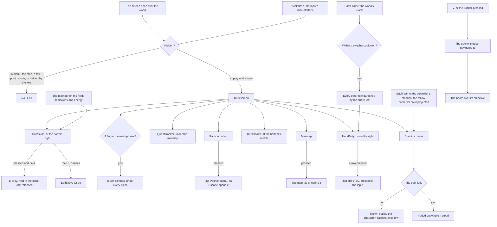

# HUD

While a player is in the world, the game keeps a heads-up display over it. The world's HUD is `Hud/Screen`, drawn in the interface library's `GameScreen` over the world's canvas, so its pieces are sized in the game's own units and hold on any window shape ([interface library](/docs/genshin/interface-library)).

## Decisions

- **The HUD's rects are the game's own tree.** The HUD's page is the `InLevelMainPage` GameObject in `00/04803507.blk`, found through its party button's Animator `TeamBtn_MP`, which no other block holds. Its tree holds the minimap, Paimon's button, the stamina meter, the party and the skill buttons, and `fitHud` writes its rects to `data/hud/interfaceRects.json` as the login's are fitted ([interface layout](/docs/genshin/interface-layout)).

## How it works

- **Only what the world backs.** A piece appears with the feature it shows, never as an inert copy, since a button that does nothing tells the player the world has something it lacks. The Paimon button opens the Paimon menu ([screens](/docs/genshin/screens)), and the [minimap](/docs/genshin/minimap) opens the [map](/docs/genshin/map). The game's other pieces (the top right's shortcuts and the chat) wait on the features behind them.
- **Props for the pieces the world fills.** The quest tracker under the minimap, the deployed team's portraits down the right, the member on the field's health and the skill and burst buttons are plain props of `Hud/Screen`, the world screen handing each its state (the field member's figures as one `HudMember`), so the whole HUD is a fixture the parity page renders with its pieces in place. The stamina meter places itself, since it follows the character across the screen.
- **The deployed team's portraits.** `Hud/Party` draws the deployed team down the right, a row a member in slot order: the member's name from the roster's name text, a round portrait stand-in, a thin HP bar under the name and the slot's number. The member on the field is marked and a member who is down is greyed. For `PARTY_SWITCH_COOLDOWN_SECONDS` after a switch every other row is darkened by the share of the cooldown left, read off the world's clock, which the frame carries as `seconds`. A press on a row holds that slot's key, through `getActionKeyCode` over `PARTY_MEMBER_INPUT_ACTIONS`, so a pointer switches as the number keys do. The names are blank until the world's names load in the reader's language.
- **The member on the field's health.** `Hud/Health` shows the game's level (`LevelFormat`) before a bar, the bar filled by HP over Max HP, and the two as whole numbers under it, HP rounded up and Max HP rounded. The Max HP is the one the character's attributes give, and the bar carries `role="meter"` named by the game's word for HP.
- **The skill and burst buttons.** `Hud/Skills` shows the member on the field's skill and burst at the bottom right. A cooldown darkens its button by the share left and counts its seconds down to a tenth, a skill with charges only while none of them stands (`getSkillReadySeconds`), and the burst fills from its foot with its energy over its cost, lit once full and off cooldown. The cooldowns and energy are the member's own in the party, and the costs and cooldowns are the kit's ([combat](/docs/genshin/combat)). Pressing one holds `E` or `Q` in the world's input until released, as the touch controls hold theirs, so a held skill holds as the key does, and the buttons let go of both as the HUD hides. Each is named by the game's words for the skill and the burst.
- **The stamina meter follows the character.** The world screen reads the party's stamina off the character on the field, which hands its controller's pool up, and while the pool is spent or refilling it projects the follow camera's pivot over the character onto the screen each frame. Both go into one reactive frame object, `HudFrame`, which the meter reads, so the frame re-renders the meter alone. The meter stands beside that point as a curved bar filled from its foot, as the wiki has the game draw it to the character's right, flashes once the pool falls under a quarter, and fades out once the pool is full, held where it last stood. It carries `role="meter"` with the pool's value and the game's word for stamina.
- **The quest tracker shows the quest V navigates to.** Under the minimap it shows the navigated quest's title over its step's line and how far its counted objective has come, as the quest screen counts it (`getQuestCounter`). With no quest navigated it shows the first quest in progress, the one V would navigate to. V, in play, or a press on the tracker navigates to the tracker's quest, and the world raises the [quests](/docs/genshin/quests)' beam over its step's first objective. While no quest is loaded both stay empty.
- **A piece presses what its key does.** A HUD piece the player presses holds its action's own key in the world's input, as the touch controls do (`getActionKeyCode`), so a press passes the same checks as the key: the tracker presses V.
- **It hides as the game's does.** The backslash, bound to the input's `HideInterface` action as the game's Hide UI key is ([controls](/docs/genshin/controls)), hides and shows it. Every menu, the map and a talk hide it too, as does photo mode, through the screen's own behaviour ([screens](/docs/genshin/screens)).
- **The world stays reachable through it.** The HUD's root lets every pointer through to the world, and only its pieces take one, so a click on the world between them still locks the pointer and turns the camera. A mouse press on a piece stops at the HUD's root, so the world's input never reads it as an attack.
- **The Paimon button is named for a screen reader.** It shows a mark alone, so it carries Paimon's name in the game's words.

## Key files

| File                                                                    | Role                                                                     |
| :---------------------------------------------------------------------- | :----------------------------------------------------------------------- |
| `packages/genshin-world/src/components/Hud/Screen/Index.vue`            | The HUD: its pieces, their places and the slots others fill              |
| `packages/genshin-world/src/data/hud/interfaceRects.json`               | The HUD's interface rects, fitted from the game's tree                   |
| `scripts/src/services/genshinAssets/fit/fitHud.ts`                      | Fits the HUD's interface rects from its exported tree                    |
| `scripts/src/services/genshinAssets/shared/DerivedAssetComponentMap.ts` | Names the HUD's page: its anchor `TeamBtn_MP` and root `InLevelMainPage` |
| `packages/genshin-world/src/components/Hud/PaimonButton/Index.vue`      | The corner button that opens the Paimon menu                             |
| `packages/genshin-world/src/components/Hud/Minimap/Index.vue`           | The corner map                                                           |
| `packages/genshin-world/src/components/Hud/Quest/Index.vue`             | The quest tracker under the minimap                                      |
| `packages/genshin-world/src/components/Hud/Stamina/Index.vue`           | The stamina meter beside the character                                   |
| `packages/genshin-world/src/components/Hud/Party/Index.vue`             | The deployed team's portraits down the right                             |
| `packages/genshin-world/src/components/Hud/Health/Index.vue`            | The member on the field's level and HP at the bottom's middle            |
| `packages/genshin-world/src/components/Hud/Skills/Index.vue`            | The skill and burst buttons at the bottom right                          |
| `packages/genshin-world/src/components/Hud/Screen/Index.fixture.ts`     | The HUD's parity fixture: the frame's party, member and tracked quest    |
| `packages/genshin-world/src/models/hud/HudMember.ts`                    | The field member's figures the health and skill buttons read             |
| `packages/genshin-world/src/components/Hud/Touch/Index.vue`             | The touch controls under the pieces                                      |
| `packages/genshin-world/src/models/hud/HudFrame.ts`                     | What the HUD reads off the world each frame                              |
| `packages/genshin-world/src/services/quest/getQuestCounter.ts`          | A step's counted objective, as the tracker and the quest screen show it  |
| `packages/genshin-world/src/services/shared/getActionKeyCode.ts`        | The key a pressed piece holds in the world's input                       |
| `packages/genshin-world/src/components/World/Session/Index.vue`         | Mounts the HUD, fills its slots with each piece's state, navigates on V  |
| `packages/genshin-world/src/components/World/Windrise/Index.vue`        | Raises the beam over the navigated objective in the world's group        |
| `packages/genshin-world/src/services/screen/ScreenBehaviourMap.ts`      | Which screens hide the HUD                                               |

## Notes

- **Its places and looks are provisional.** Each piece is to sit in the rect of its place in the HUD's own RectTransform tree, as the login's interface does ([interface layout](/docs/genshin/interface-layout)). The tree's rects are fitted; placing each piece by them is the next step. Until then each place, size and colour is a provisional value marked in its file, as are the meter's offset, arc, flash and fades and its low share (`STAMINA_METER_LOW_SHARE`), the party's rows, the health bar's looks, and the skill and burst buttons' sizes, places, colours, sweep and glow. The Paimon button's mark waits on a trace of the game's ([roadmap](/docs/genshin/roadmap)).
- **Its parity is scored over the recording it is drawn over.** `hud-world-pickup` is the English PC client at 70 seconds of a public recording, cropped to the game's screen (its letterbox bars are black) and scored over the part clear of its subtitles. The recording's own HUD sits under ours, so the composite scores a placement and a look but cannot see a piece the HUD drops; `world-hud-hidden.mkv` on the Recordings owed list gives the bare scene. Scored: a mean difference of 0.95%, FLIP 0.0488, before the screen had a fixture at all, so there is no earlier score to set it against.
- **What the composite shows is not yet the game's.** The minimap is a plain disc where the game paints its terrain, the tracker lacks the altitude line the game shows under the quest title ("Higher 1540m"), the reference names the Traveler "Tabibito" where the English text gives "Traveler" (a call for the user), and the burst energy and the skill cooldown in the fixture are provisional, read as the recording shows them until `world-skill-burst.mkv` lands.
- **The meter has one section.** The game cuts it into sections of 100, and nothing raises the pool past `STAMINA_MAX` yet.

## Sources

- [Paimon Menu](https://genshin-impact.fandom.com/wiki/Paimon_Menu), Genshin Impact Wiki: the Paimon button in the top left corner opening the menu, as Escape does.
- [Map](https://genshin-impact.fandom.com/wiki/Map), Genshin Impact Wiki: the top-left minimap, which opens the map.
- [Controls](https://genshin-impact.fandom.com/wiki/Controls), Genshin Impact Wiki: Hide UI on the backslash, and Quest Navigation on V.
- [Stamina](https://genshin-impact.fandom.com/wiki/Stamina), Genshin Impact Wiki: the meter to the right of the character while stamina drains or refills, hidden when full, cut into sections of 100.
- [Quest](https://genshin-impact.fandom.com/wiki/Quest), Genshin Impact Wiki: navigating a quest marks its objective with a beam from 50 metres off.
- [Party](https://genshin-impact.fandom.com/wiki/Party), Genshin Impact Wiki: the one second cooldown between switches.
- [Elemental Skill](https://genshin-impact.fandom.com/wiki/Elemental_Skill), Genshin Impact Wiki: the skill's cooldown, during which it cannot be used.
- [Elemental Burst](https://genshin-impact.fandom.com/wiki/Elemental_Burst), Genshin Impact Wiki: the burst's icon at the bottom right showing its cooldown's time and filling with the character's energy, glowing once ready.
