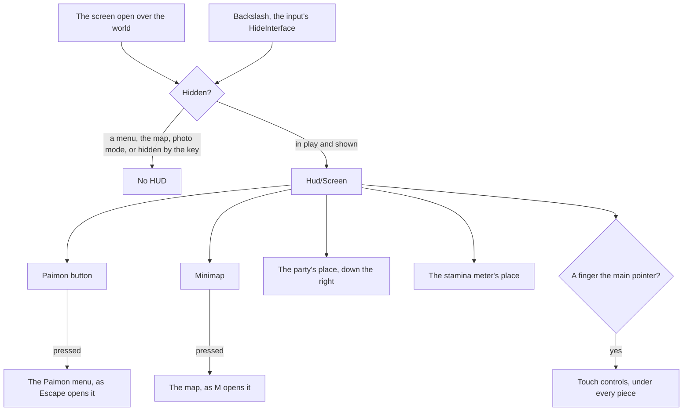

# HUD

While a player is in the world, the game keeps a heads-up display over it. The world's HUD is `Hud/Screen`, drawn in the interface library's `GameScreen` over the world's canvas, so its pieces are sized in the game's own units and hold on any window shape ([interface library](/docs/genshin/interface-library)).

## How it works

- **Only what the world backs.** A piece appears with the feature it shows, never as an inert copy, since a button that does nothing tells the player the world has something it lacks. The Paimon button opens the Paimon menu ([screens](/docs/genshin/screens)), and the [minimap](/docs/genshin/minimap) opens the [map](/docs/genshin/map). The game's other pieces (health, the skill and burst buttons, the quest tracker, the top right's shortcuts and the chat) wait on the features behind them.
- **Places for the pieces other features draw.** The party's portraits down the right side and the stamina meter beside the character are slots of `Hud/Screen`, filled by the world screen with the party's and the controller's own components, so the HUD gains them with no change of its own. The stamina meter places itself, since it follows the character across the screen.
- **It hides as the game's does.** The backslash, bound to the input's `HideInterface` action as the game's Hide UI key is ([controls](/docs/genshin/controls)), hides and shows it. Every menu and the map hide it too, as does photo mode, through the screen's own behaviour ([screens](/docs/genshin/screens)).
- **The world stays reachable through it.** The HUD's root lets every pointer through to the world, and only its pieces take one, so a click on the world between them still locks the pointer and turns the camera.
- **The Paimon button is named for a screen reader.** It shows a mark alone, so it carries Paimon's name in the game's words.

## Key files

| File                                                               | Role                                                                    |
| :----------------------------------------------------------------- | :---------------------------------------------------------------------- |
| `packages/genshin-world/src/components/Hud/Screen/Index.vue`       | The HUD: its pieces, their places and the slots others fill             |
| `packages/genshin-world/src/components/Hud/PaimonButton/Index.vue` | The corner button that opens the Paimon menu                            |
| `packages/genshin-world/src/components/Hud/Minimap/Index.vue`      | The corner map                                                          |
| `packages/genshin-world/src/components/Hud/Touch/Index.vue`        | The touch controls under the pieces                                     |
| `packages/genshin-world/src/components/World/Screen/Index.vue`     | Mounts the HUD while the world is in play and the key has not hidden it |
| `packages/genshin-world/src/services/screen/ScreenBehaviourMap.ts` | Which screens hide the HUD                                              |

## Notes

- **Its places and looks are provisional.** Each piece is to sit in the rect of its place in the HUD's own RectTransform tree, as the login's interface does ([interface layout](/docs/genshin/interface-layout)), once the HUD's block is found among the game's assets and its rects are fitted. Until then each place, size and colour is a provisional value marked in its file, and the Paimon button's mark waits on a trace of the game's ([roadmap](/docs/genshin/roadmap)).

## Sources

- [Paimon Menu](https://genshin-impact.fandom.com/wiki/Paimon_Menu), Genshin Impact Wiki: the Paimon button in the top left corner opening the menu, as Escape does.
- [Map](https://genshin-impact.fandom.com/wiki/Map), Genshin Impact Wiki: the minimap in the top left, opening the map.
- [Controls](https://genshin-impact.fandom.com/wiki/Controls), Genshin Impact Wiki: Hide UI on the backslash.
