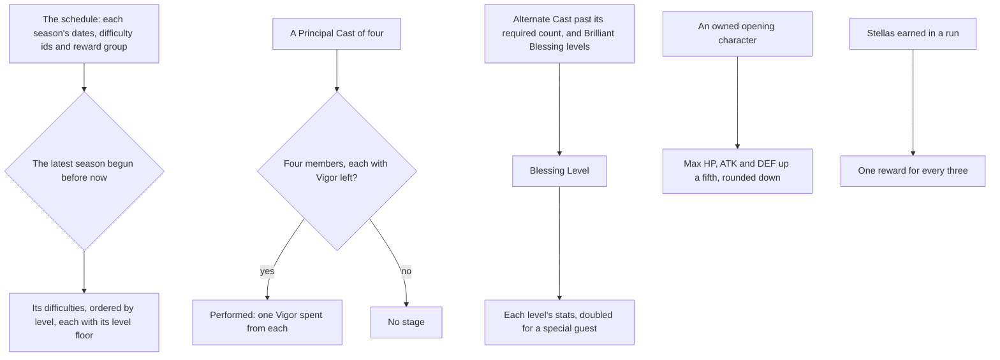

# Imaginarium Theater

The Imaginarium Theater's rules over the game's role combat tables: which season is played, which difficulties it runs and the level a cast member must reach for each, how many stages a Principal Cast can perform before its Vigor runs out, how Blessing Level and its stats are worked out, what an owned opening character gains, and how many rewards a run's Stellas have earned. This page is the first build of the [Imaginarium Theater](/docs/proposals/genshin/imaginarium-theater) proposal. The cast's elements and special guests, the acts and events, the rewind and the Theater's screen stay in the proposal.

## How it works

## The schedule and the difficulties

`pnpm -C scripts genshin:assets imaginarium` writes two slices from the role combat tables, each imported on demand from `packages/genshin-world/src/generated/imaginarium/`. The two tables are not in the community dump the scripts read, so they were fetched from the AnimeGameData repository into the dump and never committed. The repository's master matched the dump's tower tables byte for byte, so the two share a revision.

- **Seasons.** Every row of the schedule: its id, the moments it begins and ends in the game's time zone, the difficulty ids it runs and the reward group its Stellas draw from. The schedule ends with a season scheduled far ahead, which is not begun, so it is never played.
- **Difficulties.** Every difficulty row: its id, its level from one to five, and its level floor. The floors are 60 for levels one and two and 70 for levels three to five.

A season names its difficulties by id, and the writer refuses a season that names one the difficulty table lacks.

## The rules

- **The season.** The Theater plays the latest season that began before now, read in the game's time zone, UTC+8. A season is never played before it begins, and after the last one ends the last begun season is held, so a dump read months on plays its final season rather than none.
- **The difficulties.** A season's difficulties are the rows its ids name, ordered from the lowest level.
- **Vigor.** Each character has two Vigor for a run. A stage is performed by a Principal Cast of four, each with Vigor left, and performing it spends one Vigor from each. A cast of fewer than four, or one with a member out of Vigor, performs nothing.
- **Blessing Level.** Each Alternate Cast member past the number its difficulty asks adds two, and each Brilliant Blessing adds the levels it has been gained and raised to, one each. A short Alternate Cast adds nothing.
- **Blessing stats.** Each level of Blessing adds 50 ATK, 50 DEF, 20 Elemental Mastery and 800 Max HP to a cast member, and a special guest's stats are doubled.
- **The opening character.** An owned opening character's Max HP, ATK and DEF rise by a fifth, rounded down to whole units. Its Elemental Mastery is unchanged.
- **Stellas.** Every three Stellas in a run give one reward, so five Stellas give one and six give two.

## Decisions

- **The season is read off the schedule's own dates, not the table's position.** The schedule lists its seasons in order, but the latest begun is found by its start, so a row added out of order plays as it should.
- **A season names its difficulties by the difficulty rows' ids.** The schedule's difficulty list holds the ids of rows in the difficulty table, the season in the dump running ids 105 to 109 and those rows' levels one to five. The join is by id, so no position is assumed.
- **The level floors are the table's, and the lower difficulties are levels one and two.** The table's floor column reads 60 for levels one and two and 70 above, as the proposal settles, so the floor is read from the column and not written in.
- **The opening bonus rounds down.** The game's stats are whole units, and the bonus is taken on each stat in whole units, rounded down, rather than kept as a fraction.
- **The Blessing Level's required count is an input.** The table field that holds each difficulty's required count is not yet named, so the caller states the count, and the rule is built against it.
- **One latest-begun search.** The search for the item that began latest before a moment is `findLatestBegun`, which the Theater's season uses and the Spiral Abyss's period will use. The Abyss's own period finder, which had no caller yet, is replaced by it, so the two schedules share one rule and one test.

## Key files

| File                                                                                  | Role                                                                      |
| :------------------------------------------------------------------------------------ | :------------------------------------------------------------------------ |
| `scripts/src/services/genshinAssets/imaginarium/writeImaginarium.ts`                  | The two slices written from the role combat tables                        |
| `scripts/src/services/genshinAssets/imaginarium/toImaginariumSeason.ts`               | One season from its schedule row                                          |
| `scripts/src/services/genshinAssets/imaginarium/toImaginariumDifficulty.ts`           | One difficulty and its level floor from its table row                     |
| `packages/genshin-world/src/services/imaginarium/findImaginariumSeason.ts`            | The season played at a moment                                             |
| `packages/genshin-world/src/services/shared/findLatestBegun.ts`                       | The item that began latest before a moment, the search both schedules use |
| `packages/genshin-world/src/services/imaginarium/getImaginariumSeasonDifficulties.ts` | A season's difficulties, joined by id and ordered by level                |
| `packages/genshin-world/src/services/imaginarium/checkIsImaginariumStageReady.ts`     | Whether a Principal Cast can perform a stage                              |
| `packages/genshin-world/src/services/imaginarium/computeImaginariumBlessingLevel.ts`  | The Blessing Level a run holds                                            |
| `packages/genshin-world/src/services/imaginarium/getImaginariumBlessingStats.ts`      | The stats a Blessing Level adds to one cast member                        |
| `packages/genshin-world/src/services/imaginarium/applyImaginariumOpeningBonus.ts`     | An owned opening character's stats for the season                         |
| `packages/genshin-world/src/services/imaginarium/countImaginariumStellaRewards.ts`    | The rewards a run's Stellas have earned                                   |
| `packages/genshin-world/src/generated/imaginarium/seasons.json`                       | The schedule's seasons with their difficulty ids                          |
| `packages/genshin-world/src/generated/imaginarium/difficulties.json`                  | Every difficulty with its level and level floor                           |

## Not built yet

- **The cast's composition.** Which characters an Alternate Cast may hold, by element or as a special guest, and the season's elements and guests, are not named in the schedule's fields yet, so no cast is checked against a season.
- **The opening characters and the trial versions.** The characters each season names are not read yet, so an owned opening character is given its bonus by the caller, and a trial version is not told apart from the character.
- **The stage.** Nothing fights a stage, its enemies, or the health and energy every member starts it with.
- **The acts, the events and their costs.** The events between battles, the Battle Event, Companion, Brilliant Blessing and Mystery Cache, their Fantasia Flower costs and the rerolls are not read or built. The wiki could not be read when this was built, so their costs are the proposal's to settle.
- **The rewind and the other limits.** The rewind to a boss stage and the limit on it are not built, nor the Vigor a Mystery Cache restores.
- **The Stella challenges and the rewards' items.** A run's star challenges are not tracked, and the reward group's items are not resolved.
- **The screen.** Nothing enters the Theater or returns from it, and the Mondstadt Library's Theater Lobby waits on the library's interior.

## Notes

- **The schedule ends with a season scheduled ahead.** It is never played until its date passes, so the dump's last season is played until a newer dump holds one.
- **The wiki's numbers are unverified.** The Vigor, the Blessing Level stats, the opening bonus and the three-Stella reward are the proposal's statements, from the wiki, which could not be read when this was built. They are constants in `services/imaginarium/constants.ts` and need no measure from the game, but a reader who finds them wrong changes that file.

## Sources

- [Imaginarium Theater](https://genshin-impact.fandom.com/wiki/Imaginarium_Theater), Genshin Impact Wiki: the Vigor, the Blessing Level stats, the opening character's bonus and the Stella rewards this page builds. The page refused the read when this was built, so these are the proposal's statements.
- [AnimeGameData](https://github.com/DimbreathBot/AnimeGameData), the community's per-patch dump: `RoleCombatScheduleExcelConfigData` and `RoleCombatDifficultyExcelConfigData`, the two tables the slices are written from. Their revision matches the dump's tower tables.
