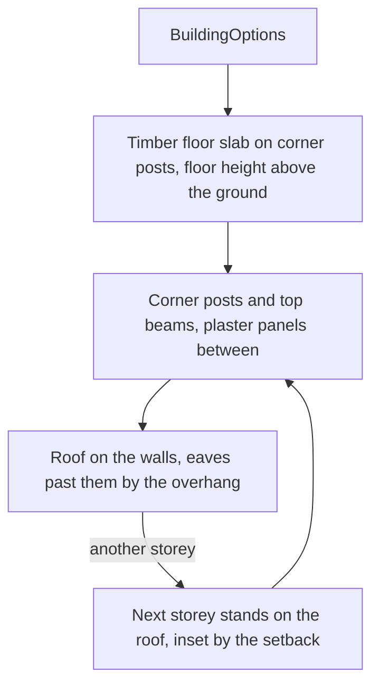

# Inazuma

The parts of [Inazuma](/docs/proposals/genshin/inazuma) built so far: the building kit its towns are made of, the colours of its islands, and the region's data file. No landmark is placed yet, since each one's position needs the game's map, so the region draws nothing until its landmarks are fitted.

## Building kit

`createBuildingGeometry` builds a building from its proportions as three geometries, one per material: timber, plaster and roof tile. Each storey stands on the roof below, and an upper storey is inset from the one below by the setback, so a tower's storeys step up.

The roof is a convex solid: its base closes it, so a camera under the eaves sees a ceiling. Its ridge runs along the longer side, and a hipped roof slopes on all four sides while a gabled one closes its ends with gables.

## Palette

`services/inazuma/constants.ts` holds each island's colours in sRGB, chosen from the names the proposal gives each island and provisional until each island is measured against its reference. The building kit's timber, plaster and tile colours are there too.

## Region data

`data/regions/inazuma.json` is the region's data in the shape `regionDataSchema` reads, with no landmarks yet. Its catalogue areas have no outlines, so the region is not fetched until they are filled.

## Key files

| File                                                                 | Role                                                 |
| :------------------------------------------------------------------- | :--------------------------------------------------- |
| `packages/genshin-engine/src/kits/inazuma/createBuildingGeometry.ts` | The building kit: floors, frame, plaster and storeys |
| `packages/genshin-engine/src/kits/inazuma/createRoofGeometry.ts`     | A hipped or gabled roof as a closed convex solid     |
| `packages/genshin-engine/src/models/kits/inazuma/BuildingOptions.ts` | A building's proportions in metres                   |
| `packages/genshin-world/src/services/inazuma/constants.ts`           | The island palettes and the building colours         |
| `packages/genshin-world/src/data/regions/inazuma.json`               | The region's landmarks, none yet                     |
