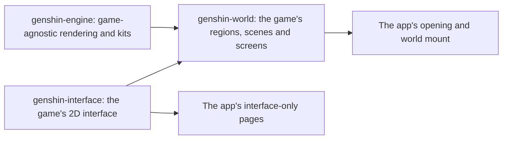

# Genshin

Genshin Impact's continent is being rebuilt in the app as a fan work, walkable at the game's own scale and in its anime look. `/genshin` plays it as the game does: the opening, then the world full screen, with nothing over it (the [agent console](/docs/infra/claude-interface/agent-console) is hidden from it until it is rebuilt in the game's style). The world is drawn by `genshin-engine`, a published package of plain TypeScript and TSL modules that knows no place by name. The game's world on it is `genshin-world`, a published package holding the catalogue, each region's data (its heights, colours, landmarks and look) and the TresJS components that build it. The game's 2D interface is `genshin-interface`, a published package of presentational Vue components with no three.js in it, which the world's screens are built from. The app keeps only the game's two pieces: `apps/web/app/components/Genshin/Index.vue`, the opening over the world loading behind it, and `Genshin/World.vue`, the world's screen (`WorldScreen`, which owns its canvas), loaded lazily so the opening shows at once, which hands the world what only the app can: the terrain worker its bundler builds, the URL its server serves region data at, and whether the tuning panel shows.

- **Three packages, split by what a page loads.** A page that shows only interface loads `genshin-interface` and no three.js; the engine knows no place by name; the world is everything that is the game's own. A fourth package for assets was rejected: nothing taken from the game is committed, so it would hold nothing.

It is unofficial and non-commercial, and makes no claim to be HoYoverse's. No model, texture, sound or image file is taken from the game: every world asset is generated by our own code at measures taken off the game, and the interface's glyphs are traced from the game's marks into paths of our own ([derived assets](/docs/genshin/derived-assets)).

## Key concepts

- **Windrise is the first scene.** Every scene starts in the Windrise the [rendering style](/docs/genshin/rendering-style) page describes, loaded at three in the afternoon. Every engine page is first shown there.
- **Light is shared uniforms.** Every material reads one set of light uniforms, and the fog one set of fog uniforms, so the hour and the weather will move the whole world by writing a few values.
- **A quality tier removes cost, never the style.** What a tier trims and what it keeps is set on the [rendering style](/docs/genshin/rendering-style) page.

## The pages of this area

| Page                                                       | What it covers                                                                                                                                                                                                                                                                                  |
| :--------------------------------------------------------- | :---------------------------------------------------------------------------------------------------------------------------------------------------------------------------------------------------------------------------------------------------------------------------------------------- |
| [Engine architecture](/docs/genshin/engine-architecture)   | the engine as modules with one job each, and the order a frame runs in                                                                                                                                                                                                                          |
| [Rendering style](/docs/genshin/rendering-style)           | the toon materials, outlines, cascaded shadows, god rays, fog, grade and AA                                                                                                                                                                                                                     |
| [Sky and time](/docs/genshin/sky-and-time)                 | the twenty-four-minute day, the painted sky, and the light it casts                                                                                                                                                                                                                             |
| [Weather](/docs/genshin/weather)                           | each area's weather, blended as it changes: rain, snow, fog, sand, lightning and wet ground                                                                                                                                                                                                     |
| [Terrain](/docs/genshin/terrain)                           | the ground on a streamed CDLOD quadtree, morphing between levels, and the floating origin                                                                                                                                                                                                       |
| [Terrain shape height](/docs/genshin/terrain-shape-height) | a ground's height as hills over a base, the sharp features they smear, and a fine residual                                                                                                                                                                                                      |
| [Ground paint](/docs/genshin/ground-paint)                 | the ground painted in layers of grass, earth, sand, snow, path and rock by rules of its slope and height                                                                                                                                                                                        |
| [Water](/docs/genshin/water)                               | still water graded by depth, foam, glints, caustics, and the world under the surface                                                                                                                                                                                                            |
| [Flowing water](/docs/genshin/flowing-water)               | rivers along their courses with foam on their bends, and waterfalls over cliffs                                                                                                                                                                                                                 |
| [Vegetation](/docs/genshin/vegetation)                     | the wind field, grass blades generated in two rings, and swaying crowns                                                                                                                                                                                                                         |
| [Trees](/docs/genshin/trees)                               | tree species, each drawn as its mesh near the eye and a baked impostor far from it                                                                                                                                                                                                              |
| [Scatter](/docs/genshin/scatter)                           | the flowers no record places, scattered on each finest tile in the terrain's worker                                                                                                                                                                                                             |
| [World map](/docs/genshin/world-map)                       | the catalogue of regions, areas and subareas, and region data loaded by reach                                                                                                                                                                                                                   |
| [Region buildings](/docs/genshin/region-buildings)         | each region's capital built by its own kit, on the world's one ground with every region's plateaus                                                                                                                                                                                              |
| [Buildings](/docs/genshin/buildings)                       | the generic kit: a platform, four walls and a flat or conical roof, one geometry from its options                                                                                                                                                                                               |
| [Mondstadt buildings](/docs/genshin/mondstadt-buildings)   | Mondstadt's timber-framed house over a stone ground floor, under a steep gable                                                                                                                                                                                                                  |
| [Liyue building kit](/docs/genshin/liyue-building-kit)     | Liyue's terrace, lacquer columns and lattice under tiers of upturned eaves, and its palette                                                                                                                                                                                                     |
| [Inazuma](/docs/genshin/inazuma)                           | Inazuma's post-and-beam kit with deep eaves, its island palette and its region data                                                                                                                                                                                                             |
| [Sumeru kits](/docs/genshin/sumeru-kits)                   | Sumeru's terraced rainforest city, its stilt hut and its desert ruins                                                                                                                                                                                                                           |
| [Nod-Krai's kits](/docs/genshin/nod-krai-kits)             | Nod-Krai's dieselpunk works and the Frostmoon Scions' stone rings                                                                                                                                                                                                                               |
| [Snezhnaya](/docs/genshin/snezhnaya)                       | Snezhnaya's industrial and capital halls and the Kresnik's Torch                                                                                                                                                                                                                                |
| [Character controller](/docs/genshin/character-controller) | the body walked through the game's movement states on its stamina, against the ground and the landmarks                                                                                                                                                                                         |
| [Follow camera](/docs/genshin/follow-camera)               | the camera behind the character, pulled in by the ground and the landmarks, and the pointer's lock                                                                                                                                                                                              |
| [Free camera](/docs/genshin/free-camera)                   | the tuning panel's camera in photo mode, flown with the keys, the pointer and a gamepad above the ground                                                                                                                                                                                        |
| [Controls](/docs/genshin/controls)                         | the game's default key, mouse and gamepad bindings, read once a frame into the actions held and pressed                                                                                                                                                                                         |
| [Screens](/docs/genshin/screens)                           | the screens opened over the world one at a time, what each holds, and the Paimon menu's shell                                                                                                                                                                                                   |
| [Map](/docs/genshin/map)                                   | the map on M at full screen, dragged to pan and zoomed by the wheel or slider, its keyboard jump list, and a jump's fade to black and back                                                                                                                                                      |
| [Minimap](/docs/genshin/minimap)                           | the HUD's corner map, the map's drawing cut to a circle round the camera and turned with it                                                                                                                                                                                                     |
| [Map unlocking](/docs/genshin/map-unlocking)               | a Statue of The Seven resonated with on F, its area filled in on the map and minimap, and only the unlocked statues offered as jumps and revives                                                                                                                                                |
| [Statues of The Seven](/docs/genshin/statues-of-the-seven) | a region's levels and rewards from the game's table, the stamina they raise to 240, and the Blessing's pool and heals, not yet on a screen                                                                                                                                                      |
| [Offering systems](/docs/genshin/offering-systems)         | the offering rule, every item held offered at once to its levels, and the Frostbearing Tree's levels from the game's table, not yet on a screen                                                                                                                                                 |
| [HUD](/docs/genshin/hud)                                   | the heads-up display's Paimon button, minimap, quest tracker, stamina meter, party, health and skill and burst buttons, and hiding it                                                                                                                                                           |
| [Touch controls](/docs/genshin/touch-controls)             | the stick on the left half, the look on the right and the jump button, fed into the one input                                                                                                                                                                                                   |
| [Enemies](/docs/genshin/enemies)                           | enemy kinds and their stats, their AI and camps, respawn and drops, struck by the kit and drawn as stand-in capsules                                                                                                                                                                            |
| [Adventure Rank](/docs/genshin/adventure-rank)             | the rank to 60 on the game's table, held at the ascension quests, the World Level and its lowering, and the enemies it raises                                                                                                                                                                   |
| [Original Resin](/docs/genshin/original-resin)             | the resin regenerating from its last change to 200, refills from Primogems at six daily prices, a claim's price and Adventure EXP, and a blossom's ways to pay, Condensed Resin included                                                                                                        |
| [Save data](/docs/genshin/save-data)                       | one save blob per signed-in player under a session lease, one live game per account, and the save's slices owned beside their models                                                                                                                                                            |
| [Domains](/docs/genshin/domains)                           | each kind's opening by Adventure Rank, and by the day: Blessing every day, Forgery and Mastery on Sundays and their set days                                                                                                                                                                    |
| [Ley line outcrops](/docs/genshin/ley-line-outcrops)       | each region's two blossoms read from the game's tables, opened by Adventure Rank and a nation's area, started and moved on along their places                                                                                                                                                   |
| [Bosses](/docs/genshin/bosses)                             | a normal boss back five seconds after its Trounce Blossom's claim, and the weekly claims counted from the Monday 04:00 reset in the reader's zone                                                                                                                                               |
| [Combat](/docs/genshin/combat)                             | auras and reactions in the game's priority, the damage formula, internal cooldown, shields and energy, and the Traveler's kit's hits                                                                                                                                                            |
| [Character kits](/docs/genshin/character-kits)             | each playable character's skill sets from the game's tables, the Traveler's kit in its own module reading its multipliers from the proud skill table                                                                                                                                            |
| [Characters](/docs/genshin/characters)                     | the official MMD packs read by our own PMX reader and drawn on the toon ramp, with their terms                                                                                                                                                                                                  |
| [Character attributes](/docs/genshin/character-attributes) | the roster, weapons and artifacts from the game's tables, and a character's attributes summed as the game sums them                                                                                                                                                                             |
| [Artifact enhancement](/docs/genshin/artifact-enhancement) | an artifact rolled from its slot's pool and the rarity's minor affixes, enhanced with Artifact EXP at a Mora a point, and locked against fodder                                                                                                                                                 |
| [Weapon enhancement](/docs/genshin/weapon-enhancement)     | a weapon levelled from ores and fodder at Mora, ascended at each phase's cap, and refined from a copy or a material, its passive waiting on the kits                                                                                                                                            |
| [Talents](/docs/genshin/talents)                           | each combat talent levelled from 1 to 10 by the game's table, each level paid in Mora and materials at its phase, and the passives each phase opens                                                                                                                                             |
| [Constellations](/docs/genshin/constellations)             | each playable character's six constellations from the game's table, activated with its own Stella Fortuna, and the talent its third and fifth raise                                                                                                                                             |
| [Companionship](/docs/genshin/companionship)               | each character's Friendship Level read from its total Companionship EXP and the game's level table, and the deployed team's grant from a claim, the stories and namecard not yet opened                                                                                                         |
| [Reputation](/docs/genshin/reputation)                     | Mondstadt's levels, requests, exploration thresholds and bounties from the game's table, the EXP carried up each level and the weekly limit across nations, nothing yet on a screen                                                                                                             |
| [Character screen](/docs/genshin/character-screen)         | the C screen's frame, its six tabs in the game's words, and the Attributes tab's level and attributes                                                                                                                                                                                           |
| [Party](/docs/genshin/party)                               | the teams, the one deployed and the member on the field, switched on 1 to 4 past the one second cooldown or with a burst on Left Alt, teams added, renamed and disbanded, each with its own HP, energy and cooldowns                                                                            |
| [Interaction](/docs/genshin/interaction)                   | the F prompts over the world: the drops and talks in reach nearest first, F picking up or talking, the wheel and a held F's repeat                                                                                                                                                              |
| [Elemental Sight](/docs/genshin/elemental-sight)           | the range that spreads from the character, the world muted and what matters lit, enemies' colours and names                                                                                                                                                                                     |
| [Inventory](/docs/genshin/inventory)                       | the bag's nine tabs, its stacks, room and sorts, the wallet's currencies, its screen on B, the enemies' materials from the game's table, the full-bag hint, Fates bought with Primogems and the destroy rule                                                                                    |
| [Gadgets](/docs/genshin/gadgets)                           | the widget config's gadgets as their kind with their cooldowns, cooldown groups and failed-use cooldowns, each cooldown kept as the moment its group is ready, nothing yet equipped or used                                                                                                     |
| [Wish](/docs/genshin/wish)                                 | the standard and beginners' pools, the rates, pity and guarantees, Capturing Radiance, the Epitomized Path and returns, and its screen on F3                                                                                                                                                    |
| [Dialogue](/docs/genshin/dialogue)                         | a talk's graph of lines and replies, its runner, the dialogue screen with auto-play and skip, and residents                                                                                                                                                                                     |
| [Resident schedules](/docs/genshin/resident-schedules)     | a resident's day and night spots, the one the clock gives at the hour, held while they are in view at its turn                                                                                                                                                                                  |
| [Quests](/docs/genshin/quests)                             | the quests' kinds, steps and objectives, their progression, the quest screen, navigation and the reader                                                                                                                                                                                         |
| [Adventurer Handbook](/docs/genshin/adventurer-handbook)   | F1's book and its six tabs, their pages waiting on what they track                                                                                                                                                                                                                              |
| [Genius Invokation TCG](/docs/genshin/genius-invokation)   | the card game's rules engine and the tutorial deck's characters and cards: a duel's dice, round, skills, cards, reactions and outcome, with no screen yet                                                                                                                                       |
| [Parity](/docs/genshin/parity)                             | matching a screen to the game's: references, tracing, scoring, motion and the visual suite                                                                                                                                                                                                      |
| [Scene derivation](/docs/genshin/scene-derivation)         | how the game's own assets are re-derived into a scene, each loss priced first                                                                                                                                                                                                                   |
| [Derived assets](/docs/genshin/derived-assets)             | which reference each part is measured from, how it becomes ours, and each part's progress                                                                                                                                                                                                       |
| [Spawned places](/docs/genshin/spawned-places)             | the official Teyvat map's statues and waypoints fitted to the scene's transport points, with the residual and each region's Oculi against the wiki's, the Oculi written into each region's slice                                                                                                |
| [Chests](/docs/genshin/chests)                             | the official map's chests fitted into each region as five tiers and the buried and sealed places, ground only; opening pays the Primogems and Mora of three tiers                                                                                                                               |
| [Puzzles](/docs/genshin/puzzles)                           | the official map's puzzle marks fitted into each region's slice by kind, and the state machines of an Elemental Monument, a Seelie led home and a Time Trial Challenge, nothing placed in the world yet                                                                                         |
| [Gathering](/docs/genshin/gathering)                       | the official map's plants and specialties fitted into each region bar five: four ingredients whose type the world does not name yet and one specialty whose map label is singular, picked with F and back on the wiki's respawns, ores and the rest not yet                                     |
| [Mining outcrops](/docs/genshin/mining-outcrops)           | the Adventure Rank 30 that opens them, and a mined outcrop back at the next 06:00 draw in the game's time zone; their places and draw not yet                                                                                                                                                   |
| [Investigation](/docs/genshin/investigation)               | the daily cap of a hundred investigations, after which no more spots spawn; the spots and their rewards not yet                                                                                                                                                                                 |
| [Exploration progress](/docs/genshin/exploration-progress) | the map's area labels with each area's count and percentage once a statue is unlocked, Galesong Hill first, its scale waiting on a recording                                                                                                                                                    |
| [Crafting](/docs/genshin/crafting)                         | the bench's tiers, potions, baits and Condensed Resin from the game's combine table, learned from their instructions and paid from the bag and wallet, crafted whole or refused, nothing yet placed or on a screen                                                                              |
| [Cooking](/docs/genshin/cooking)                           | the dishes cooked by hand to a quality and a proficiency, Auto Cook once full, a character's special dish at its chance, and the processings queued over real time, with campfires lit and put out; nothing yet placed or on a screen                                                           |
| [Forging](/docs/genshin/forging)                           | the blacksmith's enhancement ores and four-star weapons from their billets, queued by rank over real time, the Mystic Enhancement Ore from its random table, the forging talents of five characters, the Serenitea Pot's refusal, and the day's forge points held to 400,000                    |
| [Spiral Abyss](/docs/genshin/spiral-abyss)                 | the tower's floors and chambers from its tables, each chamber cleared on one clock its halves share, stars kept as the best, a floor opened by the one below's three chambers and six stars, rewards given once a cycle, and the Moon Spire's latest period; no enemies, screen or wormhole yet |
| [Imaginarium Theater](/docs/genshin/imaginarium-theater)   | the season the Theater plays, its difficulties and their level floors, Vigor and a stage's readiness, Blessing Level and its stats, the opening character's bonus and Stella rewards; the cast's composition, acts, events and screen are not built yet                                         |
| [Achievements](/docs/genshin/achievements)                 | the game's achievements counted off their quest triggers and paid in Primogems, their tiers chained, and the Achievements screen by category                                                                                                                                                    |
| [Archive](/docs/genshin/archive)                           | the seven sections read from the game's codex tables with each name in every language, a bag's items opening their entries as they are taken in, a volume's text read in a reader from the Books tab, and the screen listing each section, locked until the quest it opens after is done        |
| [Serenitea Pot](/docs/genshin/serenitea-pot)               | the realm's rules: Tubby's furnishings made from blueprints in one queue per Trust Rank over real time, Trust EXP from first makings, Adeptal Energy from comfort, and stores filling per real hour; nothing placed yet                                                                         |
| [Shops](/docs/genshin/shops)                               | Paimon's Bargains' Fates bought with Masterless Starglitter or Stardust, and the Mondstadt grocery's goods bought with Mora, from the game's shop table, restocked daily or monthly, nothing yet on a screen                                                                                    |
| [Expeditions](/docs/genshin/expeditions)                   | Mondstadt's expedition places sent for 4 to 20 hours, returned on the moment they left and claimed for items and Mora, nothing yet on a screen                                                                                                                                                  |
| [Commissions](/docs/genshin/commissions)                   | Mondstadt's daily tasks dealt four a day from the areas reached, each claimed for the reward of its dealt rank, and Katheryne's bonus on the fourth, nothing yet on a screen                                                                                                                    |
| [Wildlife](/docs/genshin/wildlife)                         | the official map's fleeing birds and beasts stood in Windrise's scene and running from the character in reach, nothing struck or dropped yet                                                                                                                                                    |
| [Fishing](/docs/genshin/fishing)                           | the official map's fishing points by region, the fish, rods and pools from the game's tables, each stock drawn by the game's clock and refilled after seventy-two hours, and the reel's tension, nothing cast yet                                                                               |
| [Interface library](/docs/genshin/interface-library)       | `genshin-interface`: the game's screen root, units, pointer, and the pieces its screens share                                                                                                                                                                                                   |
| [Interface layout](/docs/genshin/interface-layout)         | every screen laid out from the game's own RectTransform tree, nothing by hand                                                                                                                                                                                                                   |
| [Title splash](/docs/genshin/title-splash)                 | the game's title logo as each language's client draws it                                                                                                                                                                                                                                        |
| [Login screen](/docs/genshin/login-screen)                 | the opening's login: its stages, its flight, its scene and its door                                                                                                                                                                                                                             |
| [Music](/docs/genshin/music)                               | the game's music re-derived from its sound banks and played by the engine's synthesizer                                                                                                                                                                                                         |
| [Sampled instruments](/docs/genshin/sampled-instruments)   | public-domain recordings layered over a piece's voices where they bring it nearer the game                                                                                                                                                                                                      |
| [Sound effects](/docs/genshin/sound-effects)               | the game's sounds beside its music, found by a recording and played as our own noise                                                                                                                                                                                                            |
| [Game data formats](/docs/genshin/game-data-formats)       | how each kind of the game's data reads, and the shortcuts to reach for first                                                                                                                                                                                                                    |
| [Game text](/docs/genshin/game-text)                       | `genshin-text`: every language the game ships, and its strings by the game's own text id                                                                                                                                                                                                        |

What is still to build is the [Genshin proposal](/docs/proposals/genshin), and the open work on what is built is the [roadmap](/docs/genshin/roadmap). Decided ideas: [deferred](/docs/genshin/deferred) and [rejected](/docs/genshin/rejected).

## Shipped

- The engine as a package of single-purpose modules under the world package, each module added by the page that first needs it.
- The rendering style, in the Windrise scene, replacing the console's voxel world.
- The sky and the game's day over it.
- The terrain, streamed and morphing, in place of Windrise's one fixed heightfield.
- Still water, first in the lake east of Windrise.
- The wind, and grass generated around the camera.
- The world map's catalogue, and Mondstadt's landmarks loaded by reach.
- The free camera flying the world, on the engine's input, simulation, camera and collision modules.
- The character walking the world on the controller's body through the game's movement states and stamina, the follow camera behind it, photo mode's orbit round it, and the free camera kept for the tuning panel.
- Scene derivation: every scene re-derived from the game's own exports, drawn beside them by the witness render and priced term by term.
- The game's opening: its splashes, health notice, login screen with its flight to the door, and startup loading screen.
- The game's own words in its fifteen languages, served to the page in the reader's and to the persona plugin.
- The login's music, its second piece played with public-domain recordings layered over the synthesizer.
- The game's default controls, and its screens opened over the world from them and from the Paimon menu, an unbuilt screen a placeholder under its title.
- The map on M with its jump list, a jump fading to black and back, the HUD's shell with its minimap, and the touch controls.
- Map unlocking's statues: resonating with a Statue of The Seven on F fills its area in on the map and minimap, and only the unlocked statues are jumps and places to revive.
- Enemies: kinds read from the game's tables, an AI on the fixed step, camps, respawn and drops, drawn as capsules.
- Characters read from HoYoverse's official MMD packs by the engine's own PMX reader and drawn at rest on the toon ramp.
- Combat's rules as pure, tested functions: auras and reactions, the damage formula, internal cooldown, shields and energy.
- The party switched on 1 to 4, the character screen on C, and a character's attributes summed from the game's own tables.
- An artifact rolled by the game's pools and the wiki's weights, enhanced with Artifact EXP at a Mora a point, its fodder and its locks as the game keeps them.
- The F prompts' rules, the bag and its wallet on B, and the wish's published rules with its screen on F3, offering the standard and beginners' wishes from their pools.
- Original Resin: its count regenerating while the page is closed, its refills from Primogems at the game's daily prices, a claim's price and Adventure EXP, and its counter on the map's top bar.
- Ley line outcrops: each region's Revelation and Wealth read from the game's tables, their openings by rank and nation, a drawn start and the move along their places, with the touch and the claim still unbuilt.
- Mining outcrops and investigation spots: the rank that opens the outcrops, their 06:00 respawn after a mining, and the daily cap of a hundred investigations, as pure rules, with their places, draw and rewards unbuilt.
- Constellations: each character's six from the game's table, activated with its own Stella Fortuna, which a duplicate draw brings and a five-star past six a Masterless one.
- Companionship: each character's Friendship Level read from its total EXP and the game's level table, the deployed team's grant from a claim's rule at provisional amounts, and nothing opened yet.
- Elemental Sight: the range spread from the character and held to its reach, the world muted outside what is lit, interactables in white, enemies in their element's colour with their names, and the sight ended by a short walk.
- The official Teyvat map's statues and waypoints read into the references folder and fitted to the scene's transport points: one similarity over the whole map, its residual printed, and each region's Oculi checked against the wiki's.
- The official map's puzzle marks fitted into each region's slices by kind, and the Elemental Monument's state machine: lit by its element or a reaction of its own, a timed one going out after its time, and a puzzle of monuments solved once all are lit together.
- Paimon's Bargains' Fates bought with Masterless Starglitter or Stardust, and the Mondstadt grocery's general goods bought with Mora: the goods read from the game's shop table into one slice per shop, each offered from its Adventure Rank and within its dates, a buy limit restocked on its daily or monthly refresh, and the price taken from the wallet.
- Mondstadt's Reputation: its levels, requests, exploration thresholds and weekly bounties read from the game's table, the EXP carried up through each level and the limit of three a kind a week across nations, with no keeper or screen yet.
- Expeditions: Mondstadt's places sent and returned on the moment they left, claimed for their items and Mora, recalled for nothing, and the limit raised by rank, with Katheryne and the screen not yet built.
- Commissions: Mondstadt's daily tasks read from the game's tables, four dealt a day from the areas reached and held back where a quest stands, each claimed for the reward of the rank it was dealt at, Katheryne's bonus on the fourth claim, and Encounter Points claiming one unfinished, with the scene swap, the handbook's tab and the kept day not yet built.
- The official map's fleeing birds and beasts, White Pigeon, Crimson Fox and Squirrel, stood in Windrise's scene and running from the character in reach, on provisional flight numbers, with no strike, drop or pick-up yet.
- Fishing's points fitted by region, its fish, rods and pools read from the game's tables, and its rules for a stock's day and night and refill, a draw, a lure's reaction and the reel's tension, with nothing cast or on a screen yet.

## Key files

| File                                                             | Role                                                        |
| :--------------------------------------------------------------- | :---------------------------------------------------------- |
| `packages/genshin-engine/src/index.ts`                           | The engine's entry, which the app imports every module from |
| `apps/web/app/components/Genshin/Index.vue`                      | The game: the opening over the world's loading              |
| `apps/web/app/components/Genshin/World.vue`                      | The canvas on the WebGPU renderer                           |
| `packages/genshin-world/src/components/World/Screen/Index.vue`   | The world's canvas, its camera and the scene it looks at    |
| `packages/genshin-interface/src/components/GameScreen/Index.vue` | The root every screen of the game's is drawn in             |
| `packages/genshin-world/src/services/windrise`                   | Windrise's heights, colours and look                        |
