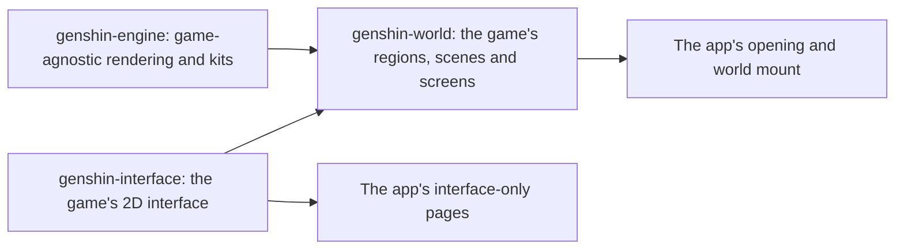

# Genshin

Genshin Impact's continent is being rebuilt in the app as a fan work, walkable at the game's own scale and in its anime look. `/genshin` plays it as the game does: the opening, then the world full screen, with nothing over it (the [agent console](/docs/infra/claude-interface/agent-console) is hidden from it until it is rebuilt in the game's style). The world is drawn by `genshin-engine`, a published package of plain TypeScript and TSL modules that knows no place by name. The game's world on it is `genshin-world`, a published package holding the catalogue, each region's data (its heights, colours, landmarks and look) and the TresJS components that build it. The game's 2D interface is `genshin-interface`, a published package of presentational Vue components with no three.js in it, which the world's screens are built from. The app keeps only the game's two pieces: `apps/web/app/components/Genshin/Index.vue`, the opening over the world loading behind it, and `Genshin/World.vue`, the world's screen (`WorldScreen`, which owns its canvas), loaded lazily so the opening shows at once, which hands the world what only the app can: the terrain worker its bundler builds, the URL its server serves region data at, and whether the tuning panel shows.

- **Three packages, split by what a page loads.** A page that shows only interface loads `genshin-interface` and no three.js; the engine knows no place by name; the world is everything that is the game's own. A fourth package for assets was rejected: nothing taken from the game is committed, so it would hold nothing.

It is unofficial and non-commercial, and makes no claim to be HoYoverse's. No model, texture, sound or image file is taken from the game: every world asset is generated by our own code at measures taken off the game, and the interface's glyphs are traced from the game's marks into paths of our own ([derived assets](/docs/genshin/derived-assets)).

## Key concepts

- **Windrise is the first scene.** Every scene starts in the Windrise the [rendering style](/docs/genshin/rendering-style) page describes, loaded at three in the afternoon. Every engine page is first shown there.
- **Light is shared uniforms.** Every material reads one set of light uniforms, and the fog one set of fog uniforms, so the hour and the weather will move the whole world by writing a few values.
- **A quality tier removes cost, never the style.** What a tier trims and what it keeps is set on the [rendering style](/docs/genshin/rendering-style) page.

## The pages of this area

| Page                                                     | What it covers                                                                                |
| :------------------------------------------------------- | :-------------------------------------------------------------------------------------------- |
| [Engine architecture](/docs/genshin/engine-architecture) | the engine as modules with one job each, and the order a frame runs in                        |
| [Rendering style](/docs/genshin/rendering-style)         | the toon materials, outlines, cascaded shadows, god rays, fog, grade and AA                   |
| [Sky and time](/docs/genshin/sky-and-time)               | the twenty-four-minute day, the painted sky, and the light it casts                           |
| [Terrain](/docs/genshin/terrain)                         | the ground on a streamed CDLOD quadtree, morphing between levels, and the floating origin     |
| [Water](/docs/genshin/water)                             | still water graded by depth, foam, glints, caustics, and the world under the surface          |
| [Vegetation](/docs/genshin/vegetation)                   | the wind field, grass blades generated in two rings, and swaying crowns                       |
| [World map](/docs/genshin/world-map)                     | the catalogue of regions, areas and subareas, and region data loaded by reach                 |
| [Parity](/docs/genshin/parity)                           | matching a screen to the game's: references, tracing, scoring, motion and the visual suite    |
| [Scene derivation](/docs/genshin/scene-derivation)       | how the game's own assets are re-derived into a scene, each loss priced first                 |
| [Derived assets](/docs/genshin/derived-assets)           | which reference each part is measured from, how it becomes ours, and each part's progress     |
| [Interface library](/docs/genshin/interface-library)     | `genshin-interface`: the game's screen root, units, pointer, and the pieces its screens share |
| [Interface layout](/docs/genshin/interface-layout)       | every screen laid out from the game's own RectTransform tree, nothing by hand                 |
| [Title splash](/docs/genshin/title-splash)               | the game's title logo as each language's client draws it                                      |
| [Login screen](/docs/genshin/login-screen)               | the opening's login: its stages, its flight, its scene and its door                           |
| [Music](/docs/genshin/music)                             | the game's music re-derived from its sound banks and played by the engine's synthesizer       |
| [Sampled instruments](/docs/genshin/sampled-instruments) | public-domain recordings layered over a piece's voices where they bring it nearer the game    |
| [Sound effects](/docs/genshin/sound-effects)             | the game's sounds beside its music, found by a recording and played as our own noise          |
| [Game data formats](/docs/genshin/game-data-formats)     | how each kind of the game's data reads, and the shortcuts to reach for first                  |
| [Game text](/docs/genshin/game-text)                     | `genshin-text`: every language the game ships, and its strings by the game's own text id      |

What is still to build is the [Genshin proposal](/docs/proposals/genshin), and the open work on what is built is the [roadmap](/docs/genshin/roadmap). Decided ideas: [deferred](/docs/genshin/deferred) and [rejected](/docs/genshin/rejected).

## Shipped

- The engine as a package of single-purpose modules under the world package, each module added by the page that first needs it.
- The rendering style, in the Windrise scene, replacing the console's voxel world.
- The sky and the game's day over it.
- The terrain, streamed and morphing, in place of Windrise's one fixed heightfield.
- Still water, first in the lake east of Windrise.
- The wind, and grass generated around the camera.
- The world map's catalogue, and Mondstadt's landmarks loaded by reach.
- Scene derivation: every scene re-derived from the game's own exports, drawn beside them by the witness render and priced term by term.
- The game's opening: its splashes, health notice, login screen with its flight to the door, and startup loading screen.
- The game's own words in its fifteen languages, served to the page in the reader's and to the persona plugin.
- The login's music, its second piece played with public-domain recordings layered over the synthesizer.

## Key files

| File                                                             | Role                                                        |
| :--------------------------------------------------------------- | :---------------------------------------------------------- |
| `packages/genshin-engine/src/index.ts`                           | The engine's entry, which the app imports every module from |
| `apps/web/app/components/Genshin/Index.vue`                      | The game: the opening over the world's loading              |
| `apps/web/app/components/Genshin/World.vue`                      | The canvas on the WebGPU renderer                           |
| `packages/genshin-world/src/components/World/Screen/Index.vue`   | The world's canvas, its camera and the scene it looks at    |
| `packages/genshin-interface/src/components/GameScreen/Index.vue` | The root every screen of the game's is drawn in             |
| `packages/genshin-world/src/services/windrise`                   | Windrise's heights, colours and look                        |
