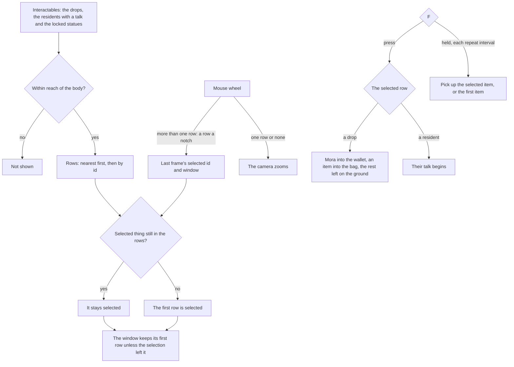

# Interaction

In the game, whatever the character can act on shows as a row of prompts beside it: an item to pick up, a chest to open, a character to talk to, a notice to read, a waypoint to activate. One row is selected, F acts on it, and with several things in reach the mouse wheel moves the selection through the rows. The world package holds the rules as pure functions over the things near the body, places the drops and the residents in the world as those things, and `genshin-interface` draws the rows over it.

## How it works

- **Five kinds.** `InteractionKind` is what acting on a thing does, and so its row's icon: `PickUp` takes an item into the [inventory](/docs/genshin/inventory), `Open` opens a chest, `Talk` starts a character's dialogue, `Read` shows a book, a notice or a sign, and `Activate` unlocks a waypoint for the map. A row's words are the thing's own name in the reader's language. The kind lives in `genshin-interface` beside the prompt list that draws it, and an `Interactable` in the world is an `InteractionPrompt` with a place.
- **In reach is a distance from the body.** `computeInteractionPrompts` keeps every thing within `INTERACTION_REACH` of the body's position, the same reach for every kind.
- **Nearest first, and still from frame to frame.** The rows run from the nearest thing to the farthest, two at one distance ordered by id, so the list never swaps two rows between frames.
- **The selection follows its thing.** The selection is the selected thing's id, never a row's index, so it stays on the same chest as rows come and go around it. When that thing leaves reach, the first row is selected.
- **The window scrolls only as far as it must.** The list shows `INTERACTION_WINDOW_SIZE` rows. Each frame the window keeps the last frame's first row unless the selection has moved out of it, and then scrolls just far enough to show it again, never past the last row.
- **The wheel steps the rows while more than one shows.** `stepInteractionSelection` moves the selection a row down the list for each notch of a positive step and up for a negative one, stopping at either end without wrapping. `useInteraction` takes the wheel's notches that way and spends them, so the camera does not zoom; with one row or none the wheel zooms the camera as before. The window follows in the same frame.
- **A press acts on the selected row.** F acts once on the selected row: a drop is picked up, and a resident's row begins their talk, which the world opens as a screen over itself ([dialogue](/docs/genshin/dialogue)).
- **A held F repeats its pick up.** While Interact stays held after its press, `getHeldPickUp` is picked up once each `INTERACTION_HELD_REPEAT_SECONDS`: the selected row when it is an item, else the first item in the list. A repeat never opens, talks, reads or activates, since each of those leaves the world for a screen.
- **F is the input's.** Pick Up and Interact are `InputAction.Interact` in the engine's `InputActionBindingMap`, on F, X on an Xbox controller and Square on a PlayStation one, as the game's defaults have them. Nothing listens for the key itself.
- **The list is drawn over the world.** `Interaction/PromptList` draws the window's slice through `genshin-interface`'s `InteractionPrompts`, in the HUD's `prompts` slot, so it hides wherever the HUD does. The composable hands its prompts on only when their rows, selection or window changed, so a still player re-renders nothing.

## The drops and the residents

- **A defeated enemy's drops lie where it fell.** The enemy's defeat reaches the world screen through Windrise, and `placeEnemyDrops` lays them at its ground point: its Mora as one pile under item id `MORA_ITEM_ID`, and each material piece as a drop of its own. A drop's id is its spawn's and the count of drops the page has placed, so no two share one. Drops last the page's life.
- **A pick up takes it into the wallet or the bag.** `pickUpDroppedItem` puts Mora into the wallet, and any other item into the bag through `addInventoryItem` by its definition, which `getItemDefinition` reads from the world's materials table ([inventory](/docs/genshin/inventory)). What the bag has no room for stays where it lay as a smaller drop.
- **A resident is a talk in reach.** Every resident of the regions in reach whose talk the world holds is a `Talk` row, named from the talks' text. A resident whose talk is not held is drawn but offered no prompt, since F on it would have no talk to open.
- **A locked statue is an activation in reach.** Each Statue of The Seven whose landmark is not yet unlocked is an `Activate` row named by its statue, and F on it unlocks it; an unlocked statue has no row ([map unlocking](/docs/genshin/map-unlocking)).
- **The stand-ins.** `World/Interactables` draws each drop as a small sphere and each resident as the locomotion capsule every body stands in as until its own is measured, one instanced mesh per kind rewritten only when the list changes. A witness render draws none.

## Parity

The list is scored against the English PC client at 1080 high in its pickup: a public tutorial's recording at 9 seconds, drawn behind the list (`interaction-prompts-pickup`, `isBackdrop`), over the list's own box. Measured off that frame:

- Three rows of 59 on a 72 pitch, the stack centred on the screen's middle, its cap's left edge 139 right of the centre.
- The cap 40 wide and 33 high, its pointer 8 by 15 at 45 from the cap's left, the pill 290 wide from 60 past the cap's left, its name's cap height 22 in a face of 31 with letter-spacing to the game's line width, the icon 34 across at 12 inside the pill.

The scores, mean difference and FLIP: the first build 8.27% and 0.2813, and with the name's place, its width and the icon's inset 6.88% and 0.2645. The two-percent bar is not met. What is left:

- **The item icons.** Three icons of 34 across are the game's own item art, which nothing ships, so a disc stands in. They are the largest term in the difference grid.
- **The pill's fill and rim.** The backdrop draws the game's pill under ours, so the fill is printed twice and the rim sits a pixel off.

Provisional and unmeasured: the pill's right end (290 units, since the rock behind it is not separable on the frame), its fill, the kinds' icons (Talk, Open, Read and Activate have no reference), and the selection's move, which the list does not animate: in the clip's stretch at 13 seconds the cap changes row within a frame or two. The clip is a captioned tutorial with a camera inset, so it gives the first row's state but no clean scroll; the clean clips are on the [roadmap](/docs/genshin/roadmap)'s Recordings owed list. No visual-suite image is approved, since the compare is over its bar.

## Key files

| File                                                                           | Role                                                                                |
| :----------------------------------------------------------------------------- | :---------------------------------------------------------------------------------- |
| `packages/genshin-world/src/services/interaction/computeInteractionPrompts.ts` | The rows in reach, the selection kept by id, and the scrolled window                |
| `packages/genshin-world/src/services/interaction/stepInteractionSelection.ts`  | The mouse wheel's step through the rows                                             |
| `packages/genshin-world/src/services/interaction/getHeldPickUp.ts`             | What each repeat of a held F picks up                                               |
| `packages/genshin-world/src/services/interaction/placeEnemyDrops.ts`           | A defeat's drops, laid where the enemy fell                                         |
| `packages/genshin-world/src/services/interaction/pickUpDroppedItem.ts`         | A pick up into the wallet or the bag, and what the bag leaves behind                |
| `packages/genshin-world/src/services/interaction/constants.ts`                 | The reach, the window's rows, the held F's interval and the stand-ins               |
| `packages/genshin-world/src/composables/useInteraction.ts`                     | The prompts read each frame, a press and a held F's repeat                          |
| `packages/genshin-world/src/models/interaction/Interactable.ts`                | A thing the character can act on: its prompt and its place                          |
| `packages/genshin-world/src/models/world/WorldDrop.ts`                         | A drop lying on the ground: its item, count, id and point                           |
| `packages/genshin-world/src/components/World/Screen/Index.vue`                 | Holds the drops, the residents and the locked statues, and acts on the selected row |
| `packages/genshin-world/src/components/World/Interactables/Index.vue`          | The drops' and the residents' stand-ins                                             |
| `packages/genshin-world/src/components/Interaction/PromptList/Index.vue`       | The window's rows, drawn in the HUD 139 units right of the centre                   |
| `packages/genshin-world/src/components/Hud/Screen/Index.vue`                   | The `prompts` slot the list is drawn in                                             |
| `packages/genshin-interface/src/models/InteractionKind.ts`                     | The five kinds of interaction                                                       |
| `packages/genshin-interface/src/components/InteractionPrompts/Index.vue`       | The prompt list's rows, the selected one marked with F                              |

## Notes

- **The reach, the window and the held F's interval are provisional.** No published source gives any of them: the wiki documents no reach, no row count and no repeat interval. Each waits on a recording of the game, and the [interaction proposal](/docs/proposals/genshin/interaction) keeps the measures with the rest of what is unbuilt.
- **The order, the held F and the drops' stand-ins are this page's reading of the game.** The wiki documents neither how the game orders several prompts nor whether a held F repeats. Nearest first, a held F that repeats its pick up and spheres for drops are the readings closest to play, and the same recording confirms or replaces them.

## Sources

- [Controls](https://genshin-impact.fandom.com/wiki/Controls), Genshin Impact Wiki: Pick Up and Interact on F, X on an Xbox controller and Square on a PlayStation one.
- [Faster item pick up](https://gamestegy.com/post/genshin-impact/322/faster-item-pick-up), GameStegy: a player's tip that the scroll wheel and F work together on the prompts.
