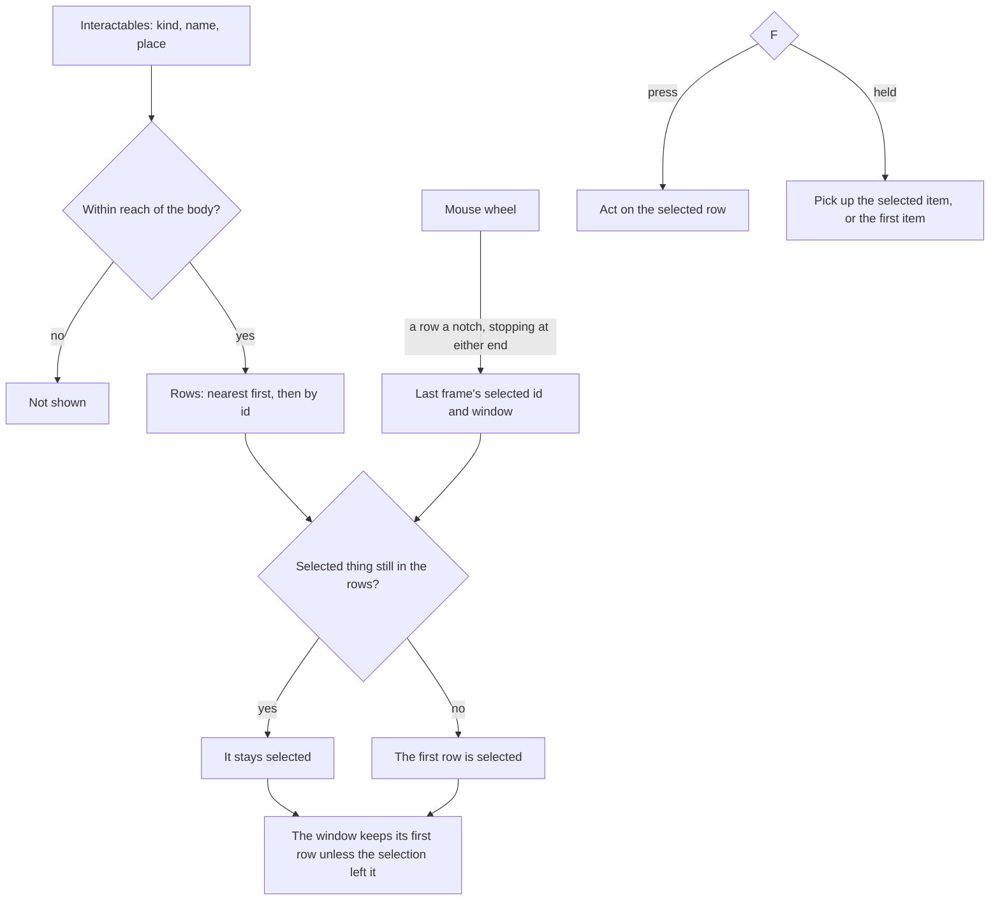

# Interaction

In the game, whatever the character can act on shows as a row of prompts beside it: an item's name to pick up, a chest to open, a character to talk to, a notice to read, a waypoint to activate. One row is selected, F acts on it, and with several things in reach the mouse wheel moves the selection through the rows. The world package holds the rules as pure functions over the things near the body, and `genshin-interface` draws the rows.

## How it works

- **Five kinds.** `InteractionKind` is what acting on a thing does, and so its row's icon: `PickUp` takes an item into the [inventory](/docs/genshin/inventory), `Open` opens a chest, `Talk` starts a character's dialogue, `Read` shows a book, a notice or a sign, and `Activate` unlocks a waypoint for the map. A row's words are the thing's own name in the reader's language. The kind lives in `genshin-interface` beside the prompt list that draws it, and an `Interactable` in the world is an `InteractionPrompt` with a place.
- **In reach is a distance from the body.** `computeInteractionPrompts` keeps every thing within `INTERACTION_REACH` of the body's position, the same reach for every kind until a recording measures the game's.
- **Nearest first, and still from frame to frame.** The rows run from the nearest thing to the farthest, two at one distance ordered by id, so the list never swaps two rows between frames.
- **The selection follows its thing.** The selection is the selected thing's id, never a row's index, so it stays on the same chest as rows come and go around it. When that thing leaves reach, the first row is selected.
- **The window scrolls only as far as it must.** The list shows `INTERACTION_WINDOW_SIZE` rows. Each frame the window keeps the last frame's first row unless the selection has moved out of it, and then scrolls just far enough to show it again, never past the last row.
- **The wheel steps the selection.** `stepInteractionSelection` moves the selection a row down the list for each notch of a positive step and up for a negative one, stopping at either end without wrapping. The window follows on the next frame's prompts.
- **A held F only picks up.** `getHeldPickUp` is what each repeat of a held F takes: the selected row when it is an item, else the first item in the list. A repeat never opens, talks, reads or activates, since each of those leaves the world for a screen.
- **F is the input's.** Pick Up and Interact are `InputAction.Interact` in the engine's `InputActionBindingMap`, on F, X on an Xbox controller and Square on a PlayStation one, as the game's defaults have them. Nothing listens for the key itself.
- **The list is `InteractionPrompts`.** The `genshin-interface` component draws the window's rows, each its kind's icon and its name, with the key's cap before the selected one, which carries `aria-current` for a screen reader.

## Key files

| File                                                                           | Role                                                                 |
| :----------------------------------------------------------------------------- | :------------------------------------------------------------------- |
| `packages/genshin-world/src/services/interaction/computeInteractionPrompts.ts` | The rows in reach, the selection kept by id, and the scrolled window |
| `packages/genshin-world/src/services/interaction/stepInteractionSelection.ts`  | The mouse wheel's step through the rows                              |
| `packages/genshin-world/src/services/interaction/getHeldPickUp.ts`             | What each repeat of a held F picks up                                |
| `packages/genshin-world/src/services/interaction/constants.ts`                 | The reach and the window's rows, both provisional                    |
| `packages/genshin-world/src/models/interaction/Interactable.ts`                | A thing the character can act on: its prompt and its place           |
| `packages/genshin-interface/src/models/InteractionKind.ts`                     | The five kinds of interaction                                        |
| `packages/genshin-interface/src/components/InteractionPrompts/Index.vue`       | The prompt list's rows, the selected one marked with F               |

## Notes

- **The reach and the window are provisional.** No published source gives either: the wiki documents no reach and no row count. Both wait on a recording of the game, and the [interaction proposal](/docs/proposals/genshin/interaction) keeps the measures with the rest of what is unbuilt.
- **The order and the held F are this page's reading of the game.** The wiki documents neither how the game orders several prompts nor whether a held F repeats. Nearest first and a held F that only picks up are the readings closest to play, and the same recording confirms or replaces them.

## Sources

- [Controls](https://genshin-impact.fandom.com/wiki/Controls), Genshin Impact Wiki: Pick Up and Interact on F, X on an Xbox controller and Square on a PlayStation one.
- [Faster item pick up](https://gamestegy.com/post/genshin-impact/322/faster-item-pick-up), GameStegy: a player's tip that the scroll wheel and F work together on the prompts.
