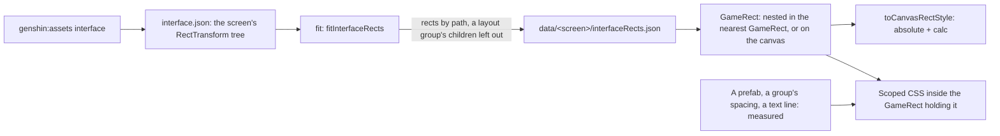

# Interface layout

A screen's interface is laid out by the game's own tree. Unity places every piece of an interface with a RectTransform: two anchors as shares of its parent's box, a pivot as a share of its own, the pivot's offset from the anchors (the anchored position) and how far its size strays from the anchors' span (the size delta). A screen's markup follows that tree piece for piece, so a piece sits inside its game parent and inherits its anchoring, and a fix to a parent reaches everything in it. On the login screen the foot, `Bottom`, is anchored to the screen's bottom, and the loading row, the account, the build string and both button columns ride in it on any window.

## How it works

- **The tree is data beside the screen.** `genshin:assets interface` exports the screen's RectTransforms from the game's block, outside the repository like every other reference. The screen's `fit` turns it into `interfaceRects.json` with `fitInterfaceRects`: every piece's anchors, pivot, position and size in canvas units, and its scale where it is not one, keyed by its path under the interface's root. The root is the canvas itself, so it is left out.
- **One component nests the tree.** `GameRect` takes a piece's rect and draws a box placed by it inside the nearest `GameRect` it is drawn in, or on the canvas when it is drawn in none, which it learns by injection. The markup reads as the game's tree: `<GameRect :rect="interfaceRects['GrpLogin/Bottom']">` holds the `GameRect` of `GrpLogin/Bottom/CurrentAccount`, which holds that of its build string.
- **The browser is the layout engine.** A RectTransform's corners are its anchors' points in the parent plus `offsetMin = anchoredPosition − sizeDelta × pivot` and `offsetMax = offsetMin + sizeDelta`, which absolute positioning with `calc()` expresses exactly (`toCanvasRectStyle`, over `computeRectOffsets`), at no cost per piece. A layout engine of its own (Yoga, Taffy) would lay out a different model and need Unity's rebuilt on top of it.
- **A layout group's children are left out.** A `GridLayoutGroup` places its children at run time, so their rects read zero; the fit keeps the group's own rect and drops everything under it, and the group's stacking and spacing are scoped CSS on its `GameRect`, measured off a recording.
- **What the tree cannot hold is measured inside the piece holding it.** A prefab the page loads at run time, such as the door's prompt in `BtnPressStart`, has no rect in the page's block, and a script that resizes a piece at run time (the age rating's layout adaptor) makes its rect a container only. Each is measured on a recording and written as CSS inside the `GameRect` it loads into, so it still rides with its parent. A line of text is set by the game's text component at run time, so its place inside its rect is measured too.
- **The game's clips play on the same tree.** Each `GameRect` a clip moves carries its path under the clips' root as its `data-clip-target`, so a fade the game plays on a parent fades everything the markup nests in it, as the door's prompt fades with `Center/SwitchServer`.

## Notes

- **A measured leaf is written from its parent's box**, such as the prompt's `calc(var(--unit) * 38 - var(--canvas-unit) * 128)` from a container standing 128 canvas units in. The measure stays the one taken off the recording, and the parent's term keeps it where the recording shows on any window.
- **A layout component has no image.** `GameRect` and `GameScreen` draw nothing of their own, so the interface library's suite exempts them from the fixture every other component owes.

## Key files

| File                                                                        | Role                                                          |
| :-------------------------------------------------------------------------- | :------------------------------------------------------------ |
| `scripts/src/services/genshinAssets/interface/extractComponentInterface.ts` | The screen's RectTransform tree, exported from its block      |
| `scripts/src/services/genshinAssets/fit/fitInterfaceRects.ts`               | The tree as rects keyed by path, a group's children out       |
| `packages/genshin-world/src/data/login/interfaceRects.json`                 | The login page's fitted rects                                 |
| `packages/genshin-interface/src/components/GameRect/Index.vue`              | A piece placed by its rect inside its parent's, or the canvas |
| `packages/genshin-interface/src/services/toCanvasRectStyle.ts`              | Unity's RectTransform as CSS, the one layout computation      |
| `packages/genshin-world/src/components/Login/Interface/Index.vue`           | The login's interface, nested as the game's tree              |
