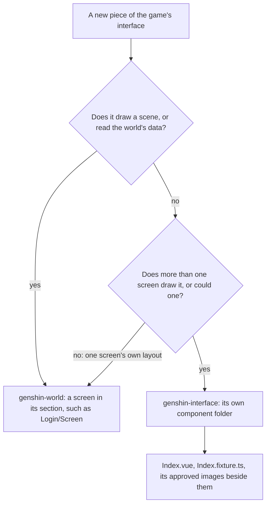

# Interface library

`genshin-interface` holds the pieces the game's screens are made of, as presentational Vue components with no three.js in them: the root a screen is drawn in, the round buttons and their glyphs, the server bar, the progress bar, the prompt band, the notice card, the wait mark and the ornamented divider. `genshin-world` builds its screens from them, and a page that shows only interface loads this package alone.

## Where a piece goes

- **A screen draws inside `GameScreen`.** The root is the window's size container, in the game's face and pointer. Its `--unit` is a pixel of the game's 1920 by 1080 screen fitted to the window's smaller axis, as the game fits its interface. Its `--canvas-unit` is a unit of the interface's 1600 by 900 canvas, where the game's RectTransforms place each piece, 1.2 screen units at 1080 high, and its `--canvas-inset` how far the canvas stands in from each side of a screen wider than 16:9: its spare width, up to 71 units, measured on a 2560 and a 3440 wide recording. Each is a custom property resolved where a child uses it, against the one container.
- **A piece sits where the game anchors it.** `toCanvasRectStyle` turns a `CanvasRect`, a RectTransform's anchors, pivot, anchored position and size, into the CSS that places it in its parent's box, from the foot up as Unity's y runs, so a piece anchored to the bottom stays there on any window. Its start is Unity's `offsetMin`, the anchored position less the size delta's share before the pivot (`computeRectOffsets`, the one layout of a RectTransform), so a piece stretched between two anchors keeps its place whatever its pivot. A screen places its pieces through `GameRect`, which draws each inside its game parent's box from the screen's fitted tree ([interface layout](/docs/genshin/interface-layout)), so the login's loading row, account, build string and button columns all ride in its foot.
- **The pointer is the game's own.** A four-pointed star with its point at the upper left, white and cream facets either side of its diagonal and a gold star inside lit from its inner corner. It was traced from the wiki's render of the game's tutorial and drawn as an SVG cursor, 25 pixels across as the game draws it on a 1080 high screen.
- **Each glyph is centred on its ink.** The game trims each icon's sprite to its ink and centres it on its button, so each traced glyph is drawn about its ink's middle (`InterfaceIconCentreMap`) rather than its trace's crop.
- **Each glyph is traced within its button.** The round buttons' glyphs were traced eight times enlarged from a 1440 high recording, with everything outside each button's white disc painted white first, so the tracer's paper is the disc's white and no glyph is clipped by a square region. The settings gear's grey ring is drawn over it, since a trace splits a mid grey from its ink.
- **Every piece has a fixture and images.** A component is a folder: `Index.vue`, the `Index.fixture.ts` whose props and variants it is shot in, and `Index.<platform>.png` and `Index-<variant>.<platform>.png`, each shot to the component's own box at the game's 1080 high scale. `pnpm -C packages/genshin-interface test:visual` holds each to its image and fails for a component without a fixture, so no piece reaches a screen unshot; `GameScreen` and `GameRect`, which draw nothing of their own, are the exceptions.
- **Sizes and colours are the English client's.** Each is measured from its 1080 high recording of the login screen, and the whole interface is compared over the recording's own frame on the [parity](/docs/genshin/parity) page, so a piece's place is exact to the unit. Its text is set in Signika, which is narrower than the game's face at one cap height, so a line keeps the game's cap height and is letter-spaced to its width.

## Key files

| File                                                              | Role                                                                   |
| :---------------------------------------------------------------- | :--------------------------------------------------------------------- |
| `packages/genshin-interface/src/components/GameScreen/Index.vue`  | The root: the units, the canvas's inset, the face and the pointer      |
| `packages/genshin-interface/src/services/constants.ts`            | The face, the units, the canvas's inset, the pointer and the separator |
| `packages/genshin-interface/src/services/toCanvasRectStyle.ts`    | A RectTransform as the CSS that places it                              |
| `packages/genshin-interface/src/components/GameRect/Index.vue`    | A piece placed by its rect inside its game parent's                    |
| `packages/genshin-interface/src/services/InterfaceIconPathMap.ts` | Each round button's traced glyph                                       |
| `packages/genshin-interface/src/components/components.visual.ts`  | The suite holding every component to its images                        |

## Sources

- [Tutorial System Show Cursor](https://genshin-impact.fandom.com/wiki/File:Tutorial_System_Show_Cursor.png), Genshin Impact Wiki: the pointer.
- [GENSHIN IMPACT | CELESTIA DOOR | LOADING SCREEN](https://www.youtube.com/watch?v=rBnfA4pXw6U): the 1080 high, 60 frame recording of the English client's login screen, which every size and colour here is measured from.
