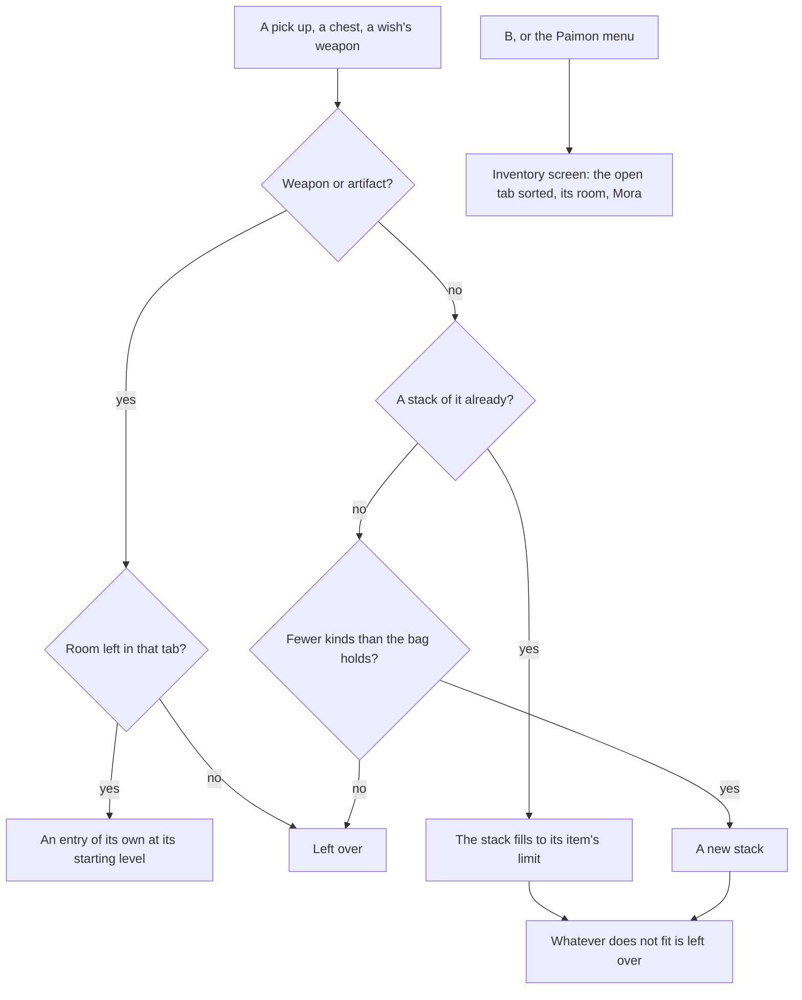

# Inventory

The game keeps everything the player carries in one bag of nine tabs, opened with B, and keeps its currencies beside it. The world package holds the bag as pure state and functions over it, `genshin-interface` draws its screen, and the world's `Inventory/Screen` puts the two together in the reader's language.

## How it works

- **The game's nine tabs.** `ItemCategory` is Weapons, Artifacts, Character Development Items, Food, Materials, Gadget, Quest, Precious Items and Furnishings, and `ItemCategories` lists them in the game's order. Each tab's name is the game's own text (`ITEM_WEAPON` to `ITEM_FURNITURE`, through `ItemCategoryGameTextKeyMap`).
- **An item is its definition.** `ItemDefinition` carries the game's item id, its tab, its name in the reader's language, its rarity, its stack limit and its rank, the place the game gives it in its tab's own order. The bag holds `InventoryItem` entries, each numbered by the bag's own count of what it has taken in, so an entry's id never repeats and runs in the order obtained.
- **Stacks fill to their item's own limit.** `addInventoryItem` adds to an item's stack up to its `stackLimit`, or opens a new stack. The limit is the item's own: most stop at 9,999, ores and experience materials hold 99,999, food and the common bosses' drops 2,000, consumable gadgets 99, and reusable gadgets and most quest items one, as the wiki lists them.
- **Weapons and artifacts never stack.** Each is an entry of its own with its level, a weapon from 1 and an artifact from 0.
- **The bag's room is the game's.** `ItemCategoryRoomMap` gives the tabs counted on their own their room in pieces: 2,000 weapons, 2,400 artifacts and 2,600 furnishings. Every other tab shares `INVENTORY_KIND_LIMIT`, 2,300 kinds of item counted by kind rather than quantity.
- **What does not fit is left over.** An addition returns the bag after it and how many there was no room for, which stay where they lay, as the game leaves a pick up the bag cannot take.
- **Each tab sorts as the game's does.** `computeInventoryTab` takes a tab's entries in the game's order. Weapons and artifacts sort by Level or Quality, ascending or descending (`InventorySortOrder`), the other key breaking a tie the same way. Furnishings run from the first obtained, gadgets and quest items from the highest quality down, and every other tab in the game's own order by rank. A tie left falls to rank, then to the order obtained.
- **A wallet of the game's currencies.** `Wallet` counts each `Currency`: Mora, Primogems and Genesis Crystals, which the game holds outside the tabs, and Intertwined Fate, Acquaint Fate, Masterless Starglitter and Masterless Stardust, which it files among the Precious Items. Each is named by its item's own text (`CurrencyGameTextKeyMap`).
- **Nothing is bought with money.** Genesis Crystals are the game's paid currency, bought only by topping up. Nothing here takes a payment, so the wallet's Genesis Crystals stay at none and every Primogem and Fate is one the world gives.
- **The screen opens on B.** `InputAction.OpenInventory` is on B, and the screens' map opens `ScreenKind.Inventory` from it or from the Paimon menu. `Inventory/Screen` opens on the weapons, sorted by level from the highest, and hands `InventoryScreen` the tabs, the open tab's cells, its room in the game's own wording ("Weapons 0/2000", only on a tab counted on its own), the sort with its order's word for a screen reader, and the Mora count beside the tabs. A weapon's caption is its level as the game writes one, an artifact's its plus, and a stack's its count. Precious Items shows the wish's four currencies the wallet holds, in the game's order, ahead of the bag's own precious items.

## Key files

| File                                                                      | Role                                                                                |
| :------------------------------------------------------------------------ | :---------------------------------------------------------------------------------- |
| `packages/genshin-world/src/services/inventory/addInventoryItem.ts`       | A pick up taken into the bag: stacks, single pieces, room and what is left          |
| `packages/genshin-world/src/services/inventory/computeInventoryTab.ts`    | A tab's entries in the order the game shows them                                    |
| `packages/genshin-world/src/services/inventory/ItemCategoryRoomMap.ts`    | The room of the tabs counted on their own                                           |
| `packages/genshin-world/src/services/inventory/constants.ts`              | The bag's kinds, the starting levels, the currencies shown, an empty bag and wallet |
| `packages/genshin-world/src/models/inventory/Currency.ts`                 | The seven currencies the wallet counts                                              |
| `packages/genshin-world/src/components/Inventory/Screen/Index.vue`        | The bag's screen in the reader's language                                           |
| `packages/genshin-world/src/components/Inventory/Screen/Index.fixture.ts` | The weapons tab of 1,347 entries, the parity page's and the visual suite's state    |
| `packages/genshin-interface/src/components/InventoryScreen/Index.vue`     | The bag's tabs, room, sort, grid and counts                                         |
| `packages/genshin-interface/src/models/ItemCategory.ts`                   | The nine tabs, in the game's order                                                  |

## Notes

- **The weapons tab is the first state matched.** Its reference is a frame of a public account tour's recording of the English PC client at 1080 high, 30 seconds into its clip, drawn behind the screen (`inventory-weapons` in `ParityReferenceMap`). The grid's four columns, its cells, the detail panel's bands and name, the tab row and the count sit where the frame puts them, and the mean difference went from 24.87% (FLIP 0.7626) to 9.14% (FLIP 0.3080) over that frame's own pixels.
- **What the backdrop cannot score.** A reference drawn behind the screen shows the game's own tab icons, arrows and Details button through every area the screen leaves transparent, so a piece this screen drops there scores as if drawn. Those pieces are the nine tabs' icons, the arrows, the Details button and the stats block of the detail panel, none built yet. The remaining difference is the grid's item art, which the rules keep out, and the stats the model does not hold.
- **Not built yet.** The nine tabs' icons (a glyph pass over the wiki's 64 pixel icons), the grid's item icons and stars, the detail panel's stats, its footer line, the Details button and its arrows, the sort as the game's dropdown, and the currencies' place, which the frame does not show and this screen places beside the count. The screen's animations wait on the recordings listed in the roadmap.
- **The wish's currencies are counted, not stacked.** The game files the Fates, Starglitter and Stardust as Precious Items with a stack of their own, so each takes one of the bag's kinds; the wallet counts them apart, and the bag's kinds leave them out.

## Sources

- [Inventory](https://genshin-impact.fandom.com/wiki/Inventory), Genshin Impact Wiki: the nine categories and what each holds, the stack limits, the 2,300 kinds, the weapons', artifacts' and furnishings' room, each tab's order, and the full-bag hint.
- [Genesis Crystal](https://genshin-impact.fandom.com/wiki/Genesis_Crystal), Genshin Impact Wiki: the paid currency, bought only by topping up.
- [Controls](https://genshin-impact.fandom.com/wiki/Controls), Genshin Impact Wiki: the inventory on B.
