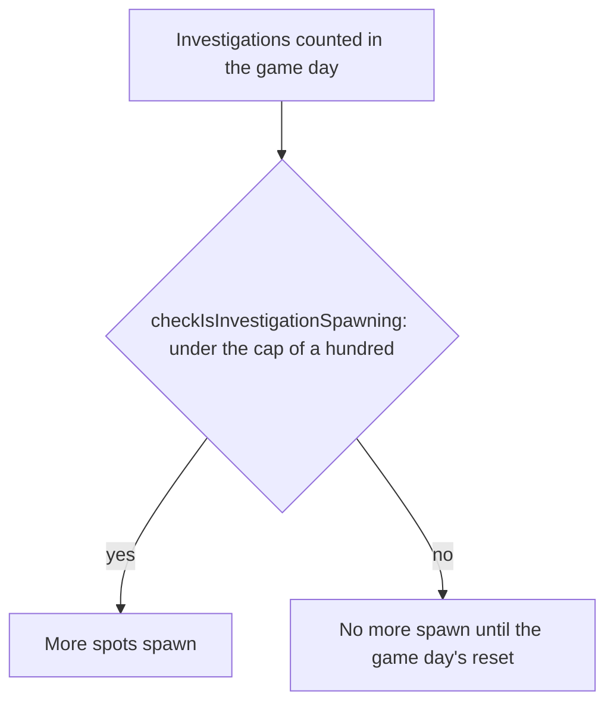

# Investigation

The rule that caps the investigation spots a player may investigate in a game day: a hundred, after which no more spawn. Nothing places the spots or gives a reward yet, so the cap is the only part built, and the [proposal](/docs/proposals/genshin/gathering) keeps the rest.

## How it works

## Rules

- **A hundred a day.** `INVESTIGATION_DAILY_CAP` is the most investigations in one game day. At the cap, no more spots spawn; below it, they do.
- **The count is the game day's.** The game day starts at the daily reset, 04:00 in the game's time zone, so the count that the cap compares is the one kept from that reset. The count's store is not built, so the reset is a rule for it to follow.

## Key files

| File                                                                                | Role                                                      |
| :---------------------------------------------------------------------------------- | :-------------------------------------------------------- |
| `packages/genshin-world/src/services/investigation/constants.ts`                    | The daily cap of investigations                           |
| `packages/genshin-world/src/services/investigation/checkIsInvestigationSpawning.ts` | Whether spots still spawn after this many in the game day |

## Sources

- [Investigation](https://genshin-impact.fandom.com/wiki/Investigation), Genshin Impact Wiki: spots that give artifacts, ingredients, ores or Mora, and the daily cap of a hundred investigations.
- [Daily Reset](https://genshin-impact.fandom.com/wiki/Daily_Reset), Genshin Impact Wiki: what comes back at the daily reset and around it.
