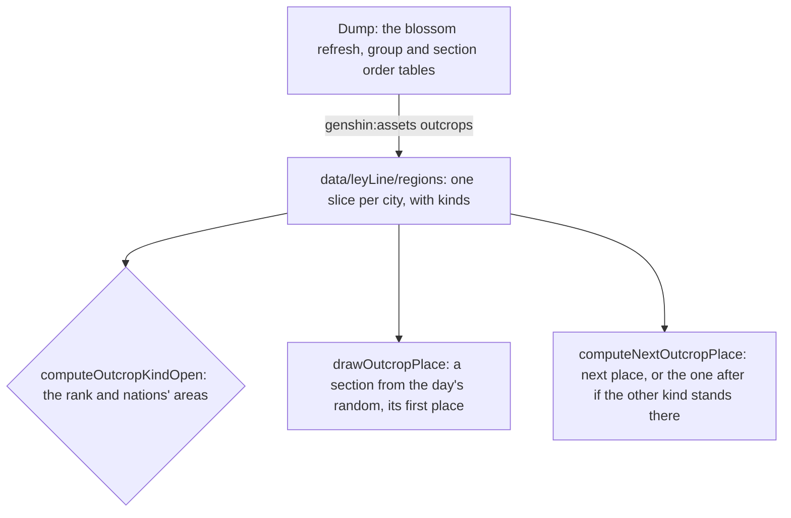

# Ley line outcrops

The rules a region's two ley line blossoms follow, read from the game's tables by `genshin:assets outcrops`: when each kind opens, where it starts after the daily reset, and where a claimed one moves on to. A kind is the Blossom of Revelation, which gives Character EXP materials, or the Blossom of Wealth, which gives Mora. Nothing places them in the world yet, so no outcrop is touched or fought, and no claim is offered: the places wait on [spawned places](/docs/proposals/genshin/spawned-places), the enemies on the wiki's table, and the rewards on a table the dump does not hold.

## How it works

## Decisions

- **Two kinds per region, read off the refresh rows.** A ley line kind is a blossom refresh whose type is `BLOSSOM_REFRESH_EXP`, the Revelation, or `BLOSSOM_REFRESH_SCOIN`, the Wealth. The rows name the city ids 1 to 7, Mondstadt to Snezhnaya in the game's order, and each of those regions gets its two kinds. Dragonspine, Blitz Rush and the Blossom Island refreshes are other challenges and read no kind.
- **Opened by rank, and by a nation's area, as the table says.** Mondstadt opens Revelation at Adventure Rank 8 and Wealth at 12. Liyue's rows open both at 18 with no area condition, which differs from the wiki's 8 and 12 for Liyue: the table is read, and the difference is a [recording owed](/docs/genshin/roadmap). Every other region opens both at 18 once a nation's area is unlocked. The table's `UNLOCK_ANY_AREA_IN_CITY` is read as that nation's Statue of The Seven activated, since a statue unlocks its area.
- **Sections in the game's order.** A region's sections are its city's section order rows, in their `order`, those with no place left out. Fontaine, Natlan and Snezhnaya have kinds but no section order rows, so their draw has no section and starts no outcrop.
- **Started at a drawn section's first place.** Each kind starts in a section drawn at random from the region's, with the day's seeded random, at the section's lowest numbered place. The table names no start. The lowest is a place no other place in its section moves to, in every section of Mondstadt, Liyue, Inazuma and Sumeru except Sumeru's 4004, whose places form a loop with no such place, where the lowest is taken too.
- **Moved on along the places each names.** A claimed outcrop moves to the first place its place lists as next, the rest of that list read by no rule yet. When the other kind stands there, it moves to the place after, the next of that next. Where neither is free, or the place lists no next, it stays until the daily reset. A next place may sit in another section of the same city, and the move follows it.
- **The daily reset is 04:00.** The refresh rows' `refreshTime` is 04:00 in the game's day, the reset every kind starts over at. The random stream a reset draws from is the caller's, and nothing wires the reset yet.
- **Settled calls on the rest of the table.** The rank 2 each city's `BlossomOpenExcelConfigData` row gives gates nothing a kind opens by, so it is not read. Each ley kind's `BlossomChestExcelConfigData` resin is 20, the price Original Resin already charges. The groups' refresh type numbers are not read, since the dump holds no enum naming them: a kind's draw ranges over every place of its region's sections.

## Data

- **The tables.** The blossom refresh, group and section order tables come from the community's dump, `BlossomRefreshExcelConfigData`, `BlossomGroupsExcelConfigData` and `BlossomSectionOrderExcelConfigData`, read from the dump's `ExcelBinOutput` folder under `GENSHIN_TEXT_DIRECTORY`. The dump at its revision lacked all three; they were taken from the same repository's files and not committed.
- **The regions.** `packages/genshin-world/src/data/leyLine/regions/<city>.json`, one slice per city with a kind, holding its two kinds' rules, its sections in order and every place its groups name. A slice is loaded on its own when a region's outcrops are wanted.

## Not built yet

- **Touching, fighting and claiming.** No outcrop is placed, so none spawns its region's enemies on a touch, reveals its blossom or offers its claim. The places wait on [spawned places](/docs/proposals/genshin/spawned-places), and the enemies per region on the wiki's table, which is not in the dump.
- **The claims' rewards.** Each refresh row holds reward rows keyed 4001 to 4110, and each chest row a reward id, but none of those ids is in the dump's reward table, and the mapping from a key to a World Level is not stated. The rewards wait on a table that names them.
- **Fontaine, Natlan and Snezhnaya.** Their kinds are read, but their sections are not in the dump's section order table, so no outcrop is drawn there.
- **Nod-Krai.** The refresh rows name no kind for it.
- **The states and the reset.** The transitions from waiting through fighting and cleared to claimed, and the reset that starts each kind over, are the proposal's still.

## Key files

| File                                                                     | Role                                                                              |
| :----------------------------------------------------------------------- | :-------------------------------------------------------------------------------- |
| `scripts/src/services/genshinAssets/leyLine/writeLeyLineTables.ts`       | writes each city's region slice from the dump's three tables                      |
| `scripts/src/services/genshinAssets/leyLine/toLeyLineRegions.ts`         | each city's kinds, places and ordered sections from the tables                    |
| `scripts/src/services/genshinAssets/leyLine/constants.ts`                | the refresh types and the two conditions the kinds open by                        |
| `packages/genshin-world/src/models/leyLine/OutcropKind.ts`               | the Revelation and the Wealth                                                     |
| `packages/genshin-world/src/models/leyLine/OutcropKindRule.ts`           | a kind's Adventure Rank and the nations whose areas it needs unlocked             |
| `packages/genshin-world/src/models/leyLine/OutcropRegion.ts`             | a region's kinds, sections and places, as its slice is written                    |
| `packages/genshin-world/src/services/leyLine/computeOutcropKindOpen.ts`  | whether a kind is open at a rank with the listed areas unlocked                   |
| `packages/genshin-world/src/services/leyLine/drawOutcropPlace.ts`        | a kind's starting place, from a drawn section's lowest numbered place             |
| `packages/genshin-world/src/services/leyLine/computeNextOutcropPlace.ts` | a claimed outcrop's next place, or the one after when the other kind stands there |

## Sources

- [AnimeGameData](https://github.com/DimbreathBot/AnimeGameData), the community's per-patch dump: the blossom refresh, group and section order tables, and the chest table's resin.
- [Ley Line Outcrop Guide](https://game8.co/games/Genshin-Impact/archives/317049), Game8: Revelation at Adventure Rank 8 and Wealth at 12 in Mondstadt and Liyue, and from version 5.8 Adventure Rank 18 and a statue in the other regions. Its Liyue figures are the ones the table disagrees with.
