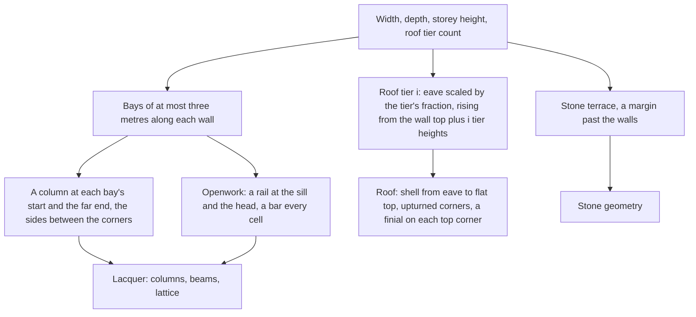

# Liyue building kit

Liyue's towns are built from one kit: a stone terrace, lacquered columns and beams, and roofs stacked one above another with their eaves turned up. The kit is pure geometry on `genshin-engine`, so a building is generated the same way anywhere and nothing about its placement lives in it.

## How it works

- **A footprint with parameters.** A building is its width along x, its depth along z, the height of its storey and its roof tier count, one to three. Its terrace stands a margin past the walls, and its walls rise from the terrace's top.
- **Bays, not a column count.** Along each wall the bays are the fewest that keep each no wider than a bay width, spread evenly. The front and back carry a column at every bay's start and at their far end, and the sides carry columns only between the corners, so no column is placed twice.
- **Openwork.** Each bay between two columns is a lattice panel: a rail at its sill and another at its head, with a bar every cell between them. The bars stand flat to the wall, so the lattice reads as openwork from the street.
- **Upturned eaves.** A roof tier is a shell of rings stepping inward from its eave to a flat top. The eave's corners lift by the curl over its middle, and the shell's rise is steep at the eave and levels toward the top. Each top corner carries a finial.
- **Stacked tiers.** Each tier above the first has its eave scaled by the tier scale of the one below and is raised one tier height, so a building with three tiers stands three rises above its walls.

## Palette

The palette's hues are the ones the game's Liyue reads as: ochre and grey rock, jade-green water, golden ginkgo and autumn maples, the red lacquer and gold of its architecture, and the stone of its terraces. Each is an sRGB colour in `genshin-world`'s `services/liyue/constants.ts`. These values are the named hues' first reading, to be fitted against the reference in the recreation passes.

## Key files

| File                                                                              | Role                                                                  |
| :-------------------------------------------------------------------------------- | :-------------------------------------------------------------------- |
| `packages/genshin-engine/src/kits/liyue/createLiyueBuildingGeometries.ts`         | The building: terrace, columns and beams, lattice and roof tiers      |
| `packages/genshin-engine/src/kits/liyue/createLiyueRoofTierGeometry.ts`           | One roof tier: the upturned shell and its finials                     |
| `packages/genshin-engine/src/kits/liyue/getLiyueBays.ts`                          | A wall's bays, none wider than the bay width                          |
| `packages/genshin-engine/src/kits/liyue/constants.ts`                             | The kit's proportions, in metres                                      |
| `packages/genshin-world/src/services/liyue/constants.ts`                          | The palette's hues                                                    |
| `packages/genshin-world/src/data/regions/liyue.json`                              | Liyue's region data, with no landmarks until their positions are fit |
