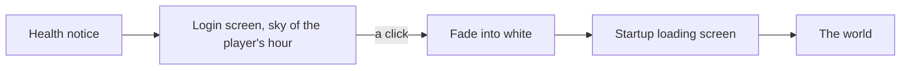

# Login screen

The game opens on its login screen once the health notice has faded: a walkway running out between towers that stand in a sea of cloud, under a sky that follows the hour of the player's own device. A click begins the game, and the screen fades into white before the startup loading screen. The console's opening shows it at the same place.

## How it works

- **The sky follows the player's hour.** Four skies, as the game draws them: dawn from half past four, day from eight, dusk from seventeen and night from nineteen, by the device's own clock. Each is one fixed sky state, its colours read off that time's capture. The light comes from the left in all four, low at dawn and dusk and the moon's at night, which no single path of a sun across a day gives, so the login scene sets its light rather than running the world's clock.
- **The scene is rebuilt from kits.** Nothing from the game ships. Each tower is one of three kinds: an octagonal tower of arcaded tiers under a ring of columns, a round shaft banded by mouldings, or a slender pole. A kind is a profile in shares of its shaft's diameter, measured off the nearest tower of that kind in the day capture, and the engine turns it into stacked sections and a colonnade.
- **The camera is matched to the captures.** The four time-of-day captures share one pose. The walkway's edges meet a touch right of centre and below it, which gives the camera's heading and pitch, and each tower is placed where its box stands in the frame, at a depth chosen for a believable width. The camera's flight along the walkway, recorded in the game, is what tunes those depths.
- **It is judged by shape and tone.** A rebuilt scene never matches a capture pixel for pixel, so the [parity](/docs/genshin/parity) comparison scores the edges both share and their colour blurred past any texture, against each time of day. The wiki's captures show no interface, so the screen is shot with its interface hidden for them.

## Key files

| File                                                                        | Role                                                         |
| :-------------------------------------------------------------------------- | :----------------------------------------------------------- |
| `packages/genshin-world/src/components/interface/login/LoginScreen.vue`     | The screen: the scene, its prompt, and the fade into white   |
| `packages/genshin-world/src/components/world/login/LoginScene.vue`          | The towers, walkway, cloud sea and sky                       |
| `packages/genshin-world/src/services/login/constants.ts`                    | The camera, the towers' placing and each time of day's sky   |
| `packages/genshin-world/src/services/login/LoginTowerProfileMap.ts`         | Each tower kind's shape, in shares of its shaft              |
| `packages/genshin-world/src/services/login/getLoginTimeOfDay.ts`            | The sky the player's hour shows                              |
| `packages/genshin-engine/src/kits/architecture/createLatheStackGeometry.ts` | A shaft as stacked sections, the moulding between them hard  |
| `packages/genshin-world/src/components/interface/opening/GameOpening.vue`   | The opening that shows it between the notice and the startup |

## Sources

- [Login Menu](https://genshin-impact.fandom.com/wiki/Login_Menu), Genshin Impact Wiki: the four backgrounds, the hours each is shown at, and the door and platform.
