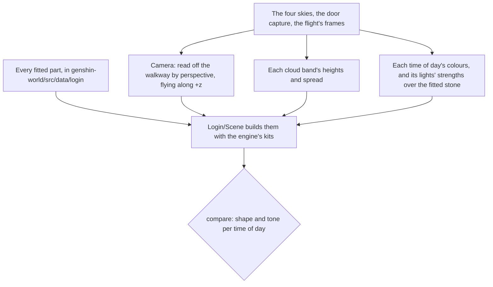

# Login screen

The game opens on its login screen once the health notice has faded. The console's opening shows it at the same place, in the same stages and at the game's own timings.

## How it plays

```mermaid
flowchart LR
  N[Health notice's white] --> A[Arriving: the scene fades up over 800 ms, the wait mark from 1.3 to 2 s]
  A --> T[Title: START GAME, the server and the account, the welcome card for 1.9 s]
  T -->|a click| P[Preparing: the status steps, then the load's share and bar, the camera flying]
  P -->|"flight flown and loading done"| D[Door: CLICK TO BEGIN and the four corner buttons]
  D -->|a click| E[Entering: the door lights, the camera rushes to it, the screen whitens]
  E --> S[Startup loading screen]
```

- **The stages are the game's current build's.** The user's own recording of the Japanese client times them and shows which corner buttons each stage has (the title's notices and exit, the door's settings, repair, notices and exit). A 1080 high English recording of an older build gives the words and every size. The status says "Preparing to download resources", "Checking for updates...", "Loading game..." over the ornament's double diamond, then "Preparing to load data" over the progress bar, which folds into its diamond at 100%.
- **The flight follows loading.** The camera flies down the walkway no further than loading has gone and no faster than its fastest, 8.9 seconds: the English recording's flight, less the two seconds it stalls for. A slow load draws it out, as the 1440 high recording's 17 seconds do. The door waits until both the flight and loading are done.
- **A click is the screen's unless it lands on a button.** The screen asks `checkIsNestedInteraction` before it moves on, so a click on a corner button stays the button's.
- **A host can pin a stage.** The stage is a `v-model`, so the parity page and a test hold one still, and the opening leaves it free.

## The scene

Every part's shape, place and stone is fitted from the game's own assets ([derived assets](/docs/genshin/derived-assets)), and whatever the blocks cannot hold is read off the captures and expressed over what they can:

- **The login screen is one arrangement of its meshes.** The blocks lay the towers out more than once; the login screen is the character select's stage, its towers and its door at 0.4 scale, with the walkway, whose own parent is lost with a block not read. It hangs at the door's scale and height, which brings its far end to the door's foot, where the recording shows the door standing at its end, as wide as the walkway. A unit test holds that width ratio, which no camera changes.
- **Each part is built from its fit.** Each tower profile is a lathe of its fitted sections, built once per placement at its scale and merged into one geometry. The walkway is its fitted outline, wings and all, extruded from its underside to its surface.
- **The camera is read off the walkway by perspective.** The walkway's crossbars and the door have known widths. In each capture their pixel widths give the focal length and the distance, and the rows they stand at give the eye's height. The eye holds 3.96 metres over the walkway, straight down its middle toward the door along +z. It flies from 72.1 metres short of the door (the dawn, dusk and night frames) to 45.3 (the English recording's last pose), pitching up from 5.6 to 6.9 degrees as its vertical field of view widens from 44.6 to 51.2. The witness render at each pose lines the walkway, the crossbars and the door up on the capture ([parity](/docs/genshin/parity)).
- **The door assembles itself once the flight reaches it.** The title's frames show the walkway running on with no door on it. At the flight's end the door rises into place from 20 metres below, easing out and settled by 800 ms, sampled from the game's `Ani_LogginScene_Door01_Liftting`. It lights from its middle: a bright line down its panel over a glow across the whole of it, raised over the door's light time.
- **The click rushes the camera to the door.** While the door lights and the screen whitens, the camera closes 41% of its distance to the door in the first third of a second, gathering speed with the square of the time, as the recording's door grows about 1.7 times, and stops short of it under the white.
- **The clouds are the game's painted clouds.** Each of the sky's three emitters, the cloud sea's billows and the middle and top cumulus, is a band of its own atlas's clouds, traced as shapes and drawn as billboards in the sky's cloud colours, so the hour recolours them without repainting. The sky itself draws no cloud layer of its own.
- **Each sky's light comes from its sun or its moon, placed where its reference shows it.** A screen point measured off the reference (the dawn's and the dusk's suns just past the left edge a little over the horizon, the night's moon behind the lantern tower) becomes a direction through the login camera (`getScreenDirection`), and the light, the sun and the moon all take it, the other body opposite; the day's sun is off its frame, so its direction is measured from the faces it lights. The hemisphere's sky colour is the bright cloud colour and its ground the shade, so a face turned up is lit by the sky as the references show under a low sun, and the haze scatters the light toward the sun.
- **Colours are measured on the screen and inverted into the scene.** The sky's, the haze's and the clouds' colours are display colours read off the references, written through the tone mapping's inverse (`toSceneColor`); the lights' strengths are measured over the stone's fitted albedo, by `compare`.
- **The haze is the cloud sea's.** The haze rises off the cloud sea far under the walkway and thins up past it. It is dense enough 20 metres under the walkway that the towers' feet are white, as the references show, and thin enough at the eye that a tower half a kilometre out is still half seen.
- **The light casts shadows and draws no god rays.** The moon's and the sun's shadows fall across the walkway from a shadow camera that follows the flight ahead of it. The god rays lit the whole sky in the light's colour, so the login's sky states turn them off.

## Tests

- `Game/Opening/Index.browser.test.ts` plays the whole opening with timers and frames faked, through the login's title, flight and door, and checks every handoff and the finish.
- The walkway and the door have unit tests of their measures: the walkway spans its fitted outline from its underside to its surface and stands nowhere past its widest, and the door stands on its plinth with its panel recessed. Each fit that builds the data has its own test in `scripts/src/services/genshinAssets`.
- `Login/Interface` is shot in each stage as fixture variants and held to its approved images; its references are the English recording's frames, over which it is compared.

## Key files

| File                                                                              | Role                                                                    |
| :-------------------------------------------------------------------------------- | :---------------------------------------------------------------------- |
| `packages/genshin-world/src/components/Login/Screen/Index.vue`                    | The stages, the flight, and the fades out of and into white             |
| `packages/genshin-world/src/components/Login/Interface/Index.vue`                 | Each stage's interface, from `genshin-ui`'s pieces                      |
| `packages/genshin-world/src/components/Login/Scene/Index.vue`                     | The camera, the fitted parts, the clouds, the sky and the shadows       |
| `packages/genshin-world/src/services/login/constants.ts`                          | The words and the timings                                               |
| `packages/genshin-world/src/services/login/scene/constants.ts`                    | The camera, the flight, the haze, the light and the shadows             |
| `packages/genshin-world/src/services/login/scene/LoginSkyStateMap.ts`             | Each time of day's colours and light strengths                          |
| `packages/genshin-world/src/services/login/cloud/LoginCloudBandMap.ts`            | Each cloud band's heights, spread and widths                            |
| `packages/genshin-world/src/services/login/tower/createLoginTowersGeometry.ts`    | Every fitted tower, built as a lathe and stood where the game stands it |
| `packages/genshin-world/src/services/login/walkway/createLoginWalkwayGeometry.ts` | The walkway, its fitted outline extruded between its two heights        |
| `packages/genshin-world/src/services/login/door/createLoginDoorGeometry.ts`       | The door's frame and its panel, from its fitted size                    |
| `packages/genshin-world/src/data/login`                                           | Every fitted part                                                       |

## Sources

- [Login Menu](https://genshin-impact.fandom.com/wiki/Login_Menu), Genshin Impact Wiki: the four backgrounds, the hours each is shown at, and the door and platform.
- [GENSHIN IMPACT | CELESTIA DOOR | LOADING SCREEN](https://www.youtube.com/watch?v=rBnfA4pXw6U): the English client's login screen at 1080 high and 60 frames.
