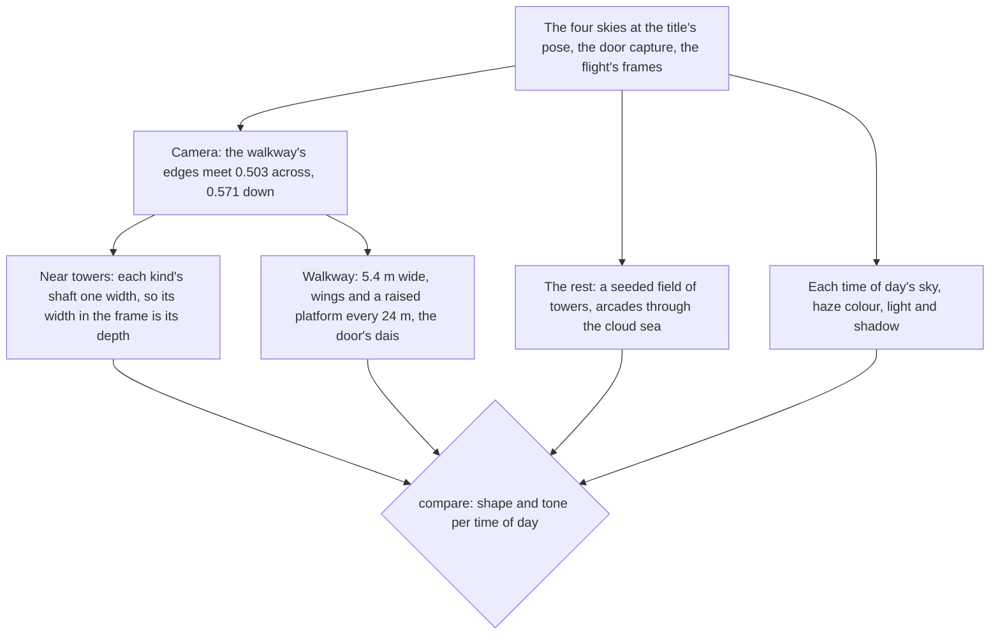

# Login screen

The game opens on its login screen once the health notice has faded. The console's opening shows it at the same place, in the same stages and at the game's own timings.

## How it plays

```mermaid
flowchart LR
  N[Health notice's white] --> A[Arriving: the scene fades up over 800 ms, the wait mark from 1.3 to 2 s]
  A --> T[Title: START GAME, the server and the account, the welcome card for 1.9 s]
  T -->|a click| P[Preparing: the status steps, then the load's share and bar, the camera flying]
  P -->|"flight flown and loading done"| D[Door: CLICK TO BEGIN and the four corner buttons]
  D -->|a click| E[Entering: the door lights over 400 ms, the screen whitens over 620]
  E --> S[Startup loading screen]
```

- **The stages are the game's current build's.** The user's own recording of the Japanese client times them and shows which corner buttons each stage has (the title's notices and exit, the door's settings, repair, notices and exit). A 1080 high English recording of an older build gives the words and every size. The status says "Preparing to download resources", "Checking for updates...", "Loading game..." over the ornament's double diamond, then "Preparing to load data" over the progress bar, which folds into its diamond at 100%.
- **The flight follows loading.** The camera flies down the walkway no further than loading has gone and no faster than its fastest, 8.9 seconds: the English recording's flight, less the two seconds it stalls for. A slow load draws it out, as the 1440 high recording's 17 seconds do. The door waits until both the flight and loading are done.
- **A click is the screen's unless it lands on a button.** The screen asks `checkIsNestedInteraction` before it moves on, so a click on a corner button stays the button's.
- **A host can pin a stage.** The stage is a `v-model`, so the parity page and a test hold one still, and the opening leaves it free.

## The scene

- **The camera is re-derived from the walkway, never guessed.** The references share one pose. The walkway's two edges meet 0.503 across and 0.571 down the frame, so the camera looks straight down it pitched 3.37 degrees down. The walkway's 5.4 metres fill 0.42 of the frame's foot, which puts the eye 4.1 metres over its surface at the game's 45-degree vertical field of view. A first pass measured the edges by eye, pitched the camera up, and scored a third of the edges shared.
- **Each near tower's depth is its kind's width.** A tower's width in the frame gives its depth only once its true width is known. So each kind's shaft is one width: a crowned tower 2.2 metres, set by the one left of the walkway, whose moulding meets the first wing; a ringed one 3, set by the right one's base ring at the walkway's level; a slender pole half a metre. The rest stand in a field scattered from a seed, clear of the walkway and of each other, and the door has its own towers where its frame shows them.
- **The haze is the cloud sea's, and brighter than the sky's horizon.** The haze is dense five metres under the walkway and thins a third of itself a metre up. So a tower 17 metres out is white below the walkway's level, as the references show, while the far towers at eye height are half hazed at 150 metres. Its colour is each reference's own, sampled low in the frame (the engine's `fogColor`), since the horizon's colour is far darker than the lit haze.
- **The light casts shadows and draws no god rays.** The moon's and the sun's shadows fall across the walkway from a shadow camera that follows the flight. The god rays, which march that shadow, lit the whole sky in the light's colour, so the login's sky states turn them off.
- **The door lights from its middle.** Its panel's emission is a bright line down its middle over a glow across the whole panel, raised over the door's light time, which the bloom then spreads.

## Tests

- `Game/Opening/Index.browser.test.ts` plays the whole opening with timers and frames faked, through the login's title, flight and door, and checks every handoff and the finish.
- The walkway, the door and the tower field have unit tests of their measures: the walkway runs from behind the camera to the dais with wings at every segment and nothing between them, the door stands on its plinth with its panel recessed, and the field stands the same towers every time, clear of the walkway and of each other.
- `Login/Interface` is shot in each stage as fixture variants and held to its approved images; its references are the English recording's frames, over which it is compared.

## Key files

| File                                                                              | Role                                                                   |
| :-------------------------------------------------------------------------------- | :--------------------------------------------------------------------- |
| `packages/genshin-world/src/components/Login/Screen/Index.vue`                    | The stages, the flight, and the fades out of and into white            |
| `packages/genshin-world/src/components/Login/Interface/Index.vue`                 | Each stage's interface, from `genshin-ui`'s pieces                     |
| `packages/genshin-world/src/components/Login/Scene/Index.vue`                     | The camera, towers, arcades, walkway, door, cloud sea, sky and shadows |
| `packages/genshin-world/src/services/login/constants.ts`                          | The words and the timings                                              |
| `packages/genshin-world/src/services/login/scene/constants.ts`                    | The camera, the flight, the haze, the light and the shadows            |
| `packages/genshin-world/src/services/login/scene/LoginSkyStateMap.ts`             | Each time of day's sky, haze and light                                 |
| `packages/genshin-world/src/services/login/tower/getLoginTowers.ts`               | The near towers, the door's and the seeded field                       |
| `packages/genshin-world/src/services/login/walkway/createLoginWalkwayGeometry.ts` | The walkway, its wings and platforms, and the door's dais              |
| `packages/genshin-world/src/services/login/door/createLoginDoorGeometry.ts`       | The door's frame and its panel                                         |
| `packages/genshin-engine/src/kits/architecture/createArcadeGeometry.ts`           | An arcade: round-headed openings through a wall, and a railing         |

## Sources

- [Login Menu](https://genshin-impact.fandom.com/wiki/Login_Menu), Genshin Impact Wiki: the four backgrounds, the hours each is shown at, and the door and platform.
- [GENSHIN IMPACT | CELESTIA DOOR | LOADING SCREEN](https://www.youtube.com/watch?v=rBnfA4pXw6U): the English client's login screen at 1080 high and 60 frames.
