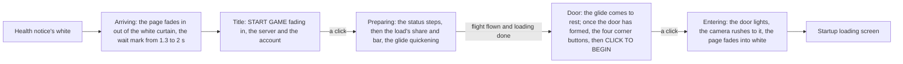
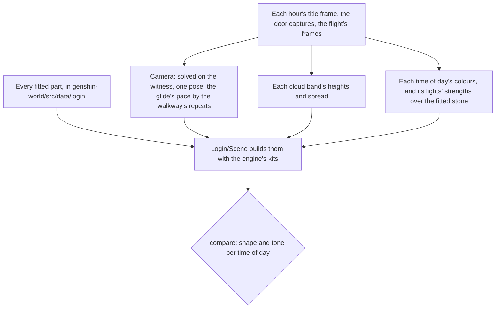

# Login screen

The game opens on its login screen once the health notice has faded. The console's opening shows it at the same place, in the same stages and at the game's own timings.

## How it plays

- **The stages are the game's current build's.** The user's own recording of the Japanese client times them and shows which corner buttons each stage has (the title's notices and exit, the door's settings, repair, notices and exit). A 1080 high English recording of an older build gives the words and every size. The status says "Preparing to download resources", "Checking for updates...", "Loading game..." over the ornament's double diamond, then "Preparing to load data" over the progress bar, which folds into its diamond at 100%.
- **The flight is the game's checks, and the door comes once they are done.** The flight is the screen's own clock for the door, the share of the way to it flown. The bar under it is the game's own checks before it loads the world, which on the page have nothing left to wait on, so the opening hands the screen a finished load: the share shown sweeps toward it at no more than one full bar per tenth of a second, the flight goes the share of the way the English recording's does before its bar is full, about two thirds, no faster than its last stretch's pace, and once the bar is full the flight flies whatever is left in the half second the bar takes to fold into its diamond and the status row to fade. The glide then carries the door's copy to the walkway's far end at its own pace, so the door rises on average about as long after the bar fills as the recording's does, 3 seconds. The world itself loads after the door, under the startup loading screen, whose marks follow it.
- **Mainland China's client marks its own screen.** A Simplified Chinese reader, who plays mainland China's build, sees its CADPA age rating (12 and over) in the top right corner at every stage, and its build string under the CNREL prefix. The rating's box and colours are measured off a public recording of that client's launch, its age and notice traced from it (`ageRating.json`) and its CADPA set in a serif; the build string is the current build's, its revision numbers the global build's, since no source publishes the mainland's own.
- **Its music plays from the start, looping as the game's does.** `LoginMusic` plays the game's login playlist, re-derived, while the screen shows, once the browser allows sound ([music](/docs/genshin/music)). The scene alone, as a reference shows it with no interface, is silent.
- **The interface moves on the game's own clips.** The login page's animation clips, decoded and fitted to keyframes (`interfaceClips.json`), play through `playInterfaceClip` as each stage begins: the white curtain and the page's fade in on arriving, the title's fade in, its fade out on the click, and the page's fade into white on entering, whose end is the `begin` below. Each piece a clip moves carries its path under the game's page as its `data-clip-target` (`LoginInterfaceClipTarget`), so the white the scene fades up out of and into is the interface's own, and a reference showing the scene alone has none.
- **A click is the screen's unless it lands on a button.** The screen asks `checkIsNestedInteraction` before it moves on, so a click on a corner button stays the button's.
- **A host can pin a stage.** The stage is a `v-model`, so the parity page and a test hold one still, and the opening leaves it free.
- **The opening says when the door is opened.** `GameOpening` emits `begin` as the screen hands on to the startup loading screen, so its host can act on the door rather than waiting for the world: the app's page mounts the world then, under the startup loading screen.
- **The words are the reader's language's.** The title, the account label, the status lines, the door's prompt and the name a player who has not chosen one goes by are the game's own text in the language the host resolved, handed down as the `gameText` prop ([game text](/docs/genshin/game-text)). The account kit's welcome card, which drops in as the game's player signs in, is not shown until the page has an account to welcome; its greeting is already the kit's own in every language, with the name where each language puts it.

## The scene

Every part's shape, place and stone is fitted from the game's own assets ([derived assets](/docs/genshin/derived-assets)), and whatever the blocks cannot hold is read off the captures and expressed over what they can:

- **The login screen is one arrangement of its meshes.** The blocks lay the towers out more than once; the login screen is its own `LoginScene`, the towers, walkway and door its `MonoLoginScene` spawns into the anchors under `SceneObj`, at its tenth, which is the scene's unit ([derived assets](/docs/genshin/derived-assets)). In the static layout the door's anchor stands far from the walkway; at the flight's end the door stands on the walkway's far end, centred and on its top, as one frame's two poses place it. The arrangement's unit test holds the cross-ratio of the dais over the walkway along the door's foot, which no camera changes.
- **The stone is lit as the game's deferred pass lights it.** The game's stone shader only writes its G-buffer, and `Hidden/Internal-DeferredShading` lights it ([game data formats](/docs/genshin/game-data-formats)), so each family's stone is its albedo and a rim glow along its edges (`createStoneMaterial`), lit by `StoneLightingModel`: the sun's colour through a toon ramp read at a half plus half the face's facing to it, scaled by the sun's visibility there raised to a fifth, the sky's light as second order spherical harmonics over the world normal, and a fitted light fading with height over tens of metres (`STONE_HEIGHT_FALLOFF`), standing in for the light the reflection pass's clustered probes cast stepping up the towers, which the page does not sample, all from one set of shared uniforms (`loginStoneLight`) each hour writes from `data/login/stoneLight.json`. The ramp holds the sun's colour, so the sun light lends only its direction and its shadow. No outline is drawn, as the game draws none round its stone. The pass's highlight is not drawn yet, so the stone's smoothness and specular colour wait on it.
- **Each part is built from its fit.** Each tower is a lathe of its wall's profile, the radius each two units of its height stands at simplified into sloped runs, so a moulding's roll and a cornice's overhang turn as the game's do, built once a tower and copied to each placement at its exact scale, turned as the game turns it and merged into one geometry, and the bridges and pillars are their hulls' boxes, merged the same way. The walkway is its 23 pieces, each its fitted outline extruded from the walkway's underside to its stone, the height most of its tops stand at seen from above, with its curbs (3 centimetres) and its lanes' borders (9 millimetres) traced from above and extruded over it to their own heights, so near the camera the curbs widen its outline and stand their inner faces as the game's do. Every piece of every copy an instance of one batch, which rises on its own and is outlined as it stands.
- **The towers carry the game's own surfaces.** Each tower's finest mesh is unrolled round its axis the way its lathe turns (a tower the game stands far off at its coarsest level alone, painted with the ground's stone and none of its finest's other materials, is fitted from that level's own mesh, its lathe and its facade both), on cells an eighth of a unit wide (about a centimetre), so its carving's edges land within a pixel of the game's where the towers stand nearest, its paint read again on half units, every cell keeping the face standing farthest out, its material's colour and metal there and how far it stands from the wall the lathe draws at its row (`fitLoginTowerFacades`). What a lathe cannot carve is traced from that as loops: the tone of each run of its height, the paint darker and lighter than its band, what stands out from its wall, its recesses at two depths (the fluting, the windows and the arches) and its gilding, with where it stands open between its columns. The loops are drawn once into an atlas of every tower's facade (`createLoginTowerFacade`), each tile clipped to itself and run on into a gutter either side by its own surface carried round its axis, so a seam's filtering and the first mipmaps never read a neighbour's facade, and which each vertex reads where it stands round its tower and up it: the shade over the stone, and an open colonnade letting the sky through. Every shade stands as far from the stone all the towers share as its texels' colour does, so a tower its texture paints darker than the rest stands darker, and a recess is painted as its texture paints it with no light kept out of it: drawn unlit beside the exports, the towers' structure stands at 0.081 and their colour 0.37 ΔE, where shades over each tower's own mean stood every tower at the shared stone's tone (0.087 and 1.52), a quarter of the contrast at 0.131 and recesses darkened by their depth at 0.092, a quarter having scored best only on lit frames, where the light across the game's carving stood in for the paint. The gilding is the stone's colour rather than metal, and no bump tilts the light at a recess's edge: with no reflection of the sky to show it, metal read dark against the exports at every hour, and three's bump map over the atlas changed no frame. The lathe stands on the walls rather than on the columns' and the cornices' tips, so the facade lies on the face it was read off. A recording is too soft, and our light too far off, for its score to see any of this: drawn beside the exports, the towers are judged against them.
- **What stands out from a tower's wall is built as columns of its own.** Its ribs, its pilasters, its colonnades' columns, its emblems and its balconies are the cells standing a unit or more out from the wall the lathe draws at their row, joined round the tower's seam into runs, and each run covering ten square units or more split row by row into rectangles while a row spans the same columns at about the same depth (`findCellComponents`, `findCellRectangles`). Each rectangle is a slab from just inside the wall out to how far its cells stand, over the turns and the height it covers, its faces flat-shaded so its edges stand sharp (`createLoginTowerSlabGeometry`), and it reads the facade where it stands, as the lathe does. What sinks four units or more into the wall, a window or a bay, is split the same way into recesses: the lathe is cut open over each through the facade's mask, which a slab never reads, and a box stands behind it, its back turned out and its sides into the opening. The recesses leave every frame level against the exports and the recordings, and open the windows the game shows; the shallower panels and flutes, sunk in under four units, recessed too scored every frame worse, so they stay painted. One radius a band round the tower, read as a ring of 64 shares, brought the titles nearer the exports but swelled the near lantern tower's balcony and stepped its windows in; as columns, every frame's towers stand nearer their exports, by day 0.8192 to 0.8338 in similarity, by night 0.7210 to 0.7368 and at dusk 0.7399 to 0.7494.
- **The walkway is painted in the game's own tones.** Each piece's tops are drawn into a plan of one copy of the walkway through their own texture coordinates and the textures their materials hold (`fitLoginPaving`). Their pattern repeats twice a copy, as its wings stand, so the plan is folded onto that 8 metre repeat, each cell the mean of its repeats over two centimetres a side, which also reads past the speckle each repeat paints differently (`foldPlanRepeats`), and read as three tones as the door's front is (`fitPlanTones`): the middle lane's paler bricks, the side lanes' and the wings' darker pockets, and the stone between. They are filled once as smooth curves into a texture of the repeat, which each piece reads where its own geometry stands, the plan repeating along the copy (`createPlanCanvasNode`), so every copy and every rising piece carries its own paint. Against the exports the walkway's mean colour stands 0.49 apart where the stone of one tone with its pockets a twentieth darker stood 2.34, and its structure 0.082 where it stood 0.124; traced unfolded the structure reads 0.072 at five times the data, and five tones read 0.090. A pocket's rim and the joints are still the relief below, read off the same plan's normals.
- **The walkway's carving is relief, lit as the game lights it.** The game paints no dark line on its paving: its stone's normal map carves each pocket's rim as a bevel and each joint between two bricks as a groove, and the low sun leaves the rims turned from it dark, which is what the recording shows as carving. The fit reads that normal map over the same plan (`fitLoginPaving`): a rim is where the normal tilts past the split between the flat stone and its bevels beside a pocket's edge, with the rims' median slope, about one and a half, their width, about a centimetre, and which way they fall, into the pockets; a groove is the stone tilted anywhere else, the joints and the lanes' borders, split from the flat stone by the same split again and traced as loops with their own slope. The scene draws the pockets and the grooves into one canvas (`createLoginPaving`), blurs it over the rim's width into the stone's depth, and tilts each top's normal by that depth's slopes, so the scene's own sun and sky light the carving at every hour. Painted as dark lines the same joints and rims had scored the walkway worse; as relief the door recording's shared edges rise from 0.411 to 0.438 and its FLIP falls a little, while against the exports the walkway's similarity falls from 0.65 to 0.56, our rims standing wider and darker than theirs at the ranking's size.
- **The camera holds one pose, and the world glides toward it.** The eye stands and turns exactly as ModelCamera does, straight down the walkway's middle along +z and pitched 5.69 degrees up. Every block of the walkway rises 5 metres into place on its own animator (`Ani_Login_Lift`) while the camera and the towers keep their laid places, so the towers' row stands 5 metres under the walkway and ModelCamera's 6 metres put the eye 1 over it. The vertical field of view is LoginCamera's 45 on a screen as wide as 18.5:9 or wider, and on a narrower one as wide a view across as 18.5:9 shows, 51.2 at 16:9 (`getLoginCameraFov`). The current build's door frame at 21.5:9 lands the door within a pixel and a quarter of this camera, its eye solved to 0.997 metres at 45 degrees, and the older build's 16:9 recording reads the 51.2; the door's rest, 10.64 metres short of it, is still that older recording's ([parity](/docs/genshin/parity)). The glide's frames refine to the same height, pitch and field of view from every start along the walkway, so it never moves; what moves is `MonoLoginScene`'s rows, each laid out ahead of its own place and wrapped by its length (`login/scroll.json`): the walkway's three copies 16 metres apart, its own length, the towers' with their bridges three 200 apart, and the cloud sea's billows and low clouds by its two 300 apart.
- **The glide's pace is the script's, timed by the walkway's repeats.** `MonoLoginScene` holds two speeds, 3.5 metres a second while the title waits and 4.5 once the game prepares. A row of a recording is one distance ahead whatever the camera's pose, so the wings' edges crossing a column of it a copy apart, 16 metres, time the pace to a few thousandths (`genshin:parity glide`): the current build's title reads 3.42 to 3.52, and a repeat already braking toward the door 4.35. Between the two it gathers or loses speed at 0.63 metres a second each second, the older recording's slope toward the door, until the script's easing curves are named; the current build's speed-up takes about half a second. At the door it keeps on to the first copy that both stands the door past the walkway's far end and can be stopped on at that rate, then slows to rest exactly there, so the door's copy stands where the pose has it (`advanceLoginGlide`).
- **The door comes to rest with the towers' row 144 metres along its loop.** Every door frame shows the big lantern tower close to the door's right and the colonnade low behind it, wherever the recording idled, and the towers moved as one land on both older builds' door frames there, nine of the walkway's copies; the current build's door frame stands them 120 metres along (`genshin:parity scroll`), so that frame is held there (`heldScrolled` 320, on the same walkway phase), and what sets the phase is still open, since every recording found idles the title only a few seconds. A scene mounted at the door stands there, and the title opens about 49 metres short of it, the English recording's glide from the title to the door's rest, on the walkway's phase the dawn frame's first solve stood it at.
- **Each hour is judged on a frame of the title at the glide's own camera.** The dawn, the day and the night are public recordings of the PC client idling on the title with no interface, each held at the moment of the loop its towers stand at (the screen's `heldScrolled`), and the dusk is the door recording. The wiki's four stills fit no camera centred on them, their near wings, far wings and towers each asking a different field of view or pitch, so they are a crop or an older build's camera and no longer judge anything; the 2021 recordings stand their walkway's far end some 30 rows lower than the current build's, so they are another camera too.
- **The towers' row stands where the blocks lay it, the walkway risen past it.** The row, its towers, bridges and pillars as one, keeps its laid place while every block of the walkway rises 5 metres, so beside the risen walkway it stands 5 metres lower, and the bridge whose deck crosses the glide's path passes under the walkway as the game's glide passes over it however long the title idles. Across it stands exactly where the exports lay it: the current build's door frame lands its edges 0.03 metres from there, and the 2.47 metres an older build's frame once read was that build's camera's error landing in the row. Along the glide it stands 8.94 metres nearer, the phase the older door frame showed it at.
- **The walkway assembles itself ahead.** The recording's walkway ends a fixed distance ahead however far the world has moved, its far blocks stacked above its surface as they rise into place, as every piece's `MonoBlockController` moves it. Each piece rises from 3 metres down at 17.5 metres ahead, carries 0.45 metres past its place, and settles into it by 13.5, its span staggered by up to 2 metres of its neighbours': the rows where the recording's walkway settles and ends, read by eye, and its far blocks stacked over the surface in steps of about 15 centimetres. A piece past the rise does not stand at all, so neither it nor its shadow shows before its turn.
- **The door's interface waits on the door.** The scene says when its door has risen into place (`doorFormed`), and only then does a click open it and the door's interface come: the four corner buttons 0.3 seconds after, and the prompt's band fading in from 1 second over 0.3, as the English recording's door forms by 12.7 seconds, its buttons show at 13.0 and its prompt at 13.7 to 14.0.
- **The door assembles itself at the walkway's far end.** The title's frames show the walkway running on with no door on it. Once the door is due it rides on the walkway's copy the glide comes to rest on, nothing past it is built, and it rises as the glide carries it within the walkway's assembling end, as the last blocks settle. The walkway assembles only by its distance from the camera, so its blocks and the door move exactly as the glide does. Once the door is due the glide keeps its pace, never faster, until the first copy at least the walkway's far end away has come within it, where the door rises, then slows evenly to rest on that copy (`advanceLoginGlide`), so the door's copy stands where the camera's pose has it and the walkway never speeds up to meet a deadline. The opening's browser test holds the click to that: a door still rising misses it. Its frame and panel are each the face the game's mesh draws seen from the front, traced and extruded through the part's own depth, so its shouldered, pointed head is the game's. Its front is painted in the tones its texture carries, read through its own coordinates as its front faces the camera: the texture's colours past their speckle grouped into three tones by k-means in CIELab, the one most of the front shows drawn under the others, and its feet's gilding, each a set of smooth loops in its own colour over the stone (`fitLoginDoor`, `fitPlanTones`), drawn once and read on the frame's and the panel's faces turned to the camera (`createPlanTonesNode`). The texture paints the frame paler than the panel and a pale edge along every groove, which a stone of one tone with lighter bands missed; two tones miss them still, and the surface pass holds the door at three. It assembles from the thirteen pieces its mesh's bones carry, seven of the frame and three of each leaf of the panel, each rising and turning into place from about 6 metres below along its own path through the game's `Ani_LogginScene_Door01_Liftting`, the first settled after 0.4 seconds and the last, the frame's head, after 1.33 (`fitRigidPieces`, `applyLoginDoorLift`), the scene's playback within a centimetre of the clip's path at its pace (the motion pass); it is formed once the last has settled. Until it rises it is drawn at no size and never culled, so its materials' pipelines compile while the scene loads: mounted only once due, they compiled on the frame it rose and stalled it. It lights from its middle: a bright line down its panel over a glow across the whole of it, raised over the door's light time.
- **The click rushes the camera to the door.** While the door lights and the screen whitens, the camera closes 41% of its distance to the door in the first third of a second, gathering speed with the square of the time, as the recording's door grows about 1.7 times, and stops short of it under the white.
- **The clouds are the game's painted clouds.** Each of the sky's three emitters, the cloud sea's billows and the middle and top cumulus, is a band of its own atlas's clouds, traced as shapes, each loop drawn as a smooth curve through its edges' midpoints and its edge softened, and drawn as billboards in the sky's cloud colours, so the hour recolours them without repainting, a band one instanced sprite (`createCloudBandSprite`) whose clouds are laid out farthest along the camera's view first before each draw, as three's sort would lay out sprites of their own, so the nearer always blends over the farther however the band scrolls. Each is coloured as the game's cloud particles are: its shade mixed toward its lit colour where its crown is, each blended from away from the sun to toward it, brightening toward the sun and fading out over its soft edge and below the horizon. The middle cumulus stands as a bank along the horizon behind the towers and the top cumulus over their crowns, so the sky between them is not left bare. The heights each band stands between are one scene's for every hour, so they are solved on the dawn's, the day's, the dusk's and the night's frames at once by `genshin:parity cover --heights`, each hour's shares solved again under them by turns. The cloud sea's billows scroll past with the world, so none stands where the walkway glides: each clears it to its side or stays under it. The sky's own cloud layer is the dome below, which draws nothing until an hour's settings for it are solved. The day's and the dusk's clouds take the colours a match of their spread solved, the dusk's on the door recording, its shade a bright pink where the colours read by eye stood a dark mauve, and those are the colours that ship. An hour's colours can now be solved on the atmosphere pass's own readings instead (`genshin:parity layer`, its `lit` and `shade`), but the night's so solved held one gate more than its shipped colours without beating them on every reading, so it was not taken; how many there are is judged by eye and by their cover, since a score comparing pixels prices every cloud standing elsewhere than the recording's. Each hour draws its own share of each band's clouds (`LoginCloudCoverMap`), each cloud ranked by its place in its band's scatter so a thinner sky leaves the rest undrawn: the dawn's and the dusk's shares are solved on their frames by `genshin:parity cover`, under the solved heights. The dusk's still leaves the sky from 8 to 15 degrees about a seventh clouded where the recording's is seven tenths ([roadmap](/docs/genshin/roadmap)). The day's and the night's keep the cover they had, since their clouds are not yet of the recordings' kind: the day's read grey where the recording's are white, and the night's dark where the recording's are pale, so more of them scored those frames worse.
- **The cloud layer is the game's own program over textures of ours.** The sky's dome (`Cloud_LOD0` under `Enviro_Cloud_Layer_Mat`) is ported as the game draws it (`createCloudLayerNode`): its dome's projections fitted as profiles by height, its curl and wisps' opacity read off its material, and its density, curl, normal and wisps textures synthesized at load from each channel's spectrum and the spread of its values, fitted off the game's (`createCloudLayerTextures`), so none of the game's texels ship. It draws nothing until an hour's coverage, opacity and wisps are solved on the atmosphere pass's statistics (`genshin:parity layer`), none yet holding every gate.
- **Each sky's light comes from its sun or its moon, placed where its reference shows it.** A screen point measured off the reference (the dawn's and the dusk's suns just past the left edge a little over the horizon, the night's moon behind the lantern tower) becomes a direction through the login camera (`getScreenDirection`), and the light, the sun and the moon all take it, the other body opposite; the day's sun is off its frame, so its direction is measured from the faces it lights. The dusk's sunlight falls from 60 degrees left of the walkway and 15 up, apart from its glow just past the frame: so it lights the lantern tower's face toward the frame's left, leaves the door's and the near towers' faces dark and casts the dais's shadow aside rather than over the walkway, as the door recording shows, where a light from the glow laid that shadow over the walkway and needed a sky light five times too strong to lift it. The hemisphere's sky colour is the bright cloud colour and its ground the shade, so a face turned up is lit by the sky as the references show under a low sun, and the haze scatters the light toward the sun.
- **Each hour's sky is solved as the game's sky shader draws it.** Over the clear sky of every reference at that hour at once, the pixels the cloud mask finds no cloud on (`genshin:parity sky`), its top and bottom colours toward the sun and away, its halos and its own shape are solved together, the night's with the glow round its moon. Each frame shows its own patch of one sky: solved on its title alone, the day's sky drew its phone door frame's patch three hundredths of FLIP worse. Each pixel is weighed by how steeply the tone curve shows it (`getToneSlope`), so the solve is of what the screen shows: in scene colour alone, the curve's inverse takes a pixel near white to many times its neighbours' colour, and the day's horizon came out pure blue. A cloud is a pixel standing over the clear sky fitted under it, split from the clear sky by Otsu's threshold between the two wherever that lies past the least ratio a cloud stands at: the fixed ratio alone read this sky's wisps and its glow toward the sun as cloud, and a solve reading them with the sky drew a dark red halo across it. No halo is solved under none, nor a gradient colour under the tone curve's floor (`solveNonNegativeSystem` over each term's excess on its floor): clamped after a free solve, a negative halo left the terms it cancelled too red, and the sky read salmon where the recording's is lavender. The night's colour away from the moon solves its red under the curve's black at none, the one sky colour that does. Solved so, it is lavender away from the sun and rose toward it, as the recording's is. The frame's score is a hundredth worse for it, the sky no longer standing in for the gold clouds the recording has low toward the sun, while the scene's own sky, drawn with no cloud, stands nearer the recording's clear sky than it did (`sky`'s drawn line).
- **Colours are measured on the screen and inverted into the scene.** The sky's, the haze's and the clouds' colours are display colours read off the references, written through the tone curve's inverse (`toSceneColor`), and each hour's stone light is solved in that same scene colour, each bin's mean taken as the screen shows it and inverted once, through the curve and then the hour's white balance, over the game's own exports (`genshin:parity calibrate`): the ramp's sixteen knots, the nine harmonics and the light fading with height, under the frame's occlusion, by least squares over the exports' interior pixels in bins, so that texels which do not line up average out, under each hour's haze as the scene sets it, whose profile is solved apart by `calibrate --haze` (below) ([parity](/docs/genshin/parity)). The frame is drawn through the game's own tone curve alone, with no grade and no bloom, so every colour measured this way inverts exactly: through the grade and bloom, the solve read back from our own render handed back a sky light a fifth to two times too strong. The curve replaced Khronos' PBR Neutral once the display pass measured it ([rendering style](/docs/genshin/rendering-style)), and with each hour's stone light solved again under it the frames stand further off than they did under the neutral curve, the night's FLIP from 0.369 to 0.462, the dawn's 0.402 to 0.449, the day's 0.464 to 0.505 and the door recording's 0.541 to 0.584, while the phone's door frame comes nearer, 0.510 to 0.479: the atmosphere was solved under the neutral curve, and the curve bends what the sky shader and the fog mix in scene colour far more than it did. Each hour's sky solved again under it brings the night's title to 0.464, the dawn's to 0.427, the day's to 0.469 and the night's door session from 0.525 to 0.500, the door recording level at 0.583, while the phone's door frame stands at 0.503; the clouds' colours and each hour's haze profile are solved again under it next ([roadmap](/docs/genshin/roadmap)). The night passes through its own white balance before the curve, cooled to a temperature of minus 9.5 and tinted 16 (`genshin:parity balance` over both its frames), which takes its stone's red under the curve's black as the game's does: with its stone light solved again under it, its title stands at 0.463 and its door session at 0.497, and a third of each frame's pixels hold a red under the black, against a quarter and a third of the game's, where none of ours did. The game's bloom is still left out. Lit so, the day's title frame's FLIP falls from 0.487 to 0.445 and the door recording's from 0.577 to 0.570, the dawn and the night hold level, and the phone's door frame rises from 0.453 to 0.478, its light the PC client's day. The light fading with height then scored every hour's frames a little better, by three to eight thousandths, the night's most.
- **The haze is the cloud sea's.** The haze rises off the cloud sea far under the walkway and thins up past it, each hour at its own density and falloff, solved over that hour's frames at once under a light left free in each part's bins (`genshin:parity calibrate --haze`). Read so, the dawn's and the night's stone above the walkway holds no haze, its far towers standing darker against their albedo rather than paler, while the stone a few metres under the walkway, where the game's cloud sea raises its billows in front of it, turns wholly to the haze's colour at every depth. Their haze is therefore a wall that hides all of the stone under it, its top about three metres below the walkway at night and six at dawn, and nothing above: solved so, the night's two frames fall by one and a half and two hundredths of FLIP and the dawn's by over a hundredth. The day's and the dusk's settle on no haze under that measure, the day's starts landing apart and the dusk's two shapes scoring alike, so theirs stay as solved with the light under the neutral curve: the dusk's hides no more than about three quarters of its far towers, which stand darker than a haze hiding all of them draws, and the day's is the lightest and thins slowest, with no most opacity, a most opacity under all having scored the phone's door frame worse.
- **The door is built as the layers its mesh carves its front in.** The fit reads the door's front from above its face as a grid of depths and keeps each depth enough of the front stands at: the frame's face, the chamfer leaning down to its opening and the panel's raised and bevelled bands. Each layer stands out from the one under it, its top flat and its wall leaning down to the layer below where the mesh leans it (`fitReliefLayers`, `createLoginDoorGeometry`). The frame score could not judge it: the game's own door drawn through our light scores worse than a flat door on both door frames, so `rank`'s gap between the stand-in and its exports chose it. Its similarity to the exports rises from about a third to two thirds on the dusk's door frame and from a half to nearly three quarters on the phone's; the phone's frame scores 0.4667 to 0.4647 and the dusk's 0.5126 to 0.5140. Built as its rising pieces, each piece is its own layers at the depths its part's flat faces stand at on any piece, its walls leaning over the whole door's front rather than into the cut beside it, so at rest the door is the shape it was, 0.7 millimetres apart on average, and stands a little nearer its exports: similarity 0.667 to 0.689 on the dusk's door frame and 0.722 to 0.743 on the phone's. Fitted one piece at a time, the depths a slope steps through on another piece and the leans across a long side piece were lost, and the side chamfers stood flat at 0.49 and 0.64.
- **The stone hazes in colours of its own.** Every stone material marks itself in a mask the scene pass writes beside its colour, and where the mask is set the haze blends toward the stone light's own haze colours, away from the sun and toward it, at the same opacity and scatter as the cloud sea's (`createHeightFogNode`). Those colours are solved with each hour's light by `genshin:parity calibrate` and written beside it. The day's comes out dimmer and bluer than the cloud sea's with no glow toward the sun, the dusk's warmer and redder, the dawn's sunward glow dimmer, and the night's close to the sea's. Each frame scores better: the dawn's title 0.3849 to 0.3805, the day's 0.4346 to 0.4321, the phone's door frame 0.4732 to 0.4667, the dusk's 0.5191 to 0.5126 and the night's 0.3737 to 0.3654.
- **The computer's frames take screen-space occlusion, the phone's none.** The game's stone carries an occlusion strength and its pipeline darkens creases and the feet of walls on screen, so the day's, the dusk's and the night's frames are drawn with occlusion reaching 8 metres (`LoginOcclusionRadiusMap`), each hour's light solved under it through the witness's occlusion target: the night scores 0.3674 to 0.3649, the door recording 0.5165 to 0.5141 and the day's title within a thousandth. The dawn's frame scored 0.3856 to 0.3864 under it, so the dawn draws none, and a reach of 4 metres scored the dawn and the day worse again. The phone's door frame scored worse under it and better without, 0.4721 to 0.4685, as a phone's client draws none: the screen takes the client's `qualityTier`, and that frame is drawn at the medium tier, which draws no occlusion.
- **The light casts shadows and the login draws no god rays.** The moon's and the sun's shadows fall across the walkway from a shadow camera over the walkway ahead of the camera. The door casts none: at dusk the sun stands low behind it and would lay its shadow down the walkway toward the camera, where the door recording's walkway and wings are lit, and the phone's door frame and the wiki's dusk still both score better without it. The login's post chain has no god rays: lit in the light's colour they washed the whole sky, and blanked to black they darkened the sky and every part behind lit air, which each hour's light and sky had been measured under.

## Tests

- `Game/Opening/Index.browser.test.ts` plays the whole opening with timers and frames faked, through the login's title, flight and door, and checks every handoff and the finish.
- The walkway and the door have unit tests of their measures: the walkway's pieces span its underside to its curbs' tops, each about its own middle, and stand nowhere past its widest, and the door's frame and panel are built from their fitted layers, each layer standing out from the one under it, the back the front's mirror. `advanceLoginGlide`'s test holds the glide's pace changes to its acceleration, its rest to a whole number of the walkway's copies and the door to first standing past the walkway's far end. The row's test holds the camera's path, and a metre either side of it, open through the towers and the bridges' hulls from end to end. Each fit that builds the data has its own test in `scripts/src/services/genshinAssets`.
- `Login/Interface` is shot in each stage as fixture variants and held to its approved images; its references are the English recording's frames, over which it is compared.

## Key files

| File                                                                            | Role                                                                             |
| :------------------------------------------------------------------------------ | :------------------------------------------------------------------------------- |
| `packages/genshin-world/src/components/Login/Screen/Index.vue`                  | The stages and the flight                                                        |
| `packages/genshin-world/src/components/Login/Interface/Index.vue`               | Each stage's interface, from `genshin-interface`'s pieces, and its clips         |
| `packages/genshin-world/src/services/login/interface/LoginInterfaceClipMap.ts`  | The login page's fitted clips, by the name the game plays each by                |
| `packages/genshin-world/src/components/Login/Scene/Index.vue`                   | The camera, the glide, the fitted parts, the clouds, the sky, shadows            |
| `packages/genshin-world/src/components/Login/Music/Index.vue`                   | The login's music, played while the screen shows                                 |
| `packages/genshin-world/src/services/login/constants.ts`                        | The words and the timings                                                        |
| `packages/genshin-world/src/services/login/scene/constants.ts`                  | The camera, the glide and its rows, the haze, the light and the shadows          |
| `packages/genshin-world/src/services/login/scene/advanceLoginGlide.ts`          | The glide a frame on, and its rest at the door                                   |
| `packages/genshin-world/src/services/login/scene/LoginSkyStateMap.ts`           | Each time of day's colours and light strengths                                   |
| `packages/genshin-world/src/services/login/scene/LoginOcclusionRadiusMap.ts`    | How far each hour's screen-space occlusion reaches                               |
| `packages/genshin-world/src/services/login/cloud/LoginCloudBandMap.ts`          | Each cloud band's heights, spread and widths                                     |
| `packages/genshin-world/src/services/login/cloud/LoginCloudCoverMap.ts`         | The share of each cloud band each hour draws                                     |
| `packages/genshin-world/src/services/login/tower/createLoginTowersGeometry.ts`  | Every fitted tower, built as a lathe and stood where the game stands it          |
| `packages/genshin-world/src/services/login/tower/createLoginTowerFacade.ts`     | The towers' traced surfaces drawn into one atlas and read as their stone         |
| `scripts/src/services/genshinAssets/fit/fitLoginTowerFacades.ts`                | Each tower unrolled round its axis and its surface traced as loops               |
| `packages/genshin-world/src/services/login/hull/createLoginHullsGeometry.ts`    | Every bridge and pillar, its hull's boxes stood where the game stands it         |
| `packages/genshin-world/src/services/login/walkway/createLoginPaving.ts`        | The walkway's paint over its repeat, and its pockets and grooves as relief       |
| `packages/genshin-world/src/services/login/walkway/sinkLoginWitnessWalkway.ts`  | The exports' walkway pieces assembling as ours do, for the stand-in table        |
| `packages/genshin-world/src/services/login/door/createLoginDoorRelief.ts`       | The door's front painted in the tones its texture carries                        |
| `packages/genshin-world/src/services/login/scene/createPlanCanvasNode.ts`       | A part's plan drawn once into a canvas and read where its geometry stands        |
| `packages/genshin-world/src/services/login/scene/createPlanTonesNode.ts`        | A part painted in the tones its texture was read in, over its plan               |
| `packages/genshin-world/src/services/login/walkway/createLoginWalkwayPieces.ts` | The walkway's pieces, each its fitted outline extruded to its top, curbs over it |
| `packages/genshin-world/src/services/login/walkway/getLoginWalkwaySink.ts`      | How far under its place a piece stands as the walkway assembles                  |
| `packages/genshin-world/src/services/login/door/createLoginDoorGeometry.ts`     | The door's pieces, each one's frame and panel built as the layers of its front   |
| `packages/genshin-world/src/services/login/door/applyLoginDoorLift.ts`          | A piece of the door carried along its lift as the door rises                     |
| `scripts/src/services/genshinAssets/fit/foldPlanRepeats.ts`                     | A plan folded onto the repeat of its pattern, over blocks of its cells           |
| `scripts/src/services/genshinAssets/fit/fitPlanTones.ts`                        | A surface's texture read as the tones it paints a plan in, as loops              |
| `scripts/src/services/genshinAssets/fit/fitRigidPieces.ts`                      | A rigidly skinned mesh split into its bones' pieces, each posed through a clip   |
| `packages/genshin-world/src/data/login`                                         | Every fitted part                                                                |

## Sources

- [Login Menu](https://genshin-impact.fandom.com/wiki/Login_Menu), Genshin Impact Wiki: the four backgrounds, the hours each is shown at, and the door and platform.
- [GENSHIN IMPACT | CELESTIA DOOR | LOADING SCREEN](https://www.youtube.com/watch?v=rBnfA4pXw6U): the English client's login screen at 1080 high and 60 frames.
