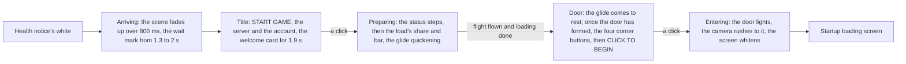

# Login screen

The game opens on its login screen once the health notice has faded. The console's opening shows it at the same place, in the same stages and at the game's own timings.

## How it plays

- **The stages are the game's current build's.** The user's own recording of the Japanese client times them and shows which corner buttons each stage has (the title's notices and exit, the door's settings, repair, notices and exit). A 1080 high English recording of an older build gives the words and every size. The status says "Preparing to download resources", "Checking for updates...", "Loading game..." over the ornament's double diamond, then "Preparing to load data" over the progress bar, which folds into its diamond at 100%.
- **The flight follows loading, and ends 3 seconds after it.** The flight is the screen's own clock for the door, the share of the way to it flown. The share shown runs toward loading's own at no more than one full bar per tenth of a second, so a load that finishes at once still sweeps the bar rather than jumping. While loading, the flight goes the share of the way the English recording's does before its bar is full, about two thirds, no faster than its last stretch's pace, so a fast load glides. Once loading is done it flies whatever is left in 3 seconds, the recording's time from a full bar to the door rising, however long the load before it took. The bar folds into its diamond, the whole status row fades, and the last stretch runs bare before the door rises.
- **A click is the screen's unless it lands on a button.** The screen asks `checkIsNestedInteraction` before it moves on, so a click on a corner button stays the button's.
- **A host can pin a stage.** The stage is a `v-model`, so the parity page and a test hold one still, and the opening leaves it free.
- **The opening says when the door is opened.** `GameOpening` emits `begin` as the screen hands on to the startup loading screen, so its host can act on the door rather than waiting for the world; for now the app's page uses it to hold the white for 3 seconds and play a rickroll in place of the world.

## The scene

Every part's shape, place and stone is fitted from the game's own assets ([derived assets](/docs/genshin/derived-assets)), and whatever the blocks cannot hold is read off the captures and expressed over what they can:

- **The login screen is one arrangement of its meshes.** The blocks lay the towers out more than once; the login screen is its own `LoginScene`, the towers, walkway and door its `MonoLoginScene` spawns into the anchors under `SceneObj`, at its tenth, which is the scene's unit ([derived assets](/docs/genshin/derived-assets)). In the static layout the door's anchor stands far from the walkway; at the flight's end the door stands on the walkway's far end, centred and on its top, as one frame's two poses place it. The arrangement's unit test holds the cross-ratio of the dais over the walkway along the door's foot, which no camera changes.
- **The stone is lit physically, as the game's is.** The game's stone shader is a specular, physically based one that draws no outline, so each family's stone is its materials' own: an albedo, a smoothness, a specular tint and a rim glow along its edges (`createStoneMaterial`), rather than the toon ramp and outline the rest of the world steps its light with. Its programs do not decompile, so its properties are read, not its code.
- **Each part is built from its fit.** Each tower profile is a lathe of its fitted sections, built once per placement at its scale and merged into one geometry, and the bridges and pillars are their hulls' boxes, merged the same way. The walkway is its 23 pieces, each its fitted outline extruded from the walkway's underside to its own top, every piece of every copy an instance of one batch, which rises on its own and is outlined as it stands.
- **The camera holds one pose, and the world glides toward it.** The eye looks straight down the walkway's middle along +z, as ModelCamera turns, at the pose solved on the English recording's door frame, on the walkway's and the door's silhouettes: 1.24 metres over the walkway's top and 10.68 short of the door, pitched 5.3 degrees up under a vertical field of view of 51.2 ([parity](/docs/genshin/parity)). The glide's frames refine to the same height, pitch and field of view from every start along the walkway, so it never moves; what moves is `MonoLoginScene`'s rows, each laid out ahead of its own place and wrapped by its length (`login/scroll.json`): the walkway's three copies 16 metres apart, its own length, the towers' with their bridges three 200 apart, and the cloud sea's billows and low clouds by its two 300 apart.
- **The glide's pace is read off the paving.** At the camera's pose every row of the ground is a distance, so the paving's column resampled into metres and correlated frame to frame is the distance the world moves (`genshin:parity glide`, off the English recording's frames that do not stall): 3.03 metres a second while the title waits, steady to a few hundredths, about 3.7 once the game prepares, gathering or losing speed at 0.55 metres a second each second, the slope of its last three seconds toward the door. At the door it keeps on to the first copy that both stands the door past the walkway's far end and can be stopped on at that rate, then slows to rest exactly there, so the door's copy stands where the pose has it (`advanceLoginGlide`).
- **The door comes to rest with the towers' row 144 metres along its loop.** Every door frame shows the big lantern tower close to the door's right and the colonnade low behind it, wherever the recording idled, and the towers moved as one land on both door references there (`genshin:parity place`), nine of the walkway's copies. A scene mounted at the door stands there, and the title opens about 49 metres short of it, the English recording's glide from the title to the door's rest, on the walkway's phase the dawn frame's first solve stood it at. The wiki's stills stand lower than the glide's pose, so their own is still open.
- **The towers' row stands off where the blocks lay it.** Held at the door frame's pose, the row, its towers, bridges and pillars as one, stands 5 metres lower, 2.47 metres toward -x and 8.94 nearer: lowered, the colonnade behind the door lands on the recording's rows and the lantern tower's window band and gold rings on its own, and the bridge whose deck crosses the glide's path passes under the walkway, as the game's glide passes over it however long the title idles; moved across and nearer, the lantern tower's two edges land on the recording's, solved on them with only those two axes free. Laid where the blocks lay it, the glide drove into that bridge every loop and the lantern tower stood a ring too high and a third too narrow, which a rigid fit with its height held read as the towers moving one by one. A camera solved on the towers behind the door instead traded its own height for the bridges' and stood them higher still.
- **The walkway assembles itself ahead.** The recording's walkway ends a fixed distance ahead however far the world has moved, its far blocks stacked above its surface as they rise into place, as every piece's `MonoBlockController` moves it. Each piece rises from 3 metres down at 17.5 metres ahead, carries 0.45 metres past its place, and settles into it by 13.5, its span staggered by up to 2 metres of its neighbours': the rows where the recording's walkway settles and ends, read by eye, and its far blocks stacked over the surface in steps of about 15 centimetres. A piece past the rise does not stand at all, so neither it nor its shadow shows before its turn.
- **The door's interface waits on the door.** The scene says when its door has risen into place (`doorFormed`), and only then does a click open it and the door's interface come: the four corner buttons 0.3 seconds after, and the prompt's band fading in from 1 second over 0.3, as the English recording's door forms by 12.7 seconds, its buttons show at 13.0 and its prompt at 13.7 to 14.0.
- **The door assembles itself at the walkway's far end.** The title's frames show the walkway running on with no door on it. Once the door is due it rides on the walkway's copy the glide comes to rest on, nothing past it is built, and it rises as it comes within the walkway's far end, as the last blocks settle, the recording's door rising at its walkway's end. Its frame and panel are each the face the game's mesh draws seen from the front, traced and extruded through the part's own depth, so its shouldered, pointed head is the game's. It rises into place from 5 metres below, easing out and settled by 800 ms, sampled from the game's `Ani_LogginScene_Door01_Liftting`. It lights from its middle: a bright line down its panel over a glow across the whole of it, raised over the door's light time.
- **The click rushes the camera to the door.** While the door lights and the screen whitens, the camera closes 41% of its distance to the door in the first third of a second, gathering speed with the square of the time, as the recording's door grows about 1.7 times, and stops short of it under the white.
- **The clouds are the game's painted clouds.** Each of the sky's three emitters, the cloud sea's billows and the middle and top cumulus, is a band of its own atlas's clouds, traced as shapes, each loop drawn as a smooth curve through its edges' midpoints and its edge softened, and drawn as billboards in the sky's cloud colours, so the hour recolours them without repainting, a band one instanced sprite (`createCloudBandSprite`) whose clouds are laid out farthest along the camera's view first before each draw, as three's sort would lay out sprites of their own, so the nearer always blends over the farther however the band scrolls. Each is coloured as the game's cloud particles are: its shade mixed toward its lit colour where its crown is, each blended from away from the sun to toward it, brightening toward the sun and fading out over its soft edge and below the horizon. The middle cumulus stands as a bank along the horizon behind the towers, from about 3 degrees under it to 7 over, where the door recording's golden clouds stand through its camera. The cloud sea's billows scroll past with the world, so none stands where the walkway glides: each clears it to its side or stays under it. The sky itself draws no cloud layer of its own.
- **Each sky's light comes from its sun or its moon, placed where its reference shows it.** A screen point measured off the reference (the dawn's and the dusk's suns just past the left edge a little over the horizon, the night's moon behind the lantern tower) becomes a direction through the login camera (`getScreenDirection`), and the light, the sun and the moon all take it, the other body opposite; the day's sun is off its frame, so its direction is measured from the faces it lights. The dusk's sunlight falls from 60 degrees left of the walkway and 15 up, apart from its glow just past the frame: so it lights the lantern tower's face toward the frame's left, leaves the door's and the near towers' faces dark and casts the dais's shadow aside rather than over the walkway, as the door recording shows, where a light from the glow laid that shadow over the walkway and needed a sky light five times too strong to lift it. The hemisphere's sky colour is the bright cloud colour and its ground the shade, so a face turned up is lit by the sky as the references show under a low sun, and the haze scatters the light toward the sun.
- **Colours are measured on the screen and inverted into the scene.** The sky's, the haze's and the clouds' colours are display colours read off the references, written through the tone mapping's inverse (`toSceneColor`); the lights' strengths are each hour's scaled until its parts stand as bright as its references' over the parts' pixels (`genshin:parity exposure`), but the night's, whose few moonlit parts read brightest to FLIP at their own, and the dusk's, whose sun and sky light are solved apart channel by channel over the door recording's near faces facing up and turned from the sun (`genshin:parity light`, stepped by halves to its fixed point, the tone mapping bending each step).
- **The haze is the cloud sea's.** The haze rises off the cloud sea far under the walkway and thins up past it. It is dense enough 20 metres under the walkway that the towers' feet are white, as the references show, and thin enough at the eye that a tower half a kilometre out is still half seen.
- **The light casts shadows and draws no god rays.** The moon's and the sun's shadows fall across the walkway from a shadow camera over the walkway ahead of the camera. The god rays lit the whole sky in the light's colour, so the login's sky states turn them off.

## Tests

- `Game/Opening/Index.browser.test.ts` plays the whole opening with timers and frames faked, through the login's title, flight and door, and checks every handoff and the finish.
- The walkway and the door have unit tests of their measures: the walkway's pieces span its underside to its surface, each about its own middle, and stand nowhere past its widest, and the door's frame stands round an opening its panel fills, recessed behind the frame's face. `advanceLoginGlide`'s test holds the glide's pace changes to its acceleration, its rest to a whole number of the walkway's copies and the door to first standing past the walkway's far end. The row's test holds the camera's path, and a metre either side of it, open through the towers and the bridges' hulls from end to end. Each fit that builds the data has its own test in `scripts/src/services/genshinAssets`.
- `Login/Interface` is shot in each stage as fixture variants and held to its approved images; its references are the English recording's frames, over which it is compared.

## Key files

| File                                                                            | Role                                                                     |
| :------------------------------------------------------------------------------ | :----------------------------------------------------------------------- |
| `packages/genshin-world/src/components/Login/Screen/Index.vue`                  | The stages, the flight, and the fades out of and into white              |
| `packages/genshin-world/src/components/Login/Interface/Index.vue`               | Each stage's interface, from `genshin-interface`'s pieces                |
| `packages/genshin-world/src/components/Login/Scene/Index.vue`                   | The camera, the glide, the fitted parts, the clouds, the sky, shadows    |
| `packages/genshin-world/src/services/login/constants.ts`                        | The words and the timings                                                |
| `packages/genshin-world/src/services/login/scene/constants.ts`                  | The camera, the glide and its rows, the haze, the light and the shadows  |
| `packages/genshin-world/src/services/login/scene/advanceLoginGlide.ts`          | The glide a frame on, and its rest at the door                           |
| `packages/genshin-world/src/services/login/scene/LoginSkyStateMap.ts`           | Each time of day's colours and light strengths                           |
| `packages/genshin-world/src/services/login/cloud/LoginCloudBandMap.ts`          | Each cloud band's heights, spread and widths                             |
| `packages/genshin-world/src/services/login/tower/createLoginTowersGeometry.ts`  | Every fitted tower, built as a lathe and stood where the game stands it  |
| `packages/genshin-world/src/services/login/hull/createLoginHullsGeometry.ts`    | Every bridge and pillar, its hull's boxes stood where the game stands it |
| `packages/genshin-world/src/services/login/walkway/createLoginWalkwayPieces.ts` | The walkway's pieces, each its fitted outline extruded to its own top    |
| `packages/genshin-world/src/services/login/walkway/readLoginWalkwaySink.ts`     | How far under its place a piece stands as the walkway assembles          |
| `packages/genshin-world/src/services/login/door/createLoginDoorGeometry.ts`     | The door's frame and its panel, each its fitted face extruded            |
| `packages/genshin-world/src/data/login`                                         | Every fitted part                                                        |

## Sources

- [Login Menu](https://genshin-impact.fandom.com/wiki/Login_Menu), Genshin Impact Wiki: the four backgrounds, the hours each is shown at, and the door and platform.
- [GENSHIN IMPACT | CELESTIA DOOR | LOADING SCREEN](https://www.youtube.com/watch?v=rBnfA4pXw6U): the English client's login screen at 1080 high and 60 frames.
