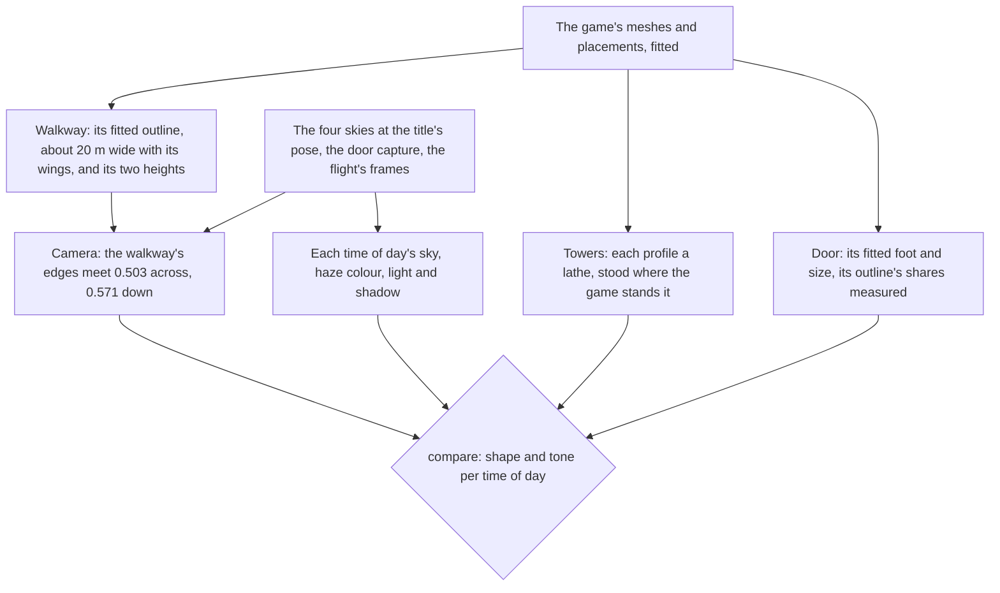

# Login screen

The game opens on its login screen once the health notice has faded. The console's opening shows it at the same place, in the same stages and at the game's own timings.

## How it plays

```mermaid
flowchart LR
  N[Health notice's white] --> A[Arriving: the scene fades up over 800 ms, the wait mark from 1.3 to 2 s]
  A --> T[Title: START GAME, the server and the account, the welcome card for 1.9 s]
  T -->|a click| P[Preparing: the status steps, then the load's share and bar, the camera flying]
  P -->|"flight flown and loading done"| D[Door: CLICK TO BEGIN and the four corner buttons]
  D -->|a click| E[Entering: the door lights over 400 ms, the screen whitens over 620]
  E --> S[Startup loading screen]
```

- **The stages are the game's current build's.** The user's own recording of the Japanese client times them and shows which corner buttons each stage has (the title's notices and exit, the door's settings, repair, notices and exit). A 1080 high English recording of an older build gives the words and every size. The status says "Preparing to download resources", "Checking for updates...", "Loading game..." over the ornament's double diamond, then "Preparing to load data" over the progress bar, which folds into its diamond at 100%.
- **The flight follows loading.** The camera flies down the walkway no further than loading has gone and no faster than its fastest, 8.9 seconds: the English recording's flight, less the two seconds it stalls for. A slow load draws it out, as the 1440 high recording's 17 seconds do. The door waits until both the flight and loading are done.
- **A click is the screen's unless it lands on a button.** The screen asks `checkIsNestedInteraction` before it moves on, so a click on a corner button stays the button's.
- **A host can pin a stage.** The stage is a `v-model`, so the parity page and a test hold one still, and the opening leaves it free.

## The scene

- **The world is the game's, fitted.** The towers, the walkway and the door are measured off the game's own meshes and placements, and only our kits' parameters ship ([derived assets](/docs/genshin/derived-assets)). Each tower profile is a lathe of its fitted sections, built once per placement at its scale and merged into one geometry. The walkway is its fitted outline, wings and all, extruded from its underside to its surface. The door stands at its fitted foot, its plinth, arch, border and recess shares of its fitted size read off the door capture.
- **The camera is re-derived from the walkway, never guessed.** A MonoBehaviour exports without its fields, so the camera's path is measured from the references, which share one pose. The walkway's two edges meet 0.503 across and 0.571 down the frame, so the camera looks straight down it pitched 3.37 degrees down. The walkway's fitted width, about 10 metres to either side of its middle, fills 0.42 of the frame's foot, which puts the eye 0.76 of that width over its surface at the game's 45-degree vertical field of view. The camera starts beyond the walkway's end, where the first wings' near edge meets the frame 0.807 down, and flies along +z until the door's foot meets it 0.722 down.
- **The haze is the cloud sea's, and brighter than the sky's horizon.** The haze rises off the cloud sea far under the walkway and thins up past it. It is dense enough 20 metres under the walkway that the towers' feet are white, as the references show, and thin enough at the eye that a tower half a kilometre out is still half seen. Its colour is each reference's own, sampled low in the frame (the engine's `fogColor`), since the horizon's colour is far darker than the lit haze.
- **The light casts shadows and draws no god rays.** The moon's and the sun's shadows fall across the walkway from a shadow camera that follows the flight. The god rays, which march that shadow, lit the whole sky in the light's colour, so the login's sky states turn them off.
- **The door lights from its middle.** Its panel's emission is a bright line down its middle over a glow across the whole panel, raised over the door's light time, which the bloom then spreads.

## Tests

- `Game/Opening/Index.browser.test.ts` plays the whole opening with timers and frames faked, through the login's title, flight and door, and checks every handoff and the finish.
- The walkway and the door have unit tests of their measures: the walkway spans its fitted outline from its underside to its surface and stands nowhere past its widest, and the door stands on its plinth with its panel recessed.
- `Login/Interface` is shot in each stage as fixture variants and held to its approved images; its references are the English recording's frames, over which it is compared.

## Key files

| File                                                                              | Role                                                                    |
| :-------------------------------------------------------------------------------- | :---------------------------------------------------------------------- |
| `packages/genshin-world/src/components/Login/Screen/Index.vue`                    | The stages, the flight, and the fades out of and into white             |
| `packages/genshin-world/src/components/Login/Interface/Index.vue`                 | Each stage's interface, from `genshin-ui`'s pieces                      |
| `packages/genshin-world/src/components/Login/Scene/Index.vue`                     | The camera, towers, walkway, door, cloud sea, sky and shadows           |
| `packages/genshin-world/src/services/login/constants.ts`                          | The words and the timings                                               |
| `packages/genshin-world/src/services/login/scene/constants.ts`                    | The camera, the flight, the haze, the light and the shadows             |
| `packages/genshin-world/src/services/login/scene/LoginSkyStateMap.ts`             | Each time of day's sky, haze and light                                  |
| `packages/genshin-world/src/services/login/tower/createLoginTowersGeometry.ts`    | Every fitted tower, built as a lathe and stood where the game stands it |
| `packages/genshin-world/src/services/login/walkway/createLoginWalkwayGeometry.ts` | The walkway, its fitted outline extruded between its two heights        |
| `packages/genshin-world/src/services/login/door/createLoginDoorGeometry.ts`       | The door's frame and its panel                                          |
| `packages/genshin-world/src/data/login`                                           | The fitted towers, walkway and door the scene reads                     |

## Sources

- [Login Menu](https://genshin-impact.fandom.com/wiki/Login_Menu), Genshin Impact Wiki: the four backgrounds, the hours each is shown at, and the door and platform.
- [GENSHIN IMPACT | CELESTIA DOOR | LOADING SCREEN](https://www.youtube.com/watch?v=rBnfA4pXw6U): the English client's login screen at 1080 high and 60 frames.
