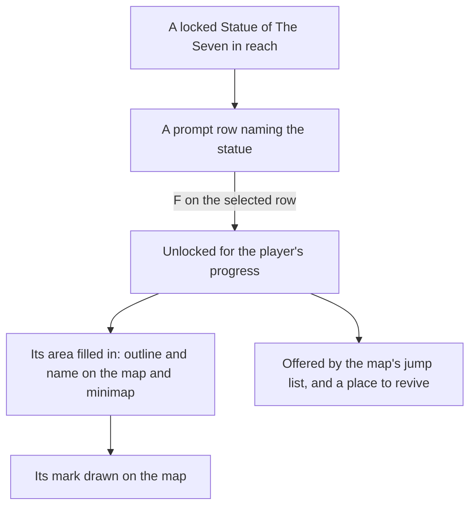

# Map unlocking

In the game the map is blank until a statue fills in its area, and a place is a jump only once it is unlocked. Here a Statue of The Seven is unlocked by resonating with it on F, and until then its area is blank on the map and the minimap and the statue is not offered as a jump. This page is what is built of [map unlocking](/docs/proposals/genshin/map-unlocking); Teleport Waypoints and domain entrances are not yet in the world's data, so they are not unlocked here.

## How it works

- **Resonating is an interaction.** A locked jump landmark is an `Activate` row of the prompt list while it is in reach, named by its statue's game name. F on the selected row unlocks it, and an unlocked statue has no row. The row's icon is the interaction kind's, so the list shows what acting on it does without a verb of its own: no text id for the game's resonating prompt is in the text dump under a known key.
- **Nothing is unlocked at the start.** A new player has unlocked no statue, so the map is blank and no jump is offered. The wiki says the first activation lights the statue's surrounding area and reveals its nearby waypoints, and that whether Windrise's statue is already active depends on the player's progress through the opening quest, so an unlock here is the player's own F until quest steps unlock them.
- **Kept with the player's progress, as the bag and the wallet are.** The unlocked ids are a slice of the [save](/docs/genshin/save-data), so they last across a reload.
- **An area is filled while a landmark in it is unlocked.** `computeFilledAreaIds` gives the areas unlocked landmarks stand in. The map's drawing outlines only filled areas, `computeAreaLabels` names only filled areas, and the marks drawn are the unlocked landmarks alone, so the minimap shows the same.
- **Only unlocked places are jumps.** The jump list, the map's marks and the minimap receive the unlocked landmarks, and a party that falls is jumped to the unlocked landmark nearest its body. With none unlocked it is left where it fell.
- **A first unlock pays its point's Primogems.** `pnpm -C scripts genshin:assets trans-points` builds the open world's transport point rewards and publishes them as `transPoints/scene3`, each point's Adventure EXP and Primogems joined from its reward row. Windrise's statue is the one statue the world holds with its point (point 4, in `LandmarkIdStatuePointIdMap`), so its first unlock adds five Primogems to the wallet, once, since only a locked landmark is offered to resonate with. Its fifty Adventure EXP wait on the Adventure EXP the adventure rank keeps, which no screen holds yet.

## Key files

| File                                                                               | Role                                                                        |
| :--------------------------------------------------------------------------------- | :-------------------------------------------------------------------------- |
| `packages/genshin-world/src/services/map/computeFilledAreaIds.ts`                  | The areas that unlocked landmarks stand in, which are the filled ones       |
| `packages/genshin-world/src/services/map/computeAreaLabels.ts`                     | Names only the filled areas, at their outline or their unlocked landmarks   |
| `packages/genshin-world/src/components/Map/Drawing/Index.vue`                      | Draws the outlines of filled areas and the marks of the unlocked landmarks  |
| `packages/genshin-world/src/components/World/Session/Index.vue`                    | Holds the unlocked ids, offers the locked statues as rows, and unlocks on F |
| `packages/genshin-world/src/composables/useJumpLandmarks.ts`                       | Every region's jump landmarks, read once, before the unlocked ones are kept |
| `scripts/src/services/genshinAssets/transPoints/buildTransPointRewards.ts`         | Builds the open world's transport point rewards, for publishing             |
| `packages/genshin-world/src/generated/transPoints/scene3.json`                     | The written slice, imported on demand                                       |
| `packages/genshin-world/src/services/transPoint/readOpenWorldTransPointRewards.ts` | Loads the slice, checking it against its shape as it arrives                |

## Notes

- **The unlock is not yet animated.** The game's resonating light and the time it holds the player are measured off a recording the user records ([roadmap](/docs/genshin/roadmap), recordings owed), so the unlock is instant here.
- **Waypoints wait on exploring.** Teleport Waypoints are not landmarks of the region data until [exploring](/docs/proposals/genshin/exploring) fits them, so no waypoint is unlocked, rewarded or pointed to yet. The slice already holds every open-world point's reward, so a waypoint needs only its point id to be matched.

## Sources

- [Galesong Hill](https://www.icy-veins.com/genshin-impact/galesong-hill), Icy Veins: the first activation of a Statue of The Seven lights the surrounding area and reveals the nearby teleport waypoints.
- [Let the Wind Lead](https://www.powerpyx.com/genshin-impact-let-the-wind-lead-walkthrough), PowerPyx: whether the Windrise statue is already active depends on the player's progress.
- [AnimeGameData](https://github.com/DimbreathBot/AnimeGameData), the community's per-patch dump: `TransPointRewardConfigData`, each transport point's reward, and `RewardExcelConfigData`, the Adventure EXP and Primogems each reward pays.
