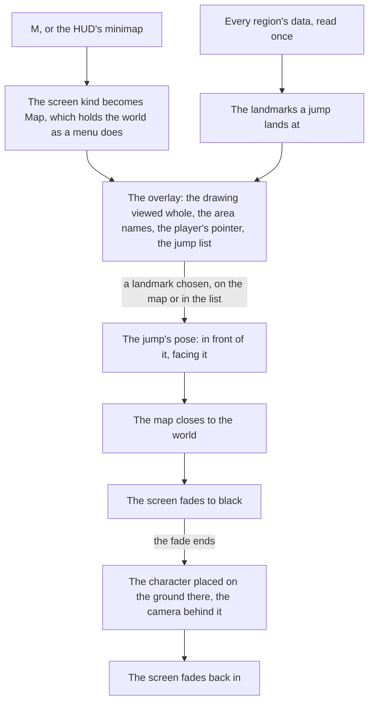

# Map

The game's map opens on M and is how a player crosses the continent: they choose a Teleport Waypoint or a Statue of The Seven and arrive there. The world's map is built the same way. It draws the [world map](/docs/genshin/world-map)'s catalogue rather than any of the game's imagery, and a jump lands the [character](/docs/genshin/character-controller) in front of the landmark chosen.

## How it works

- **One drawing, two views.** `Map/Drawing` draws the catalogue's drawn area outlines and every landmark a jump lands at, in world metres with x east and z south, so north is up. The overlay views it whole and the [minimap](/docs/genshin/minimap) cuts it to a circle round the camera, so the two never disagree about what the world holds. A mark's radius is a share of the extent a view shows, so it is drawn one size at any scale.
- **The overlay shows everything it draws.** It fits a square round the drawn outlines, the landmarks and the player, never closer in than the minimap shows, with a margin round it. Each area's name sits at the middle of its outline, or of its landmarks where its outline is not drawn yet, and an area with neither has no name on the map.
- **The map is a screen.** It is the `Map` screen kind, opened by M through the input's `OpenMap` action ([controls](/docs/genshin/controls)) and closed by M, Escape or its own button, as every screen opens and closes ([screens](/docs/genshin/screens)). It holds the world under it as the game's menus do, and the HUD is hidden while it is open.
- **The jump list is the map for the keyboard and a screen reader.** Beside the map, it lists every landmark a jump lands at under its region's name, each a button carrying its area's name and its kind in the game's own words. The drawing itself is hidden from a screen reader, since the list says everything it shows. Focus starts on the overlay's close button.
- **Every region, not only those in reach.** The map shows the whole continent, so `useJumpLandmarks` reads every region's data once, through the same `readRegionData` the world's reach uses, and keeps the landmarks whose kind a jump lands at. A region that fails is logged and left off the map.

## The jump

- **The landmarks a jump lands at.** `JUMP_LANDMARK_KINDS` holds the Statue of The Seven alone today, as the game teleports to its statues and waypoints and nowhere else; a tree is never a jump. Teleport Waypoints join as a landmark kind of their own once the regions' data holds them.
- **A landmark's name is its area's.** Each statue lights one area, so its area's catalogue name is the name a jump goes by, with no name of its own written anywhere.
- **The pose lands in front, facing back.** `computeJumpPose` stands the arrival a fixed distance in front of the landmark, along the way it faces, at a yaw that looks back at it, so the view arrives on what was jumped to, clear of a statue's plinth. The body stands on the ground's height there, read when the jump lands.
- **The world screen jumps.** `WorldScreen` exposes `jumpTo(pose)` and `readCameraPosition()` to its host. A jump closes the map, fades a black veil over the screen, and once the fade ends asks `WorldCharacter` to `place` the body at the pose, facing its yaw with the [follow camera](/docs/genshin/follow-camera) level behind it, then fades back in.

## Key files

| File                                                              | Role                                                                     |
| :---------------------------------------------------------------- | :----------------------------------------------------------------------- |
| `packages/genshin-world/src/components/Map/Drawing/Index.vue`     | The one drawing of the catalogue, which both views draw                  |
| `packages/genshin-world/src/components/Map/Overlay/Index.vue`     | The map on M: the drawing viewed whole, the names, the pointer, the list |
| `packages/genshin-world/src/components/Map/JumpList/Index.vue`    | Every jump, grouped by region, as buttons                                |
| `packages/genshin-world/src/components/Map/Pointer/Index.vue`     | The player on the map, pointing the way the view faces                   |
| `packages/genshin-world/src/composables/useJumpLandmarks.ts`      | Every region's landmarks a jump lands at, read once                      |
| `packages/genshin-world/src/services/map/computeJumpPose.ts`      | Where a jump to a landmark lands, and which way it faces                 |
| `packages/genshin-world/src/services/map/computeAreaLabels.ts`    | Where each area's name is written                                        |
| `packages/genshin-world/src/services/map/constants.ts`            | The kinds a jump lands at, the arrival's distance, the marks' sizes      |
| `packages/genshin-world/src/components/World/Screen/Index.vue`    | Opens the map, fades and places on a jump, and exposes both to its host  |
| `packages/genshin-world/src/components/World/Character/Index.vue` | Places the body at a pose, the follow camera level behind it             |

## Notes

- **Its looks are provisional.** The map's colours, the marks, the pointer, the list's look and the fade's durations are each marked provisional in their file, until the map's and the teleport's recordings are measured ([roadmap](/docs/genshin/roadmap)).
- **The arrival is a fixed distance until the game's own arrival points are read.** The game sets a transport point for every statue and waypoint, which the text dump's scene points hold under obfuscated field names; until they are named and fitted, a jump lands a provisional distance in front of the landmark.
- **The fade does not wait on the ground.** A jump far from where the camera stood fades back in as soon as it is placed, and the terrain streams in round it as it does after any flight.

## Sources

- [Teleport Waypoint](https://genshin-impact.fandom.com/wiki/Teleport_Waypoint), Genshin Impact Wiki: fast travel by selecting a waypoint on the map, statues acting as waypoints too.
- [Map](https://genshin-impact.fandom.com/wiki/Map), Genshin Impact Wiki: the map on M, and teleporting from it.
- [Game accessibility guidelines](https://gameaccessibilityguidelines.com/full-list/): menus reachable without the play itself.
