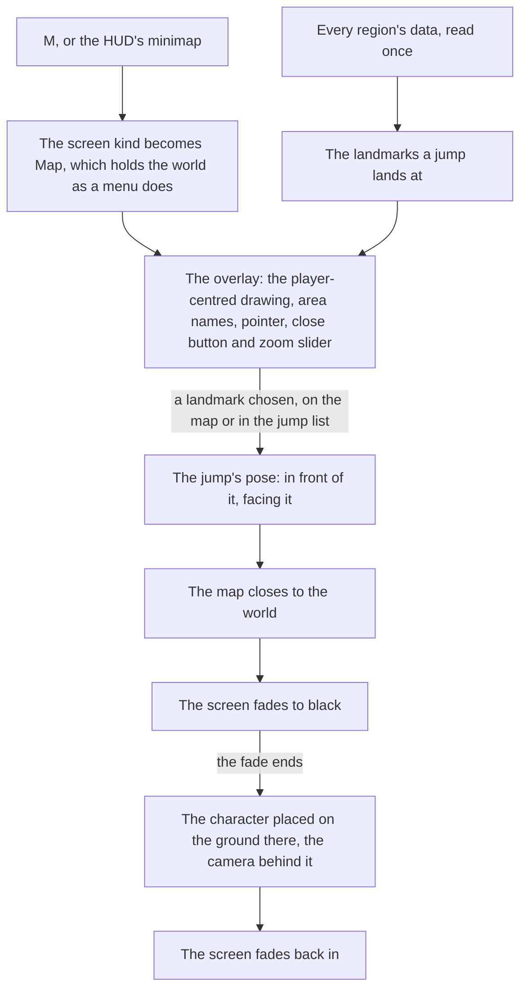

# Map

The game's map opens on M and is how a player crosses the continent: they choose a Teleport Waypoint or a Statue of The Seven and arrive there. The world's map is built the same way. It draws the [world map](/docs/genshin/world-map)'s catalogue rather than any of the game's imagery, and a jump lands the [character](/docs/genshin/character-controller) in front of the landmark chosen.

## How it works

- **One drawing, two views.** `Map/Drawing` draws the outlines of the filled areas and every unlocked landmark a jump lands at ([map unlocking](/docs/genshin/map-unlocking)), in world metres with x east and z south, so north is up. The overlay centres it on the player and the [minimap](/docs/genshin/minimap) cuts it to a circle round the camera, so the two never disagree about what the world holds. A mark's radius is a share of the extent a view shows, so it is drawn one size at any scale.
- **The overlay is the open map at full screen.** It centres the drawing on the player with `MAP_VIEW_METRES` metres across its width, and the screen's own aspect fills the rest. Each filled area's name sits at the middle of its outline, or of its unlocked landmarks where its outline is not drawn yet, and an area with neither has no name on the map; an area no unlocked statue stands in is blank. The name's size is a share of the same extent, so it reads one size at any scale.
- **The game's chrome sits where the reference puts it.** The close button stands at the top right and the zoom slider down the left, each at its place in the wiki's 1080 high screenshot and drawn in `--unit`. The slider is drawn at its default and does not zoom yet.
- **The map is a screen.** It is the `Map` screen kind, opened by M through the input's `OpenMap` action ([controls](/docs/genshin/controls)) and closed by M, Escape or its own button, as every screen opens and closes ([screens](/docs/genshin/screens)). It holds the world under it as the game's menus do, and the HUD is hidden while it is open.
- **The jump list is for the keyboard and a screen reader.** The game shows no list, so the jumps are a visually hidden list beside the map, each landmark a button carrying its area's name and its kind in the game's own words, grouped under its region's name. The drawing itself is hidden from a screen reader, since the list says everything it jumps to. Focus starts on the overlay's close button.
- **Every region, not only those in reach.** The map shows the whole continent, so `useJumpLandmarks` reads every region's data once, through the same `readRegionData` the world's reach uses, and keeps the landmarks whose kind a jump lands at. A region that fails is logged and left off the map.

## The jump

- **The landmarks a jump lands at.** `JUMP_LANDMARK_KINDS` holds the Statue of The Seven alone today, as the game teleports to its statues and waypoints and nowhere else; a tree is never a jump. Only the unlocked ones are offered, as the world's jump list, the map and a revive are given the unlocked landmarks alone ([map unlocking](/docs/genshin/map-unlocking)). Teleport Waypoints join as a landmark kind of their own once the regions' data holds them.
- **A landmark's name is its area's.** Each statue lights one area, so its area's catalogue name is the name a jump goes by, with no name of its own written anywhere.
- **The pose lands in front, facing back.** `computeJumpPose` stands the arrival a fixed distance in front of the landmark, along the way it faces, at a yaw that looks back at it, so the view arrives on what was jumped to, clear of a statue's plinth. The body stands on the ground's height there, read when the jump lands.
- **The world screen jumps.** `WorldScreen` exposes `jumpTo(pose)` and `readCameraPosition()` to its host. A jump closes the map, fades a black veil over the screen, and once the fade ends asks `WorldCharacter` to `place` the body at the pose, facing its yaw with the [follow camera](/docs/genshin/follow-camera) level behind it, then fades back in.

## Parity

The overlay is scored whole-frame against `map-overlay-jueyun`, the English client's map on M over Jueyun Karst at 1920 by 1080: a mean difference of 31.37% and a FLIP of 0.7918, as the overlay stands. Most of that is terrain: the game paints its map as art, which is not drawn, so the frame's score is the painted map's. The bar is set on the interface layer alone, the area names, the pointer, the close button and the zoom slider, with the terrain masked. `compare` scores one region per reference and cannot mask a terrain yet, so that score is not quoted.

## Key files

| File                                                                 | Role                                                                                                                                              |
| :------------------------------------------------------------------- | :------------------------------------------------------------------------------------------------------------------------------------------------ |
| `packages/genshin-world/src/components/Map/Drawing/Index.vue`        | The one drawing of the catalogue, which both views draw                                                                                           |
| `packages/genshin-world/src/components/Map/Overlay/Index.vue`        | The map on M: the drawing centred on the player, the names, the pointer, the close and zoom chrome, and the Original Resin counter on the top bar |
| `packages/genshin-world/src/components/Map/Overlay/Index.fixture.ts` | The state the parity page shoots, the player in the Sea of Clouds                                                                                 |
| `packages/genshin-world/src/components/Map/JumpList/Index.vue`       | Every jump, grouped by region, as buttons, visually hidden on the overlay                                                                         |
| `packages/genshin-world/src/components/Map/Pointer/Index.vue`        | The player on the map: a disc with a cap pointing the way the view faces                                                                          |
| `packages/genshin-world/src/composables/useJumpLandmarks.ts`         | Every region's landmarks a jump lands at, read once                                                                                               |
| `packages/genshin-world/src/services/map/computeJumpPose.ts`         | Where a jump to a landmark lands, and which way it faces                                                                                          |
| `packages/genshin-world/src/services/map/computeAreaLabels.ts`       | Where each area's name is written                                                                                                                 |
| `packages/genshin-world/src/services/map/constants.ts`               | The kinds a jump lands at, the arrival's distance, the view's metres, the marks' and names' sizes                                                 |
| `packages/genshin-world/src/components/World/Screen/Index.vue`       | Opens the map, fades and places on a jump, and exposes both to its host                                                                           |
| `packages/genshin-world/src/components/World/Character/Index.vue`    | Places the body at a pose, the follow camera level behind it                                                                                      |

## Notes

- **Its looks are provisional.** The map's colours, the marks, the pointer, the list's look and the fade's durations are each marked provisional in their file, until the map's and the teleport's recordings are measured ([roadmap](/docs/genshin/roadmap)).
- **The map's terrain is not drawn.** The game paints its map as art, and that art is kept out of the repository, so the overlay draws only the catalogue's outlines, which are provisional squares for most areas. Against the wiki's full-screen screenshot of Jueyun Karst (`map-overlay-jueyun`), the overlay scores 31.37% mean difference and a FLIP of 0.7920; the terrain and the squares are the difference, while the chrome and the names are placed from the reference's own pixels.
- **Not built yet.** The zoom slider does not zoom and the map does not pan ([exploring](/docs/proposals/genshin/exploring)). The region tag at the bottom right, its exploration progress, the UID line and the domains-only toggle are missing: their words are not in the text dump, so they wait on their text ids rather than being typed by hand. The top bar's floor counter belongs to a feature not yet built, and its resin counter is [Original Resin](/docs/genshin/original-resin)'s, placed provisionally until its recording lands. No reference for the teleport panel has been found, so it is not drawn ([roadmap](/docs/genshin/roadmap)).
- **The jump list is hidden, not removed.** It is kept for the keyboard and a screen reader and is not drawn, because the reference shows no list. Whether it should be shown beside the map is a call for the user.
- **The pointer is shared with the minimap.** Both draw `Map/Pointer`, so the minimap's centre pointer takes the same disc and cap.
- **The arrival is a fixed distance until the game's own arrival points are read.** The game sets a transport point for every statue and waypoint, which the text dump's scene points hold under obfuscated field names; until they are named and fitted, a jump lands a provisional distance in front of the landmark.
- **The fade does not wait on the ground.** A jump far from where the camera stood fades back in as soon as it is placed, and the terrain streams in round it as it does after any flight.

## Sources

- [Teleport Waypoint](https://genshin-impact.fandom.com/wiki/Teleport_Waypoint), Genshin Impact Wiki: fast travel by selecting a waypoint on the map, statues acting as waypoints too.
- [Map](https://genshin-impact.fandom.com/wiki/Map), Genshin Impact Wiki: the map on M, and teleporting from it.
- [Map Stardust in Jueyun](https://genshin-impact.fandom.com/wiki/File:Map_Stardust_in_Jueyun.png), Genshin Impact Wiki: the full-screen map at 1080 high, the reference the chrome and the names are placed against.
- [Game accessibility guidelines](https://gameaccessibilityguidelines.com/full-list/): menus reachable without the play itself.
