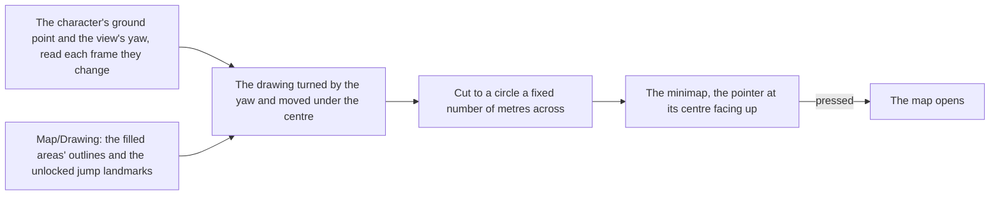

# Minimap

In the world, the game keeps a small round map in the top left of its heads-up display, so they know where they stand without opening the full [map](/docs/genshin/map). The world's minimap is that map's own drawing, viewed close round the character.

## How it works

- **The map's drawing, not a second one.** `Hud/Minimap` draws `Map/Drawing` with the unlocked landmarks the map holds, so a landmark the map gains, or an area a statue fills in, appears on the minimap with no change of its own ([map unlocking](/docs/genshin/map-unlocking)).
- **It turns with the view.** The drawing is moved so the character's ground point sits at the centre and turned by the camera's yaw, so the way the view faces is always up, and the pointer at the centre never turns. The circle shows `MINIMAP_RADIUS` metres each way.
- **Read once a frame, handed on when it moves.** The world screen reads the character's body's ground point in world metres and the camera's yaw once a frame, and hands the HUD a new reading only when one of them moved, so a still player re-renders nothing.
- **One button.** The minimap is a button named for the map in the game's words; pressing it opens the map, as M does. The drawing inside it is hidden from a screen reader and takes no pointer of its own.

## Key files

| File                                                            | Role                                                                  |
| :-------------------------------------------------------------- | :-------------------------------------------------------------------- |
| `packages/genshin-world/src/components/Hud/Minimap/Index.vue`   | The drawing cut to a circle round the character, turned with the view |
| `packages/genshin-world/src/components/Map/Drawing/Index.vue`   | The one drawing it shares with the map                                |
| `packages/genshin-world/src/components/Map/Pointer/Index.vue`   | The pointer at its centre                                             |
| `packages/genshin-world/src/services/map/constants.ts`          | The metres it shows, and the marks' share of them                     |
| `packages/genshin-world/src/components/World/Session/Index.vue` | Reads the character's ground point and the view's yaw for it          |

## Notes

- **Its look is provisional.** Its size, rim, the metres it shows, its icons and whether its rim carries a north mark are measured off a recording of the English PC client's world HUD, which is not yet found ([roadmap](/docs/genshin/roadmap)); until then each is marked provisional in its file.

## Sources

- [Map](https://genshin-impact.fandom.com/wiki/Map), Genshin Impact Wiki: the minimap in the top left of the HUD, opening the map.
