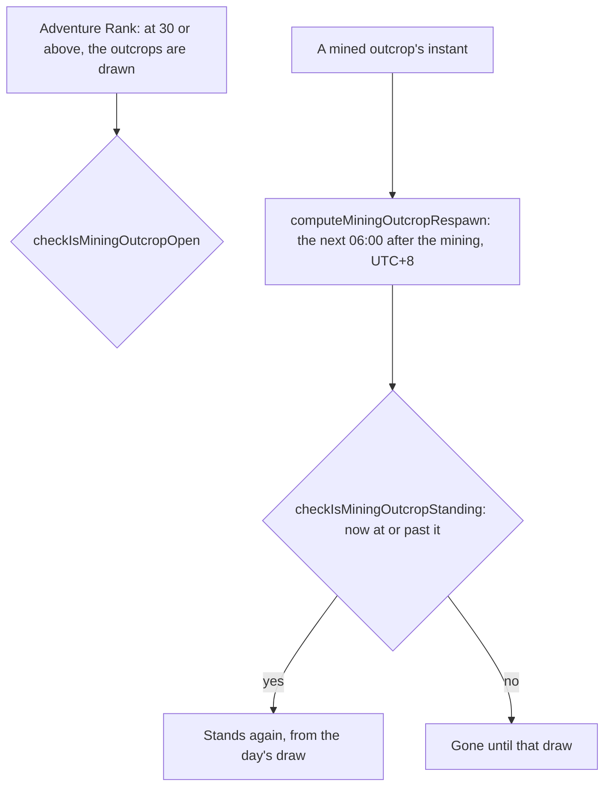

# Mining outcrops

The rules a region's mining outcrops follow, the Magical Crystal Chunks a player mines for: the Adventure Rank that opens them, and when a mined one comes back. A mining outcrop is drawn each day at 06:00 in the game's time zone, two hours after the daily reset, and a mined one stays gone until the day's next draw. Nothing places them in the world yet, so none is drawn, mined or marked, and the [proposal](/docs/proposals/genshin/gathering) keeps the places and the draw.

## How it works

## Rules

- **Opened at Adventure Rank 30.** `checkIsMiningOutcropOpen` compares the rank with the constant. The rank only opens the outcrops; Reputation's mining outcrop search, at level 2 of a nation, is what marks them.
- **A mined outcrop comes back at the next draw.** The respawn is the first 06:00 strictly after the mining, read in the game's time zone, UTC+8. A mining before a day's draw is back at that draw, and one at or after it at the next day's.
- **Standing once the respawn has come.** One never mined stands. A mined one stands from its respawn, and gone before it. The day's unmined outcrops are gone with the next day's draw, which the draw itself owns once it is built.

## Key files

| File                                                                          | Role                                                    |
| :---------------------------------------------------------------------------- | :------------------------------------------------------ |
| `packages/genshin-world/src/services/leyLine/constants.ts`                    | The opening rank and the 06:00 refresh time             |
| `packages/genshin-world/src/services/leyLine/checkIsMiningOutcropOpen.ts`     | Whether the outcrops are drawn at a rank                |
| `packages/genshin-world/src/services/leyLine/computeMiningOutcropRespawn.ts`  | The next 06:00 after a mining, in the game's time zone  |
| `packages/genshin-world/src/services/leyLine/checkIsMiningOutcropStanding.ts` | Whether a mined or unmined outcrop stands at an instant |

## Notes

- **The respawn is the wiki's, not measured.** The 06:00 draw is the wiki's figure, read in UTC+8 as the [Original Resin](/docs/genshin/original-resin) page reads the game's time zone. A recording of a mined outcrop coming back would confirm it.

## Sources

- [Mining Outcrop](https://genshin-impact.fandom.com/wiki/Mining_Outcrop), Genshin Impact Wiki: Magical Crystal Chunks from rank 30, and the respawn at 06:00, two hours after the reset.
- [Daily Reset](https://genshin-impact.fandom.com/wiki/Daily_Reset), Genshin Impact Wiki: what comes back at the daily reset and around it.
