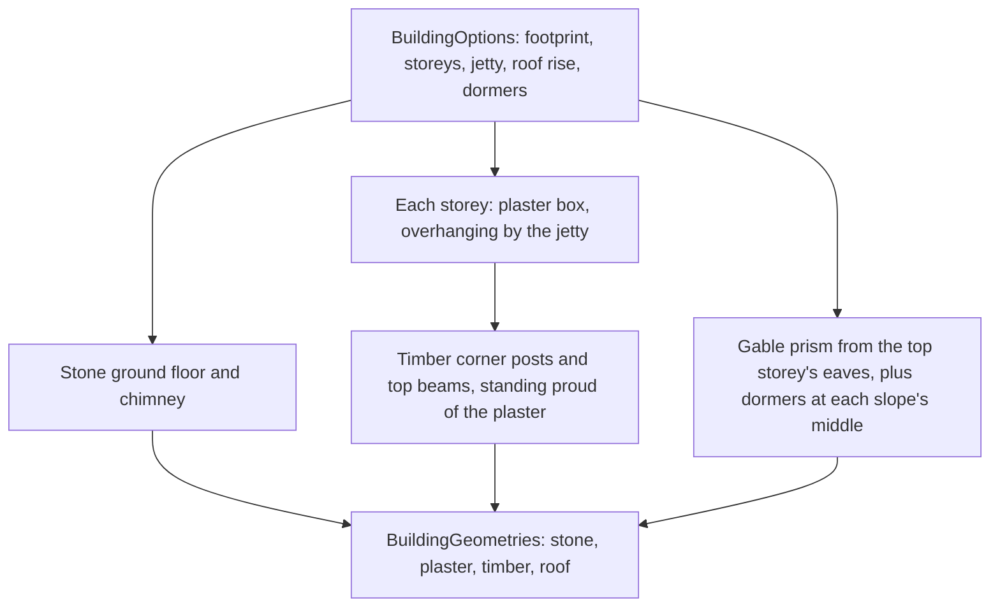

# Mondstadt buildings

A Mondstadt house is generated from its parameters by `createBuildingGeometries`, one of the engine's [kits](/docs/genshin/engine-architecture). It returns one merged geometry per material, so a building is one draw for each of its four materials. Nothing is read from the game: every part is a box or an extruded gable, placed by the parameters alone.

## Parameters

- **Footprint.** The width runs along the gable walls and the depth along the front and back walls, in metres.
- **Ground floor.** A stone box of the given height, the footprint's full size.
- **Storeys.** Each storey is a plaster box. The front and back walls of each storey extend the jetty beyond the storey beneath it, so the overhang accumulates by one jetty per storey. The gable walls do not overhang.
- **Timber frame.** Each storey has a timber post at each corner and a beam along the top of each wall. A timber member's outer face stands a few centimetres proud of the plaster so it reads as a frame.
- **Roof.** A gable whose ridge runs along the width, with eaves overhanging the top storey by a fixed amount. Its rise is a parameter.
- **Dormers.** A count per slope, spaced evenly along the width and set at each slope's middle, with their bases sunk slightly into the roof.
- **Chimney.** A stone column a quarter of the way along the width, rising past the ridge.

## Key files

| File                                                                     | Role                                                                    |
| :----------------------------------------------------------------------- | :---------------------------------------------------------------------- |
| `packages/genshin-engine/src/kits/mondstadt/createBuildingGeometries.ts` | The house from its parameters: four materials, one geometry each        |
| `packages/genshin-engine/src/kits/mondstadt/constants.ts`                | The eave, timber, dormer and chimney dimensions                         |
| `packages/genshin-engine/src/models/kits/mondstadt/BuildingOptions.ts`   | The parameters a house takes                                            |
| `packages/genshin-engine/src/models/kits/mondstadt/BuildingGeometries.ts` | The four geometries a house returns, one per material                 |
| `packages/genshin-engine/src/kits/mergeGeometryParts.ts`                 | Merges each material's parts into its one geometry                      |

Not built yet: the house's dressing (window boxes, shutters, lanterns and banners), the windmill, and the city wall, gate bridge and cathedral. The windmill, the walls and the cathedral are landmark-tier pieces that need their reference poses.
