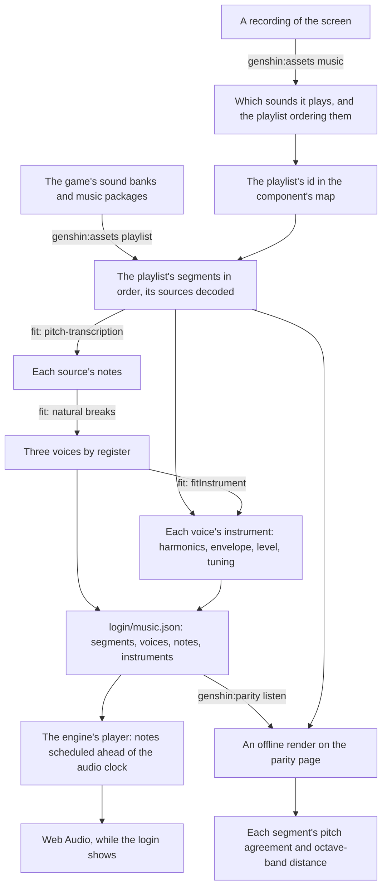

# Music

The login plays its music, and so does ours. The game's audio is a reference, read locally from the installed game and never shipped. What ships is ours: the playlist's structure, the notes, each voice's measured instrument, and a synthesizer that plays them. The login came first, and every step is a command or a fit any other piece of the game's music goes through the same way.

## How it works

- **The structure is exact.** The login's playlist is a continuous sequence that loops forever: a first piece of 104 seconds, a silent segment of about ten seconds, a second piece of 92.75 seconds (its source's last 2.25 seconds trimmed), and the rest again. Every length, trim and the order come from the sound banks (`genshin:assets playlist`), so the handoffs land where the game's do. A recording only found which playlist it is.
- **The notes are transcribed from the game's own sound.** [pitch-transcription](/docs/pitch-transcription) hears each decoded source at its defaults: about a thousand notes in the first piece and about six hundred in the second. Its readings are cached beside the source, so a second fit takes seconds. Bends are not carried. The model's contours read most frames a bin off the note's own, yet the fundamentals' peaks in the decoded sound sit within about a tenth of a semitone of their pitches, so the contours are not the music's tuning. That small offset is each voice's measured `tuning`, and the notes stay on whole pitches.
- **Voices by register.** Each source's notes split into three registers at Fisher's natural breaks over their pitches, the exact least-spread split, so a new piece needs no hand-set pitches. Telling two instruments apart within one register waits until the listening score ranks it the largest loss.
- **Every instrument is measured.** A voice's instrument is read from the decoded sound at its own notes, wherever every other sounding note's harmonics leave a partial clear (`fitInstrument`):
  - each overtone's amplitude over the fundamental's at the peak, to the eighth harmonic and below 8 kHz;
  - the attack, from the note's start to that peak;
  - the decay's time constant and the level it settles to, a least-squares fit over each clear note;
  - the release's time constant after the note ends, over each note nothing sounds over as it fades;
  - the fundamental's level for a note of full velocity;
  - the tuning against A440.

  Each is the median over the voice's clear notes, so the few a transcription misread, or another instrument covers, move none of them. A note whose peak sits under the noise of the voice's loudest is not measured at all. A window reads a peak low when a fast decay follows it, so the level is divided by the share of the peak the fitted envelope says a window catches. An overtone with too few clear readings is left silent rather than guessed. The fit prints every value with how many notes it came from and its residual.

- **Our own synthesizer, in the engine.** `genshin-engine`'s audio module plays each note as an oscillator over its instrument's harmonics, through a gain following its envelope. The envelope's value at the note's end is worked out rather than held with `cancelAndHoldAtTime`, which Firefox lacks. `createMusicPlayer` schedules the notes due in the next two seconds every half second and loops the playlist. `renderMusicSegment` renders one segment offline through the same notes. The login's score and instruments are the world package's data (`login/music.json`).
- **It starts with the page's first gesture.** `LoginMusic` renders nothing. It starts the player as the login screen mounts and stops it when the screen goes. A browser holds sound until the page has had a click or a key, so on a page that has had neither the music waits for the first pointer press or key press anywhere on the window — on the title, usually its own click — and starts there from its beginning.
- **Measured by a listening score, approved by ear.** `genshin:parity listen` renders each segment offline on the parity page, through the screen that plays it, and scores it against the game's decoded segment. The pitch agreement is the mean dot product of the two's pitch classes over the game's audible frames, 1 when every frame names the same notes in the same balance. The distance is each octave band's mean level gap in decibels, from 63 Hz to 8 kHz, which charges timbre and loudness alike. The report is committed as `ParityMusicScores.snapshot.md`. The first score agrees on pitch about four frames in five or better in both pieces. The bands sit about ten decibels off on average, closest in the middle octaves and furthest in the top two. The session cannot hear, so the numbers say what changed and the user's ears say whether it sounds right.

## Recreating another piece

The order, and the rules each step keeps, are the `genshin-parity` skill's `references/music.md`:

1. Find the sound with `genshin:assets music <recording>` over a recording of the screen.
2. Name its playlist in the component's map (`musicPlaylistId`).
3. Export it with `genshin:assets playlist <component>`.
4. Fit it through the component's fit, after `fitLoginMusic`.
5. Play it from a component that renders nothing, after `Login/Music`, with an `isMotionOnly` fixture.
6. Score it with `listen`.
7. The user listens.

## Not yet

- **The passes the score orders.** The largest loss is the top octaves. What fills them is the next pass: the reverb the game's mix is heard in, or overtones above the eighth harmonic. After it come instruments told apart within a register, and the dynamics within a note that the median envelope flattens. Each is taken when `listen` ranks it the largest loss ([roadmap](/docs/genshin/roadmap)).
- **Sound effects.** The door's opening, the clicks and the wind are sounds rather than music, and each is a page of its own when its turn comes.

## Key files

| File                                                               | Role                                                            |
| :----------------------------------------------------------------- | :-------------------------------------------------------------- |
| `scripts/src/services/genshinAssets/extractComponentPlaylist.ts`   | A component's playlist resolved from the banks, sources decoded |
| `scripts/src/services/genshinAssets/fitLoginMusic.ts`              | The login's notes, voices and instruments                       |
| `scripts/src/services/genshinAssets/readMusicSourceNotes.ts`       | A source's notes, its readings cached                           |
| `scripts/src/services/genshinAssets/splitVoicesByRegister.ts`      | The registers' natural breaks                                   |
| `scripts/src/services/genshinAssets/fitInstrument.ts`              | A voice's instrument measured at its clear notes                |
| `scripts/src/services/genshinAssets/readSpectralPeak.ts`           | A partial's frequency and height between two bins               |
| `scripts/src/services/genshinParity/scoreMusicSegment.ts`          | Pitch agreement and each octave band's distance                 |
| `scripts/src/services/genshinParity/ParityMusicScores.snapshot.md` | The last `listen`, committed                                    |
| `packages/genshin-engine/src/audio/createMusicPlayer.ts`           | The live player                                                 |
| `packages/genshin-engine/src/audio/scheduleMusicNote.ts`           | One note's oscillator and envelope                              |
| `packages/genshin-world/src/components/Login/Music/Index.vue`      | Where the login's music plays                                   |

## Sources

- [bnnm/wwiser](https://github.com/bnnm/wwiser) — the reference parser for Wwise's banks, read to confirm the track's clips and the playlist's items at the banks' version.
- [vgmstream](https://github.com/vgmstream/vgmstream) — the decoder for Wwise's Vorbis, pinned in the scripts' cache.
- [Autoplay guide for media and Web Audio APIs](https://developer.mozilla.org/en-US/docs/Web/Media/Guides/Autoplay), MDN — why sound waits for the page's first click or key.
- [Jenks natural breaks optimization](https://en.wikipedia.org/wiki/Jenks_natural_breaks_optimization) — the least-spread split of a list into ranges, which the registers follow.
