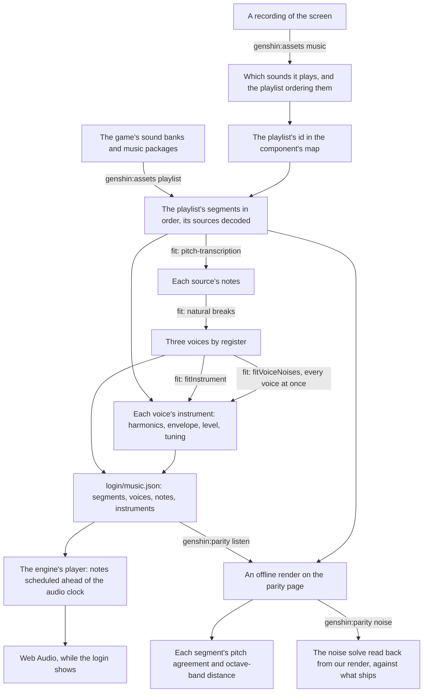

# Music

The login plays its music, and so does ours. The game's audio is a reference, read locally from the installed game and never shipped. What ships is ours: the playlist's structure, the notes, each voice's measured instrument, and a synthesizer that plays them. The login came first, and every step is a command or a fit any other piece of the game's music goes through the same way.

## How it works

- **The structure is exact.** The login's playlist is a continuous sequence that loops forever: a first piece of 104 seconds, a silent segment of about ten seconds, a second piece of 92.75 seconds (its source's last 2.25 seconds trimmed), and the rest again. Every length, trim and the order come from the sound banks (`genshin:assets playlist`), so the handoffs land where the game's do. A recording only found which playlist it is.
- **The notes are transcribed from the game's own sound.** [pitch-transcription](/docs/pitch-transcription) hears each decoded source at its defaults: about a thousand notes in the first piece and about six hundred in the second. Its readings are cached beside the source, so a second fit takes seconds. Bends are not carried. The model's contours read most frames a bin off the note's own, yet the fundamentals' peaks in the decoded sound sit within about a tenth of a semitone of their pitches, so the contours are not the music's tuning. That small offset is each voice's measured `tuning`, and the notes stay on whole pitches.
- **Voices by register.** Each source's notes split into three registers at Fisher's natural breaks over their pitches, the exact least-spread split, so a new piece needs no hand-set pitches. Telling two instruments apart within one register waits until the listening score ranks it the largest loss.
- **Every instrument is measured.** A voice's instrument is read from the decoded sound at its own notes, wherever every other sounding note's harmonics leave a partial clear (`fitInstrument`). Only a partial loud enough to move a reading covers it, one a tenth of the reading's amplitude or more, since a quieter one shifts it by under a decibel. A low note's harmonics past about the seventeenth lie closer than a semitone apart, so counted at any level they would cover everything above them and leave the upper voices almost no clear readings. How loud each partial is comes from the voices' instruments, so the fit runs twice: first with every partial covering what it overlaps, then with each counted at the level its voice's first fit gives it:
  - each overtone's amplitude over the fundamental's at the peak, to the thirty-second harmonic and below 10 kHz, short of the codec's cut at the transcription's half rate;
  - the attack, from the note's start to that peak;
  - the decay's time constant and the level it settles to, a least-squares fit over each clear note;
  - the release's time constant after the note ends, over each note nothing sounds over as it fades;
  - the fundamental's level for a note of full velocity;
  - the tuning against A440.

  Each is the median over the voice's clear notes, so the few a transcription misread, or another instrument covers, move none of them. A note whose peak sits under the noise of the voice's loudest is not measured at all. A window reads a peak low when a fast decay follows it, so the level is divided by the share of the peak the fitted envelope says a window catches. An overtone with too few clear readings is left silent rather than guessed. The fit prints every value with how many notes it came from and its residual.

- **Every voice's noise is solved at once, band by band.** In some octaves the game's sound is more noise than partials: its lowest two and its top two read several times flatter than the tonal ones between, the lowest a quiet rumble and the top the breath, bow and room each voice is heard with, loudest at the notes' attacks in the second piece. Noise covers every frequency and no note in a piece sounds alone, so no note's noise can be read on its own. Instead `fitVoiceNoises` reads each octave band's noise in each frame from the median of its bins off every partial (`readPartialBinRanges`, as far out as a partial leaks through the window, carried through each note's ring), as the sum over the voices of each one's share times the power of its fundamentals sounding there. A least-squares solve tells the voices apart by how their mix moves from frame to frame, and Gauss-Newton on the logarithm of each frame's power refines it, so a gap is charged in decibels as the listening score charges it and a loud attack does not outweigh the frames between. Only a band whose median flatness reads noise-like gets noise: in a tonal band what lies off our partials is tones we did not transcribe, and noise there blurs the pitch the score agrees on. The solve runs in the listening score's own frames, so the noise and `genshin:parity bands` judge a band by one flatness. Reverb could not fill these bands: a room's echo only spreads what a note already holds.
- **Our own synthesizer, in the engine.** `genshin-engine`'s audio module plays each note as an oscillator over its instrument's harmonics, and its instrument's noise from a looped buffer, through one gain following its envelope. The noise is built in the spectrum (`createNoiseBuffer`, over the engine's `transformFourier`): each band flat between its half octaves at the level the instrument gives it, so no band leaks into another and the loop has no seam. The envelope's value at the note's end is worked out rather than held with `cancelAndHoldAtTime`, which Firefox lacks. `createMusicPlayer` schedules the notes due in the next two seconds every half second and loops the playlist. `renderMusicSegment` renders one segment offline through the same notes. The login's score and instruments are the world package's data (`login/music.json`).
- **It starts as soon as the browser lets it.** `LoginMusic` renders nothing. It starts the player as the login screen mounts and stops it when the screen goes. The browser's autoplay policy decides whether a new audio context runs or starts suspended, so when it starts suspended the music waits for the first pointer press or key press anywhere on the window — on the title, usually its own click — and starts there from its beginning.
- **Measured by a listening score, approved by ear.** `genshin:parity listen` renders each segment offline on the parity page, through the screen that plays it, and scores it against the game's decoded segment. The pitch agreement is the mean dot product of the two's pitch classes over the game's audible frames, 1 when every frame names the same notes in the same balance. The distance is each octave band's mean level gap in decibels, from 63 Hz to 8 kHz, which charges timbre and loudness alike, and each band's bias is that gap signed, under 0 where ours is the quieter, which tells a band ours leaves short from one it overfills. The report is committed as `ParityMusicScores.snapshot.md`. The score agrees on pitch about four frames in five or better in both pieces. The bands sit about seven to eight decibels off on average. From 250 Hz to 2 kHz their bias is within a few decibels of none, so what is left there changes from frame to frame rather than across the piece. The first piece's lowest band is the exception: ours overfills it by about seven decibels, and the noise is what overfills it. The session cannot hear, so the numbers say what changed and the user's ears say whether it sounds right.
- **Its noise read back.** `genshin:parity noise` renders each segment as `listen` does (`renderMusicSegments`) and runs the noise solve over the notes we ship twice, on the game's sound and on our render. The game's reading reproduces what ships, so where our reading parts from it, the solve and the player disagree about what a level means, and a band's bias there says nothing about the band until they agree.
- **What a score is worth.** Each score is read between two ends: the game's segment against itself shifted later, and against sound it does not hold. Pitch agreement falls to about a quarter once the game is two seconds or more off itself, and under a fifth for one piece against the other. Ours, above four in five, names nearly the right notes at nearly the right time, closer than the game a quarter second off itself. The distance reads the other way. The game a quarter second off itself is three to six decibels from itself, two seconds off seven to nine, and the other piece about fourteen, so ours, at seven to eight, is as far from the game in timbre and dynamics as the game is from itself a second or two later: the right notes in the wrong sound, which is what listening to it confirms. Pitch agreement is never quoted as how alike the music is; the distance, read against these ends, is.

## Recreating another piece

The order, and the rules each step keeps, are the `genshin-parity` skill's `references/music.md`:

1. Find the sound with `genshin:assets music <recording>` over a recording of the screen.
2. Name its playlist in the component's map (`musicPlaylistId`).
3. Export it with `genshin:assets playlist <component>`.
4. Fit it through the component's fit, after `fitLoginMusic`.
5. Play it from a component that renders nothing, after `Login/Music`, with an `isMotionOnly` fixture.
6. Score it with `listen`.
7. The user listens.

## Not yet

- **Each note's own noise.** Every note reads its instrument's noise buffer from where the clock stands in the loop, and every buffer's phases depend only on the band, so the notes sounding at once play one noise in step: their amplitudes add, where the noise solve adds their powers. `genshin:parity noise` shows it, reading our render's noise back two to four times what ships. Zeroing the first piece's lowest-band noise alone takes that band's bias from about seven decibels to about one, and the bass voice's level is not the excess. A start in the loop that each note's time and pitch scatter fixes it, and the start must land on a whole sample frame: on the parity page's browser a source started between two frames reads its loop between samples, and that interpolation halves the top band at the listening score's rate. Scattered on whole frames, the first piece's noise reads back within about a fifth of what ships, its distance improves and its lowest band's overfill halves. The second piece's noise reads back whole, yet its top two bands fall four to eight decibels short and pitch agreement drops by a few ten-thousandths, so the scatter waits. That points at the solve's median: it reads off-partial content that is not noise-like, such as sparse partials of the game's own, as too little ([roadmap](/docs/genshin/roadmap)).
- **The sound itself.** Read against its ends, the distance is the gap, not the pitch: one fixed spectrum under one envelope per register sounds like an organ, not an orchestra in a hall. The notes are to be played from public-domain recordings of real instruments ([sampled instruments](/docs/proposals/genshin/sampled-instruments)). `genshin:parity instruments` solves which recorded instrument and level each voice takes in the score's own octave bands. Its distance comes within a few tenths of a decibel of what `listen` then measures. Neither pass so far shipped: both lost pitch agreement in the first piece, and the band solve's choice in both pieces, so the solve is to hear pitch next.
- **The passes the score orders.** The upper octaves' remaining distance has little bias, so it waits on what changes within a note: instruments told apart within a register, and the dynamics that the median envelope flattens. Each is taken when `listen` ranks it the largest loss.
- **Sound effects.** The door's opening, the clicks and the wind are sounds rather than music, and each is a page of its own when its turn comes.

## Key files

| File                                                                | Role                                                              |
| :------------------------------------------------------------------ | :---------------------------------------------------------------- |
| `scripts/src/services/genshinAssets/extractComponentPlaylist.ts`    | A component's playlist resolved from the banks, sources decoded   |
| `scripts/src/services/genshinAssets/fitLoginMusic.ts`               | The login's notes, voices and instruments                         |
| `scripts/src/services/genshinAssets/readMusicSourceNotes.ts`        | A source's notes, its readings cached                             |
| `scripts/src/services/genshinAssets/splitVoicesByRegister.ts`       | The registers' natural breaks                                     |
| `scripts/src/services/genshinAssets/fitMusicVoices.ts`              | A source's voices by register, each one's instrument fitted twice |
| `scripts/src/services/genshinAssets/fitInstrument.ts`               | A voice's instrument measured at its clear notes                  |
| `scripts/src/services/genshinAssets/fitVoiceNoises.ts`              | Every voice's noise in each noise-like band, solved at once       |
| `scripts/src/services/genshinParity/characterizeMusicBands.ts`      | What each band of the game's sound holds, for `bands`             |
| `packages/genshin-engine/src/audio/createNoiseBuffer.ts`            | An instrument's noise, built band by band in the spectrum         |
| `scripts/src/services/genshinAssets/readSpectralPeak.ts`            | A partial's frequency and height between two bins                 |
| `scripts/src/services/genshinParity/scoreMusicSegment.ts`           | Pitch agreement and each octave band's distance                   |
| `scripts/src/services/genshinParity/renderMusicSegments.ts`         | Each segment rendered by its screen, beside the game's            |
| `scripts/src/services/genshinParity/commands/noiseCommand.ts`       | The noise solve read back from our render and from the game's     |
| `scripts/src/services/genshinParity/commands/instrumentsCommand.ts` | Each voice's recorded instrument and level, solved in the bands   |
| `scripts/src/services/genshinParity/ParityMusicScores.snapshot.md`  | The last `listen`, committed                                      |
| `packages/genshin-engine/src/audio/createMusicPlayer.ts`            | The live player                                                   |
| `packages/genshin-engine/src/audio/scheduleMusicNote.ts`            | One note's oscillator and envelope                                |
| `packages/genshin-world/src/components/Login/Music/Index.vue`       | Where the login's music plays                                     |

## Sources

- [bnnm/wwiser](https://github.com/bnnm/wwiser) — the reference parser for Wwise's banks, read to confirm the track's clips and the playlist's items at the banks' version.
- [vgmstream](https://github.com/vgmstream/vgmstream) — the decoder for Wwise's Vorbis, pinned in the scripts' cache.
- [Autoplay guide for media and Web Audio APIs](https://developer.mozilla.org/en-US/docs/Web/Media/Guides/Autoplay), MDN — when a browser starts an audio context suspended until the page's first click or key.
- [Jenks natural breaks optimization](https://en.wikipedia.org/wiki/Jenks_natural_breaks_optimization) — the least-spread split of a list into ranges, which the registers follow.
