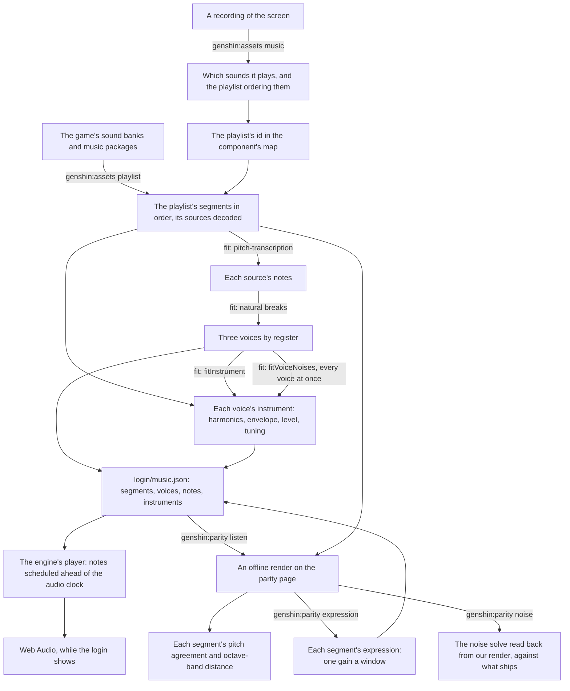

# Music

The login plays its music, and so does ours. The game's audio is a reference, read locally from the installed game and never shipped. What ships is ours: the playlist's structure, the notes, each voice's measured instrument, and a synthesizer that plays them. The login came first, and every step is a command or a fit any other piece of the game's music goes through the same way.

## How it works

- **The structure is exact.** The login's playlist is a continuous sequence that loops forever: a first piece of 104 seconds, a silent segment of about ten seconds, a second piece of 92.75 seconds (its source's last 2.25 seconds trimmed), and the rest again. Every length, trim and the order come from the sound banks (`genshin:assets playlist`), so the handoffs land where the game's do. A recording only found which playlist it is.
- **The notes are transcribed from the game's own sound.** [pitch-transcription](/docs/pitch-transcription) hears each decoded source at its defaults: about a thousand notes in the first piece and about six hundred in the second. Its readings are cached beside the source, so a second fit takes seconds. Bends are not carried. The model's contours read most frames a bin off the note's own, yet the fundamentals' peaks in the decoded sound sit within about a tenth of a semitone of their pitches, so the contours are not the music's tuning. That small offset is each voice's measured `tuning`, and the notes stay on whole pitches.
- **Voices by register.** Each source's notes split into three registers at Fisher's natural breaks over their pitches, the exact least-spread split, so a new piece needs no hand-set pitches. Telling two instruments apart within one register waits until the listening score ranks it the largest loss.
- **Every instrument is measured.** A voice's instrument is read from the decoded sound at its own notes, wherever every other sounding note's harmonics leave a partial clear (`fitInstrument`). Only a partial loud enough to move a reading covers it, one a tenth of the reading's amplitude or more, since a quieter one shifts it by under a decibel. A low note's harmonics past about the seventeenth lie closer than a semitone apart, so counted at any level they would cover everything above them and leave the upper voices almost no clear readings. How loud each partial is comes from the voices' instruments, so the fit runs twice: first with every partial covering what it overlaps, then with each counted at the level its voice's first fit gives it:
  - each overtone's amplitude over the fundamental's at the peak, to the thirty-second harmonic and below 10 kHz, short of the codec's cut at the transcription's half rate;
  - the attack, from the note's start to that peak;
  - the decay's time constant and the level it settles to, one fit in decibels to the notes' median level at each moment past their peaks;
  - the release's time constant after the note ends, over each note nothing sounds over as it fades;
  - the fundamental's level for a note of full velocity;
  - the tuning against A440.

  Each is the median over the voice's clear notes, so the few a transcription misread, or another instrument covers, move none of them. A note whose peak sits under the noise of the voice's loudest is not measured at all. A window reads a peak low when a fast decay follows it, so the level is divided by the share of the peak the fitted envelope says a window catches. An overtone with too few clear readings is left silent rather than guessed. The decay alone is fitted to a curve of medians rather than note by note. A note's own few frames cannot tell a slow decay from a fast one that settles onto a level, and fitted note by note every voice died about twice as fast as its notes do in the game's sound: each note a short blip where the game's rings on. The fit prints every value with how many notes it came from and its residual.

- **Every voice's noise is solved at once, band by band.** In some octaves the game's sound is more noise than partials: its lowest two and its top two read several times flatter than the tonal ones between, the lowest a quiet rumble and the top the breath, bow and room each voice is heard with, loudest at the notes' attacks in the second piece. Noise covers every frequency and no note in a piece sounds alone, so no note's noise can be read on its own. Instead `fitVoiceNoises` reads each octave band's noise in each frame from the median of its bins off every partial (`readPartialBinRanges`, as far out as a partial leaks through the window, carried through each note's ring), as the sum over the voices of each one's share times the power of its fundamentals sounding there. A least-squares solve tells the voices apart by how their mix moves from frame to frame, and Gauss-Newton on the logarithm of each frame's power refines it, so a gap is charged in decibels as the listening score charges it and a loud attack does not outweigh the frames between. Only a band whose median flatness reads noise-like gets noise: in a tonal band what lies off our partials is tones we did not transcribe, and noise there blurs the pitch the score agrees on. The solve runs in the listening score's own frames, so the noise and `genshin:parity bands` judge a band by one flatness. Reverb could not fill these bands: a room's echo only spreads what a note already holds.
- **Our own synthesizer, in the engine.** `genshin-engine`'s audio module plays each note as an oscillator over its instrument's harmonics, and its instrument's noise from a looped buffer, through one gain following its envelope. The noise is built in the spectrum (`computeNoiseSamples`, over the engine's `transformFourier`, every band in the one transform): each band flat between its half octaves at the level the instrument gives it, so no band leaks into another and the loop has no seam. The envelope's value at the note's end is worked out rather than held with `cancelAndHoldAtTime`, which Firefox lacks. `createMusicPlayer` schedules the notes due in the next two seconds every half second and loops the playlist. `renderMusicSegment` renders one segment offline through the same notes. The login's score and instruments are the world package's data (`login/music.json`).
- **The music swells as the game's does.** The game's orchestra plays a section louder and the next softer, by about twenty decibels at once in every band across the first piece, and the transcription's velocities carry none of it: they read each note's amplitude much alike from section to section. So each segment carries an expression, one gain a window of `MUSIC_EXPRESSION_WINDOW_SECONDS` over every voice, as an orchestral mockup's expression controller (CC11) swells and fades a whole section. `genshin:parity expression` renders each segment as it ships and fits each window's one gain over every band to the game's (`fitMusicExpression`), solved exactly in the score's own measure, then adds it to what the segment holds: it is fitted after the instruments, against our render of them, and a second run moves it little. The player plays each segment's notes through a gain of their own and ramps it between the windows' centres, evenly in decibels (`scheduleMusicExpression`), so a chord ringing past its segment's end fades from the level it ended at rather than jumping to the next segment's. It is the largest gain the score has had: the first piece's distance fell by about a third and the second's by a few tenths of a decibel, pitch agreement unchanged. The gains fitted to half the bands and scored on the others leave nearly the same distance, so they are the music's loudness rather than any band's balance. Velocity would not carry it, since a note's velocity is fixed when it starts and a swell moves under notes already sounding.
- **It starts as soon as the browser lets it.** `LoginMusic` renders nothing. It starts the player as the login screen mounts and stops it when the screen goes. The browser's autoplay policy decides whether a new audio context runs or starts suspended, so when it starts suspended the music waits for the first pointer press or key press anywhere on the window — on the title, usually its own click — and starts there from its beginning.
- **Measured by a listening score, approved by ear.** `genshin:parity listen` renders each segment offline on the parity page, through the screen that plays it, and scores it against the game's decoded segment. The pitch agreement is the mean dot product of the two's pitch classes over the game's audible frames, 1 when every frame names the same notes in the same balance. The distance is each octave band's mean level gap in decibels, from 63 Hz to 8 kHz, which charges timbre and loudness alike, and each band's bias is that gap signed, under 0 where ours is the quieter, which tells a band ours leaves short from one it overfills. The report is committed as `ParityMusicScores.snapshot.md`. The score agrees on pitch about four frames in five or better in both pieces. The bands sit about five to seven decibels off on average. From 250 Hz to 2 kHz their bias is within a few decibels of none, so what is left there changes from frame to frame rather than across the piece. The first piece's lowest band is the exception: ours overfills it by about six decibels, and the noise is what overfills it. A fixed equaliser over every band does not ship: with each band's gain fitted to one half of a piece and scored on the other, it left about as much distance as none, so what remains moves within a section rather than across one. The session cannot hear, so the numbers say what changed and the user's ears say whether it sounds right.
- **Its noise read back.** `genshin:parity noise` renders each segment as `listen` does (`renderMusicSegments`) and runs the noise solve over the notes we ship twice, on the game's sound and on our render. The game's reading reproduces what ships, so where our reading parts from it, the solve and the player disagree about what a level means, and a band's bias there says nothing about the band until they agree.
- **Its attacks counted.** `genshin:parity attacks` reads how often each octave band's level jumps by `LISTEN_ATTACK_RISE_DECIBELS` from one frame to the next, in our render and in the game's (`readAttackShares`). The listening score cannot hear this: a band's mean gap reads a note that dies too soon and the next one striking over it the same as two notes ringing. It was built for what the ear reported, scattered single notes rather than a smooth line. With each note's decay fitted on its own, the first piece's bands from 500 Hz to 2 kHz jumped two to three times as often as the game's. Under the decay fitted to the median curve they jump about as often as the game's, and the first piece's pitch agreement rose a little with its distance unchanged.
- **What a score is worth.** Each score is read between two ends: the game's segment against itself shifted later, and against sound it does not hold. Pitch agreement falls to about a quarter once the game is two seconds or more off itself, and under a fifth for one piece against the other. Ours, above four in five, names nearly the right notes at nearly the right time, closer than the game a quarter second off itself. The distance reads the other way. The game a quarter second off itself is three to six decibels from itself, two seconds off seven to nine, and the other piece about fourteen, so ours, at five to seven, lies between the game a quarter second and two seconds off itself: the right notes, swelling where the game's do, in the wrong sound. Pitch agreement is never quoted as how alike the music is; the distance, read against these ends, is.

## Recreating another piece

The order, and the rules each step keeps, are the `genshin-parity` skill's `references/music.md`:

1. Find the sound with `genshin:assets music <recording>` over a recording of the screen.
2. Name its playlist in the component's map (`musicPlaylistId`).
3. Export it with `genshin:assets playlist <component>`.
4. Fit it through the component's fit, after `fitLoginMusic`.
5. Fit its expression with `genshin:parity expression`.
6. Play it from a component that renders nothing, after `Login/Music`, with an `isMotionOnly` fixture.
7. Score it with `listen`.
8. The user listens.

## Not yet

- **Each note's own noise.** Every note reads its instrument's noise buffer from where the clock stands in the loop, and every buffer's phases depend only on the band, so the notes sounding at once play one noise in step: their amplitudes add, where the noise solve adds their powers. `genshin:parity noise` shows it, reading our render's noise back two to four times what ships. Zeroing the first piece's lowest-band noise alone takes that band's bias from about seven decibels to about one, and the bass voice's level is not the excess. A start in the loop that each note's time and pitch scatter fixes it, and the start must land on a whole sample frame: on the parity page's browser a source started between two frames reads its loop between samples, and that interpolation halves the top band at the listening score's rate. Scattered on whole frames, the first piece's noise reads back within about a fifth of what ships, its distance improves and its lowest band's overfill halves. The second piece's noise reads back whole, yet its top two bands fall four to eight decibels short and pitch agreement drops by a few ten-thousandths, so the scatter waits. That points at the solve's median: it reads off-partial content that is not noise-like, such as sparse partials of the game's own, as too little ([roadmap](/docs/genshin/roadmap)).
- **The sound itself.** Read against its ends, the distance is the gap, not the pitch: one fixed spectrum under one envelope per register sounds like an organ, not an orchestra in a hall. The notes are to be played from public-domain recordings of real instruments ([sampled instruments](/docs/proposals/genshin/sampled-instruments)). `genshin:parity instruments` solves which recorded instrument and level each voice takes in the score's own octave bands. Its candidates are only the instruments `genshin:parity solos` finds holding a voice's notes in tune at least as well as plain sine tones, and each mix is scored whole. Nothing has shipped. In the fourth pass each mix was scored under an expression fitted to it, as the shipped music plays: the second piece held its pitch at about two tenths of a decibel over the synthesizer, and the first piece fell short on both counts. What remains is the recordings' spectrum rather than their decay. The first piece's pitch is past the recordings' reach: no balance of them, no two layered on a voice and no equaliser on each voice reaches the synthesizer's pitch agreement, so how that piece is played is an open choice on the proposal.
- **The second piece's top voice.** The decay fitted to the median curve cost the second piece about two hundredths of pitch agreement for a tenth of a decibel of distance, and all of it through its top voice: with that one voice's old envelope put back, the agreement returns. Its notes now ring as long as the game's notes heard alone do, so the envelope is not what is wrong. Most of that voice's notes sit on a harmonic of a lower note sounding with them, and a transcription hears a loud overtone as a note of its own, which we then play with overtones the game's never had, for longer than before. Telling such a note from a melody doubled an octave up is the open unknown. Three remedies were tried and removed:
  - Joining a note to the one before it at its pitch, wherever the game's fundamental does not rise at its start. About a fifth to a quarter of the notes join. The bands jump no less often, and pitch agreement falls by up to two hundredths in the second piece with the registers held where they were, four where the fewer notes move them.
  - Reading a note's level and decay from the frame its voice's attack lands on, rather than from its own loudest frame. The first piece's voices then barely decay: its bands jump several times less often than the game's and its pitch agreement falls by over a hundredth.
  - A decay per octave of overtones, each harmonic dying faster than the fundamental by its number to a fitted power, as additive synthesis gives a plucked string. The fit reads the second piece's top and bass overtones dying faster, as they do in the game's sound, yet playing them so moves neither score by more than a tenth of a decibel, for an oscillator an octave of overtones on every note.
- **The passes the score orders.** The upper octaves' remaining distance has little bias, so it waits on what changes within a note. `genshin:parity decay` reads each band's gap by how long before it the last note began: in the second piece our bands from 1 kHz to 4 kHz ring several decibels over the game's half a second and more into a note, where one envelope holds every harmonic and an instrument's upper partials die first. A room's reverb would lengthen that ring, not shorten it. Instruments told apart within a register are taken when `listen` ranks them the largest loss.
- **Sound effects.** The door's opening, the clicks and the wind are sounds rather than music, and each is a page of its own when its turn comes.

## Key files

| File                                                                   | Role                                                              |
| :--------------------------------------------------------------------- | :---------------------------------------------------------------- |
| `scripts/src/services/genshinAssets/music/extractComponentPlaylist.ts` | A component's playlist resolved from the banks, sources decoded   |
| `scripts/src/services/genshinAssets/fit/fitLoginMusic.ts`              | The login's notes, voices and instruments                         |
| `scripts/src/services/genshinAssets/readMusicSourceNotes.ts`           | A source's notes, its readings cached                             |
| `scripts/src/services/genshinAssets/splitVoicesByRegister.ts`          | The registers' natural breaks                                     |
| `scripts/src/services/genshinAssets/shared/fitMusicVoices.ts`          | A source's voices by register, each one's instrument fitted twice |
| `scripts/src/services/genshinAssets/shared/fitInstrument.ts`           | A voice's instrument measured at its clear notes                  |
| `scripts/src/services/genshinAssets/shared/fitVoiceNoises.ts`          | Every voice's noise in each noise-like band, solved at once       |
| `scripts/src/services/genshinParity/characterizeMusicBands.ts`         | What each band of the game's sound holds, for `bands`             |
| `packages/genshin-engine/src/audio/computeNoiseSamples.ts`             | An instrument's noise, its bands built in one spectrum            |
| `scripts/src/services/genshinAssets/shared/readSpectralPeak.ts`        | A partial's frequency and height between two bins                 |
| `scripts/src/services/genshinParity/music/scoreMusicSegment.ts`        | Pitch agreement and each octave band's distance                   |
| `scripts/src/services/genshinParity/renderMusicSegments.ts`            | Each segment rendered by its screen, beside the game's            |
| `scripts/src/services/genshinParity/commands/noiseCommand.ts`          | The noise solve read back from our render and from the game's     |
| `scripts/src/services/genshinParity/commands/instrumentsCommand.ts`    | Each voice's recorded instrument and level, solved in the bands   |
| `scripts/src/services/genshinParity/commands/solosCommand.ts`          | Every recorded instrument alone through each voice, for pitch     |
| `scripts/src/services/genshinParity/ParityMusicScores.snapshot.md`     | The last `listen`, committed                                      |
| `packages/genshin-engine/src/audio/createMusicPlayer.ts`               | The live player                                                   |
| `packages/genshin-engine/src/audio/scheduleMusicExpression.ts`         | A segment's expression ramped on the gain its notes play through  |
| `scripts/src/services/genshinParity/music/fitMusicExpression.ts`       | Each window's one gain over every band, fitted to the game's      |
| `scripts/src/services/genshinParity/commands/expressionCommand.ts`     | Each segment's expression refitted against our render and written |
| `scripts/src/services/genshinParity/commands/decayCommand.ts`          | Whether ours rings past the game's, band by band, by a note's age |
| `scripts/src/services/genshinParity/commands/attacksCommand.ts`        | How often each band jumps between frames, ours against the game's |
| `scripts/src/services/genshinParity/readAttackShares.ts`               | The share of a band's frames that jump                            |
| `packages/genshin-engine/src/audio/scheduleMusicNote.ts`               | One note's oscillator and envelope                                |
| `packages/genshin-world/src/components/Login/Music/Index.vue`          | Where the login's music plays                                     |

## Sources

- [bnnm/wwiser](https://github.com/bnnm/wwiser) — the reference parser for Wwise's banks, read to confirm the track's clips and the playlist's items at the banks' version.
- [vgmstream](https://github.com/vgmstream/vgmstream) — the decoder for Wwise's Vorbis, pinned in the scripts' cache.
- [Autoplay guide for media and Web Audio APIs](https://developer.mozilla.org/en-US/docs/Web/Media/Guides/Autoplay), MDN — when a browser starts an audio context suspended until the page's first click or key.
- [MIDI CC11 vs CC1: expression and dynamics explained](https://modwheel.net/guides/understanding-midi-ccs), modwheel.net — expression as a section's volume over the layer already playing, and why velocity, fixed when a note starts, cannot swell a held note.
- [An introduction to additive synthesis](https://www.soundonsound.com/techniques/introduction-additive-synthesis), Sound on Sound — each harmonic under an envelope of its own, the second decaying in half the fundamental's time and so on, so a plucked sound darkens as it rings: the decay per octave of overtones that was tried.
- [Jenks natural breaks optimization](https://en.wikipedia.org/wiki/Jenks_natural_breaks_optimization) — the least-spread split of a list into ranges, which the registers follow.
