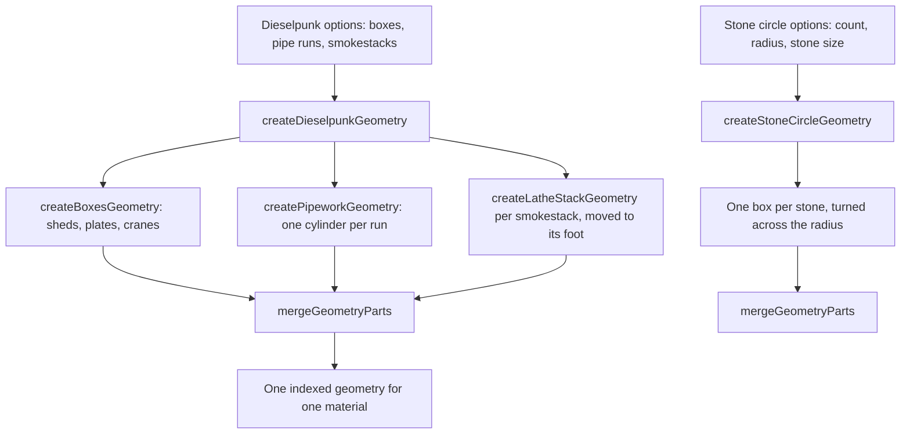

# Nod-Krai's kits

Nod-Krai's structures are not Mondstadt's or Inazuma's, so each of its two kits is a generator of its own, built over the engine's shared architecture parts rather than over any region's kit. The engine knows no region: the kits take their numbers as options, and the region's fitted values are supplied by the world package.

## How it works

- **The dieselpunk kit merges three kinds of part.** `createDieselpunkGeometry` takes a structure's boxes, which `createBoxesGeometry` builds into sheds, plates and cranes, its pipe runs and its smokestacks. Each smokestack is a stack of sections from `createLatheStackGeometry`, moved to its foot. Every part is indexed so that `mergeGeometryParts` can join them into one geometry for one material; a faceted stack is not indexed and would drop out of the merge, so the kit builds them round.
- **Pipework is a cylinder per run.** `createPipeworkGeometry` stands one cylinder of the given radius between each run's two ends. Each cylinder is turned from the vertical onto its run and moved to the run's midpoint, so a run may point in any direction.
- **The Frostmoon kit stands a ring of stones.** `createStoneCircleGeometry` places each stone at an even angle about the origin, its height standing on the ground and its thickness lying across the radius, so every stone faces the ring's centre.

## Key files

| File                                                                    | Role                                                             |
| :---------------------------------------------------------------------- | :--------------------------------------------------------------- |
| `packages/genshin-engine/src/kits/nod-krai/createDieselpunkGeometry.ts` | The dieselpunk structure, merged from its boxes, pipes and stacks |
| `packages/genshin-engine/src/kits/nod-krai/createPipeworkGeometry.ts`   | Pipework as one cylinder per run                                 |
| `packages/genshin-engine/src/kits/nod-krai/createStoneCircleGeometry.ts` | The Frostmoon Scions' ring of standing stones                    |
| `packages/genshin-engine/src/models/kits/nod-krai/DieselpunkOptions.ts` | The dieselpunk structure's options                               |
| `packages/genshin-world/src/data/regions/nod-krai.json`                 | Nod-Krai's region data, empty until its landmarks are placed     |
