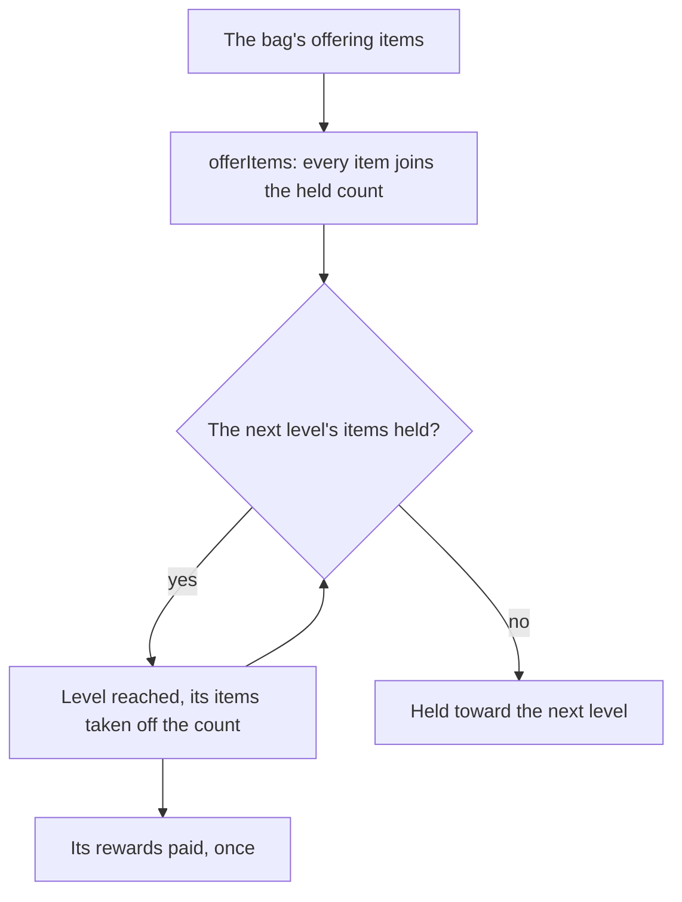

# Offering systems

In the game a sacred tree, fountain or shrine takes the items of its kind the bag holds, all at once, and rises a level for each threshold its offerings pass. This page is what is built of [Offering systems](/docs/proposals/genshin/offering-systems): the rule, the same one a statue's Oculi follow, and the Frostbearing Tree in Dragonspine as the first offering written. The rules are pure functions with their own tests. Nothing in the world calls them yet, since no tree stands in Dragonspine, so the rule runs on no screen.

## How it works

- **The tree's levels come from the game's table.** `pnpm -C scripts genshin:assets offerings` writes the Frostbearing Tree's levels from the offering level-up table, one row a level holding the item it takes, how many, and the rewards its reward row pays. Offering 1 is the tree, the one its open state names. The table is not in the community dump the scripts read, so it is fetched from the AnimeGameData repository into that dump and never committed. The slice is imported on demand by `readFrostbearingTreeLevels` and checked against its schema as it arrives.
- **Every item the bag holds is offered at once.** `offerItems` takes the count offered, adds it to the held count, then reaches each next level whose items the count now covers, taking those off the count and returning the levels reached in order, so the caller pays each one. A level's threshold is the running sum of the items the levels take, so the tree's eleven levels after its first take ten each, 110 in all.
- **The first offer starts the tree.** Level 1 takes no items, so offering none reaches it, whatever the bag holds, and its reward is paid once, as a statue's first resonance does. This is settled from the table, since the wiki's page was not reachable when this was built.
- **Items past the last level are held.** Past the tree's last level the items stay on the held count with no level to reach, as a statue's Oculi do past its last level.

## Key files

| File                                                                          | Role                                                                      |
| :---------------------------------------------------------------------------- | :------------------------------------------------------------------------ |
| `packages/genshin-world/src/services/offering/offerItems.ts`                  | Offers items and reaches each level they cover, the rule statues share    |
| `packages/genshin-world/src/services/offering/readFrostbearingTreeLevels.ts`  | Imports the tree's slice and checks it against its schema                 |
| `packages/genshin-world/src/models/offering/OfferingLevel.ts`                 | One level: the items it takes, the item they are, its rewards             |
| `packages/genshin-world/src/models/offering/OfferingProgress.ts`              | The held count, the level reached and the levels, shared with the statues |
| `packages/genshin-world/src/models/offering/OfferingReward.ts`                | One item a level pays                                                     |
| `packages/genshin-world/src/generated/offerings/frostbearingTree.json`        | The written slice, imported on demand                                     |
| `scripts/src/services/genshinAssets/offerings/writeFrostbearingTreeLevels.ts` | Writes the tree's levels, each reward joined from the reward table        |
| `scripts/src/services/genshinAssets/offerings/toOfferingLevelRow.ts`          | One level's row: the item and count it takes, its rewards                 |
| `scripts/src/services/genshinAssets/rewards/readRewardMap.ts`                 | The reward table keyed by reward id, shared by the level writers          |

## Notes

- **Not yet wired.** No tree stands in the world, and nothing calls `offerItems` on a screen. The tree's place in Dragonspine, its offering in reach and the taking of the bag's items wait on Mondstadt's region page and on the spawned places that place the items.
- **One rule with the statues.** The statues' offerOculus became `offerItems`, which takes the count offered rather than one Oculus, and the level shape they share is `itemCount` and `itemId`, in place of oculusCount and oculusItemId. The statue slice was rewritten under those names.
- **Reading the wiki.** The [Offering System](https://genshin-impact.fandom.com/wiki/Offering_System) page answered HTTP 402 when this was built, so the calls above rest on the game's table alone, and the wiki's wording of each is still to be checked.

## Sources

- [AnimeGameData](https://github.com/DimbreathBot/AnimeGameData), the community's per-patch dump: the offering level-up table with each offering's items and rewards, the offering open-state table, and the reward table the rewards are joined from.
