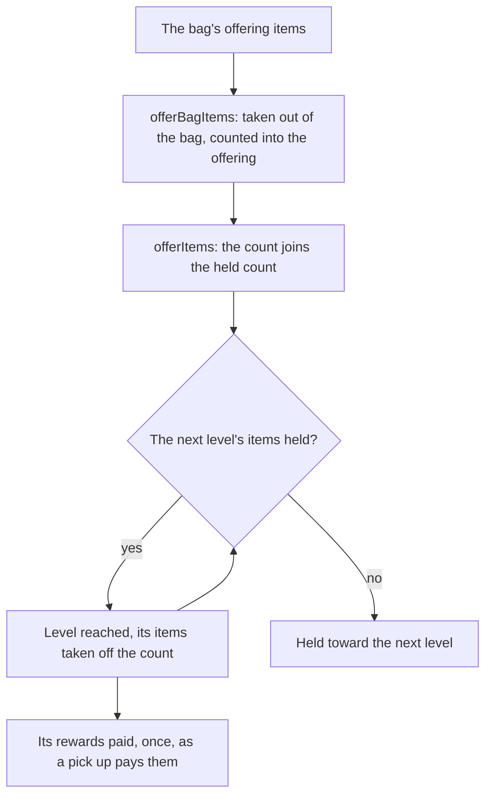

# Offering systems

In the game a sacred tree, fountain or shrine takes the items of its kind the bag holds, all at once, and rises a level for each threshold its offerings pass. This page is what is built of [Offering systems](/docs/proposals/genshin/offering-systems): the rule, the same one a statue's Oculi follow, the bag's offer that takes the items out of the bag, and the Frostbearing Tree in Dragonspine as the first offering published. The rules are pure functions with their own tests. Nothing in the world calls them yet, since no tree is drawn or prompted in Dragonspine, so the rule runs on no screen.

## How it works

- **The tree's levels come from the game's table.** `pnpm -C scripts genshin:assets offerings` publishes the Frostbearing Tree's levels from the offering level-up table, one row a level holding the item it takes, how many, and the rewards its reward row pays. Offering 1 is the tree, the one its open state names. The offering table is not in the dump, so the [game data formats](/docs/genshin/game-data-formats) page records how it is fetched. `readFrostbearingTreeLevels` fetches the levels by their key from the hosted game data and checks them against its schema as they arrive.
- **The tree's place comes from the official map.** The same command publishes the Frostbearing Tree's place: the map's one point for the tree, which lies in Mondstadt's area, carried through the [spawned places](/docs/genshin/spawned-places) fit into the game's coordinates and then into Mondstadt's region axes. It is one slice per region in the `frostbearingTreePlaces` dataset, and the tree stands at `(-596.88, -216.89)` in Mondstadt's axes, not yet placed on the ground.
- **Every item the bag holds is offered at once.** `offerBagItems` takes every item an offering's levels take that the bag holds out of the bag and counts them into the offering through `offerItems`. That takes the count offered, adds it to the held count, then reaches each next level whose items the count now covers, taking those off the count and returning the levels reached in order. A level's threshold is the running sum of the items the levels take, so the tree's eleven levels after its first take ten each, 110 in all.
- **Each reached level's rewards are paid in.** `offerBagItems` pays every reward of the levels reached as a pick up pays it: Mora into the wallet, anything else into the bag. What the bag has no room for is left over and counted as the offer's overflow.
- **The first offer starts the tree.** Level 1 takes no items, so offering none reaches it, whatever the bag holds, and its reward is paid once, as a statue's first resonance does. This is settled from the table, since the wiki's page was not reachable when this was built.
- **Items past the last level are held.** Past the tree's last level the items stay on the held count with no level to reach, as a statue's Oculi do past its last level.

## Key files

| File                                                                          | Role                                                                      |
| :---------------------------------------------------------------------------- | :------------------------------------------------------------------------ |
| `packages/genshin-world/src/services/offering/offerItems.ts`                  | Offers items and reaches each level they cover, the rule statues share    |
| `packages/genshin-world/src/services/offering/offerBagItems.ts`               | Takes the bag's offering items out, offers them and pays the rewards      |
| `packages/genshin-world/src/services/offering/readFrostbearingTreeLevels.ts`  | Fetches the tree's levels by key and checks them against its schema       |
| `packages/genshin-world/src/models/offering/OfferingLevel.ts`                 | One level: the items it takes, the item they are, its rewards             |
| `packages/genshin-world/src/models/offering/OfferingProgress.ts`              | The held count, the level reached and the levels, shared with the statues |
| `packages/genshin-world/src/models/offering/OfferingOffer.ts`                 | What an offer leaves: the bag, the wallet, the progress and the overflow  |
| `packages/genshin-world/src/models/offering/OfferingReward.ts`                | One item a level pays                                                     |
| `packages/genshin-world/src/generated/offerings/frostbearingTree.json`        | The committed levels, which no code imports                               |
| `packages/genshin-world/src/generated/frostbearingTreePlaces/mondstadt.json`  | The tree's place in Mondstadt, one slice per region                       |
| `scripts/src/services/genshinAssets/offerings/buildFrostbearingTreeLevels.ts` | Builds the tree's levels, each reward joined from the reward table        |
| `scripts/src/services/genshinAssets/offerings/buildFrostbearingTreePlaces.ts` | Builds the tree's place from the official map's point and the fit         |
| `scripts/src/services/genshinAssets/offerings/toOfferingLevelRow.ts`          | One level's row: the item and count it takes, its rewards                 |
| `scripts/src/services/genshinAssets/rewards/readRewardMap.ts`                 | The reward table keyed by reward id, shared by the level builders         |

## Notes

- **Not yet wired.** No tree is drawn in the world and no prompt offers to it, so nothing calls `offerBagItems` on a screen. The tree's landmark and its ground, the Offer prompt's verb (a game text id still to be decoded from the install) and the taking on F wait on Mondstadt's region page.
- **The bag has no definition for the tree's item yet.** The offering item 107010 and most of the levels' reward items are not in the materials table the bag reads, so `getItemDefinition` cannot name them until their definitions are added from the game's item table.
- **One rule with the statues.** The statues' offerOculus became `offerItems`, which takes the count offered rather than one Oculus, and the level shape they share is `itemCount` and `itemId`, in place of oculusCount and oculusItemId. The statue slice was rewritten under those names.
- **Reading the wiki.** The [Offering System](https://genshin-impact.fandom.com/wiki/Offering_System) page answered HTTP 402 when this was built, so the calls above rest on the game's table and the official map alone, and the wiki's wording of each is still to be checked.

## Sources

- [AnimeGameData](https://github.com/DimbreathBot/AnimeGameData), the community's per-patch dump: the offering level-up table with each offering's items and rewards, the offering open-state table, and the reward table the rewards are joined from.
- [Teyvat Interactive Map](https://act.hoyolab.com/ys/app/interactive-map/index.html), HoYoLAB: the map's point for the Frostbearing Tree, read into the references folder and carried through the fit.
