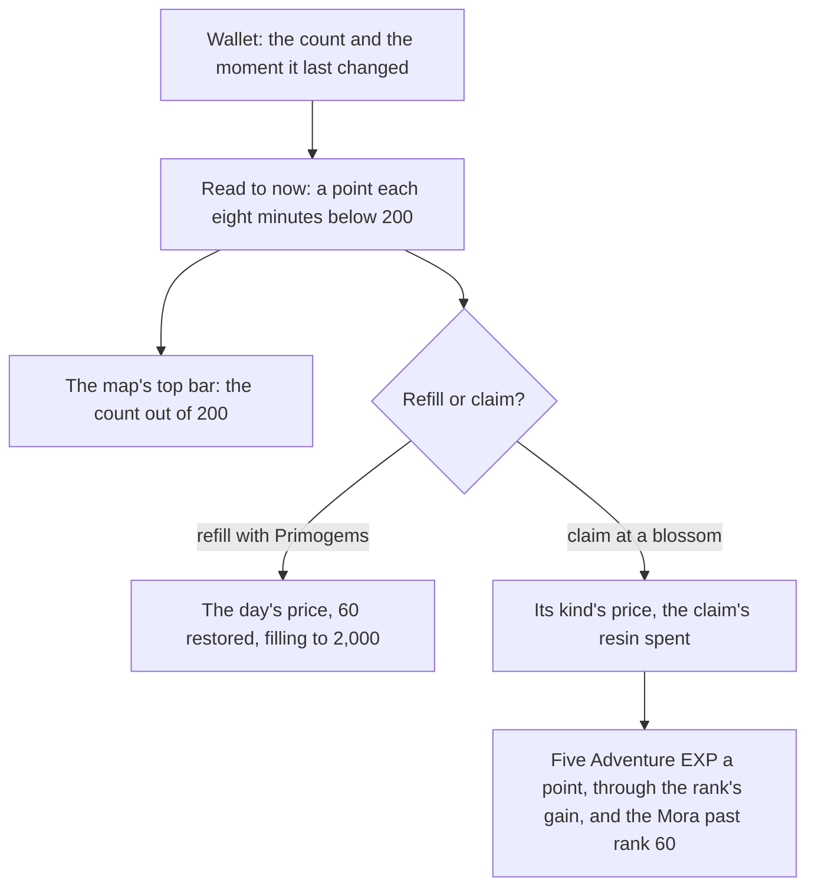

# Original Resin

The game keeps its energy for claiming challenge rewards as Original Resin. The wallet holds it as a count and the moment it last changed, so its regeneration is read to the present rather than run on a timer, and the page can be closed for a day and still show the resin filled. The map's top bar counts it. The claim's price, its Adventure EXP and the Primogem refill are pure services in `genshin-world`, read off the rules the [proposal](/docs/proposals/genshin/original-resin) settles.

The claim's ways to pay are pure services too: a blossom's offers, and a Condensed Resin spent for three rewards at a ley line or a domain. No challenge leaves a blossom to claim yet, so no offer is shown and the claims' rewards are the proposal's still.

## How it works

## Decisions

- **One every eight minutes, to 200.** `regenerateOriginalResin` adds a point for each eight minutes since the moment the resin last changed, up to 200. It moves that moment on by the points it gives, so the time to the next point keeps its place. At 200 regeneration stops and the moment is now, so a spend that takes the resin below 200 starts the next point from there.
- **A refill passes the cap, to 2,000.** `refillOriginalResin` reads the regeneration to now, then adds to the count, filling to 2,000. Above 200 the resin does not regenerate.
- **Primogem refills, six a game day.** Each restores 60 at 50, 100, 100, 150, 200 and 200 Primogems, the world's own and never sold. `refillOriginalResinWithPrimogems` refuses a refill short of its price, at the 2,000 cap, or once the day's six are used. The game's day starts at 04:00 in UTC+8, the game's server time, so the count restarts at that hour and not at midnight.
- **A claim's price by its kind.** `computeBlossomClaimResin` prices one claim at a ley line or a domain at 20, a normal boss at 40, and a weekly boss at 30 for each of its first three claims in the week and 60 after them.
- **A claim's offers.** `computeBlossomClaimOffers` lists how a blossom's claim is paid: one claim at its price; at a ley line or a domain also two claims at twice the price, and a Condensed Resin for three claims. A boss offers its one claim only.
- **Condensed Resin's claim.** `spendCondensedResin` takes one Condensed Resin out of the bag for a ley line's or a domain's three claims, and refuses a boss. It spends no Original Resin, so it gives no Adventure EXP.
- **Five Adventure EXP a point.** `claimOriginalResin` spends the resin, then gives five Adventure EXP a point through `gainAdventureExp`, so the EXP past rank 60 is paid into the wallet as Mora. A claim the resin does not cover returns undefined and spends nothing.
- **Settled calls.** A new player holds the full 200. The resin's rarity is 3, the game's material table's `rankLevel`. Its name is the game's own text, `GameTextKey.OriginalResin`. Both the starting amount and the 04:00 reset are settled from the game's own design rather than checked against the wiki, which was not reachable when they were settled.

## Data

- **The item's row.** Original Resin is item 106 in the game's material table, with the rarity above. Its name's text id is the one `GameTextKey.OriginalResin` holds.
- **The other resins' rows.** Fragile Resin is item 107009, whose use adds 60 of item 106, the restore the refill uses. Condensed Resin is item 220007, with a stack limit of five, the held limit its decision states. Neither is read by a page yet.

## Not built yet

- **The blossoms.** No challenge leaves a blossom, so no F prompt offers a claim. The prices are ready for the [ley line outcrops](/docs/proposals/genshin/ley-line-outcrops), [domains](/docs/proposals/genshin/domains) and [bosses](/docs/proposals/genshin/bosses) to call.
- **The claims' rewards.** "BlossomChestExcelConfigData" is in the dump, but its rows name each blossom's chest gadget, not a reward: the gadget (for instance 70210109, the Flora chest) carries no reward id, and no table the dump or the community's repository holds links it to a reward in the reward table. The fixed reward needs that link from another source, and the rolled drops are the wiki's, not yet read.
- **Fragile Resin's refill.** The item is not in the materials the bag reads, and its use is the inventory's. The refill rule is ready for it.
- **Condensed Resin's claim is not wired.** Its spend is ready, but no offer is shown until a blossom is placed. Its crafting from 60 is the [crafting](/docs/genshin/crafting) bench's.
- **The dialogs.** The refill and claim dialogs, and the top bar's plus for refilling, are unbuilt. The top bar shows the count only.

The top bar's place and type are provisional until a recording measures them. The line is on the [roadmap](/docs/genshin/roadmap)'s Recordings owed list.

## Key files

| File                                                                                    | Role                                                                                       |
| :-------------------------------------------------------------------------------------- | :----------------------------------------------------------------------------------------- |
| `packages/genshin-world/src/services/originalResin/constants.ts`                        | The cap, the refill cap, the regeneration interval, the Primogem prices and the game's day |
| `packages/genshin-world/src/services/originalResin/regenerateOriginalResin.ts`          | The count and its moment read to now, a point each interval below the cap                  |
| `packages/genshin-world/src/services/originalResin/spendOriginalResin.ts`               | A spend read to now, undefined where the resin is not held                                 |
| `packages/genshin-world/src/services/originalResin/refillOriginalResin.ts`              | A refill added to the count, filling to the refill cap                                     |
| `packages/genshin-world/src/services/originalResin/refillOriginalResinWithPrimogems.ts` | A refill for the day's next price, the day's count restarting at the game's day            |
| `packages/genshin-world/src/services/originalResin/computeBlossomClaimResin.ts`         | A claim's price by its blossom kind and the weekly boss's claims that week                 |
| `packages/genshin-world/src/services/originalResin/claimOriginalResin.ts`               | A claim: the resin spent, the Adventure EXP gained and the Mora past rank 60               |
| `packages/genshin-world/src/services/originalResin/computeBlossomClaimOffers.ts`        | The ways a blossom's claim is paid: one, two at twice the price, or a Condensed Resin      |
| `packages/genshin-world/src/services/originalResin/checkIsMultiClaimBlossom.ts`         | A ley line or a domain, the blossoms that can be doubled or paid in Condensed Resin        |
| `packages/genshin-world/src/services/originalResin/spendCondensedResin.ts`              | A Condensed Resin taken from the bag for three claims, refused at a boss                   |
| `packages/genshin-world/src/models/originalResin/BlossomClaimOffer.ts`                  | One way to pay a claim: its claim count, its resin and its Condensed Resin                 |
| `packages/genshin-world/src/models/inventory/Wallet.ts`                                 | The count of each currency, the moment Original Resin last changed, and the day's refills  |
| `packages/genshin-world/src/services/inventory/constants.ts`                            | A new player's wallet, holding Original Resin at the cap                                   |
| `packages/genshin-world/src/components/Map/Overlay/Index.vue`                           | The count on the map's top bar, read when the map opens                                    |
| `packages/genshin-text/src/models/GameTextKey.ts`                                       | `OriginalResin`, the item's name in the game's text                                        |

## Notes

- **The map reads its count once.** The count is taken when the map opens, so it holds still while the map is up, which is the moment a player reads it.
- **The rate and the cap are the game's public figures.** They are constants, not measures. Only the top bar's place and type are measured, and they wait on the recording.
- **A claim's Companionship EXP is a rule of its own.** The claim gives no Companionship EXP itself; a blossom's amount goes to the deployed team through the [companionship](/docs/genshin/companionship) grant, its amounts provisional until recorded.

## Sources

- [Original Resin](https://genshin-impact.fandom.com/wiki/Original_Resin), Genshin Impact Wiki: the claims' prices, five Adventure EXP a point, one point every eight minutes to 200, the Fragile and Primogem refills, and the 2,000 cap.
- [AnimeGameData](https://github.com/DimbreathBot/AnimeGameData), the community's per-patch dump: the material rows of items 106, 107009 and 220007, and the reward table.
