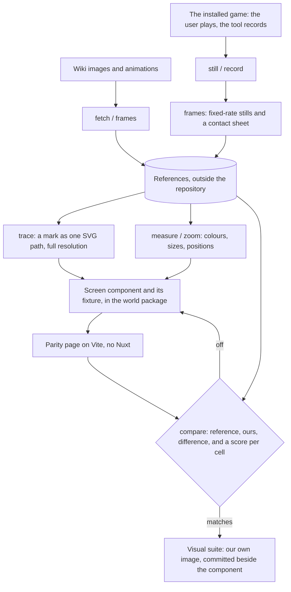

# Parity

The Genshin area recreates the game's own screens, so "does it look right" has an exact answer: the game. Parity is the loop that asks it. It is built for an agent, which reads images but drives no browser of its own: every step is one command that prints numbers and writes an image the agent reads. The user's eye stays the final check. The loop is fast enough that nobody has to wait on that check.

## How it works

- **References stay outside the repository.** They are HoYoverse's images, so they are fetched and recorded into `~/Esposter/genshin-parity` and never committed. The repository holds only what each screen is judged against (`ParityReferenceMap`): a wiki file, or one frame of a recording, named by the recording and the second it is taken at.
- **Search before recording.** Most of what a screen needs is already published: the wiki holds the game's screens and its standalone marks, the community's data dumps hold its in-game text, and public videos show the rest, including the English client when the recording is in another language. A clip from one is fetched into the captures folder with yt-dlp from a throwaway virtual environment, and sampled like any recording. A recording of the installed game is for what nothing published shows, such as exact timings at 60 frames a second and colours read true.
- **The installed game is recorded, never driven.** The user starts the game and plays while the tool records. It sends the game no input, since the game's terms count injected input as botting.
- **Only the game's window is recorded.** Capture goes through Windows Graphics Capture, found by the game's executable. Nothing else reaches the file: no window above it, no desktop or webcam behind it, no cursor, and no overlay that is its own window. A recording of the screen's rectangle was tried first and took whatever was on screen whenever the user switched away. `record` waits for the window to open, so a recording can be armed before the game starts and take it from its first frame. It encodes on the GPU at 60 frames a second, near-lossless, into Matroska, which stays readable if the recording is cut short. A minimised game gives no frames, so a recording also ends by the clock, at its length in real time, rather than waiting for frames that are not coming.
- **FFmpeg is pinned, not installed.** Window capture arrived in FFmpeg 8, which no npm package bundles. The tool fetches one versioned release the first time it needs FFmpeg, refuses it unless its SHA-256 matches the pinned one, and unpacks it into the scripts package's `node_modules/.cache`, so no install or CI run ever pays for it.
- **A vector is used as it is, and only a mark with none is traced.** Wikimedia Commons holds some of the game's logos as SVG, the publisher's among them, and its paths are drawn directly, so no edge can chip.
- **A glyph is traced from the game's own mark.** The tracer starts from the wiki's standalone render of a mark where one exists, since a mark on a screenshot is small and, when pale, too faint to split cleanly. It traces at the source's full resolution, never reduced, and prints the region beside the trace to check. Ink is told from paper by how far each pixel strays from the colour at the region's corners, so a mark dark on white, lit on black or coloured on either traces alike, and an outline smaller than a sliver of the region, a sparkle printed on a logo or a speck of compression, is dropped. The path it writes is the one the component draws. Nothing from the game ships except shapes derived this way, a choice made so the screens match exactly.
- **A screen is a component folder with a fixture, in its section.** Every screen is a presentational component in the world package, laid out as Nuxt lays out the app's: `components/<Section>/<Name>/Index.vue`, named by its path (`Login/Screen` is `LoginScreen`), with its `Index.fixture.ts`, its browser tests and its approved images beside it. The sections follow the game (`Game`, `Splash`, `Loading`, `Login`, `World`), and `Game/Opening` shows the game's first screens in turn and owns every handoff between them. Having a fixture is what puts a screen on the parity page and in the visual suite, named as the package's own barrel exports it, so there is no list to keep. A fixture's `variants` are further states it is approved in, such as each stage of the login's interface. A fixture marked `isMotionOnly`, such as a 3D scene whose anti-aliasing jitters every frame, is shot on the page but kept out of the suite. A screen draws inside `genshin-ui`'s `GameScreen`, whose `--unit` scales the game's 1920 by 1080 screen by the window's smaller axis, as the game scales its interface; scaling by height alone was tried first, and a window narrower than 16:9 set text sized for the height in a box sized for the width. A screen also draws no heading element, since a host page's heading styles (the console's gold, its inherited font) reach into it; a heading is a paragraph with `role="heading"`. The pieces screens share are [`genshin-ui`](/docs/genshin/interface-library)'s, held by a suite of their own.
- **The comparison is numbers first.** `compare` shoots the screen in the machine's own Edge at 1080 CSS pixels high, scaled to the reference's pixel size. It prints the mean difference and a six-by-six grid of per-cell differences, then writes reference, ours and their difference side by side. A cell that stands out says where to zoom. It prints two scores beside them for a scene, which is rebuilt from shapes rather than copied and so never matches pixel for pixel: the shape, as the share of edges each image has where the other has one too, and the tone, as the difference of their colours blurred past any texture. A reference can hand its screen props of its own, so one screen is judged in each state a reference shows, such as a scene at each time of day.
- **Motion is matched frame by frame.** A recording is first sampled at one frame a second to find its events, then each event is read at its full rate over its own window of time. Our screen's motion is held at its start on the parity page and shot at the same moments. `entry` holds the screen's own animations as it mounts. `props` lets those finish, then applies the fixture's `motionProps` and holds the transitions they start; a still and the visual suite show the fixture's first state. `luma` prints one region's darkness across both sets of frames as two curves, so a fade's duration and a wipe's steps are read off numbers rather than raced. Window capture takes a frame only when the window changes, so a curve from it jitters by a frame or two where frames were skipped, and a fit is judged over the whole curve.
- **Nothing is approved uncompared.** The visual suite only holds a screen to its own last image, so it says nothing about the game. What does is `compare` against a reference in the same language and build, and a test fails for any screen with a fixture that no reference names. A title logo sized from another language's client was approved once without a reference and came out nearly twice the size of the English client's, which is why the test exists. A public video that letterboxes the game is cropped to its screen by the reference's `crop`.
- **An approved screen is held by the visual suite.** `pnpm test:visual` renders every screen and every variant from its fixture in Vitest's browser mode and matches it against its own last image, `Index.<platform>.png` and `Index-<variant>.<platform>.png` beside the component, as a test sits beside its code. It is a separate config, so an ordinary test run never starts a browser, and it reads the engine and the interface library from their source, so a change there shows without a build. The same config runs the tests of what only a browser can play: `Game/Opening`'s plays the whole opening, the login's flight included, and checks every handoff, so a screen skipped along the way fails a run rather than a reader's eye. `-u` approves what the screens draw now. A new image's first run writes it and fails once, which is Vitest's way of asking for that approval.
- **An interface over a scene is compared over the reference's own frame.** A reference with `isBackdrop` has its frame drawn behind the screen, served to the page by the shooting browser and drawn pixel for pixel, so every cell the interface leaves bare scores exactly 0.00% and only the interface can differ. A capture's frame is rewritten without the gamma and primaries FFmpeg tags it with, since a browser colour-manages a tagged image and drew the frame darker than its own file. Glass the interface draws translucent (the prompt band) lands on the recording's own glass and darkens twice, so its colour is solved from the scene around it, and the score holds its opaque pieces and every placement. The login's interface reached a few tenths of a percent on each stage this way, the rest being the older build's build string and repair button.
- **The world's shapes are measured off the game's own assets, never copied.** The interface is rebuilt from screenshots, which its overlay compare holds exactly; a scene's towers, doors and profiles come from the installed game's files. AnimeStudio exports them with the game closed into the references folder, outside the repository like every other reference, and a transform fits our own kits' parameters to them, so only numbers of ours ship ([derived assets](/docs/genshin/derived-assets)).

## Commands

From `scripts/`, as `pnpm genshin:parity <command>`, each with its own `--help`; the parity page from `packages/genshin-world`, as `pnpm parity`.

| Command                                           | What it does                                                                                  |
| :------------------------------------------------ | :-------------------------------------------------------------------------------------------- |
| `fetch`                                           | Every reference not yet held, as PNG                                                          |
| `compare <reference>`                             | Shoots its screen, prints the scores, writes reference, ours, difference                      |
| `shoot <screen> <w> <h> [--motion entry] [ms…]`   | The parity page's screen at a size, paused at each time when given                            |
| `frames <file or File:…> [fps] [start] [seconds]` | A video or animated image as stills and a contact sheet, over a window                        |
| `luma <x> <y> <w> <h> <image or folder>…`         | One region's darkness across images, or a folder's frames, as a curve                         |
| `measure <image> <x,y>…`                          | The image's size and the colour under each point                                              |
| `zoom <image> <x> <y> <w> <h>`                    | A region enlarged with hard edges                                                             |
| `polar <image> <bands> <angles>`                  | A ring mark's colours about the image's centre, by radius and angle                           |
| `trace <image or File:…> <x> <y> <w> <h> [scale]` | A glyph as one SVG path, and the region beside it to check                                    |
| `launch`, `still`, `record <name> [seconds]`      | Start the game, capture its window once, or record it once it opens (two minutes unless told) |

## What it costs

Each step takes seconds, so the loop runs as often as a test would:

- The parity page is up in about a second.
- A comparison, shot included, takes a few seconds.
- The visual suite's first screen takes a few seconds, and each further screen a fraction of one.
- A trace at a mark's full 1600-unit resolution takes a second or two.

The startup loading screen reached a mean difference of a few hundredths of a percent in two edits. The remainder is antialiasing along the edge of the lit marks.

## Key files

| File                                                                  | Role                                                                                                        |
| :-------------------------------------------------------------------- | :---------------------------------------------------------------------------------------------------------- |
| `scripts/src/services/genshinParity/commands/genshinParityCommand.ts` | The commands, one file each beside it                                                                       |
| `scripts/src/services/genshinParity/ParityReferenceMap.ts`            | Each reference, the wiki file it comes from and its screen                                                  |
| `scripts/src/services/genshinParity/compareScreen.ts`                 | Shoot, score and lay reference, ours and difference side by side                                            |
| `scripts/src/services/genshinParity/shootScreen.ts`                   | The parity page's screen in Edge, over a reference's own frame when it is a backdrop                        |
| `scripts/src/services/genshinParity/traceImage.ts`                    | A mark traced into one path at full resolution                                                              |
| `packages/genshin-world/parity/screens.ts`                            | Every screen with a fixture, for the page and the suite                                                     |
| `packages/genshin-world/parity/screens.visual.ts`                     | The visual suite                                                                                            |
| `packages/genshin-world/src/components/Loading/Startup/Index.vue`     | The game's startup screen: the seven marks, wiped in as loading goes                                        |
| `packages/genshin-world/src/components/Splash/Sequence/Index.vue`     | The game's splashes: its logos and health notice, timed from a recording                                    |
| `packages/genshin-world/src/components/Game/Opening/Index.vue`        | The game's opening: the splashes, the login screen, then the startup screen, handed on by their own timings |

## Sources

- [Visual regression testing](https://vitest.dev/guide/browser/visual-regression-testing), Vitest: `toMatchScreenshot` and where its reference images are kept.
- [imagetracerjs](https://github.com/jankovicsandras/imagetracerjs): the public-domain tracer behind `trace`.
- [Photo Mode](https://genshin-impact.fandom.com/wiki/Photo_Mode), Genshin Impact Wiki: capturing the game without its interface, for the world's references.
