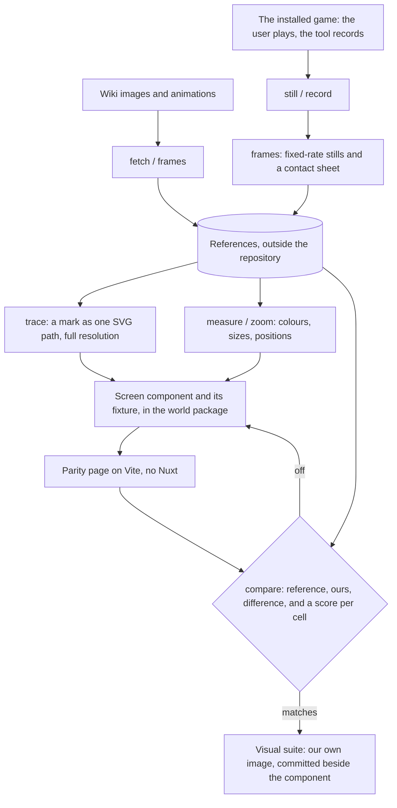

# Parity

The Genshin area recreates the game's own screens, so "does it look right" has an exact answer: the game. Parity is the loop that asks it. It is built for an agent, which reads images but drives no browser of its own: every step is one command that prints numbers and writes an image the agent reads. The user's eye stays the final check. The loop is fast enough that nobody has to wait on that check.

## How it works

- **References stay outside the repository.** They are HoYoverse's images, so they are fetched and recorded into `~/Esposter/genshin-parity` and never committed. The repository holds only which wiki file each screen is judged against (`ParityReferenceMap`).
- **The installed game is recorded, never driven.** The user starts the game and plays while the tool records. It sends the game no input, since the game's terms count injected input as botting.
- **Only the game's window is recorded.** Capture goes through Windows Graphics Capture, found by the game's executable. Nothing else reaches the file: no window above it, no desktop or webcam behind it, no cursor, and no overlay that is its own window. A recording of the screen's rectangle was tried first and took whatever was on screen whenever the user switched away. `record` waits for the window to open, so a recording can be armed before the game starts and take it from its first frame. It encodes on the GPU at 60 frames a second, near-lossless, into Matroska, which stays readable if the recording is cut short. A minimised game gives no frames, so a recording also ends by the clock, at its length in real time, rather than waiting for frames that are not coming.
- **FFmpeg is pinned, not installed.** Window capture arrived in FFmpeg 8, which no npm package bundles. The tool fetches one versioned release the first time it needs FFmpeg, refuses it unless its SHA-256 matches the pinned one, and unpacks it into `scripts/node_modules/.cache/ffmpeg`, so no install or CI run ever pays for it.
- **A glyph is traced from the game's own mark.** The tracer starts from the wiki's standalone render of a mark where one exists, since a mark on a screenshot is small and, when pale, too faint to split cleanly. It traces at the source's full resolution, never reduced, and prints the region beside the trace to check. The path it writes is the one the component draws. Nothing from the game ships except shapes derived this way, a choice made so the screens match exactly.
- **A screen is a component with a fixture, in its section.** Every screen is a presentational component under the world package's `components/interface/<section>`, where the sections follow the game's own: loading, menu, prompt, HUD, dialogue, map, character, settings. Beside each is a `<Name>.fixture.ts` whose `props` show the reference's state. Pieces two sections share are in `interface/shared`, and every component is exported by its file name at any depth, so a screen's name is unique across sections. Having a fixture is what puts a screen on the parity page and in the visual suite, so there is no list to keep. A screen lays itself out in the game's units, a 1080-unit-high screen that scales with the height (`--unit: calc(100cqh / 1080)`), because the game scales its interface the same way.
- **The comparison is numbers first.** `compare` shoots the screen in the machine's own Edge at 1080 CSS pixels high, scaled to the reference's pixel size. It prints the mean difference and a six-by-six grid of per-cell differences, then writes reference, ours and their difference side by side. A cell that stands out says where to zoom.
- **Motion is matched frame by frame.** A recording is first sampled at one frame a second to find its events, then each event at the full rate over its own window of time, into stills and a contact sheet with each frame's time. A fixture's `motionProps` are applied after the first frame when the shot asks for motion, and the parity page then holds every animation at its start; a still, and the visual suite, show the fixture's first state. `shoot` sets each animation to the same times as the game's frames, and `luma` prints one region's darkness across both sets as two curves. A fade's duration and a wipe's steps are read off those numbers rather than raced.
- **An approved screen is held by the visual suite.** `pnpm test:visual` renders every screen from its fixture in Vitest's browser mode and matches it against its own last image, kept in each section's `__screenshots__` beside its screens. It is a separate config, so an ordinary test run never starts a browser. `-u` approves what the screens draw now. A new screen's first run writes its image and fails once, which is Vitest's way of asking for that approval.

## Commands

From `scripts/`, as `pnpm genshin:parity <command>`; the parity page from `packages/genshin-world`, as `pnpm parity`.

| Command                                           | What it does                                                                                  |
| :------------------------------------------------ | :-------------------------------------------------------------------------------------------- |
| `fetch`                                           | Every reference not yet held, as PNG                                                          |
| `compare <reference>`                             | Shoots its screen, prints the scores, writes reference, ours, difference                      |
| `shoot <screen> <w> <h> [ms…]`                    | The parity page's screen at a size, paused at each time when given                            |
| `frames <file or File:…> [fps] [start] [seconds]` | A video or animated image as stills and a contact sheet, over a window                        |
| `luma <x> <y> <w> <h> <image>…`                   | One region's darkness across images, as a curve                                               |
| `measure <image> <x,y>…`                          | The image's size and the colour under each point                                              |
| `zoom <image> <x> <y> <w> <h>`                    | A region enlarged with hard edges                                                             |
| `trace <image or File:…> <x> <y> <w> <h> [scale]` | A glyph as one SVG path, and the region beside it to check                                    |
| `launch`, `still`, `record <name> [seconds]`      | Start the game, capture its window once, or record it once it opens (two minutes unless told) |

## What it costs

Each step takes seconds, so the loop runs as often as a test would:

- The parity page is up in about a second.
- A comparison, shot included, takes a few seconds.
- The visual suite's first screen takes a few seconds, and each further screen a fraction of one.
- A trace at a mark's full 1600-unit resolution takes a second or two.

The startup loading screen reached a mean difference of a few hundredths of a percent in two edits. The remainder is antialiasing along the edge of the lit marks.

## Key files

| File                                                                         | Role                                                                 |
| :--------------------------------------------------------------------------- | :------------------------------------------------------------------- |
| `scripts/src/genshinParity/index.ts`                                         | The commands                                                         |
| `scripts/src/services/genshinParity/ParityReferenceMap.ts`                   | Each reference, the wiki file it comes from and its screen           |
| `scripts/src/services/genshinParity/compareScreen.ts`                        | Shoot, score and lay reference, ours and difference side by side     |
| `scripts/src/services/genshinParity/traceImage.ts`                           | A mark traced into one path at full resolution                       |
| `packages/genshin-world/parity/screens.ts`                                   | Every screen with a fixture, for the page and the suite              |
| `packages/genshin-world/parity/screens.visual.ts`                            | The visual suite                                                     |
| `packages/genshin-world/src/components/interface/loading/StartupLoading.vue` | The game's startup screen: the seven marks, wiped in as loading goes |

## Sources

- [Visual regression testing](https://vitest.dev/guide/browser/visual-regression-testing), Vitest: `toMatchScreenshot` and where its reference images are kept.
- [imagetracerjs](https://github.com/jankovicsandras/imagetracerjs): the public-domain tracer behind `trace`.
- [Photo Mode](https://genshin-impact.fandom.com/wiki/Photo_Mode), Genshin Impact Wiki: capturing the game without its interface, for the world's references.
