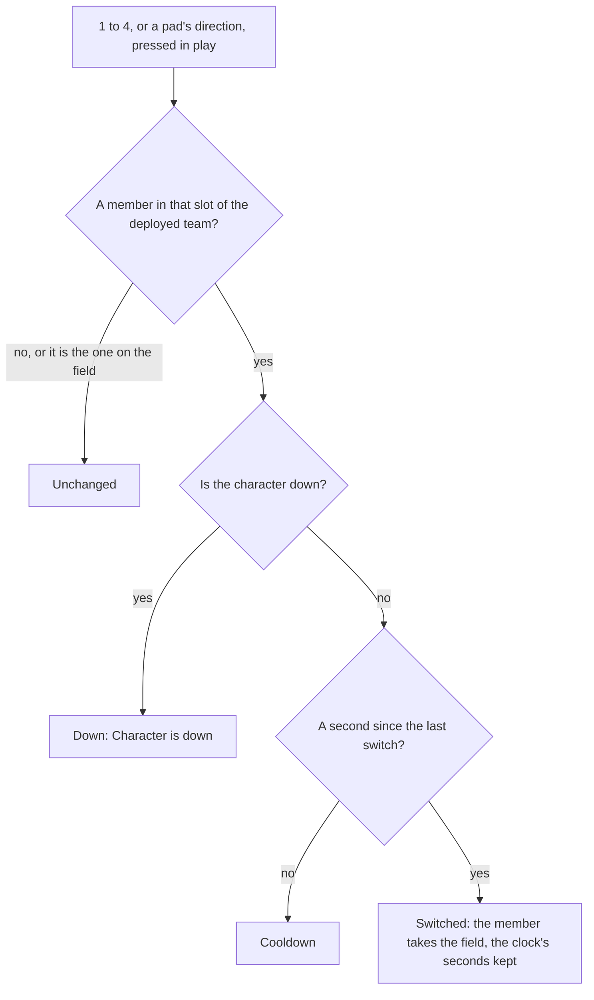

# Party

In the game, a party is a team of up to four characters, and the player keeps several: Party Setup, on `L`, holds the teams set up, one of them deployed, and one member of the deployed team is on the field. The keys `1` to `4`, and a pad's directions, switch the member on the field. `genshin-world` keeps this as a `Party`, plain data with a few rules over it, so it runs the same in a test as in the world.

## How it works

- **A party is its teams, the one deployed and the one on the field.** `Party` holds every `PartyTeam` set up, the index of the deployed one, the index of its member on the field, each character's own `PartyMember` by its id and the seconds on the world's clock at the last switch. `createParty` starts one as the game starts a player's: the four default teams, Party 1 to 4, the first deployed with the characters given at full HP and its first member on the field.
- **A character keeps its own HP, energy and cooldowns, whichever team holds it.** A `PartyMember` holds its HP as a share of its Max HP, so the HP keeps its share as the Max HP changes, as the game keeps it; its energy toward its burst; and the seconds left on its skill and its burst. A character is down when its HP is gone (`checkIsCharacterDown`), and a character a team takes on joins the party at full HP.
- **A fall brings on the next member.** `damagePartyMember` takes a share of a character's Max HP. One whose HP runs out is down and loses its energy, and if it was on the field the next member of the deployed team standing after it takes the field. `checkIsPartyDown` holds once the whole deployed team is down, and `reviveParty` brings each fallen member back at 35% of its Max HP, as the game revives a fallen team at the nearest waypoint. `drownParty` is the game's drowning: every member loses its energy and 10% of its Max HP.
- **A team is filled from the left.** A `PartyTeam` holds its members' character ids in slot order and the name the player gave it, `""` while it keeps the game's own.
- **A switch is a key's slot, in the order of the deployed team.** `PARTY_MEMBER_INPUT_ACTIONS` holds the actions for slots 1 to 4 ([controls](/docs/genshin/controls) binds them to `1` to `4` and a pad's up, right, left and down). `switchPartyMember` answers with a `PartySwitchResult`: `Unchanged` for an empty slot or the member already on the field, `Down` for a character who is down, `Cooldown` within `PARTY_SWITCH_COOLDOWN_SECONDS` of the last switch, and `Switched` otherwise.
- **Party Setup's edits are refused as the game refuses them.** `deployPartyTeam` deploys a team with its first member standing on the field, and answers `Empty` for a team with nobody in it and `Down` for one whose members are all down. `setPartyTeamCharacters` sets a team's members, each once and four at most; on the deployed team the field keeps its slot, or the last one past a shortened team, so it answers `Empty` for a team emptied and `Down` for a character who is down landing on the field. Both are a `PartyTeamResult`.
- **The character on the field** is `getActiveCharacterId`, the deployed team's member at the active index.
- **Teams are added, renamed and disbanded under the game's limits.** `addPartyTeam` adds an empty team named "Team Standing By" until renamed, and answers `Full` past fifteen teams. `disbandPartyTeam` keeps the four default teams and the deployed one (`Kept`), and a team disbanded before the deployed one moves its index down so the same team stays deployed. `renamePartyTeam` with an empty name gives a team its own name back.
- **A burst on a switch.** [Controls](/docs/genshin/controls) binds `Left Alt` with `1` to `4` to `SwitchToPartyMemberAndBurst1` to `4`, a chord that takes the press over from the plain key. The character's fixed step reads that press (`PARTY_MEMBER_BURST_INPUT_ACTIONS`) and uses its burst once the member is on the field, switched to by the world screen's key that frame or already there, so a refused switch (a cooldown, a fallen member, an empty slot) uses no burst.
- **Elemental Resonance is a rule over the deployed team's elements.** `getElementalResonances` gives each element that two or more of a full team's four members share, in the game's element order, and none for a team not full.

## The world screen

The world screen keeps the player's characters and their party. A new player's is the Traveler alone, made by `createCharacter` once the roster arrives, at level 1 with the weapon the game gives them ([character attributes](/docs/genshin/character-attributes)). Once a frame, in play with no screen over the world, the first party key pressed is passed to `switchPartyMember` at the canvas clock's elapsed seconds, so a screen over the world holds the keys as it holds the rest of play.

The character on the field fights through its kit, which prices every character's hits from its attributes with the Traveler's kit until the kits run gives each its own ([combat](/docs/genshin/combat)). An enemy's strike and a drowning take HP from the party, and a team that has all fallen revives at 35% and is jumped to the Statue of The Seven nearest the body, or left where it fell when none is loaded.

## Key files

| File                                                                  | Role                                                                                 |
| :-------------------------------------------------------------------- | :----------------------------------------------------------------------------------- |
| `packages/genshin-world/src/models/party/Party.ts`                    | The teams, the one deployed, the field, each member, the clock                       |
| `packages/genshin-world/src/services/party/createParty.ts`            | A party as the game starts one                                                       |
| `packages/genshin-world/src/services/party/switchPartyMember.ts`      | A key's switch, or the game's reason for refusing it                                 |
| `packages/genshin-world/src/services/party/deployPartyTeam.ts`        | A team deployed, its first member standing on the field                              |
| `packages/genshin-world/src/services/party/setPartyTeamCharacters.ts` | A team's members set, the field keeping its slot                                     |
| `packages/genshin-world/src/services/party/damagePartyMember.ts`      | HP taken, a fall, and the next member brought on                                     |
| `packages/genshin-world/src/services/party/gainPartyEnergy.ts`        | A particle's energy to each standing member of the deployed team                     |
| `packages/genshin-world/src/services/party/stepPartyCooldowns.ts`     | Each member's skill and burst cooldowns, lowered each step                           |
| `packages/genshin-world/src/services/party/addPartyTeam.ts`           | A team added to Party Setup, named until renamed, at most fifteen                    |
| `packages/genshin-world/src/services/party/disbandPartyTeam.ts`       | A team disbanded, the defaults and the deployed one kept                             |
| `packages/genshin-world/src/services/party/renamePartyTeam.ts`        | A team renamed, an empty name giving its own back                                    |
| `packages/genshin-world/src/services/party/getElementalResonances.ts` | The resonances a full team's elements give                                           |
| `packages/genshin-world/src/services/party/drownParty.ts`             | A drowning: every member's energy and a tenth of its Max HP                          |
| `packages/genshin-world/src/services/party/reviveParty.ts`            | A fallen team brought back at 35% of its Max HP                                      |
| `packages/genshin-world/src/services/map/findNearestLandmark.ts`      | The loaded statue nearest the body, where a fallen team is jumped to                 |
| `packages/genshin-world/src/services/party/constants.ts`              | The team size, the cooldown, the default teams and the keys                          |
| `packages/genshin-world/src/components/World/Character/Index.vue`     | Steps the field's kit, its cooldowns, a drowning and a burst on a switch             |
| `packages/genshin-world/src/components/World/Screen/Index.vue`        | Keeps the characters and the party, switches on the keys, and respawns a fallen team |

## Notes

- **The cooldown is the single player's.** The wiki gives one second; co-op splits the four slots between players and is out of the world's scope.
- **Only the character on the field takes an enemy's strike.** The others' HP falls only by a drowning, which takes every member's energy and a tenth of its Max HP together, while their cooldowns keep running off the field.

## Sources

- [Party](https://genshin-impact.fandom.com/wiki/Party), Genshin Impact Wiki: four members, the one second switch cooldown, Party Setup on `L`, the four default teams that are never disbanded, a team filled from the left and a team of none never deployed.
- [Fallen Character](https://genshin-impact.fandom.com/wiki/Fallen_Character), Genshin Impact Wiki: a fallen character is never switched in, and "Character is down" for a fallen character on the field's slot or a team of fallen characters deployed; a fallen character's energy lost, the fallen team revived at the nearest waypoint with 35% HP, and drowning's 10% of every member's Max HP and all its energy.
- [Health](https://genshin-impact.fandom.com/wiki/Health), Genshin Impact Wiki: the next character brought on when one falls, and the HP keeping its share as the Max HP changes.
- [Controls](https://genshin-impact.fandom.com/wiki/Controls), Genshin Impact Wiki: party members 1 to 4 on the number keys and a pad's up, right, left and down.
