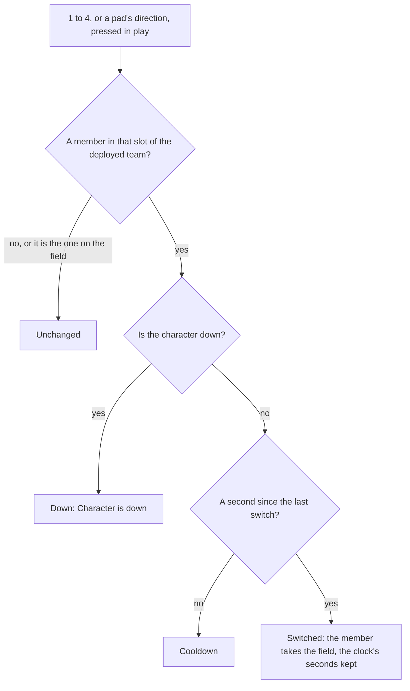

# Party

In the game, a party is a team of up to four characters, and the player keeps several: Party Setup, on `L`, holds the teams set up, one of them deployed, and one member of the deployed team is on the field. The keys `1` to `4`, and a pad's directions, switch the member on the field. `genshin-world` keeps this as a `Party`, plain data with a few rules over it, so it runs the same in a test as in the world.

## How it works

- **A party is its teams, the one deployed and the one on the field.** `Party` holds every `PartyTeam` set up, the index of the deployed one, the index of its member on the field, the characters who are down and the seconds on the world's clock at the last switch. `createParty` starts one as the game starts a player's: the four default teams, Party 1 to 4, the first deployed with the characters given and its first member on the field.
- **A team is filled from the left.** A `PartyTeam` holds its members' character ids in slot order and the name the player gave it, `""` while it keeps the game's own.
- **A switch is a key's slot, in the order of the deployed team.** `PARTY_MEMBER_INPUT_ACTIONS` holds the actions for slots 1 to 4 ([controls](/docs/genshin/controls) binds them to `1` to `4` and a pad's up, right, left and down). `switchPartyMember` answers with a `PartySwitchResult`: `Unchanged` for an empty slot or the member already on the field, `Down` for a character who is down, `Cooldown` within `PARTY_SWITCH_COOLDOWN_SECONDS` of the last switch, and `Switched` otherwise.
- **Party Setup's edits are refused as the game refuses them.** `deployPartyTeam` deploys a team with its first member standing on the field, and answers `Empty` for a team with nobody in it and `Down` for one whose members are all down. `setPartyTeamCharacters` sets a team's members, each once and four at most; on the deployed team the field keeps its slot, or the last one past a shortened team, so it answers `Empty` for a team emptied and `Down` for a character who is down landing on the field. Both are a `PartyTeamResult`.
- **The character on the field** is `getActiveCharacterId`, the deployed team's member at the active index.

## The world screen

The world screen keeps the player's characters and their party. A new player's is the Traveler alone, made by `createCharacter` once the roster arrives, at level 1 with the weapon the game gives them ([character attributes](/docs/genshin/character-attributes)). Once a frame, in play with no screen over the world, the first party key pressed is passed to `switchPartyMember` at the canvas clock's elapsed seconds, so a screen over the world holds the keys as it holds the rest of play.

## Key files

| File                                                                  | Role                                                           |
| :-------------------------------------------------------------------- | :------------------------------------------------------------- |
| `packages/genshin-world/src/models/party/Party.ts`                    | The teams, the one deployed, the field, who is down, the clock |
| `packages/genshin-world/src/services/party/createParty.ts`            | A party as the game starts one                                 |
| `packages/genshin-world/src/services/party/switchPartyMember.ts`      | A key's switch, or the game's reason for refusing it           |
| `packages/genshin-world/src/services/party/deployPartyTeam.ts`        | A team deployed, its first member standing on the field        |
| `packages/genshin-world/src/services/party/setPartyTeamCharacters.ts` | A team's members set, the field keeping its slot               |
| `packages/genshin-world/src/services/party/constants.ts`              | The team size, the cooldown, the default teams and the keys    |
| `packages/genshin-world/src/components/World/Screen/Index.vue`        | Keeps the characters and the party, and switches on the keys   |

## Notes

- **The cooldown is the single player's.** The wiki gives one second; co-op splits the four slots between players and is out of the world's scope.
- **Nothing makes a character fall yet.** A character goes down when [combat](/docs/genshin/combat)'s damage takes its last HP, which writes `fallenCharacterIds`; until then nobody is down and the rule only refuses in its tests.

## Sources

- [Party](https://genshin-impact.fandom.com/wiki/Party), Genshin Impact Wiki: four members, the one second switch cooldown, Party Setup on `L`, the four default teams that are never disbanded, a team filled from the left and a team of none never deployed.
- [Fallen Character](https://genshin-impact.fandom.com/wiki/Fallen_Character), Genshin Impact Wiki: a fallen character is never switched in, and "Character is down" for a fallen character on the field's slot or a team of fallen characters deployed.
- [Controls](https://genshin-impact.fandom.com/wiki/Controls), Genshin Impact Wiki: party members 1 to 4 on the number keys and a pad's up, right, left and down.
