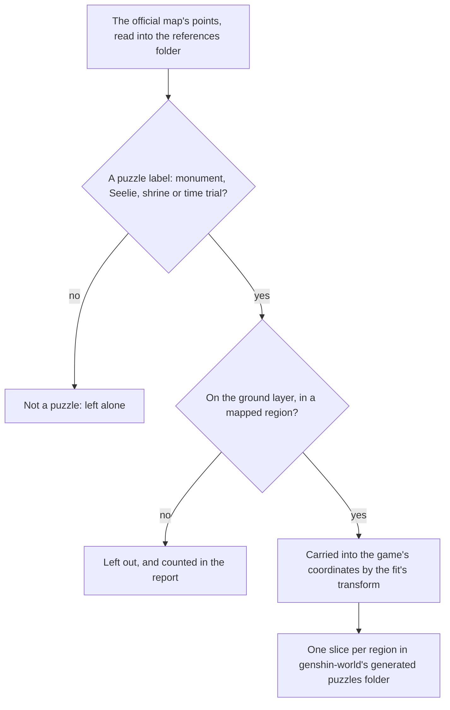
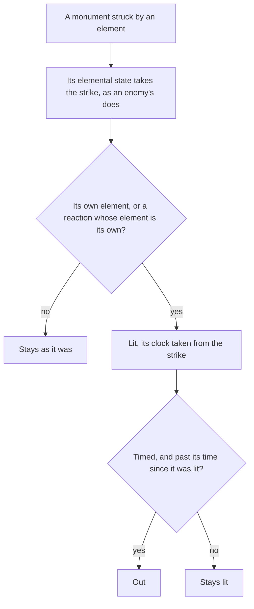

# Puzzles

The servers' puzzle mechanisms are not in the client's data, so the map's public points stand in for their places, per the [spawned places](/docs/genshin/spawned-places) page. This page is the built half of the [puzzles](/docs/proposals/genshin/puzzles) proposal: each puzzle mark the map gives is carried into its region's slice by its kind, and an Elemental Monument is a small state machine that a strike or a reaction lights. Nothing is placed in the world, drawn, struck or solved yet.

## How it works

## The writer

`pnpm -C scripts genshin:assets puzzles` writes one slice per region in `packages/genshin-world/src/generated/puzzles/`, in the shape the [chests](/docs/genshin/chests) page describes. Its report lists each region's places and the ones it left out.

- **The four kinds are the map's labels.** An Elemental Monument is the monument label, a Seelie is the Seelie label with the two variants the map names beside it (Electro and Warming), a Shrine of Depths is each nation's and the borderland's shrine label, and a Time Trial Challenge is the challenge label. The map gives each nation's shrine a label of its own, so the kind is the one thing those labels share.
- **The ground only and the mapped areas only.** As the chests are, a point on a layer under the ground or in an area no region is mapped to is counted and left out.
- **Only places.** The map gives no element, no timing and no wiring for a mark, so none of those is written. The writer shares its placement with the chests' writer, the `placeMapPoints` primitive, so a kind of point is one label map away from a slice.

## The monument

An `ElementalMonument` holds its element, its own elemental state, whether it is lit, whether it is timed, and the state's clock reading when it was last lit.

- **A strike** (`strikeElementalMonument`) lands on the monument's elemental state through `applyElement`, as a kit's hit lands on an enemy. The monument is lit by the element itself, or by any reaction whose element is its own, so a Swirl that spreads the Pyro on it lights a Pyro monument as much as a Pyro strike does. A lit monument's clock restarts from the strike.
- **A step** (`stepElementalMonument`) moves the elemental state on the fixed step, so its auras decay and its Burning ticks Pyro, lighting it from any reaction of its own. A timed monument that is not lit again goes out once `ELEMENTAL_MONUMENT_LIT_SECONDS` have passed since it was lit; an untimed one stays lit.
- **A solve** (`checkIsMonumentPuzzleSolved`) holds once every monument of a puzzle is lit together, and never by none at all.

`ELEMENTAL_MONUMENT_LIT_SECONDS` is provisional until a recording of a timed monument going out measures it.

## The Seelie

A `Seelie` holds its start and its court on the ground, its progress along the route between them, its state and the time it has been left unfollowed. It is `Resting` where it was found, becomes `Led` once the player follows it, walks its route while followed and `Settled` at the court. Left unfollowed for `SEELIE_RETURN_SECONDS` it goes back to its start, `Resting`, and a settled one stays settled. `stepSeelie` moves it on the fixed step, and the caller reports whether the player is following it that step. A route's walk takes `SEELIE_ROUTE_SECONDS` provisionally.

The map gives one point per Seelie and no court, so a Seelie's court and start are not yet fitted into the world: the court is the one the wiki says a Seelie settles in, and the placed court is still to come.

## The Time Trial Challenge

A `TimeTrialChallenge` holds its clock's limit and what is left of it, its state, and how many of its targets are struck against how many it asks for. `startTimeTrialChallenge` starts an idle one from its marker, `strikeTimeTrialTarget` counts a target done and solves the challenge once the last is, and `stepTimeTrialChallenge` runs the clock on the fixed step and fails it when it runs out. A solved challenge is the solve event: once challenges are placed, the world will read its `Solved` state and spawn its chest, which the chests opening will grant. The map gives no limit or target count per challenge, so both come from the world's data once measured.

## Key files

| File                                                                        | Role                                                                        |
| :-------------------------------------------------------------------------- | :-------------------------------------------------------------------------- |
| `packages/genshin-world/src/models/puzzle/PuzzleKind.ts`                    | The four kinds the official map marks as puzzles                            |
| `packages/genshin-world/src/models/puzzle/PuzzlePlace.ts`                   | A placed puzzle mechanism: its id, kind and ground point                    |
| `packages/genshin-world/src/models/puzzle/ElementalMonument.ts`             | A monument's element, elemental state, lit state and timing                 |
| `packages/genshin-world/src/services/puzzle/strikeElementalMonument.ts`     | A strike on a monument, lighting it by its element or a reaction of its own |
| `packages/genshin-world/src/services/puzzle/stepElementalMonument.ts`       | A monument's elemental state on the fixed step, and its time going out      |
| `packages/genshin-world/src/services/puzzle/checkIsMonumentPuzzleSolved.ts` | Whether every monument of a puzzle is lit together                          |
| `packages/genshin-world/src/models/puzzle/Seelie.ts`                        | A Seelie's start, court, route progress and state                           |
| `packages/genshin-world/src/models/puzzle/TimeTrialChallenge.ts`            | A challenge's clock, targets and state                                      |
| `packages/genshin-world/src/services/puzzle/stepSeelie.ts`                  | A Seelie led while followed, settled at its court or sent back to rest      |
| `packages/genshin-world/src/services/puzzle/startTimeTrialChallenge.ts`     | Starts an idle challenge's clock from its marker                            |
| `packages/genshin-world/src/services/puzzle/strikeTimeTrialTarget.ts`       | Counts a target done, solving the challenge on its last                     |
| `packages/genshin-world/src/services/puzzle/stepTimeTrialChallenge.ts`      | Runs a challenge's clock on the fixed step, failing it when it runs out     |
| `packages/genshin-world/src/services/puzzle/constants.ts`                   | The timed monument's lit time, and a Seelie's return and route times        |
| `packages/genshin-world/src/generated/puzzles/`                             | One slice per region, imported on demand once the world places them         |
| `scripts/src/services/genshinAssets/puzzles/PuzzleKindLabelIdsMap.ts`       | Each kind's labels on the official map                                      |
| `scripts/src/services/genshinAssets/puzzles/writePuzzlePlaces.ts`           | Writes each region's puzzle places from the points                          |
| `scripts/src/services/genshinAssets/points/placeMapPoints.ts`               | Carries a kind's labelled points into their regions, shared with chests     |
| `scripts/src/services/genshinAssets/commands/puzzlesCommand.ts`             | `genshin:assets puzzles`                                                    |

## Sources

- [Teyvat Interactive Map](https://act.hoyolab.com/ys/app/interactive-map/index.html), HoYoLAB: the official map. Its label tree and point list are the public data the writer reads as references.
- [Elemental Monument](https://genshin-impact.fandom.com/wiki/Elemental_Monument), Genshin Impact Wiki: monuments lit by their element, reactions included, some for good and some for a time.
