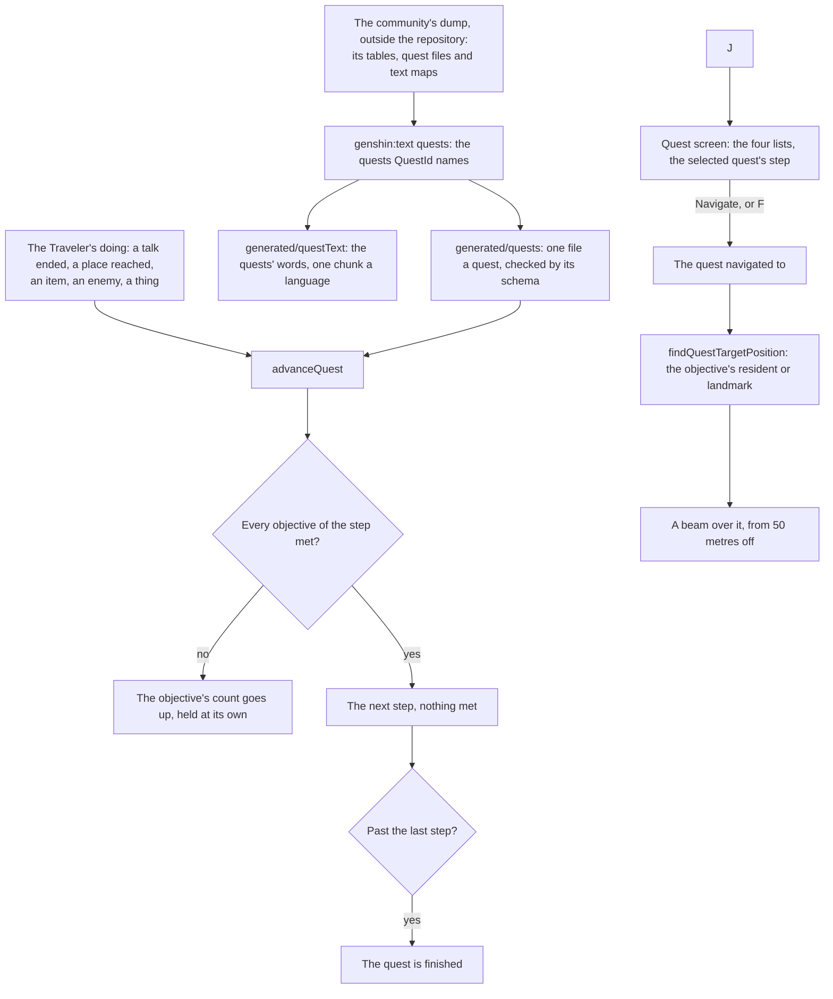

# Quests

The game's quests are its story: the Archon quests of the main story, a character's story quests, the world quests found about the map, an event's quests and the daily commissions. Each is a run of steps, and each step asks something of the Traveler. The world holds a quest as the game's data does, by the game's own ids, and a quest's words come from the game's own text, as the [dialogue](/docs/genshin/dialogue) page's talks do.

## How it works

### A quest

A `Quest` has the game's id, its kind, its title and description by text id, its steps in the order they are done, and the talks it runs. A step has its id, its line by text id (the "Talk to Paimon" the quest screen shows) and its objectives. An objective has a kind, a target and a count:

| Kind     | What it asks                    | Its target, as the game's own condition names it |
| :------- | :------------------------------ | :----------------------------------------------- |
| GoTo     | reach a place                   | the place's trigger                              |
| TalkTo   | finish a talk                   | the talk                                         |
| Defeat   | defeat enemies, a count of them | the enemy                                        |
| Collect  | collect items, a count of them  | the item                                         |
| Interact | act on a thing                  | the thing, or the waypoint unlocked              |

The kinds are the game's five, and the quest screen files them under the game's four lists. An event's quests are listed among the world quests, as the game's own quest types have it.

### Progress

A quest's progress is the step it is on, which equals the number of steps once it is finished, and how many times each of that step's objectives has been met. `advanceQuest` takes a `QuestEvent`, the kind of the Traveler's doing and the id it names. Each objective of the current step that the event names is met once more, held at its count. Once every objective is met, the quest moves on to its next step with nothing met. An event no objective names leaves the quest where it was, and so does any event once the quest is finished.

### The quest screen

`QuestScreen` is J's screen, through the screens' `ScreenKind.Quests`. Its tabs along the top list every quest, then each of the game's four lists, and Q and E step between them. Down the left, each list's quests sit under its heading in the game's words. On the right are the selected quest's title, its step with its first counted objective's "(n/m)", and its description, over the button that navigates to it, or cancels the navigation of the quest already navigated to. F presses that button. The screen reads the quests in progress, their progress and their text map, and the world screen holds the one navigated to.

### Navigation

`findQuestTargetPosition` finds where an objective's target stands among the regions in reach: the resident or landmark it names, or the resident whose talk it names. `QuestBeam` raises a column of light over that spot once the camera is 50 metres or more away, the distance at which the wiki says the game's beam appears. The beam reaches from under the lowest ground to over the highest peak, so it rises out of the ground wherever it stands with no height read for it. The world raises it over the first objective of the navigated quest's current step, in the floating origin's group, and V or a press on the [HUD](/docs/genshin/hud)'s tracker navigates to the quest the tracker shows.

### The quests' content

`QuestId` is the inventory of quests the world carries, the prologue's first two to begin with. `pnpm -C scripts genshin:text quests` writes each one into the world: its kind, title and description from the quest table, and its shown steps from its binary output. It also writes the talks those steps end on, from the dialog table with each speaker named from the character table, and every word they show in every language. Each quest is checked against the world's own schema before it is written.

The dump scrambles the binary output's field names each patch, so the reader finds each field by its shape, as [game data formats](/docs/genshin/game-data-formats) describes. A step with no words is the game's own bookkeeping and is left out. A shown step whose conditions ask nothing the Traveler does, such as a cutscene played, is left out and noted.

## Key files

| File                                                                   | Role                                                                |
| :--------------------------------------------------------------------- | :------------------------------------------------------------------ |
| `packages/genshin-world/src/models/quest/Quest.ts`                     | A quest: its kind, words, steps and talks, with its schema          |
| `packages/genshin-world/src/models/quest/QuestObjective.ts`            | One thing a step asks for, by its kind, target and count            |
| `packages/genshin-world/src/services/quest/advanceQuest.ts`            | The Traveler's doing met against the current step, step by step     |
| `packages/genshin-world/src/services/quest/findQuestTargetPosition.ts` | Where a navigated objective's target stands                         |
| `packages/genshin-world/src/services/quest/QuestKindCategoryMap.ts`    | Each kind's list on the quest screen                                |
| `packages/genshin-world/src/services/quest/constants.ts`               | The screen's tab order and keys, and the beam's distance and look   |
| `packages/genshin-world/src/components/Quest/Screen/Index.vue`         | The quest screen J opens                                            |
| `packages/genshin-world/src/components/Quest/Beam/Index.vue`           | The beam over the navigated objective                               |
| `packages/genshin-world/src/models/quest/QuestId.ts`                   | The quests the world carries, the reader's inventory                |
| `scripts/src/services/genshinText/writeQuests.ts`                      | The reader: every inventoried quest, its talks and words written    |
| `scripts/src/services/genshinText/readQuestSteps.ts`                   | A quest's shown steps read off its scrambled binary output by shape |
| `scripts/src/services/genshinText/readTalk.ts`                         | A talk read off the dialog table                                    |

## Notes

- **Nothing starts a quest yet.** The world screen's quest list is empty until quests are loaded and started, so J opens an empty screen. The [quests proposal](/docs/proposals/genshin/quests) lists what joins them to the world.
- **A step keeps one objective.** A step that finishes on any of several places lists each as a condition, so the reader keeps the first condition that asks something. A step asking for two things at once would lose the second.
- **The beam's look is provisional.** Its radius and colour wait on a recording of the English client navigating to an objective.
- **The quest screen is laid out, not yet likeness.** Its header, tabs, list, details and navigation button sit at the English client's 1080-high places, measured off the wiki's screenshot. Its five tab glyphs stand in as diamonds until traced, its header reads the game's "Quests" where the client reads "In Progress" (that text is not in the English the package carries), and its quest distances, kind and place marks, rewards row, Quest Overview button and UID are not built. The client draws the world blurred behind the screen; the parity page has no world to draw, so its frame scores 55.84% mean and 0.8998 FLIP, most of it that blur, and the screen's open, close and tab animations are not yet timed (the roadmap's Recordings owed).

## Sources

- [Quest](https://genshin-impact.fandom.com/wiki/Quest), Genshin Impact Wiki: the Archon, story and world quests and the commissions, and the beam that marks a navigated objective from 50 metres off.
- [Quest/Menu](https://genshin-impact.fandom.com/wiki/Quest/Menu), Genshin Impact Wiki: the quest screen's list grouped by Archon quests, story quests, commissions and world quests, its tabs, and its quest information with its Navigate button.
- [Event Quest](https://genshin-impact.fandom.com/wiki/Event_Quest), Genshin Impact Wiki: most event quests are world quests, and a flagship event's are story quests.
- [Controls](https://genshin-impact.fandom.com/wiki/Controls), Genshin Impact Wiki: J for the quest menu, V for quest navigation, and holding V to show the step's objective.
- [AnimeGameData](https://gitlab.com/Dimbreath/AnimeGameData), the community's per-patch dump: the quest table's types and words, each quest's binary output of steps and conditions, and the dialog and character tables a talk is read from.
