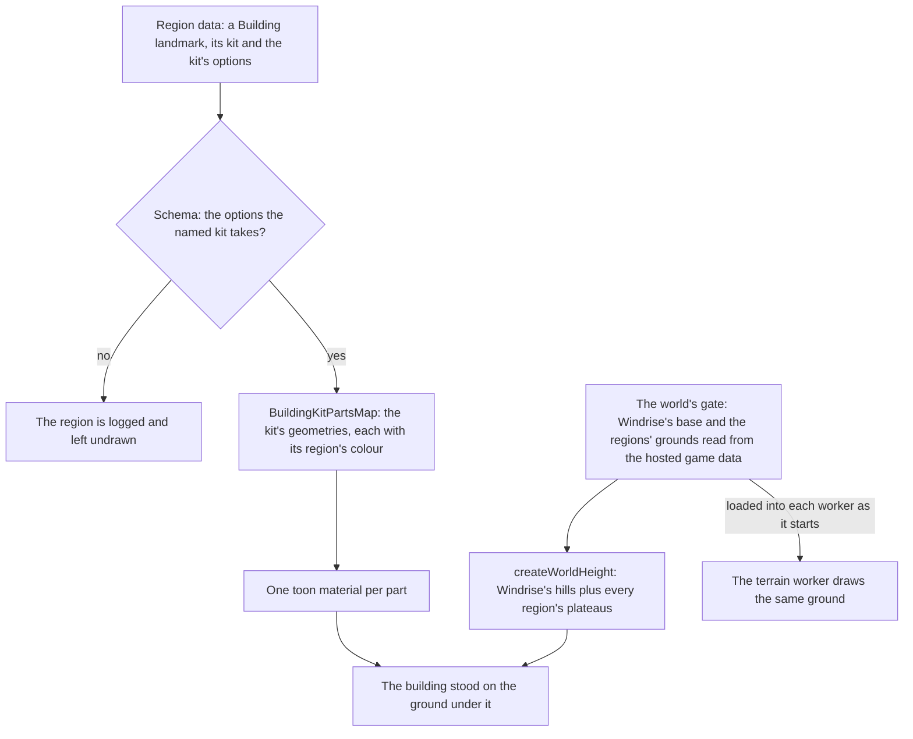

# Region buildings

Every region has a building kit of its own, and a region's towns are built from it. A building landmark is the one landmark kind for all of them: its data names the kit, which is its region's, and carries the options that kit takes, so a Liyue hall and a Fontaine row house are one kind with different options. Each region's capital stands as one building of its kit, the first landmark of every region but Mondstadt's Windrise, so a camera that reaches any region finds something of it standing on its ground.

## How it works

- **The kit is the region's.** `BuildingKit` names one kit per region: Mondstadt's house, Liyue's terraced hall, Inazuma's post-and-beam building, Sumeru's rainforest city, Fontaine's row house, Natlan's tribe building on the engine's generic building, Nod-Krai's dieselpunk works and Snezhnaya's stepped hall. A building's options are checked against its kit's own schema as the region's data arrives (`regionBuildingSchema`, a union by kit), so a Fontaine building carrying Liyue's options fails its region rather than reaching a generator.
- **Parts in the region's colours.** `BuildingKitPartsMap` turns each kit's result into parts, one geometry for each material the kit draws in, coloured from its region's palette in `services/<region>/constants.ts`. `WorldLandmarkBuilding` gives each part a toon material, so a building costs one draw per material, and frees both when its region is released.
- **One ground for the world.** `createWorldHeight` builds the ground every reader stands on: the terrain worker, the character's body, the cameras and every landmark. It composes Windrise's fitted hills over the world's base with every other region's plateaus, the `ground/<region>` records the world's screen reads from the [hosted game data](/docs/genshin/hosted-game-data) before it opens, through [terrain shape height](/docs/genshin/terrain-shape-height), so each region's features are filed into the same cells as the hills and a point reads only those near it. The session builds it once and hands it down as `getGroundHeight`, and each terrain worker builds its own from the same records, loaded into it as it starts. A plateau's height is over the base, which is the ground everywhere no fit has reached.
- **Capitals at provisional places.** Each capital stands where its city's waypoints do in the game's own data, read once by hand to the nearest ten metres: Mondstadt City, Liyue Harbor, Inazuma City, Sumeru City, the Court of Fontaine, Natlan's People of the Springs, Nod-Krai's Nasha Town. Snezhnaya's capital, Snezhnograd, is not in the community's dump yet, so it stands at the place the scene has always set by hand, written into `RegionCapitalMap`: about four kilometres along x from Nasha Town, level with it in z. Each plateau is raised to its capital's height the same way, and each capital's area has a square outline round it, so its region loads when the camera comes within reach.
- **The fit places them exactly.** `genshin:assets fit windrise --only landmarks` places Windrise's oak and statue from the game's placements and then every capital from its waypoints (`fitRegionCapitals`). The game's own area table names each capital's areas; their waypoints are the scene points of the kind Windrise's statue is, and the median waypoint stands the landmark and centres and lifts its region's first plateau. Mondstadt's capital is written after Windrise's landmarks, since both are in its one file. Each plateau it moves is written into its region's `ground.json`, the file people edit, and published as `ground/<region>` in the same run.

## Key files

| File                                                                      | Role                                                                 |
| :------------------------------------------------------------------------ | :------------------------------------------------------------------- |
| `packages/genshin-world/src/models/world/BuildingLandmark.ts`             | A building landmark: its region's kit and the options that kit takes |
| `packages/genshin-world/src/models/world/RegionBuilding.ts`               | The kit and its options, checked against the kit's own schema        |
| `packages/genshin-world/src/models/world/BuildingKit.ts`                  | The kit each region builds with                                      |
| `packages/genshin-world/src/services/world/BuildingKitPartsMap.ts`        | Each kit's geometries as parts in its region's colours               |
| `packages/genshin-world/src/components/World/Landmark/Building/Index.vue` | A building drawn on the ground, one material per part                |
| `packages/genshin-world/src/services/world/createWorldHeight.ts`          | The world's one ground: Windrise's hills and every region's plateaus |
| `packages/genshin-world/src/models/world/RegionGround.ts`                 | A region's plateaus where no fit has drawn its ground                |
| `scripts/src/services/genshinAssets/fit/fitRegionCapitals.ts`             | Every capital stood at its waypoints, and its plateau raised to them |
| `scripts/src/services/genshinAssets/fit/RegionCapitalMap.ts`              | Each region's first landmark and the game's areas that place it      |

## Notes

- **Places, plateaus, outlines and colours are provisional.** The places and heights wait on the fit, the palettes on sampling the game's own building textures, and each area's square outline on the area's own; the [roadmap](/docs/genshin/roadmap) holds each.
- **A plateau stands within the terrain's bounds.** Every tile's box spans the heights Windrise's fit stands between, so a region's ground above or below them would be culled where it shows; `createWorldHeight.test.ts` fails for any plateau outside them.
- **The game's map turns ours.** Placed by the game's own coordinates, the capitals stand with north along x and east along z, Inazuma east of Liyue and Fontaine to its north-west, since the game's x and the mirror of its z are the scene's.
