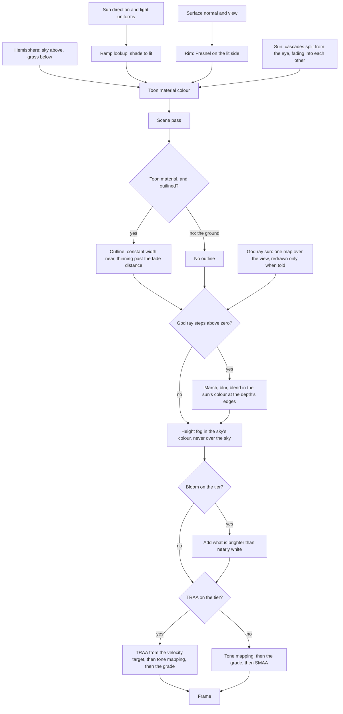

# Rendering style

Genshin's world does not read as anime because of its models. It reads that way because of how light lands on them. Surfaces step from lit to shade across a narrow painted band instead of a physical falloff. Shadow is a colour, a cool sky blue, rather than black. Edges catch a rim of sky light, and distance dissolves into a haze the colour of the sky. The engine sets that look once, in the materials and passes every later page draws with, and it is shown in Windrise, the valley where the game's world opens: a great oak on a grassy rise, with a Statue of The Seven in its shade, through the day the [sky](/docs/genshin/sky-and-time) runs.

## How it works

### Materials

- **One toon material for the environment.** Every surface uses `createToonMaterial`, three's `MeshToonNodeMaterial` reading the world's ramp: a short row of bytes from dark to lit with a narrow smooth step (`computeRampValues`), so light steps across a band rather than a Lambert curve. The ramp's dark side is zero, so a face turned from the sun takes only ambient light.
- **Shadow is a colour, not an absence.** Cast shadow and the ramp's dark side both leave only the hemisphere light, whose sky is above and whose bounce is the grass below, so shade reads as the sky's blue and the ground's green. Nothing is multiplied toward black.
- **A rim picks out silhouettes.** A Fresnel term, masked to the side the sun lights and tinted by the sky, is the material's emissive node (`createRimNode`), so it lights on top of the ramp. Its colour and strength are the shared `LightUniforms` every material reads, so the [sky](/docs/genshin/sky-and-time) moves them through the day by writing a few values.
- **Leaves are cut in the shader.** A leaf card is a plain quad cut to a pointed oval by its opacity (`createLeafMaterial`), so a crown needs no leaf texture.

### Outlines

- **One pass outlines every toon material.** `ToonOutlinePassNode` draws the scene with a back-face shell around each object whose material carries three's toon flag.
- **The ground opts out.** The game draws no outline around its terrain, so the ground's material is built with `isOutlined: false`, which clears that flag while keeping the toon lighting (`ToonNodeMaterial`). Without it, every ridge would draw an ink line against the sky.
- **Width thins with distance.** Three extrudes the shell by a constant width on screen. The engine scales the thickness by the fade distance over the view distance, capped at one, so an outline keeps its width up close and holds a constant width in the world past the fade distance. A far tree keeps a line without turning to ink.

### Shadows

- **The sun casts through cascades.** `createSunLight` attaches three's `CSMShadowNode` to the sun: the view is split from the eye outward in the practical scheme, each cascade with its own map. Near shadows stay crisp and far ones cheap, and each cascade spans more ground than the last, which softens the far shadows into the blotches the game draws. Neighbouring cascades fade into each other rather than meeting at a seam. The cascades follow the camera on their own, so the light's position sets only the sun's direction, and the last cascade ends at the region's `SHADOW_MAX_FAR`.
- **The ground casts too**, so a hill shadows the slope behind it when the sun is low.

### After the scene

- **God rays march through a shadow of their own.** Three's `GodraysNode` reads one light's single shadow map, but the sun's shadow is split into cascades, each covering only a slice of the view. So `createGodraysLight` adds a second sun that lights nothing, whose one map spans the view. The ground and the landmarks stand still, so its map is drawn only when `shadow.needsUpdate` is set, which the sky does each time the light has turned half a degree. The rays are marched at half resolution, smoothed by a bilateral blur, and blended in the sun's colour by `depthAwareBlend`, which keeps them from bleeding over the edges of what stands in front.
- **A height fog in the sky's colour.** `createHeightFogNode` integrates a haze whose density falls off exponentially with height along the ray from the eye to what each pixel shows, starting past a start distance. Low ground and the far world thicken toward the fog's colour, the peaks rise out of it, and a level ray takes the limit the general form divides by zero to reach. It runs after the outline pass, so an outline fades with what it outlines, and it skips the sky, which is already the fog's colour. Its colour, density, falloff, base height and start distance are `FogUniforms`, whose colour the sky writes.
- **Bloom lifts only the brightest light**: what is brighter than nearly white, which is the sun, glints and elemental light.
- **A colour grade per region.** `computeGradeLut` builds a cube of display colours from a region's `GradeOptions`: contrast about the middle, saturation about each colour's grey, a shadow tint weighted toward the dark and a highlight tint toward the light. `Lut3DNode` maps the frame through it after the tone mapping, so the grade follows the tone curve rather than feeding it. The grade is authored as numbers against the region's reference screenshots, never sampled from their pixels. Windrise's is cool in shade and warm in light.
- **Anti-aliasing by tier.** TRAA resolves the scene's edges before the tone mapping from a velocity target the scene pass writes beside its colour, and it settles the thin outlines and leaf edges that SMAA leaves shimmering. A tier that pays for neither the velocity target nor a frame of history takes SMAA over the graded frame instead.

### Quality steps down, never out

Each `QualityTier` sets what the frame spends (`QualityTierSettingsMap`): the shadow maps' size and the number of cascades, the god rays' march steps (none on the lowest tier), the pixel ratio, bloom, and TRAA or SMAA. The ramp, the rim and the outline stay at every tier, because they are the style. The tier is read when the scene mounts, since its cascades are built with the sun.

### The tuning panel

In development, `useGenshinTuning` opens three's inspector with a **Look** panel over the ramp, the rim, the outline, the fog, the grade, the god rays and bloom. A slider writes the uniform, or regenerates the texture it drives, at once, so the look is tuned against reference screenshots rather than guessed. Nothing is saved: a value that looks right is copied into the region's constants. The inspector is imported only from that composable, so a production build never loads it.

## What it costs to run

- **The god rays' map is drawn about every two seconds**, as the sun turns, not every frame, since nothing it shadows moves. Every material still samples it with the sun's, which is the price of a light the god rays can read.
- **The god rays march at half resolution**, and a tier drops them before it drops pixels.
- **The fog and the grade are arithmetic** in the passes the frame already runs through, with no render target of their own.
- **Every generator is benched at two scales or more.** The grade's cube costs its texels, and the bench beside `computeGradeLut` holds that at two sizes.

## Key files

| File                                                             | Role                                                                            |
| :--------------------------------------------------------------- | :------------------------------------------------------------------------------ |
| `packages/genshin-engine/src/nodes/createToonMaterial.ts`        | The environment material: ramp, rim, and whether it is outlined                 |
| `packages/genshin-engine/src/nodes/ToonNodeMaterial.ts`          | The toon material with the emissive rim and the outline flag                    |
| `packages/genshin-engine/src/nodes/createRimNode.ts`             | The rim: Fresnel on the lit side, tinted by the sky                             |
| `packages/genshin-engine/src/materials/computeRampValues.ts`     | The ramp's bytes, from dark through a narrow step to lit                        |
| `packages/genshin-engine/src/atmosphere/createSunLight.ts`       | The sun and its fading cascades                                                 |
| `packages/genshin-engine/src/post/createGodraysLight.ts`         | The unlit sun whose one map the god rays march through                          |
| `packages/genshin-engine/src/post/createPostPipeline.ts`         | The frame after the scene: outlines, god rays, fog, bloom, grade and AA         |
| `packages/genshin-engine/src/post/createHeightFogNode.ts`        | The height fog integrated along each pixel's ray                                |
| `packages/genshin-engine/src/post/computeGradeLut.ts`            | A region's grade as a cube of display colours                                   |
| `packages/genshin-engine/src/renderer/QualityTierSettingsMap.ts` | What each tier spends, and what none drops                                      |
| `apps/web/app/components/Genshin/Windrise.vue`                   | The Windrise scene: its ground, oak, statue, lights and look                    |
| `apps/web/app/services/genshin/windrise/constants.ts`            | Windrise's ramp, sun, fog, shadow reach and grade                               |
| `apps/web/app/composables/genshin/usePostPipeline.ts`            | The engine's chain in place of TresJS's render, rebuilt on a new camera or tier |
| `apps/web/app/composables/genshin/useGenshinTuning.ts`           | Development's tuning panel over the look                                        |

## Notes

- **Characters are not styled here.** Character shading, with its face shadow map, hair highlights and material masks, belongs to the character page the program writes once the world is walkable. The environment material stays the one the world uses.
- **The ramp is a small texture, not a TSL function.** A row of sixty-four bytes filtered linearly is as smooth as the function would be, costs one texel fetch, and is regenerated in place when the tuning panel moves the step.
- **The god rays' sun is not free.** It lights nothing, but three evaluates every light's shadow in every material that receives shadows. Its map is rarely redrawn, so the cost is one sample per shaded fragment; a light three can render a shadow for without any material reading it would remove that.

## Sources

- [Console platform development in Genshin Impact](https://docswell.com/s/UnityJapan/KWRPQ5-210617-unity-dojo20211mihoyozhenzhongyi), Zhenzhong Yi, miHoYo, Unity Dojo 2021: the game's cascaded shadow maps with soft filtering, and volumetric fog and god rays by ray marching, the passes recreated here.
- [MeshToonNodeMaterial](https://threejs.org/docs/pages/MeshToonNodeMaterial.html) and [ToonOutlinePassNode](https://threejs.org/docs/pages/ToonOutlinePassNode.html), three.js: the toon material the environment material extends, and the outline pass that only toon materials receive.
- [CSMShadowNode](https://threejs.org/docs/pages/CSMShadowNode.html), [GodraysNode](https://threejs.org/docs/pages/GodraysNode.html), [BloomNode](https://threejs.org/docs/pages/BloomNode.html), [Lut3DNode](https://threejs.org/docs/pages/Lut3DNode.html), [SMAANode](https://threejs.org/docs/pages/SMAANode.html) and [TRAANode](https://threejs.org/docs/pages/TRAANode.html), three.js: the cascaded shadows and the post-processing chain.
- [Better fog](https://iquilezles.org/articles/fog/), Inigo Quilez: the closed form of fog whose density falls off exponentially with height, integrated along the view ray.
- [Windrise](https://genshin-impact.fandom.com/wiki/Windrise), Genshin Impact Wiki: the first scene's layout, a valley whose oak shelters a statue.
