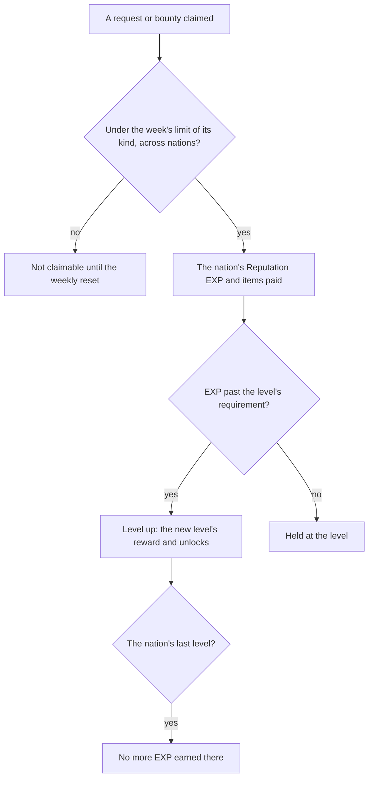

# Reputation

Each nation keeps a Reputation, raised by the work done for its people. Mondstadt's is built as data and rules: its levels from the game's table, the reward each level, request and bounty pays, the unlocks a level opens, and the weekly limit on claiming them. Nothing yet stands in the world to claim them from. The keeper, the bounties' trails and the exploration that raises the EXP wait on their own pages, so the rules here have no caller yet.

## How it works

## Data

- **The levels.** `ReputationLevelExcelConfigData`'s rows for the nation, each with `nextLevelExp`, the EXP to leave that level, unlike Friendship's totals. The last level's is zero, and it earns no more EXP. Level 2 opens the mining outcrop search and level 4 the merchant discounts, the function ids the table names.
- **Each reward.** A level's `rewardId`, and a request's or bounty's, read from the reward table. The nation's Reputation EXP is the item `ReputationCityExcelConfigData` names as its `virtualItemId`, so the reward is split into the EXP that item's count gives and the items it also pays. A request pays its EXP and Mora, a bounty its EXP and Mora, more of each at the harder difficulties.
- **Requests and bounties.** The requests of the groups the levels name, each with its weight, and the nation's `HuntingRefreshExcelConfigData` bounties with the region each is hunted in.
- **The tables the dump lacked.** The dump at its revision held the exploration table but not the level, city, function, request, quest or hunting tables. Those six were fetched from the AnimeGameData repository into the dump's `ExcelBinOutput` and never committed.

## Notes

- **The weekly limit is three of each kind, across nations.** Bounties and requests are counted apart, and each kind's claims are counted from the weekly reset, Monday at the daily reset's hour, a claim at the reset counting toward the new week. The count is the bosses' weekly helper, moved to a shared `services/weekly` folder.
- **A discount is 10% off, rounded down to a multiple of five Mora.** The rounding is the player's favour, the five beneath the discounted price. The wiki's Reputation page did not answer when this was built (HTTP 402), so the reading follows the proposal's own wording and the [shops](/docs/proposals/genshin/shops) proposal's.
- **The discount's shops are the function's text, not yet ids.** Which shops a discount covers is named in the function's text, and the shops' own ids are not joined yet. The discount is the [shops](/docs/genshin/shops) page's to apply once it has a screen.
- **Not built.** The keeper placed in region data, requests run as world quests, a bounty's trail and its spawned target, the exploration thresholds, the discount applied to a shop's price, the Reputation screen, and Natlan's tribes and supply notices. The [proposal](/docs/proposals/genshin/reputation) keeps them.

## Key files

| File                                                                                    | Role                                                                        |
| :-------------------------------------------------------------------------------------- | :-------------------------------------------------------------------------- |
| `packages/genshin-world/src/services/reputation/addReputationExp.ts`                    | The EXP carried up through each level's requirement, held at the last level |
| `packages/genshin-world/src/services/reputation/computeReputationDiscountedPrice.ts`    | A price's 10% off, rounded down to a multiple of five Mora                  |
| `packages/genshin-world/src/services/reputation/checkIsReputationWeeklyLimitReached.ts` | Whether a kind's claims this week have reached the limit across nations     |
| `packages/genshin-world/src/services/reputation/readMondstadtReputation.ts`             | The generated slice, imported on demand and checked against its shape       |
| `packages/genshin-world/src/services/reputation/constants.ts`                           | The discount, its rounding and the weekly claim limit                       |
| `packages/genshin-world/src/services/weekly/countWeeklyClaims.ts`                       | The claims the weekly limit counts, across nations                          |
| `packages/genshin-world/src/services/weekly/computeWeeklyResetTime.ts`                  | The reset the weekly limit counts from                                      |
| `packages/genshin-world/src/generated/reputation/mondstadt.json`                        | The levels, requests and bounties, written from the dump                    |
| `packages/genshin-world/src/models/reputation/ReputationCity.ts`                        | A nation's slice, with the schemas of its levels, requests and bounties     |
| `scripts/src/services/genshinAssets/reputation/writeMondstadtReputation.ts`             | Writes the slice from the dump's tables                                     |
| `scripts/src/services/genshinAssets/reputation/toReputationReward.ts`                   | Splits a reward into the Reputation EXP and the items it also pays          |

## Sources

- [AnimeGameData](https://github.com/DimbreathBot/AnimeGameData), the community's per-patch dump: `ReputationLevelExcelConfigData`, `ReputationCityExcelConfigData`, the function table, `ReputationRequestExcelConfigData`, `HuntingRefreshExcelConfigData` and `RewardExcelConfigData`, the tables the slice is written from.
- [Reputation](https://genshin-impact.fandom.com/wiki/Reputation), Genshin Impact Wiki: the nations' Reputation and its sources. Its page did not answer when this was built, so only the proposal's own wording stands for the discount's rounding.
