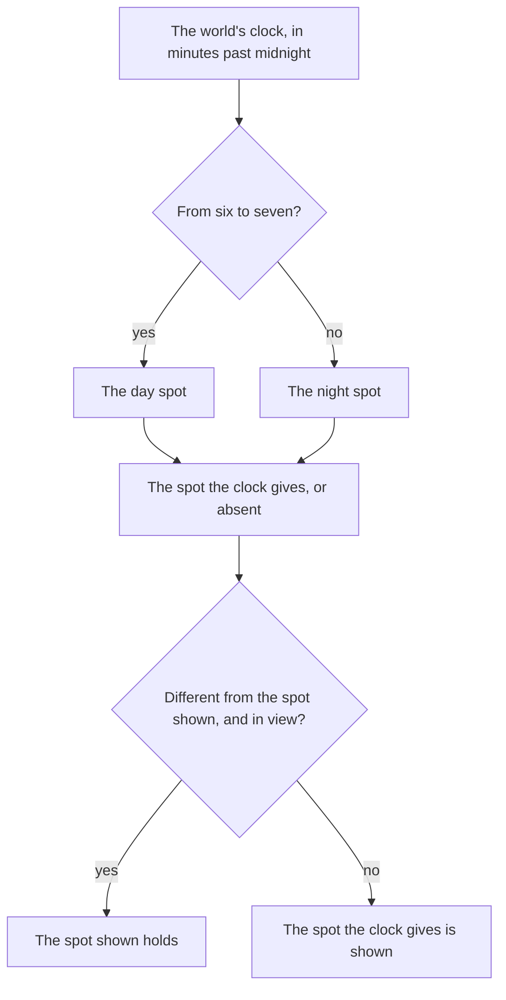

# Resident schedules

The game's people keep hours. A resident stands at one spot in the day and another at night, and some are seen only at one time. The [dialogue](/docs/genshin/dialogue) page's residents are placed in a region's data with a day spot, a night spot, or one of the two, and this page is the rule that picks the spot the world shows at the clock's minute.

## How it works

- **Two spots by the hour.** `computeResidentSpot` returns the day spot from six in the morning until seven at night and the night spot the rest of the day. A period the resident keeps no spot for is absent, so the resident is neither drawn nor offered as a talk.
- **Held while in view.** `computeShownResidentSpot` keeps the spot a resident stands at while the spot the clock now gives differs and the resident is in view, and moves them once they are out of view. An absence is treated as a spot, so a resident who appears or disappears at the turn does so out of view too.
- **Read each frame.** `useResidentSpots` runs each frame in the world: it reads the clock's minute, tests each resident's ground point against the camera's frustum in world coordinates, and replaces its map of shown spots only when one changed. A resident is placed the first frame they are in the data, and one whose region leaves reach is dropped, so they are placed afresh on return.
- **Consumers read the shown spot.** The world screen's prompts list a resident at their shown spot, and the quest's navigation marker points at it, so a resident absent at this hour is neither a prompt nor a marker.

## Key files

| File                                                                       | Role                                                                           |
| :------------------------------------------------------------------------- | :----------------------------------------------------------------------------- |
| `packages/genshin-world/src/models/world/Resident.ts`                      | A resident with an optional day spot and an optional night spot                |
| `packages/genshin-world/src/models/world/ResidentSpot.ts`                  | One spot: its ground point and the way it faces                                |
| `packages/genshin-world/src/services/resident/computeResidentSpot.ts`      | The spot the clock gives at a minute, or none                                  |
| `packages/genshin-world/src/services/resident/computeShownResidentSpot.ts` | The spot shown, held while the resident is in view across a change             |
| `packages/genshin-world/src/composables/useResidentSpots.ts`               | The shown spot of each resident, read each frame from the clock and the camera |
| `packages/genshin-world/src/components/World/Windrise/Index.vue`           | Holds the residents' spots and exposes them to the world screen                |
| `packages/genshin-world/src/components/World/Screen/Index.vue`             | Lists the residents at their shown spot as talk prompts                        |
| `packages/genshin-world/src/services/quest/findQuestTargetPosition.ts`     | A quest target resident's shown spot, for the navigation marker                |

## Sources

- [NPC](https://genshin-impact.fandom.com/wiki/NPC), Genshin Impact Wiki: open-world residents with their daytime and nighttime locations.
