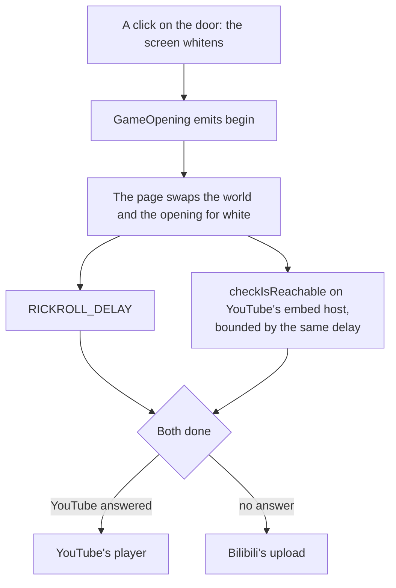

# Rickroll

Until the world past the login screen is ready to be walked into, the door is a joke: the reader clicks it, the screen whitens as the game's does, and after 3 seconds of white Rick Astley plays.

## How it plays

- **The world stops at the door.** On `begin` the page unmounts the world and the opening, so nothing renders behind the white.
- **The white is also the probe's window.** Whether the reader's network reaches YouTube is asked during the hold rather than guessed from their language or location, as [third-party reachability](/docs/architecture/third-party-reachability) sets out; a network that blocks it, in mainland China or anywhere else, gets Bilibili's upload instead.
- **The song plays with sound.** The door's click is the page's user activation, and the frame's `allow="autoplay"` hands it on, so the player may start unmuted. The page sends no cross-origin embedder policy, since a frame under one loads credentialless and loses that activation, and the page shares no memory that would need isolation.
- **Either player is sent the page's origin.** Both refuse to play without a `Referer`, which the site's `no-referrer` policy withholds, so the frame asks for `strict-origin-when-cross-origin`.

## Key files

| File                                            | Role                                                                        |
| :---------------------------------------------- | :-------------------------------------------------------------------------- |
| `apps/web/app/components/Genshin/Index.vue`     | The page: the opening, the world behind it, and the rickroll the door opens |
| `apps/web/app/services/genshin/constants.ts`    | The delay, both players' URLs and the probe's URL                           |
| `apps/web/app/util/network/checkIsReachable.ts` | Whether the reader's network answers a URL in time                          |
| `apps/web/server/plugins/security.ts`           | The page's exemption from the cross-origin embedder policy                  |
